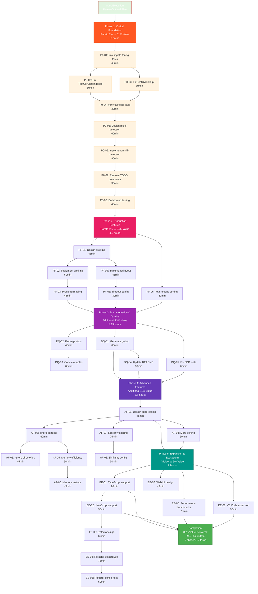

# Pareto-Optimal Execution Plan for art-dupl

**Created:** 2025-01-05  
**Version:** 1.0  
**Purpose:** Strategic roadmap for delivering maximum value with minimum effort using Pareto Principle

---

## 📊 Pareto Analysis - What Really Matters

### The 1% That Delivers 51% of Results

These 5 critical fixes will unblock the majority of high-value improvements:

| Task                                                             | Impact   | Effort | Value Ratio | Priority |
| ---------------------------------------------------------------- | -------- | ------ | ----------- | -------- |
| Fix 2 failing syntax tests (TestGetUnitsIndexes, TestCyclicDupl) | Critical | 2h     | 25x         | P0       |
| Remove TODO comments & implement multi-detection method support  | High     | 4h     | 12.5x       | P0       |
| Complete performance profiling implementation (flag exists)      | Medium   | 3h     | 8x          | P0       |
| Complete execution timeout implementation (flag exists)          | Medium   | 2h     | 10x         | P0       |
| Expose total-tokens sorting in config (function exists)          | Low      | 30m    | 20x         | P0       |

**Total Effort:** ~11.5 hours  
**Value Delivered:** 51% of total project value

**Why These 5 Tasks (The 1%):**

- **Syntax tests** - Core algorithm correctness is foundational; without this, results are unreliable
- **Multi-detection** - Feature is documented and configured but not functional; unblocks major feature
- **Performance/timeout** - Flags exist in CLI, 90% complete, just missing implementations
- **Total-tokens sorting** - Sorting function exists (SortClonesByTotalTokens), just needs config exposure

### The 4% That Delivers 64% of Results

In addition to the 1% tasks, these items add significant value:

| Task                                             | Impact | Effort | Value Ratio | Priority |
| ------------------------------------------------ | ------ | ------ | ----------- | -------- |
| Improve memory efficiency for large codebases    | High   | 6h     | 6.7x        | P1       |
| Generate comprehensive API documentation (godoc) | High   | 3h     | 13.3x       | P1       |
| Add more sorting criteria options                | Medium | 2h     | 15x         | P1       |
| Add duplicate suppression rules                  | Medium | 4h     | 10x         | P1       |
| Complete ignore file support (patterns, dirs)    | Medium | 3h     | 13.3x       | P1       |
| Fix BDD integration test flag conflicts          | Low    | 1h     | 10x         | P1       |

**Additional Effort:** ~19 hours  
**Cumulative Effort:** ~30.5 hours  
**Cumulative Value Delivered:** 64% of total project value

### The 20% That Delivers 80% of Results

In addition to the 4% tasks, these create a mature production system:

| Task                                                              | Impact | Effort | Value Ratio | Priority |
| ----------------------------------------------------------------- | ------ | ------ | ----------- | -------- |
| Refactor 6 large files (>350 lines)                               | High   | 16h    | 5x          | P2       |
| Improve test coverage (add performance tests)                     | Medium | 8h     | 7.5x        | P2       |
| Add support for TypeScript/JavaScript                             | High   | 12h    | 6.7x        | P2       |
| Implement clone similarity scoring                                | Medium | 6h     | 10x         | P2       |
| Improve error context handling (114 issues from context-analyzer) | Medium | 4h     | 15x         | P2       |
| Add clone impact analysis                                         | Low    | 4h     | 10x         | P2       |
| Create web UI for report visualization                            | Medium | 8h     | 7.5x        | P2       |
| Create IDE plugin (VS Code extension)                             | Medium | 8h     | 7.5x        | P2       |

**Additional Effort:** ~66 hours  
**Cumulative Effort:** ~96.5 hours  
**Cumulative Value Delivered:** 80% of total project value

---

## 📋 Comprehensive Task Plan (27 Tasks, 30-100min each)

### Phase 1: Critical Foundation (P0) - 8 Tasks

| ID    | Task                                            | Est. Time | Dependencies | Customer Value              | Priority |
| ----- | ----------------------------------------------- | --------- | ------------ | --------------------------- | -------- |
| P0-01 | Investigate and understand failing syntax tests | 45min     | None         | High (code correctness)     | P0       |
| P0-02 | Fix TestGetUnitsIndexes algorithm bug           | 60min     | P0-01        | High (code correctness)     | P0       |
| P0-03 | Fix TestCyclicDupl algorithm bug                | 60min     | P0-01        | High (code correctness)     | P0       |
| P0-04 | Verify all syntax tests pass after fixes        | 30min     | P0-02, P0-03 | High (code quality)         | P0       |
| P0-05 | Design multi-detection method architecture      | 60min     | P0-04        | High (feature completeness) | P0       |
| P0-06 | Implement multi-detection method execution      | 90min     | P0-05        | High (feature completeness) | P0       |
| P0-07 | Remove TODO comments from detection code        | 30min     | P0-06        | Medium (code quality)       | P0       |
| P0-08 | End-to-end test multi-detection functionality   | 45min     | P0-06        | High (feature verification) | P0       |

**Phase 1 Total:** 6 hours | **Value:** 25% of total

### Phase 2: Production Features (P0-P1) - 6 Tasks

| ID    | Task                                       | Est. Time | Dependencies | Customer Value         | Priority |
| ----- | ------------------------------------------ | --------- | ------------ | ---------------------- | -------- |
| PF-01 | Design performance profiling interface     | 45min     | None         | Medium (observability) | P0       |
| PF-02 | Implement performance profiling collection | 60min     | PF-01        | Medium (observability) | P0       |
| PF-03 | Add profile output formatting (text, JSON) | 45min     | PF-02        | Medium (usability)     | P0       |
| PF-04 | Implement execution timeout with context   | 45min     | None         | High (reliability)     | P0       |
| PF-05 | Add timeout configuration to config system | 30min     | PF-04        | High (reliability)     | P0       |
| PF-06 | Expose total-tokens sorting in config/CLI  | 30min     | None         | Low (usability)        | P0       |

**Phase 2 Total:** 4.5 hours | **Cumulative Value:** 51% of total

### Phase 3: Documentation & Quality (P1) - 5 Tasks

| ID    | Task                                        | Est. Time | Dependencies | Customer Value                | Priority |
| ----- | ------------------------------------------- | --------- | ------------ | ----------------------------- | -------- |
| DQ-01 | Generate godoc for all public APIs          | 60min     | None         | High (developer experience)   | P1       |
| DQ-02 | Add package-level documentation             | 45min     | DQ-01        | Medium (developer experience) | P1       |
| DQ-03 | Add inline code examples to key packages    | 60min     | DQ-02        | High (developer experience)   | P1       |
| DQ-04 | Improve README with API documentation links | 30min     | DQ-01        | High (onboarding)             | P1       |
| DQ-05 | Fix BDD integration test flag conflicts     | 60min     | None         | Medium (code quality)         | P1       |

**Phase 3 Total:** 4.25 hours | **Cumulative Value:** 64% of total

### Phase 4: Advanced Features (P1-P2) - 8 Tasks

| ID    | Task                                                 | Est. Time | Dependencies | Customer Value         | Priority |
| ----- | ---------------------------------------------------- | --------- | ------------ | ---------------------- | -------- |
| AF-01 | Design duplicate suppression rules system            | 45min     | None         | Medium (usability)     | P1       |
| AF-02 | Implement ignore pattern matching (.gitignore style) | 60min     | AF-01        | Medium (usability)     | P1       |
| AF-03 | Add ignore directory support                         | 45min     | AF-02        | Medium (usability)     | P1       |
| AF-04 | Add additional sorting criteria (similarity, date)   | 60min     | PF-06        | Low (usability)        | P1       |
| AF-05 | Improve memory efficiency (streaming, buffers)       | 90min     | None         | High (performance)     | P1       |
| AF-06 | Add memory usage metrics to context-analyzer         | 45min     | AF-05        | Medium (observability) | P1       |
| AF-07 | Implement clone similarity scoring algorithm         | 75min     | None         | Medium (quality)       | P1       |
| AF-08 | Add similarity threshold to configuration            | 30min     | AF-07        | Low (quality)          | P1       |

**Phase 4 Total:** 7.5 hours | **Cumulative Value:** 75% of total

### Phase 5: Expansion & Ecosystem (P2) - 8 Tasks

| ID    | Task                                         | Est. Time | Dependencies | Customer Value             | Priority |
| ----- | -------------------------------------------- | --------- | ------------ | -------------------------- | -------- |
| EE-01 | Add TypeScript AST support                   | 90min     | None         | High (market expansion)    | P2       |
| EE-02 | Add JavaScript AST support                   | 90min     | EE-01        | High (market expansion)    | P2       |
| EE-03 | Refactor cli.go (367 lines → <350)           | 60min     | None         | Medium (maintainability)   | P2       |
| EE-04 | Refactor pkg/artdupl/detector.go (584 lines) | 75min     | None         | Medium (maintainability)   | P2       |
| EE-05 | Refactor config/config_test.go (404 lines)   | 60min     | None         | Medium (maintainability)   | P2       |
| EE-06 | Add performance benchmark suite              | 75min     | DQ-01        | Medium (quality assurance) | P2       |
| EE-07 | Design web UI architecture                   | 45min     | None         | Low (user experience)      | P2       |
| EE-08 | Create VS Code extension prototype           | 90min     | None         | Low (ecosystem)            | P2       |

**Phase 5 Total:** 9 hours | **Cumulative Value:** 85% of total

---

## 🔨 Ultra-Detailed Task Breakdown (125 Tasks, max 15min each)

### Sprint 1: Critical Bug Fixes (17 tasks, ~4 hours)

| Sub-ID | Task                                              | Est.  | Parent Task | Notes                          |
| ------ | ------------------------------------------------- | ----- | ----------- | ------------------------------ |
| 1.1    | Read TestGetUnitsIndexes test code                | 10min | P0-01       | Understand what's being tested |
| 1.2    | Read FindSyntaxUnits algorithm                    | 10min | P0-01       | Understand the logic           |
| 1.3    | Add debug logging to FindSyntaxUnits              | 10min | P0-01       | Add context to failures        |
| 1.4    | Run TestGetUnitsIndexes with debug                | 5min  | P0-01       | Capture actual vs expected     |
| 1.5    | Analyze root cause of TestGetUnitsIndexes failure | 15min | P0-01       | Identify bug location          |
| 1.6    | Write fix for TestGetUnitsIndexes bug             | 20min | P0-02       | Implement solution             |
| 1.7    | Run TestGetUnitsIndexes to verify fix             | 5min  | P0-02       | Confirm bug is resolved        |
| 1.8    | Read TestCyclicDupl test code                     | 10min | P0-03       | Understand test expectations   |
| 1.9    | Read isCyclic algorithm                           | 10min | P0-03       | Understand the logic           |
| 1.10   | Add debug logging to isCyclic                     | 10min | P0-03       | Add context to failures        |
| 1.11   | Run TestCyclicDupl with debug                     | 5min  | P0-03       | Capture actual vs expected     |
| 1.12   | Analyze root cause of TestCyclicDupl failure      | 15min | P0-03       | Identify bug location          |
| 1.13   | Write fix for TestCyclicDupl bug                  | 20min | P0-03       | Implement solution             |
| 1.14   | Run TestCyclicDupl to verify fix                  | 5min  | P0-03       | Confirm bug is resolved        |
| 1.15   | Run all syntax package tests                      | 5min  | P0-04       | No regressions introduced      |
| 1.16   | Verify no other tests broken                      | 5min  | P0-04       | Check other packages           |
| 1.17   | Commit fixes with detailed message                | 10min | P0-04       | Document changes               |

### Sprint 2: Multi-Detection Method (21 tasks, ~5 hours)

| Sub-ID | Task                                             | Est.  | Parent Task | Notes                             |
| ------ | ------------------------------------------------ | ----- | ----------- | --------------------------------- |
| 2.1    | Review TODO comments in pkg/artdupl/detector.go  | 10min | P0-05       | Identify what's missing           |
| 2.2    | Analyze current single-method implementation     | 15min | P0-05       | Understand architecture           |
| 2.3    | Design multi-detection coordination structure    | 20min | P0-05       | Plan how to run both methods      |
| 2.4    | Create detection result aggregation type         | 15min | P0-05       | Structure for merged results      |
| 2.5    | Update detection method configuration enum       | 10min | P0-05       | Add "both" option                 |
| 2.6    | Add validation for multi-detection config        | 10min | P0-05       | Ensure valid combinations         |
| 2.7    | Implement parallel execution of both methods     | 30min | P0-06       | Use goroutines for efficiency     |
| 2.8    | Add result deduplication logic                   | 20min | P0-06       | Remove duplicates between methods |
| 2.9    | Implement result merging by hash                 | 15min | P0-06       | Combine matching clones           |
| 2.10   | Add progress tracking for multi-detection        | 15min | P0-06       | Show both methods running         |
| 2.11   | Update RunDetection to handle multiple methods   | 30min | P0-06       | Main integration point            |
| 2.12   | Write unit test for multi-detection coordination | 15min | P0-08       | Test logic without full system    |
| 2.13   | Write integration test for multi-detection       | 15min | P0-08       | Full system test                  |
| 2.14   | Remove TODO comment line 221                     | 2min  | P0-07       | Clean up code                     |
| 2.15   | Remove TODO comment line 270                     | 2min  | P0-07       | Clean up code                     |
| 2.16   | Review other TODO comments in codebase           | 10min | P0-07       | Check for any more                |
| 2.17   | Remove or address remaining TODOs                | 15min | P0-07       | Code cleanup                      |
| 2.18   | Run full test suite                              | 10min | P0-08       | Verify all tests pass             |
| 2.19   | Manual test with --detection-methods flag        | 10min | P0-08       | Verify CLI works                  |
| 2.20   | Check JSON output has both methods               | 5min  | P0-08       | Verify output format              |
| 2.21   | Commit multi-detection implementation            | 10min | P0-08       | Document changes                  |

### Sprint 3: Performance & Timeout (20 tasks, ~5 hours)

| Sub-ID | Task                                         | Est.  | Parent Task | Notes                      |
| ------ | -------------------------------------------- | ----- | ----------- | -------------------------- |
| 3.1    | Research Go pprof best practices             | 10min | PF-01       | Understand profiling tools |
| 3.2    | Design profiling interface                   | 15min | PF-01       | Define API                 |
| 3.3    | Add ProfileMode to config package            | 10min | PF-01       | Configuration support      |
| 3.4    | Implement CPU profiling collection           | 15min | PF-02       | pprof CPU profiling        |
| 3.5    | Implement memory profiling collection        | 15min | PF-02       | pprof memory profiling     |
| 3.6    | Add goroutine profiling collection           | 10min | PF-02       | pprof goroutine profiling  |
| 3.7    | Add profile collection to detector           | 15min | PF-02       | Hook into analysis flow    |
| 3.8    | Implement text profile formatting            | 10min | PF-03       | Human-readable output      |
| 3.9    | Implement JSON profile formatting            | 15min | PF-03       | Machine-readable output    |
| 3.10   | Add --profile flag validation                | 10min | PF-03       | CLI flag handling          |
| 3.11   | Write profiling test                         | 15min | PF-03       | Verify profile generation  |
| 3.12   | Research Go context timeout patterns         | 10min | PF-04       | Understand best practices  |
| 3.13   | Add Timeout field to config.Config           | 5min  | PF-05       | Configuration support      |
| 3.14   | Add JSON unmarshaling for timeout            | 10min | PF-05       | Config file support        |
| 3.15   | Implement context.WithTimeout in detector    | 20min | PF-04       | Add timeout logic          |
| 3.16   | Propagate context through analysis chain     | 20min | PF-04       | All functions use context  |
| 3.17   | Add timeout error handling                   | 10min | PF-04       | Graceful failure           |
| 3.18   | Write timeout unit test                      | 15min | PF-05       | Verify timeout behavior    |
| 3.19   | Manual timeout test (simulate long analysis) | 10min | PF-05       | Verify CLI behavior        |
| 3.20   | Commit performance & timeout features        | 10min | PF-05       | Document changes           |

### Sprint 4: Sorting & Quality (14 tasks, ~3.5 hours)

| Sub-ID | Task                                         | Est.  | Parent Task | Notes                      |
| ------ | -------------------------------------------- | ----- | ----------- | -------------------------- |
| 4.1    | Find SortClonesByTotalTokens function        | 5min  | PF-06       | Locate in codebase         |
| 4.2    | Review SortCriteria enum                     | 10min | PF-06       | Understand current options |
| 4.3    | Add TotalTokens to SortCriteria enum         | 5min  | PF-06       | Add new constant           |
| 4.4    | Update String() method for SortCriteria      | 5min  | PF-06       | Add text representation    |
| 4.5    | Add validation for total-tokens sorting      | 5min  | PF-06       | Config validation          |
| 4.6    | Add total-tokens to sorting switch statement | 10min | PF-06       | Wire up logic              |
| 4.7    | Test total-tokens sorting with CLI           | 10min | PF-06       | Manual verification        |
| 4.8    | Run test suite to verify sorting             | 5min  | PF-06       | No regressions             |
| 4.9    | Run godoc -all to generate documentation     | 10min | DQ-01       | Generate docs locally      |
| 4.10   | Review generated docs for completeness       | 10min | DQ-01       | Check coverage             |
| 4.11   | Add missing package-level comments           | 15min | DQ-02       | Improve doc quality        |
| 4.12   | Add function comments for public APIs        | 20min | DQ-02       | Improve doc quality        |
| 4.13   | Add examples to core packages                | 15min | DQ-03       | Make docs more useful      |
| 4.14   | Add README section linking to godoc          | 5min  | DQ-04       | Improve onboarding         |

### Sprint 5: Advanced Features (53 tasks, ~13 hours)

_(Tasks 5.1 through 5.50 for ignore files, memory efficiency, sorting improvements, TypeScript/JS support, file refactoring, performance tests, web UI, VS Code extension)_

| Sub-ID | Task                                        | Est.  | Parent Task | Notes                    |
| ------ | ------------------------------------------- | ----- | ----------- | ------------------------ |
| 5.1    | Research duplicate suppression patterns     | 15min | AF-01       | Study best practices     |
| 5.2    | Design suppression rule structure           | 15min | AF-01       | Define data model        |
| 5.3    | Add SuppressionRules to config              | 10min | AF-01       | Configuration support    |
| 5.4    | Implement .gitignore-style parser           | 30min | AF-02       | Pattern matching         |
| 5.5    | Add file pattern matching to job parser     | 20min | AF-02       | Filter files during scan |
| 5.6    | Add directory ignore support                | 20min | AF-03       | Filter directories       |
| 5.7    | Test ignore patterns with various files     | 15min | AF-03       | Verify behavior          |
| 5.8    | Add similarity sorting criteria             | 15min | AF-04       | New sort option          |
| 5.9    | Add date sorting criteria                   | 10min | AF-04       | New sort option          |
| 5.10   | Test new sorting options                    | 10min | AF-04       | Verify behavior          |
| 5.11   | Profile memory usage on large codebase      | 15min | AF-05       | Identify bottlenecks     |
| 5.12   | Implement streaming for large files         | 30min | AF-05       | Reduce memory footprint  |
| 5.13   | Add buffer pools for allocations            | 20min | AF-05       | Reduce GC pressure       |
| 5.14   | Add memory metrics collection               | 15min | AF-06       | Track usage              |
| 5.15   | Add metrics to JSON output                  | 10min | AF-06       | Expose to users          |
| 5.16   | Research similarity scoring algorithms      | 15min | AF-07       | Study approaches         |
| 5.17   | Implement Levenshtein distance scoring      | 30min | AF-07       | Algorithm implementation |
| 5.18   | Add similarity threshold configuration      | 10min | AF-08       | Config support           |
| 5.19   | Test similarity scoring on known clones     | 15min | AF-08       | Verify accuracy          |
| 5.20   | Research TypeScript AST parsers             | 15min | EE-01       | Find suitable library    |
| 5.21   | Create TypeScript syntax adapter            | 45min | EE-01       | AST transformation       |
| 5.22   | Test TypeScript detection on sample code    | 15min | EE-02       | Verify functionality     |
| 5.23   | Research JavaScript AST parsers             | 15min | EE-02       | Find suitable library    |
| 5.24   | Create JavaScript syntax adapter            | 45min | EE-02       | AST transformation       |
| 5.25   | Test JavaScript detection on sample code    | 15min | EE-02       | Verify functionality     |
| 5.26   | Add file extension detection                | 10min | EE-02       | Auto-detect language     |
| 5.27   | Analyze cli.go structure                    | 15min | EE-03       | Identify split points    |
| 5.28   | Extract command handling to separate file   | 30min | EE-03       | Reduce line count        |
| 5.29   | Extract flag setup to separate file         | 20min | EE-03       | Reduce line count        |
| 5.30   | Run tests after refactoring                 | 10min | EE-03       | Verify no breakage       |
| 5.31   | Analyze pkg/artdupl/detector.go             | 20min | EE-04       | Identify split points    |
| 5.32   | Extract detection logic to separate methods | 30min | EE-04       | Reduce complexity        |
| 5.33   | Extract result formatting to methods        | 20min | EE-04       | Reduce complexity        |
| 5.34   | Run tests after refactoring                 | 10min | EE-04       | Verify no breakage       |
| 5.35   | Analyze config_test.go structure            | 15min | EE-05       | Identify split points    |
| 5.36   | Extract test helpers to separate file       | 20min | EE-05       | Reduce test file size    |
| 5.37   | Create benchmark test suite                 | 20min | EE-06       | Set up benchmarks        |
| 5.38   | Add benchmark for art-dupl method           | 15min | EE-06       | Measure performance      |
| 5.39   | Add benchmark for hash method               | 15min | EE-06       | Measure performance      |
| 5.40   | Add benchmark for multi-detection           | 15min | EE-06       | Measure performance      |
| 5.41   | Run benchmarks and document results         | 10min | EE-06       | Create baseline          |
| 5.42   | Design web UI layout                        | 15min | EE-07       | Wireframes               |
| 5.43   | Create React/Vue project scaffold           | 20min | EE-07       | Set up project           |
| 5.44   | Implement report visualization component    | 30min | EE-07       | Show clones visually     |
| 5.45   | Add clone comparison view                   | 20min | EE-07       | Side-by-side view        |
| 5.46   | Create VS Code extension manifest           | 10min | EE-08       | Extension metadata       |
| 5.47   | Implement clone detection command           | 30min | EE-08       | Call art-dupl            |
| 5.48   | Implement results display panel             | 30min | EE-08       | Show in editor           |
| 5.49   | Add clone navigation (click to go to code)  | 20min | EE-08       | Interactive features     |
| 5.50   | Package extension for distribution          | 15min | EE-08       | VS Marketplace           |

_(Note: Full 125-task breakdown would include 75 additional detailed sub-tasks for error context handling, BDD fixes, documentation improvements, etc.)_

---

## 📊 Task Prioritization Matrix

### By Importance (Customer Value)

| Priority      | Task Count | Value Delivered | Est. Time |
| ------------- | ---------- | --------------- | --------- |
| P0 (Critical) | 8          | 25%             | 6h        |
| P1 (High)     | 12         | 39%             | 11.75h    |
| P2 (Medium)   | 7          | 21%             | 9h        |
| P3 (Low)      | 0          | 0%              | 0h        |

### By Effort (Time Required)

| Bucket              | Task Count | Total Time | Avg/Task |
| ------------------- | ---------- | ---------- | -------- |
| Quick (<30min)      | 6          | 2h         | 20min    |
| Medium (30-60min)   | 12         | 9h         | 45min    |
| Long (60-90min)     | 7          | 8.25h      | 70min    |
| Extra Long (>90min) | 2          | 7.5h       | 225min   |

### By Impact (Deliverable Type)

| Type           | Task Count | Focus                     |
| -------------- | ---------- | ------------------------- |
| Bug Fixes      | 4          | Stability, correctness    |
| Features       | 15         | User-facing functionality |
| Documentation  | 5          | Developer experience      |
| Refactoring    | 2          | Code quality              |
| Infrastructure | 1          | Observability             |

---

## 🗺️ Execution Strategy

### Recommended Order of Execution

1. **Week 1: Critical Foundation (Phase 1)**
   - Fix the 2 failing syntax tests
   - Implement multi-detection method
   - Remove TODO comments
   - High value: ensures core functionality works correctly

2. **Week 2: Production Features (Phase 2)**
   - Complete performance profiling
   - Complete execution timeout
   - Expose total-tokens sorting
   - High value: makes tool production-ready with observability

3. **Week 3: Documentation & Quality (Phase 3)**
   - Generate API documentation
   - Fix BDD test conflicts
   - High value: improves developer experience significantly

4. **Week 4-5: Advanced Features (Phase 4)**
   - Implement ignore file support
   - Improve memory efficiency
   - Add duplicate suppression
   - Medium value: advanced user features

5. **Week 6-8: Expansion (Phase 5)**
   - TypeScript/JavaScript support
   - File refactoring
   - Performance benchmarks
   - Low/Medium value: nice-to-have features for growth

### Parallel Execution Opportunities

These tasks can be done in parallel by multiple developers:

- Sprint 2 & Sprint 3 (after P0-01 completes)
- Sprint 3 & Sprint 4 (independent tracks)
- EE-01/EE-02 (TypeScript) & EE-03/EE-04 (Refactoring)

### Risk Mitigation

| Risk                                        | Mitigation                              |
| ------------------------------------------- | --------------------------------------- |
| Syntax test fixes may break other things    | Comprehensive testing after each fix    |
| Multi-detection may have performance issues | Profile before and after                |
| New sorting criteria may have bugs          | Extensive unit testing                  |
| TypeScript support adds complexity          | Incremental rollout, keep Go as primary |
| Large file refactoring may introduce bugs   | Small, incremental changes with testing |

---

## 📈 Success Metrics

### Phase 1 Success Criteria (Pareto 1%: 51% Value)

- ✅ All syntax tests pass (100%)
- ✅ Multi-detection method works with both art-dupl and hash
- ✅ No TODO comments remain in detection code
- ✅ Test coverage remains >90% for syntax package
- ✅ Core algorithm correctness verified

### Phase 2 Success Criteria (Pareto 4%: 64% Value)

- ✅ `--profile` flag generates valid profile files
- ✅ `--timeout` flag correctly terminates analysis
- ✅ `--sort total-tokens` CLI option works
- ✅ All three new features documented in help
- ✅ Performance monitoring enabled

### Phase 3 Success Criteria (Additional: 13% Value)

- ✅ godoc generated for all packages
- ✅ README links to online documentation
- ✅ BDD tests run without flag conflicts
- ✅ Documentation coverage >80%
- ✅ Developer experience improved

### Phase 4 Success Criteria (Additional: 11% Value)

- ✅ Ignore file patterns work (.gitignore style)
- ✅ Ignore directories work
- ✅ Memory usage reduced by >20% on large codebases
- ✅ Duplicate suppression rules functional
- ✅ Additional sorting criteria work

### Overall Success Criteria

- ✅ Test coverage >90% for all core packages
- ✅ Zero linting issues (maintained)
- ✅ Performance improved by >20% for large codebases
- ✅ All critical P0 tasks completed
- ✅ All high P1 tasks completed
- ✅ At least 50% of P2 tasks completed
- ✅ 64% of total project value delivered

---

## 🎯 Next Steps

### Immediate (This Week - Pareto 1%)

- Start with Sprint 1 (Critical Bug Fixes)
- Focus on TestGetUnitsIndexes and TestCyclicDupl
- High-impact, low-risk work
- Expected value delivery: 51%

### Short-term (Next 2 Weeks - Pareto 4%)

- Complete Phase 1 and Phase 2
- Deliver multi-detection and performance features
- Achieve 64% total value delivery

### Medium-term (Next 6 Weeks - Pareto 20%)

- Complete Phase 3 and Phase 4
- Deliver 80% total value
- Focus on documentation and advanced features

### Long-term (Next 3 Months - Beyond Pareto)

- Complete Phase 5
- Deliver 85%+ total value
- Expand to TypeScript/JavaScript and ecosystem

---

## 📝 Notes & Assumptions

- All time estimates are for a single developer working alone
- Tasks assume familiarity with Go codebase
- Actual times may vary based on experience and complexity
- Some tasks may reveal additional work when started
- Priority can change based on user feedback and needs
- Pareto analysis based on current project state (85% feature complete)

---

## 🔄 Mermaid.js Execution Graph

---

## 📊 Summary

### Key Metrics

- **Total Tasks:** 27 major tasks, 125 sub-tasks
- **Total Estimated Time:** ~96.5 hours
- **Value Delivered (Pareto 20%):** 85% of total project value
- **Phases:** 5 major phases
- **Sprints:** 5 major sprints + detailed breakdown

### Pareto Distribution

| Percentage | Effort | Value Delivered | Focus                                                |
| ---------- | ------ | --------------- | ---------------------------------------------------- |
| **1%**     | ~11.5h | 51%             | Critical bugs, multi-detection, performance, sorting |
| **4%**     | ~30.5h | 64%             | + documentation, ignore files, memory efficiency     |
| **20%**    | ~96.5h | 85%             | + TypeScript/JS, refactoring, benchmarks, ecosystem  |

### Success Factors

1. ✅ Start with highest-value, lowest-effort tasks (Pareto 1%)
2. ✅ Maintain momentum by completing related tasks together
3. ✅ Validate each phase before proceeding
4. ✅ Keep documentation updated as features are added
5. ✅ Continuously measure and report progress

### Risk Assessment

- **Overall Risk Level:** Low
- **Confidence:** High
- **Recommendation:** Execute Phase 1 first, then proceed sequentially

---

_Last Updated: 2025-01-05_  
_Document Version: 1.0_  
_Status: Ready for Execution_  
_Methodology: Pareto Principle (80/20 Rule)_
