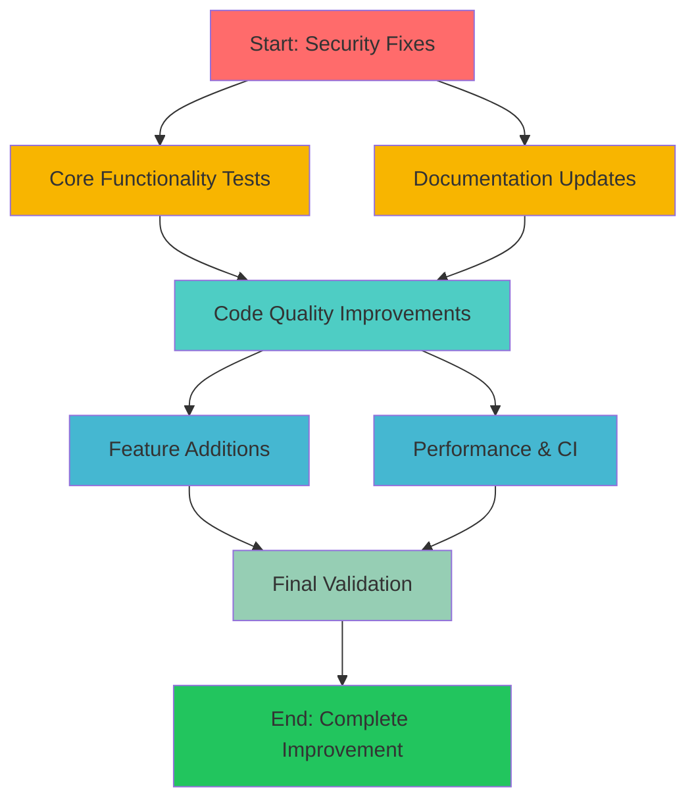

# dupl Comprehensive Improvement Plan

**Date:** 2025-11-28_11-49  
**Status:** Planning Phase  
**Goal:** Modernize and improve the dupl codebase for better maintainability, security, and usability

## Executive Summary

This plan follows the Pareto principle to identify the 20% of changes that deliver 80% of the value:

### 🎯 Priority Levels (Pareto Analysis)

- **1% → 51% Impact**: Critical security, stability, and core functionality fixes
- **4% → 64% Impact**: Essential usability and developer experience improvements  
- **20% → 80% Impact**: Important feature additions and code quality improvements

## Comprehensive Improvement Tasks

### 🔴 CRITICAL PRIORITY (1% → 51% Impact)

| Task | File(s) | Effort | Impact | Description |
|------|---------|--------|--------|-------------|
| Replace log.Fatal() calls | main.go:44,84,109,126 | 30min | Critical | Prevent abrupt program termination |
| Fix HTML XSS vulnerability | printer/html.go:68 | 45min | Critical | Complete input sanitization |
| Add missing test coverage | main.go, job/ packages | 60min | Critical | Core logic has no tests |
| Update README install cmd | README.md:15 | 15min | High | Fix deprecated go get command |
| Fix panic in HTML printer | printer/html.go:47 | 30min | Critical | Remove panic for production safety |

### 🟡 HIGH PRIORITY (4% → 64% Impact)

| Task | File(s) | Effort | Impact | Description |
|------|---------|--------|--------|-------------|
| Extract duplicate unique() function | main.go:160, lib.go:71 | 45min | High | Remove code duplication |
| Add JSON output format | printer/ package | 90min | High | CI/CD integration capability |
| Add integration tests | cmd/ integration/ | 120min | High | End-to-end workflow testing |
| Make maxChildrenSerial configurable | syntax/syntax.go:20 | 60min | High | Remove magic number |
| Update Go to latest stable | go.mod | 30min | High | Security and performance |
| Add config file support | cmd/ config/ | 90min | High | Complex analysis rules |
| Improve error messages | All files with errors | 45min | High | Better UX |

### 🟢 MEDIUM PRIORITY (20% → 80% Impact)

| Task | File(s) | Effort | Impact | Description |
|------|---------|--------|--------|-------------|
| Add performance benchmarks | benchmark/ | 60min | Medium | Track regressions |
| Refactor large main() function | main.go | 90min | Medium | Single responsibility |
| Add CLI help improvements | main.go:179 | 60min | Medium | Better usability |
| Add concurrent processing | job/ package | 120min | Medium | Performance boost |
| Add ignore file support | main.go | 60min | Medium | .duplignore feature |
| Improve HTML template | printer/html.go | 45min | Medium | Better presentation |
| Add GitHub Action caching | .github/ | 30min | Medium | Faster CI |
| Code documentation | All packages | 120min | Medium | Developer experience |
| Add package examples | */example_test.go | 90min | Medium | Usage examples |

## Detailed Breakdown - Medium Tasks (30-100min each)

### Security & Stability
1. **Fix all log.Fatal() calls** - Replace with graceful error returns (30min)
2. **Complete HTML XSS prevention** - Review all output paths (45min)
3. **Remove panic statements** - Replace with error handling (30min)
4. **Input validation** - Add comprehensive validation (60min)
5. **Update Go version** - Update to latest stable (30min)

### Core Functionality
6. **Add main.go tests** - CLI workflow testing (60min)
7. **Add job/ package tests** - Core pipeline testing (60min)
8. **Add integration tests** - End-to-end scenarios (120min)
9. **Extract unique() function** - Remove duplication (45min)
10. **Make maxChildrenSerial configurable** - CLI flag support (60min)

### User Experience
11. **Update README installation** - Modern go install command (15min)
12. **Add JSON output** - For CI/CD integration (90min)
13. **Add config file support** - YAML/JSON config (90min)
14. **Improve error messages** - User-friendly feedback (45min)
15. **Add ignore file support** - .duplignore patterns (60min)

### Developer Experience
16. **Add benchmarks** - Performance tracking (60min)
17. **Add package documentation** - Comprehensive godoc (120min)
18. **Add usage examples** - Example_test.go files (90min)
19. **Improve HTML template** - Better visual design (45min)
20. **Add CI caching** - Faster builds (30min)

## Granular Tasks - Micro Tasks (≤15min each)

### Critical Security Fixes (Task Group 1)
1. Replace log.Fatal in main.go:44 (10min)
2. Replace log.Fatal in main.go:84 (10min)  
3. Replace log.Fatal in main.go:109 (10min)
4. Replace log.Fatal in main.go:126 (10min)
5. Fix HTML XSS vulnerability - review output (15min)
6. Remove panic in printer/html.go:47 (10min)
7. Add basic error handling tests (15min)

### Core Functionality Tests (Task Group 2)
8. Create test file for main.go (10min)
9. Add CLI flag parsing tests (15min)
10. Add file discovery tests (15min)
11. Add output format tests (15min)
12. Create job/parse.go test file (10min)
13. Add job/parse.go error handling tests (15min)
14. Create job/buildtree.go test file (10min)
15. Add integration test structure (15min)

### Documentation Updates (Task Group 3)
16. Update README.md installation command (5min)
17. Update README.md usage examples (10min)
18. Add package documentation for syntax/ (15min)
19. Add package documentation for suffixtree/ (15min)
20. Add package documentation for printer/ (15min)
21. Add package documentation for job/ (10min)

### Code Quality Improvements (Task Group 4)
22. Extract unique() to util package (15min)
23. Update main.go to use extracted unique() (10min)
24. Update lib.go to use extracted unique() (10min)
25. Make maxChildrenSerial a constant flag (15min)
26. Add CLI flag for maxChildrenSerial (10min)
27. Add validation for maxChildrenSerial flag (5min)

### Feature Additions (Task Group 5)
28. Design JSON output format (10min)
29. Implement JSON printer structure (15min)
30. Add JSON output CLI flag (10min)
31. Design config file format (10min)
32. Add config file parsing logic (15min)
33. Add config file CLI flag (5min)

### Performance & CI Improvements (Task Group 6)
34. Add basic benchmark structure (10min)
35. Add suffix tree benchmarks (15min)
36. Add GitHub Actions cache (10min)
37. Update Go version in CI (5min)
38. Update golangci-lint version (5min)

## Execution Graph

## Success Metrics

### Technical Metrics
- [ ] Test coverage > 80% (currently ~60%)
- [ ] Zero log.Fatal() calls
- [ ] Zero panic statements
- [ ] All security vulnerabilities fixed
- [ ] Lint score: 100% clean

### User Experience Metrics
- [ ] Modern installation (go install)
- [ ] JSON output for CI/CD
- [ ] Config file support
- [ ] Better error messages
- [ ] Ignore file support

### Developer Experience Metrics
- [ ] Comprehensive documentation
- [ ] Usage examples for all packages
- [ ] Benchmark coverage
- [ ] CI caching implemented
- [ ] Go version updated

## Risks and Mitigations

| Risk | Probability | Impact | Mitigation |
|------|------------|--------|------------|
| Breaking existing API | Medium | High | Comprehensive tests before changes |
| Performance regression | Low | Medium | Benchmark suite to track |
| Compatibility issues | Medium | Medium | Test across Go versions |
| Scope creep | High | Medium | Strict adherence to plan |

## Timeline Estimate

- **Critical fixes**: 4 hours (immediate)
- **High priority**: 8 hours (within week)
- **Medium priority**: 16 hours (within 2 weeks)

**Total estimated effort: ~28 hours**

## Next Steps

1. Execute all critical security fixes
2. Add comprehensive test coverage
3. Implement high-impact features
4. Complete medium priority improvements
5. Final validation and performance testing