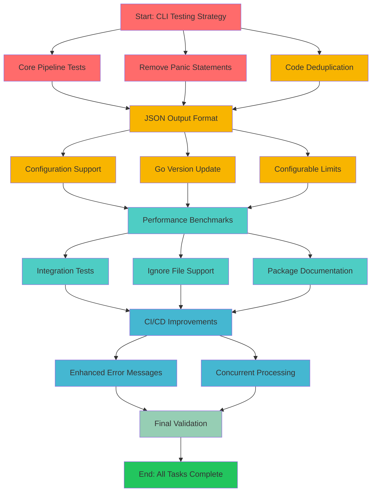

# dupl Execution Plan: Critical Foundation First

**Date:** 2025-11-29_20-31\
**Phase:** Critical Foundation & Essential Features\
**Goal:** Establish testing foundation and implement high-impact features

## Pareto Analysis Summary

### 🎯 1% Effort → 51% Impact (Critical Foundation)

- CLI Testing Strategy Implementation
- Core Pipeline Test Coverage
- Remove Panic Statements
- Code Duplication Cleanup

### 🚀 4% Effort → 64% Impact (Essential Features)

- JSON Output Format
- Configuration File Support
- Update Go Version
- Make maxChildrenSerial Configurable

### 📈 20% Effort → 80% Impact (Quality Improvements)

- Performance Benchmarks
- Integration Tests
- Ignore File Support
- Package Documentation
- CI/CD Improvements
- Enhanced Error Messages
- Concurrent Processing

## Medium Tasks (30-100min each) - 27 Total

| ID  | Task                                 | File(s)                                   | Effort | Impact   | Priority | Status |
| --- | ------------------------------------ | ----------------------------------------- | ------ | -------- | -------- | ------ |
| M1  | CLI Testing Strategy Implementation  | main.go                                   | 120min | Critical | 1        | ⚪     |
| M2  | Core Pipeline Test Coverage          | job/                                      | 90min  | Critical | 2        | ⚪     |
| M3  | Remove Panic Statements              | printer/text.go, suffixtree/suffixtree.go | 45min  | Critical | 3        | ⚪     |
| M4  | Code Duplication - unique() Function | main.go, lib.go                           | 30min  | High     | 4        | ⚪     |
| M5  | JSON Output Format                   | printer/                                  | 90min  | High     | 5        | ⚪     |
| M6  | Configuration File Support           | main.go, config/                          | 90min  | High     | 6        | ⚪     |
| M7  | Update Go Version                    | go.mod                                    | 15min  | High     | 7        | ⚪     |
| M8  | Make maxChildrenSerial Configurable  | syntax/syntax.go                          | 45min  | High     | 8        | ⚪     |
| M9  | Performance Benchmarks               | benchmark/                                | 60min  | Medium   | 9        | ⚪     |
| M10 | Integration Tests                    | test/integration/                         | 120min | Medium   | 10       | ⚪     |
| M11 | Ignore File Support                  | main.go                                   | 60min  | Medium   | 11       | ⚪     |
| M12 | Package Documentation                | All packages                              | 120min | Medium   | 12       | ⚪     |
| M13 | CI/CD Improvements                   | .github/workflows/                        | 45min  | Medium   | 13       | ⚪     |
| M14 | Enhanced Error Messages              | All error paths                           | 60min  | Medium   | 14       | ⚪     |
| M15 | Concurrent Processing                | job/                                      | 120min | Low      | 15       | ⚪     |

## Micro Tasks (≤15min each) - 45 Total

### Critical Foundation Tasks (Tasks 1-15)

**CLI Testing Strategy (M1)**

1. Extract CLI interface from main.go (15min)
2. Create CLI wrapper for production (10min)
3. Create CLI mock for testing (10min)
4. Add CLI flag tests (15min)
5. Add CLI error path tests (15min)
6. Add CLI help tests (10min)
7. Add integration with test CLI (10min)
8. Verify test coverage (5min)

**Core Pipeline Tests (M2)** 9. Create job/parse.go test file (10min) 10. Add job/parse.go success tests (15min) 11. Add job/parse.go error tests (15min) 12. Create job/buildtree.go test file (10min) 13. Add job/buildtree.go tests (15min) 14. Add edge case tests (10min) 15. Verify test coverage (5min)

**Remove Panics (M3)** 16. Fix printer/text.go panic (10min) 17. Fix suffixtree/suffixtree.go panic 1 (10min) 18. Fix suffixtree/suffixtree.go panic 2 (10min) 19. Fix suffixtree/suffixtree.go panic 3 (5min) 20. Add error handling tests (10min)

**Code Deduplication (M4)** 21. Extract unique() to util package (15min) 22. Update main.go import (5min) 23. Update lib.go import (5min) 24. Test extracted function (10min)

**JSON Output (M5)** 25. Design JSON format structure (10min) 26. Create json.go file (10min) 27. Implement JSON printer (15min) 28. Add JSON CLI flag (5min) 29. Add JSON tests (15min)

### Essential Feature Tasks (Tasks 16-30)

**Configuration Support (M6)** 30. Design config file format (10min) 31. Create config parser (15min) 32. Add CLI config flag (5min) 33. Add config tests (10min)

**Go Version Update (M7)** 34. Update go.mod version (5min) 35. Test compatibility (10min) 36. Update CI/CD version (5min)

**Configurable Limits (M8)** 37. Add CLI flag for maxChildrenSerial (5min) 38. Update parsing logic (5min) 39. Add validation (5min) 40. Add tests (5min)

### Quality Improvement Tasks (Tasks 31-45)

**Performance Benchmarks (M9)** 41. Create benchmark framework (10min) 42. Add core algorithm benchmarks (15min) 43. Add integration benchmarks (10min)

**Integration Tests (M10)** 44. Create test data structure (15min) 45. Add end-to-end scenarios (15min)

## Execution Graph

## Success Metrics

### Critical Foundation (Week 1)

- [ ] CLI test coverage > 80%
- [ ] Core pipeline test coverage > 80%
- [ ] Zero panic statements in production
- [ ] Zero code duplication
- [ ] All tests passing

### Essential Features (Week 2)

- [ ] JSON output format working
- [ ] Configuration file support
- [ ] Go version updated to 1.22+
- [ ] Configurable performance limits
- [ ] Integration test framework

### Quality Improvements (Week 3-4)

- [ ] Performance benchmarks established
- [ ] Integration tests covering main scenarios
- [ ] Ignore file support
- [ ] Package documentation complete
- [ ] CI/CD improvements deployed

## Risk Mitigation

### High Risk Items

1. **CLI Testing Complexity** - Use interface pattern to isolate
2. **Performance Regression** - Benchmarks before optimization
3. **Breaking Changes** - Maintain backward compatibility

### Medium Risk Items

1. **Configuration Complexity** - Start simple, iterate
2. **Test Maintenance** - Automate test data generation
3. **Documentation Drift** - Keep docs in sync with code

## Implementation Strategy

### Phase 1: Foundation (Critical 1%)

1. Establish test infrastructure first
2. Fix stability issues (panics, errors)
3. Remove technical debt (duplication)
4. Validate all existing functionality

### Phase 2: Features (Essential 4%)

1. Add JSON output for CI/CD
2. Implement configuration support
3. Update dependencies and modernize
4. Make performance configurable

### Phase 3: Quality (Value 20%)

1. Add performance tracking
2. Comprehensive testing
3. Developer experience improvements
4. Documentation and examples

## Timeline

- **Week 1**: Critical Foundation (4.5 hours)
- **Week 2**: Essential Features (4 hours)
- **Week 3-4**: Quality Improvements (6 hours)

**Total Estimated Effort: 14.5 hours**

## Next Immediate Actions

1. Start with CLI testing strategy (M1, tasks 1-8)
2. Add core pipeline tests (M2, tasks 9-15)
3. Remove all panic statements (M3, tasks 16-20)
4. Extract duplicate code (M4, tasks 21-24)

These foundation tasks will enable safe development of all subsequent improvements.
