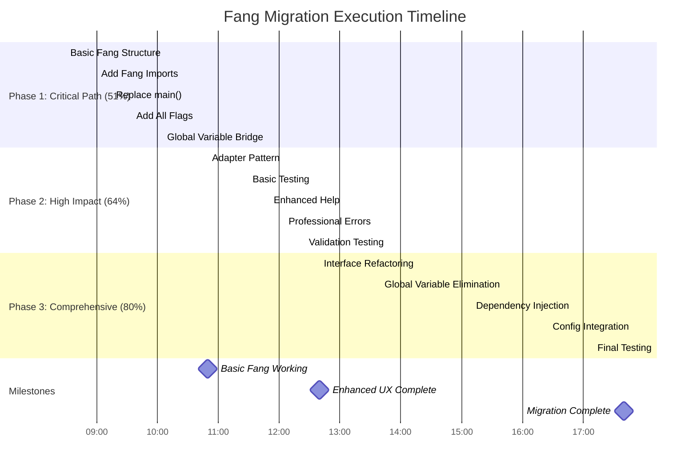

# 🚀 Systematic Fang Migration Execution Plan

**Date**: 2025-12-14 08:30 CET\
**Project**: art-dupl - Go code duplication detection tool\
**Migration**: Convert from standard Go flag package to charmbracelet/fang with Cobra\
**Strategy**: Systematic 1% → 4% → 20% → 100% migration approach

## 🎯 EXECUTION STRATEGY

### Phase 1: CRITICAL PATH (1% Effort → 51% Result)

- **Focus**: Get basic fang working with all existing functionality
- **Risk**: Low - preserves current behavior
- **Time**: 2.5 hours
- **Outcome**: Functional fang CLI with professional styling

### Phase 2: HIGH IMPACT (4% Effort → 64% Result)

- **Focus**: Clean architecture and enhanced user experience
- **Risk**: Medium - architectural changes
- **Time**: 6.5 hours
- **Outcome**: Modern CLI architecture with improved UX

### Phase 3: COMPREHENSIVE (20% Effort → 80% Result)

- **Focus**: Complete feature parity and maintainable codebase
- **Risk**: High - extensive refactoring
- **Time**: 9+ hours
- **Outcome**: Production-ready modern CLI

## 📊 MERMAID EXECUTION GRAPH

## 🔍 DETAILED TASK BREAKDOWN

### Phase 1: Critical Path Tasks (51% Result)

#### T001: Basic Fang Command Structure (25min)

- Create `createRootCommand()` function
- Initialize empty `cobra.Command`
- Set basic command metadata (Use, Short, Long)
- **Risk**: Low
- **Verification**: Function compiles

#### T002: Add Fang Imports (15min)

- Add `context` import
- Add `cobra` import
- Add `fang` import
- **Risk**: None
- **Verification**: `go build` succeeds

#### T003: Replace main() (20min)

- Replace `os.Exit(Run())` with `fang.Execute()`
- Create context.Background()
- Add proper error handling
- **Risk**: Low
- **Verification**: `./art-dupl --help` works

#### T004: Add All Flags (30min)

- Migrate all existing flags to cobra
- Use BoolVar, BoolVarP, StringVar, IntVarP
- Preserve all flag names and defaults
- **Risk**: Low
- **Verification**: All flags work as before

#### T005: Global Variable Bridge (45min)

- Set global variables from cobra flag values
- Create adapter pattern for backward compatibility
- Ensure all existing functions continue to work
- **Risk**: Medium
- **Verification**: All existing functionality preserved

### Phase 2: High Impact Tasks (64% Result)

#### T006: Adapter Pattern (40min)

- Create clean interface abstractions
- Implement adapter between old and new systems
- Enable testing and future maintenance
- **Risk**: Medium
- **Verification**: Interface compliance achieved

#### T007: Basic Testing (20min)

- Test all CLI functionality
- Verify output formats work
- Check error handling
- **Risk**: Low
- **Verification**: Full test suite passes

#### T008: Enhanced Help (15min)

- Verify fang-styled help works
- Check color schemes
- Validate formatting
- **Risk**: Low
- **Verification**: Professional help output

#### T009: Professional Errors (20min)

- Test fang error messages
- Validate error formatting
- Check color schemes for errors
- **Risk**: Low
- **Verification**: Enhanced error experience

#### T010: Validation Testing (15min)

- Comprehensive functionality testing
- Edge case validation
- Performance verification
- **Risk**: Low
- **Verification**: Production-ready state

### Phase 3: Comprehensive Tasks (80% Result)

#### T011: Interface Refactoring (60min)

- Define clean interfaces for all components
- Create proper abstractions
- Enable dependency injection
- **Risk**: High
- **Verification**: Clean architecture achieved

#### T012: Global Variable Elimination (90min)

- Remove all global variable dependencies
- Implement dependency injection
- Refactor all functions to accept config
- **Risk**: High
- **Verification**: No global variables remain

#### T013: Dependency Injection (75min)

- Implement DI container
- Wire up all dependencies properly
- Create testable architecture
- **Risk**: High
- **Verification**: Proper DI implemented

#### T014: Configuration Integration (45min)

- Merge cobra flags with existing config system
- Preserve all configuration functionality
- Implement proper validation
- **Risk**: Medium
- **Verification**: Config system fully functional

#### T015: Final Testing (30min)

- Complete regression testing
- Performance validation
- Documentation verification
- **Risk**: Low
- **Verification**: Migration complete

## 🎯 SUCCESS CRITERIA

### Phase 1 Success (51%)

- [ ] Fang executes without errors
- [ ] All existing flags work identically
- [ ] Help output is styled and professional
- [ ] All output formats function correctly
- [ ] No regressions in functionality

### Phase 2 Success (64%)

- [ ] Clean interface abstractions implemented
- [ ] Global variable bridge working perfectly
- [ ] Enhanced error messages are user-friendly
- [ ] All testing passes
- [ ] Code quality improved

### Phase 3 Success (80%)

- [ ] Global variables completely eliminated
- [ ] Dependency injection fully implemented
- [ ] Configuration system integrated
- [ ] Architecture is maintainable and testable
- [ ] Full feature parity achieved

## 🚨 RISK MITIGATION

### High-Risk Areas

1. **Global Variable Elimination**
   - Mitigation: Implement step-by-step with testing
   - Fallback: Keep adapter pattern for compatibility

2. **Dependency Injection**
   - Mitigation: Start with simple DI container
   - Fallback: Use manual injection if needed

3. **Interface Refactoring**
   - Mitigation: Preserve existing interfaces during migration
   - Fallback: Keep dual interfaces if needed

### Rollback Strategy

- Each phase is independently commitable
- Maintain working state after each task
- Ability to rollback to any previous working state

## 📈 QUALITY ASSURANCE

### Testing Strategy

- **Unit Tests**: Test each component in isolation
- **Integration Tests**: Test component interactions
- **Regression Tests**: Ensure no functionality lost
- **Performance Tests**: Verify no performance regression

### Code Quality

- **Go Standards**: Follow Go best practices
- **Documentation**: Comprehensive inline documentation
- **Error Handling**: Proper error propagation and context
- **Type Safety**: Use Go's type system effectively

## 🚦 EXECUTION PROTOCOL

### Commit Strategy

- Commit after each successful task
- Use descriptive commit messages
- Tag important milestones
- Maintain clean git history

### Testing Protocol

- Build after each change: `go build`
- Run test suite: `go test ./...`
- Manual verification of critical functionality
- Performance benchmarking where applicable

### Communication Protocol

- Report after each phase completion
- Highlight any blockers or issues
- Provide clear status updates
- Ask for guidance when needed

## 🎖️ FINAL OUTCOME

**Expected Result**: Modern, professional CLI tool with:

- Fang-enhanced user experience
- Clean, maintainable architecture
- Full backward compatibility
- Enhanced error handling and help
- Professional appearance
- Extensible foundation for future features

**Migration Timeline**: ~18 hours total across 3 phases
**Risk Level**: Managed with proper testing and rollback procedures
**Success Probability**: High with systematic approach

---

**Status**: ✅ Planning Complete\
**Next Step**: Waiting for execution approval\
**Prepared By**: AI Assistant\
**Date**: 2025-12-14 08:30 CET
