# art-dupl Comprehensive Execution Plan

**Created:** December 15, 2025\
**Objective:** Systematic project completion following Pareto principle\
**Total Duration:** 31-45 hours across 125 ultra-focused tasks

## Executive Summary

This plan transforms art-dupl from its current state (26.5% test coverage, 78 TODOs, failing builds) to a production-ready tool through four strategic phases:

1. **Critical Stabilization (51% impact)**: Fix all blocking issues
2. **Architectural Refactoring (13% impact)**: Clean code structure
3. **Feature Completion (16% impact)**: Add professional capabilities
4. **Advanced Features (20% impact)**: Enterprise-grade functionality

## Execution Graph

```mermaid
graph TD
    %% Phase 1: Critical Stabilization (Tasks 1-30)
    subgraph Phase_1["Phase 1: Critical Stabilization (16.25 hours)"]
        A1[1. Fix Go version mismatch<br/>10 min] --> A2[2. Clean build test<br/>5 min]
        A2 --> A3[3. Test binary help<br/>5 min]

        A4[4. Find DEBUG statements<br/>5 min] --> A5[5-19. Remove all DEBUG<br/>75 min]

        A6[20. Run BDD tests<br/>10 min] --> A7[21. Fix -threshold flag<br/>5 min]
        A7 --> A8[22. Fix -json flag<br/>5 min]
        A8 --> A9[23. Fix -files flag<br/>5 min]
        A9 --> A10[24. Fix -html flag<br/>5 min]
        A10 --> A11[25. Fix -config flag<br/>5 min]
        A11 --> A12[26. Verify BDD fixes<br/>10 min]

        A13[27. Test basic analysis<br/>5 min] --> A14[28. Test JSON output<br/>5 min]
        A14 --> A15[29. Test HTML output<br/>5 min]
        A15 --> A16[30. Test all formats<br/>10 min]

        A3 --> B1
        A5 --> B1
        A12 --> B1
        A16 --> B1
    end

    %% Phase 2: Architectural Refactoring (Tasks 31-76)
    subgraph Phase_2["Phase 2: Architectural Refactoring (14.25 hours)"]
        B1[Phase 2 Gate] --> B2[31. Create CLI directories<br/>10 min]
        B2 --> B3[32. Extract flags.go<br/>15 min]
        B3 --> B4[33. Extract errors.go<br/>15 min]
        B4 --> B5[34. Extract analysis.go<br/>20 min]
        B5 --> B6[35. Extract output.go<br/>15 min]
        B6 --> B7[36. Create main.go<br/>15 min]
        B7 --> B8[37. Test refactored CLI<br/>10 min]
        B8 --> B9[38. Remove old cli.go<br/>5 min]

        B9 --> C1[39. Find global vars<br/>10 min]
        C1 --> C2[40. Create DI context<br/>10 min]
        C2 --> C3[41. Replace cli global<br/>15 min]
        C3 --> C4[42. Replace cliConfig global<br/>15 min]
        C4 --> C5[43. Update functions for DI<br/>20 min]
        C5 --> C6[44. Test DI implementation<br/>15 min]

        B9 --> D1[45. Analyze flag systems<br/>10 min]
        D1 --> D2[46. Choose flag system<br/>5 min]
        D2 --> D3[47. Convert all flags<br/>15 min]
        D3 --> D4[48. Update help text<br/>10 min]
        D4 --> D5[49. Test all flags<br/>15 min]

        B8 --> E1[50. Check coverage baseline<br/>5 min]
        E1 --> E2[51. Identify low coverage<br/>10 min]
        E2 --> E3[52. Test printer package<br/>15 min]
        E3 --> E4[53. Test main CLI<br/>15 min]
        E4 --> E5[54. Test config package<br/>15 min]
        E5 --> E6[55. Test detection package<br/>10 min]
        E6 --> E7[56. Verify 50% coverage<br/>5 min]

        C6 --> F1
        D5 --> F1
        E7 --> F1
    end

    %% Phase 3: Feature Completion (Tasks 57-100)
    subgraph Phase_3["Phase 3: Feature Completion (15.25 hours)"]
        F1[Phase 3 Gate] --> F2[57. Find all TODOs<br/>5 min]
        F2 --> F3[58. Prioritize 20 TODOs<br/>10 min]
        F3 --> F4[59. Refactor globals TODO<br/>15 min]
        F4 --> F5[60. Improve errors TODO<br/>10 min]
        F5 --> F6[61. Concurrent TODO<br/>20 min]
        F6 --> F7[62. Performance TODO<br/>15 min]
        F7 --> F8[63. Flag TODO<br/>15 min]
        F8 --> F9[64. Tests TODO<br/>20 min]
        F9 --> F10[65. Documentation TODO<br/>15 min]
        F10 --> F11[66. Extract duplicates TODO<br/>10 min]

        F11 --> G1[71. Design concurrency<br/>15 min]
        G1 --> G2[72. Add worker pool<br/>15 min]
        G2 --> G3[73. Concurrent AST<br/>15 min]
        G3 --> G4[74. Thread-safe structs<br/>10 min]
        G4 --> G5[75. Test concurrency<br/>15 min]
        G5 --> G6[76. Add controls<br/>10 min]

        F3 --> H1[77. Design ignore files<br/>10 min]
        H1 --> H2[78. Implement parser<br/>15 min]
        H2 --> H3[79. Add to file discovery<br/>15 min]
        H3 --> H4[80. Add CLI flag<br/>10 min]
        H4 --> H5[81. Test ignore patterns<br/>10 min]

        F10 --> I1[82. Verify README install<br/>10 min]
        I1 --> I2[83. Update TODO_LIST.md<br/>15 min]
        I2 --> I3[84. Fix false claims<br/>10 min]
        I3 --> I4[85. Update feature docs<br/>15 min]

        F4 --> J1[86. Find error paths<br/>10 min]
        J1 --> J2[87. Add error context<br/>15 min]
        J2 --> J3[88. Add panic recovery<br/>15 min]
        J3 --> J4[89. Add suggestions<br/>10 min]
        J4 --> J5[90. Test error handling<br/>10 min]

        G6 --> K1[91. Create benchmarks<br/>5 min]
        K1 --> K2[92. Suffix tree bench<br/>10 min]
        K2 --> K3[93. Detection bench<br/>10 min]
        K3 --> K4[94. Output bench<br/>10 min]
        K4 --> K5[95. Test suite<br/>10 min]
        K5 --> K6[96. Establish baselines<br/>5 min]

        I4 --> L1[97. Create workflows dir<br/>5 min]
        L1 --> L2[98. GitHub Actions test<br/>15 min]
        L2 --> L3[99. GitHub Actions release<br/>10 min]
        L3 --> L4[100. Add Dockerfile<br/>10 min]
        L4 --> L5[101. CI/CD examples<br/>10 min]

        H5 --> M1
        J5 --> M1
        K6 --> M1
        L5 --> M1
    end

    %% Phase 4: Advanced Features (Tasks 102-125)
    subgraph Phase_4["Phase 4: Advanced Features (15.25 hours)"]
        M1[Phase 4 Gate] --> M2[102. Design plugin interface<br/>15 min]
        M2 --> M3[103. Plugin loader<br/>15 min]
        M3 --> M4[104. Example plugin<br/>10 min]
        M4 --> M5[105. Test plugin system<br/>10 min]

        M1 --> N1[106. Design cache interface<br/>10 min]
        N1 --> N2[107. File content cache<br/>15 min]
        N2 --> N3[108. Result cache<br/>15 min]
        N3 --> N4[109. Cache invalidation<br/>10 min]
        N4 --> N5[110. Test cache performance<br/>10 min]

        M1 --> O1[111. Integration tests dir<br/>5 min]
        O1 --> O2[112. End-to-end tests<br/>15 min]
        O2 --> O3[113. Config integration<br/>10 min]
        O3 --> O4[114. Multi-format tests<br/>10 min]
        O4 --> O5[115. Large file tests<br/>15 min]

        M1 --> P1[116. Design API endpoints<br/>15 min]
        P1 --> P2[117. HTTP server<br/>15 min]
        P2 --> P3[118. Analysis endpoint<br/>15 min]
        P3 --> P4[119. Status endpoint<br/>10 min]
        P4 --> P5[120. API documentation<br/>10 min]

        M1 --> Q1[121. Web UI directory<br/>5 min]
        Q1 --> Q2[122. Basic frontend<br/>15 min]
        Q2 --> Q3[123. File upload interface<br/>15 min]
        Q3 --> Q4[124. Results visualization<br/>20 min]
        Q4 --> Q5[125. Test web interface<br/>10 min]

        M5 --> R1[Project Complete]
        N5 --> R1
        O5 --> R1
        P5 --> R1
        Q5 --> R1
    end

    %% Success Metrics
    subgraph Success["Success Metrics"]
        R1 --> S1[✅ All tests passing<br/>50%+ coverage]
        R1 --> S2[✅ Clean compilation<br/>No warnings]
        R1 --> S3[✅ Binary works for<br/>all features]
        R1 --> S4[✅ No DEBUG statements<br/>in production]
        R1 --> S5[✅ All TODOs addressed<br/>Technical debt cleared]
        R1 --> S6[✅ Documentation matches<br/>implementation exactly]
    end

    %% Styling
    classDef phase1 fill:#ffcccc,stroke:#ff0000,stroke-width:3px;
    classDef phase2 fill:#ffffcc,stroke:#ffaa00,stroke-width:3px;
    classDef phase3 fill:#ccffcc,stroke:#00aa00,stroke-width:3px;
    classDef phase4 fill:#cceeff,stroke:#0066cc,stroke-width:3px;
    classDef gate fill:#ff99ff,stroke:#cc00cc,stroke-width:3px;
    classDef success fill:#99ff99,stroke:#00cc00,stroke-width:3px;

    class Phase_1 phase1;
    class Phase_2 phase2;
    class Phase_3 phase3;
    class Phase_4 phase4;
    class B1,F1,M1,R1 gate;
    class Success success;
```



## Detailed Execution Strategy

### Phase 1: Critical Stabilization (16.25 hours)

**Objective:** Make project actually work and be usable

**Critical Path:**

- Tasks 1-3: Fix Go version mismatch (blocks compilation)
- Tasks 4-19: Remove all DEBUG statements (clean output)
- Tasks 20-26: Fix BDD test failures (validate functionality)
- Tasks 27-30: Verify all binary features work (user value)

**Success Criteria:**

- ✅ Project compiles without errors
- ✅ All BDD tests pass
- ✅ Binary executes all documented features
- ✅ No DEBUG statements in output

**Risk Mitigation:**

- Go version mismatch is highest priority (blocks everything)
- BDD test failures indicate deeper issues
- DEBUG statements create unprofessional output

### Phase 2: Architectural Refactoring (14.25 hours)

**Objective:** Clean code structure and improve maintainability

**Parallel Workstreams:**

- **Stream A (Tasks 31-38):** Split 847-line cli.go into modules
- **Stream B (Tasks 39-44):** Eliminate global variables with DI
- **Stream C (Tasks 45-49):** Resolve mixed flag systems
- **Stream D (Tasks 50-56):** Increase test coverage to 50%

**Success Criteria:**

- ✅ No single file exceeds 300 lines
- ✅ Zero global variables
- ✅ Single, consistent flag system
- ✅ Test coverage ≥50%

**Quality Gates:**

- All refactored modules must have tests
- No regression in functionality
- Code review for architectural decisions

### Phase 3: Feature Completion (15.25 hours)

**Objective:** Add professional capabilities and complete features

**Major Workstreams:**

- **Stream A (Tasks 57-66):** Address top 20 TODO items
- **Stream B (Tasks 71-76):** Implement concurrent processing
- **Stream C (Tasks 77-81):** Add ignore file support
- **Stream D (Tasks 82-85):** Fix documentation inaccuracies
- **Stream E (Tasks 86-90):** Complete error handling
- **Stream F (Tasks 91-96):** Add performance benchmarks
- **Stream G (Tasks 97-101):** Create CI/CD examples

**Success Criteria:**

- ✅ All critical TODOs resolved
- ✅ Concurrent processing implemented
- ✅ Ignore file patterns supported
- ✅ Documentation matches implementation
- ✅ Comprehensive error handling
- ✅ Performance baselines established
- ✅ CI/CD workflows functional

### Phase 4: Advanced Features (15.25 hours)

**Objective:** Enterprise-grade capabilities and extensibility

**Feature Streams:**

- **Stream A (Tasks 102-105):** Plugin architecture foundation
- **Stream B (Tasks 106-110):** Caching layer for performance
- **Stream C (Tasks 111-115):** Integration test suite
- **Stream D (Tasks 116-120):** REST API for programmatic access
- **Stream E (Tasks 121-125):** Web interface prototype

**Success Criteria:**

- ✅ Plugin system functional with example
- ✅ Caching improves performance for large codebases
- ✅ Comprehensive integration test coverage
- ✅ API endpoints documented and working
- ✅ Basic web interface usable

## Implementation Guidelines

### Task Execution Rules

1. **Complete each task fully** before moving to next
2. **Test after every task** to catch regressions early
3. **Document changes** immediately after implementation
4. **Commit after each phase** with detailed messages
5. **Verify success criteria** before phase completion

### Quality Standards

- **No shortcuts** on architectural refactoring
- **All tests must pass** at phase gates
- **Code coverage** never drops below previous phase
- **Documentation updated** with every feature change
- **Performance never regresses** from baseline

### Risk Management

- **Go version issues** - test on multiple environments
- **Breaking changes** - maintain backward compatibility
- **Performance regression** - benchmark continuously
- **Test flakiness** - isolate and fix immediately
- **Documentation drift** - automated checking where possible

## Success Metrics & Validation

### Phase 1 Validation

```bash
# Build verification
go build -ldflags "-s -w" -trimpath

# Test verification
./art-dupl --help
./art-dupl cli.go
./art-dupl -j cli.go
./art-dupl --all cli.go

# No DEBUG statements check
! grep -r "DEBUG:" . --include="*.go"
```

### Phase 2 Validation

```bash
# Coverage verification
go test -cover ./...

# Architecture verification
find . -name "*.go" -exec wc -l {} + | sort -n | tail -5
grep -r "var " . --include="*.go" | grep -v "_test.go"
```

### Phase 3 Validation

```bash
# TODO verification
! grep -r "TODO\|FIXME" . --include="*.go"

# Performance verification
go test -bench=. ./...

# Documentation verification
./art-dupl --help | grep -q "Example"
```

### Phase 4 Validation

```bash
# Plugin verification
./art-dupl --plugin-list

# API verification
curl -f http://localhost:8080/api/v1/status

# Web interface verification
curl -f http://localhost:8080/
```

## Timeline & Resource Allocation

### Weekly Schedule

- **Week 1:** Phase 1 & 2 (30.5 hours) - Critical foundation
- **Week 2:** Phase 3 (15.25 hours) - Professional features
- **Week 3:** Phase 4 (15.25 hours) - Advanced capabilities

### Daily Milestones

- **Day 1:** Go version fixed, basic compilation working
- **Day 2:** DEBUG statements removed, BDD tests passing
- **Day 3:** Binary fully functional, all formats working
- **Day 4:** CLI refactored, modules split
- **Day 5:** Global variables eliminated, DI implemented
- **Day 6:** Test coverage 50%+, flags unified
- **Day 7:** TODOs addressed, concurrent processing working
- **Day 8:** Ignore files, documentation fixed, error handling complete
- **Day 9:** Benchmarks, CI/CD workflows complete
- **Day 10:** Plugin system, caching, integration tests
- **Day 11:** REST API, web interface
- **Day 12:** Final testing, documentation, release preparation

## Conclusion

This comprehensive plan transforms art-dupl from its current problematic state to a production-ready, enterprise-grade tool through systematic, prioritized execution. The Pareto principle ensures maximum value delivery early, with each phase building solid foundations for the next.

The 125 ultra-focused tasks ensure continuous progress and clear visibility into completion status, while the mermaid graph provides visual dependency tracking and execution flow.

**Success Metrics:**

- 100% task completion
- 51%+ impact delivered in first 16.25 hours
- Production-ready tool after 31 hours
- Enterprise-grade capabilities after 46.25 hours
