# Art-Dupl Code Duplication Elimination Plan

**Date**: 2025-12-17  
**Version**: 1.0  
**Author**: Crush AI Assistant  
**Target**: Eliminate 35 clone groups with threshold 30 using 80/20, 64/4, 51/1 principles

---

## Executive Summary

This plan addresses the 35 clone groups detected by art-dupl with threshold 30. Using the Pareto principle, we focus on the **1% of changes that deliver 51% of value**, then expand to cover **4% delivering 64% value**, and finally **20% delivering 80% value**.

### Key Findings
- **35 clone groups** identified across the codebase
- **Highest impact**: CLI output format duplication and error handling patterns
- **Total effort**: ~47 hours (125 tasks × 15-30 minutes each)
- **Estimated value delivery**: 80% code quality improvement with 20% effort

---

## 80/20, 64/4, 51/1 Analysis

### 51/1 - Critical Impact (1% delivers 51% of value)

#### 1. CLI Output Format Switch Blocks
- **Files**: `cli.go:194,663`
- **Problem**: Duplicated 6-line switch statements for printer creation
- **Solution**: Extract `createPrinter()` function
- **Value**: Eliminates core duplication in CLI functionality
- **Effort**: 2 hours (6 tasks × 15-30 min)

#### 2. Configuration Error Handling
- **Files**: `cli.go:606,621`
- **Problem**: Identical validation error handling patterns
- **Solution**: Extract `handleConfigError()` function
- **Value**: Centralizes error handling logic
- **Effort**: 1.5 hours (5 tasks × 15-30 min)

### 64/4 - High Impact (4% delivers 64% of value)

#### 3. Output Format Conflict Validation
- **Files**: `cli.go:629-641`
- **Problem**: Triple-duplicated conflict validation blocks
- **Solution**: Create `validateOutputFormatConflicts()` helper
- **Value**: Consolidates validation logic
- **Effort**: 1.5 hours (6 tasks × 15-30 min)

#### 4. Sorting Logic Consolidation
- **Files**: `printer/json.go:93,101,105` & `printer/sorter.go:153,161`
- **Problem**: Duplicated sorting implementations
- **Solution**: Unified sorting module
- **Value**: Centralizes sorting strategy
- **Effort**: 1.5 hours (6 tasks × 15-30 min)

#### 5. File Content Processing
- **Files**: `printer/html.go:109` & `json.go:147`
- **Problem**: Duplicated file processing logic
- **Solution**: Extract `extractFileContent()` helper
- **Value**: Shared processing pipeline
- **Effort**: 1.5 hours (6 tasks × 15-30 min)

#### 6. JSON MarshalJSON Patterns
- **Files**: `config/detectionmethod.go:42,46`, `outputformat.go:29,33,66,70`
- **Problem**: Triple-duplicated MarshalJSON implementations
- **Solution**: Generic enum marshaling function
- **Value**: Centralizes enum marshaling
- **Effort**: 1 hour (5 tasks × 15-30 min)

### 80/20 - Medium Impact (20% delivers 80% of value)

#### Remaining 21 Tasks
- Error writing utilities
- Test helpers and utilities
- Configuration validation
- Printer factory pattern
- Performance optimizations
- Documentation updates

---

## Implementation Plan

### Phase 1: Critical Impact (Tasks 1-12)
**Timeline**: 6 hours  
**Focus**: Eliminate highest-value duplications

```mermaid
gantt
    title Phase 1: Critical Impact Implementation
    dateFormat X
    axisFormat %s
    
    section CLI Refactoring
    Analyze CLI switch blocks    :crit, 2022-01-01, 15min
    Design createPrinter()       :crit, 2022-01-01, 10min
    Implement createPrinter()    :crit, 2022-01-01, 15min
    Replace switch blocks        :crit, 2022-01-01, 20min
    Test createPrinter()         :crit, 2022-01-01, 15min
    
    section Error Handling
    Analyze error patterns       :crit, 2022-01-01, 15min
    Design handleConfigError()   :crit, 2022-01-01, 10min
    Implement handleConfigError() :crit, 2022-01-01, 15min
    Replace error handling       :crit, 2022-01-01, 20min
    Test error handling         :crit, 2022-01-01, 15min
```



### Phase 2: High Impact (Tasks 13-39)
**Timeline**: 6.5 hours  
**Focus**: Consolidate major functional duplications

```mermaid
gantt
    title Phase 2: High Impact Implementation
    dateFormat X
    axisFormat %s
    
    section Output Validation
    Analyze conflicts           :crit, 2022-01-01, 15min
    Design validation          :crit, 2022-01-01, 10min
    Implement validation       :crit, 2022-01-01, 15min
    Replace validation blocks  :crit, 2022-01-01, 30min
    Test validation           :crit, 2022-01-01, 15min
    
    section Sorting Consolidation
    Analyze sorting patterns    :crit, 2022-01-01, 30min
    Design unified interface    :crit, 2022-01-01, 10min
    Implement unified sorting   :crit, 2022-01-01, 15min
    Replace sorting logic       :crit, 2022-01-01, 20min
    Test unified sorting        :crit, 2022-01-01, 15min
```



### Phase 3: Medium Impact (Tasks 40-125)
**Timeline**: 34.5 hours  
**Focus**: Systematic cleanup and optimization

---

## Detailed Task Breakdown

### 27 Primary Tasks (100-30min each)

| Priority | Task | Impact | Effort | Customer Value | Est. Time |
|----------|------|--------|--------|---------------|-----------|
| 1 | Extract createPrinter() function from CLI switch blocks | HIGH | LOW | HIGH | 30min |
| 2 | Create handleConfigError() helper function | HIGH | LOW | HIGH | 45min |
| 3 | Implement validateOutputFormatConflicts() helper | HIGH | MEDIUM | HIGH | 60min |
| 4 | Consolidate sorting logic in printer modules | HIGH | MEDIUM | MEDIUM | 75min |
| 5 | Extract extractFileContent() from html.go/json.go | HIGH | MEDIUM | MEDIUM | 60min |
| 6 | Create generic enum marshaling function | MEDIUM | MEDIUM | MEDIUM | 60min |
| 7 | Implement writeErrorAndExit() helper utility | MEDIUM | LOW | MEDIUM | 45min |
| 8 | Create shared test utilities for test data setup | MEDIUM | MEDIUM | LOW | 60min |
| 9 | Extract generic test validation helper | MEDIUM | MEDIUM | LOW | 45min |
| 10 | Centralize clone sorting by filename logic | MEDIUM | HIGH | LOW | 50min |
| 11 | Refactor CLI error writing patterns | MEDIUM | LOW | MEDIUM | 40min |
| 12 | Create configuration validation utilities | MEDIUM | MEDIUM | MEDIUM | 55min |
| 13 | Implement printer factory pattern | MEDIUM | HIGH | MEDIUM | 70min |
| 14 | Extract common error handling patterns | LOW | LOW | MEDIUM | 35min |
| 15 | Create file processing utilities | MEDIUM | MEDIUM | LOW | 50min |
| 16 | Implement output formatting helpers | LOW | MEDIUM | LOW | 45min |
| 17 | Refactor test data generation | LOW | MEDIUM | LOW | 40min |
| 18 | Create integration test helpers | LOW | MEDIUM | LOW | 55min |
| 19 | Implement performance test utilities | LOW | HIGH | LOW | 60min |
| 20 | Extract configuration parsing helpers | LOW | MEDIUM | LOW | 45min |
| 21 | Create file system utilities | LOW | LOW | LOW | 30min |
| 22 | Implement logging utilities | LOW | LOW | LOW | 35min |
| 23 | Refactor string formatting helpers | LOW | LOW | LOW | 30min |
| 24 | Create validation utilities | LOW | MEDIUM | LOW | 40min |
| 25 | Implement error type utilities | LOW | LOW | LOW | 35min |
| 26 | Extract common constants | LOW | LOW | LOW | 25min |
| 27 | Final cleanup and documentation | LOW | MEDIUM | LOW | 50min |

### 125 Granular Tasks (max 15min each)

**Phase 1: Critical Impact (Tasks 1-12)** - Focus on CLI core functionality

| ID | Task | Priority | Est. Time | Dependencies |
|----|------|----------|-----------|--------------|
| 1 | Analyze CLI output format switch blocks in cli.go:194,663 | HIGH | 15min | - |
| 2 | Design createPrinter() function signature | HIGH | 10min | 1 |
| 3 | Implement createPrinter() function skeleton | HIGH | 15min | 2 |
| 4 | Replace first switch block with createPrinter() call | HIGH | 10min | 3 |
| 5 | Replace second switch block with createPrinter() call | HIGH | 10min | 4 |
| 6 | Test createPrinter() function with unit tests | HIGH | 15min | 5 |
| 7 | Analyze config error handling in cli.go:606,621 | HIGH | 15min | - |
| 8 | Design handleConfigError() function signature | HIGH | 10min | 7 |
| 9 | Implement handleConfigError() function | HIGH | 15min | 8 |
| 10 | Replace first error handling block | HIGH | 10min | 9 |
| 11 | Replace second error handling block | HIGH | 10min | 10 |
| 12 | Test handleConfigError() with unit tests | HIGH | 15min | 11 |

**Phase 2: High Impact (Tasks 13-39)** - Focus on functional consolidation

| ID | Task | Priority | Est. Time | Dependencies |
|----|------|----------|-----------|--------------|
| 13 | Analyze output format conflicts in cli.go:629-641 | HIGH | 15min | - |
| 14 | Design validateOutputFormatConflicts() signature | HIGH | 10min | 13 |
| 15 | Implement validateOutputFormatConflicts() function | HIGH | 15min | 14 |
| 16 | Replace first conflict validation block | HIGH | 10min | 15 |
| 17 | Replace second conflict validation block | HIGH | 10min | 16 |
| 18 | Replace third conflict validation block | HIGH | 10min | 17 |
| 19 | Test validateOutputFormatConflicts() with unit tests | HIGH | 15min | 18 |
| 20-39 | [Complete list in appendix] | - | - | - |

**Phase 3: Medium Impact (Tasks 40-125)** - Systematic cleanup and optimization

| ID | Task | Priority | Est. Time | Dependencies |
|----|------|----------|-----------|--------------|
| 40-125 | [Complete list in appendix] | - | - | - |

---

## Risk Assessment & Mitigation

### High Risk Items
1. **CLI Functionality Regression**
   - **Risk**: Breaking core CLI functionality
   - **Mitigation**: Comprehensive testing after each change
   - **Recovery**: Git rollback strategy

2. **Printer Output Format Changes**
   - **Risk**: Output format incompatibility
   - **Mitigation**: Maintain backward compatibility
   - **Recovery**: Preserve original output format tests

3. **Configuration System Changes**
   - **Risk**: Configuration parsing failures
   - **Mitigation**: Preserve existing config interface
   - **Recovery**: Test with all configuration combinations

### Medium Risk Items
1. **Test System Refactoring**
   - **Risk**: Test coverage regression
   - **Mitigation**: Run full test suite after each test-related change
   - **Recovery**: Preserve original test patterns during transition

---

## Success Metrics

### Quantitative Metrics
- **Clone Reduction**: Target 80% reduction in clone groups (35 → 7)
- **Code Size**: Expected 15% reduction in lines of code
- **Test Coverage**: Maintain >90% coverage throughout process
- **Build Time**: Target 10% improvement in build times

### Qualitative Metrics
- **Maintainability**: Improved code readability and organization
- **Extensibility**: Easier addition of new output formats and features
- **Developer Experience**: Reduced cognitive load when working with codebase

---

## Implementation Timeline

### Week 1: Critical Impact (6 hours)
- **Monday-Tuesday**: CLI switch block refactoring
- **Wednesday-Thursday**: Error handling consolidation
- **Friday**: Testing and validation

### Week 2: High Impact (6.5 hours)
- **Monday**: Output format validation
- **Tuesday**: Sorting logic consolidation
- **Wednesday**: File content processing
- **Thursday**: JSON marshaling
- **Friday**: Testing and integration

### Week 3-4: Medium Impact (34.5 hours)
- **Week 3**: Utilities and test infrastructure
- **Week 4**: Final optimization and documentation

---

## Appendix

### Complete 125-Task Breakdown

[Full task list with dependencies and time estimates would be included in a real implementation]

### Code Examples

#### Before: Duplicated CLI Switch Block
```go
// cli.go:194
switch mergedConfig.OutputFormat {
case config.OutputFormatHTML:
    newPrinter = printer.NewHTML
case config.OutputFormatPlumbing:
    newPrinter = printer.NewPlumbing
case config.OutputFormatJSON:
    newPrinter = printer.NewJSON
default:
    newPrinter = printer.NewText
}

// cli.go:663 - DUPLICATE
switch mergedConfig.OutputFormat {
case config.OutputFormatHTML:
    newPrinter = printer.NewHTML
case config.OutputFormatPlumbing:
    newPrinter = printer.NewPlumbing
case config.OutputFormatJSON:
    newPrinter = printer.NewJSON
default:
    newPrinter = printer.NewText
}
```

#### After: Refactored with createPrinter()
```go
func createPrinter(format config.OutputFormat, w io.Writer, fread printer.ReadFile) printer.Printer {
    switch format {
    case config.OutputFormatHTML:
        return printer.NewHTML
    case config.OutputFormatPlumbing:
        return printer.NewPlumbing
    case config.OutputFormatJSON:
        return printer.NewJSON
    default:
        return printer.NewText
    }
}

// Usage in both locations:
newPrinter = createPrinter(mergedConfig.OutputFormat, cli.Stdout(), fileReader)
```

---

## Conclusion

This plan provides a systematic approach to eliminating code duplication in the art-dupl project. By focusing on the highest-impact changes first (51/1 principle), we maximize value delivery while minimizing risk. The phased approach ensures continuous integration and testing throughout the refactoring process.

The expected outcome is a more maintainable, extensible codebase with significantly reduced technical debt, while preserving all existing functionality and maintaining high test coverage.

---

**Next Steps**: Await approval to proceed with Phase 1 implementation.

---

*This document was generated by Crush AI Assistant on 2025-12-17*
*For questions or clarification, refer to the detailed task breakdown in the appendix.*