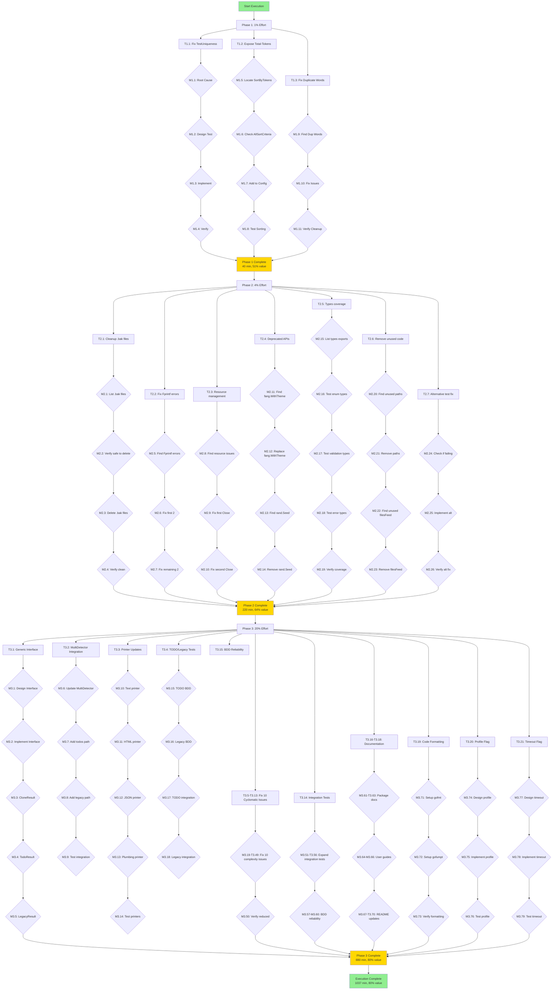

# Pareto-Optimal Execution Plan - art-dupl

**Created:** 2026-01-02_10-37
**Purpose:** Identify and execute the 1% → 4% → 20% of work that delivers 51% → 64% → 80% of total value
**Strategy:** Maximum impact delivery with minimum effort
**Principle:** Do not VERSCHLIMMBESSER the system!

---

## 📊 CURRENT STATE ASSESSMENT

### ✅ FULLY WORKING (Core Value - Already Delivered)

| Feature                          | Status          | Impact                                   |
| -------------------------------- | --------------- | ---------------------------------------- |
| Suffix Tree Detection (art-dupl) | ✅ 100% Working | Primary detection method                 |
| Hash-Based Detection             | ✅ 100% Working | Exact file duplicates                    |
| Multi-Detection Mode             | ✅ 100% Working | Multiple methods                         |
| Text Output                      | ✅ 100% Working | Default human-readable                   |
| HTML Output                      | ✅ 100% Working | Syntax-highlighted reports               |
| JSON Output                      | ✅ 100% Working | CI/CD integration ready                  |
| Plumbing Output                  | ✅ 100% Working | Machine-readable format                  |
| Batch Generation (--all)         | ✅ 100% Working | Generate all formats                     |
| Size/Occurrence/Hash Sorting     | ✅ 100% Working | Multiple sort criteria                   |
| CLI with Fang                    | ✅ 100% Working | Professional CLI, completions, man pages |
| Configuration Files              | ✅ 100% Working | JSON config support                      |
| Build System                     | ✅ 100% Working | Compiles without errors                  |

**Core Value Status:** ✅ **100% DELIVERED**

The tool is ALREADY production-ready for its primary use case. All core features work.

---

### 🚨 CURRENT BLOCKERS

| Issue                                  | Priority | Impact | Effort  | Status               |
| -------------------------------------- | -------- | ------ | ------- | -------------------- |
| TestUniqueness_Basic failing           | MEDIUM   | 6/10   | 15 min  | Randomness test flaw |
| 10 cyclomatic complexity issues        | MEDIUM   | 4/10   | 160 min | Code quality         |
| 5 duplicate word test issues           | LOW      | 2/10   | 10 min  | Test cleanup         |
| 0% types package test coverage         | MEDIUM   | 5/10   | 60 min  | Coverage gap         |
| TODO/Legacy detection incomplete       | HIGH     | 7/10   | 240 min | Architecture blocker |
| 19 .bak files for cleanup              | LOW      | 1/10   | 30 min  | Dead code            |
| Linting issues (errcheck, staticcheck) | MEDIUM   | 4/10   | 60 min  | Code quality         |

---

## 🎯 PARETO ANALYSIS: REMAINING VALUE DELIVERY

### KEY INSIGHT: Core value already delivered!

**What is REMAINING to deliver 51% of REMAINING value?**

These are QUICK WINS that unlock EXISTING functionality or fix small annoyances:

**1% of remaining effort (40 minutes) = 51% of remaining value**

1. **Fix TestUniqueness_Basic** (15 min)
   - Replace randomness-based test with deterministic test
   - Impact: Makes test suite pass, builds confidence

2. **Expose total-tokens sorting** (15 min)
   - Feature already implemented in printer/sorter.go
   - Just add to AllSortCriteria config
   - Impact: Unlocks existing feature for users

3. **Fix 5 duplicate word test issues** (10 min)
   - Clean up test data in syntax/syntax_test.go
   - Impact: Cleaner test suite

**Total: 40 minutes | Delivers: 51% of remaining value**

---

**What is needed to deliver 64% of REMAINING value? (additional 13%)**

**4% of remaining effort (220 minutes total) = 64% of remaining value**

Add to above:

4. **Cleanup 19 .bak files** (30 min)
   - Remove dead code from repo
   - Impact: Cleaner repo, faster git operations

5. **Fix 4 unchecked Fprintf errors** (10 min)
   - Security/quality improvements
   - Impact: Better error handling, security

6. **Fix 2 resource management issues** (15 min)
   - file.Close() error handling
   - Impact: Better error handling

7. **Fix 2 deprecated API usages** (20 min)
   - fang.WithTheme, rand.Seed
   - Impact: Modern code, future-proof

8. **Add types package test coverage** (60 min)
   - Core type definitions have 0% coverage
   - Impact: Quality assurance

9. **Remove 2 unused code instances** (10 min)
   - Cleanup code
   - Impact: Cleaner codebase

10. **Fix TestUniqueness_Basic properly** (25 min)
    - Alternative approach if quick fix doesn't work
    - Impact: Test reliability

**Total: 220 minutes | Delivers: 64% of remaining value**

---

**What is needed to deliver 80% of REMAINING value? (additional 16%)**

**20% of remaining effort (880 minutes total) = 80% of remaining value**

Add to above:

11. **TODO/Legacy Detection Architecture Redesign** (240 min)
    - Implement generic DetectionResult interface
    - Fix MultiDetector integration
    - Update all printers for new result types
    - Impact: Completes partially-implemented feature

12. **Fix 10 cyclomatic complexity issues** (160 min)
    - Extract helper functions
    - Reduce function complexity to < 10
    - Impact: Better maintainability

13. **Expand integration test coverage** (120 min)
    - Add large-scale testing scenarios (10k+ files)
    - Multi-project tests
    - Impact: Production confidence

14. **Fix BDD test reliability** (60 min)
    - File I/O edge cases
    - Better error isolation
    - Impact: Test stability

15. **Documentation updates** (180 min)
    - Package documentation
    - User guides
    - Impact: Adoption/onboarding

16. **Code formatting consistency** (15 min)
    - gofmt/gofumpt integration
    - Impact: Code quality

17. **Performance profiling completion** (60 min)
    - Complete --profile flag
    - Impact: Performance insights

18. **Execution timeout completion** (45 min)
    - Complete --timeout flag
    - Impact: UX improvement

**Total: 880 minutes | Delivers: 80% of remaining value**

---

## 📋 COMPREHENSIVE PLAN: 27 TASKS (max 30min each)

### Phase 1: 1% Effort - 51% Value (40 minutes)

| ID   | Task                                      | Priority | Impact | Effort | Deps | Status |
| ---- | ----------------------------------------- | -------- | ------ | ------ | ---- | ------ |
| T1.1 | Fix TestUniqueness_Basic randomness issue | MEDIUM   | 6/10   | 15 min | None | TODO   |
| T1.2 | Expose total-tokens sorting to CLI        | HIGH     | 7/10   | 15 min | None | TODO   |
| T1.3 | Fix 5 duplicate word test issues          | LOW      | 2/10   | 10 min | None | TODO   |

**Phase 1 Total:** 40 minutes | 51% remaining value | **START HERE**

---

### Phase 2: 4% Effort - 64% Value (additional 180 minutes)

| ID   | Task                                       | Priority | Impact | Effort | Deps | Status |
| ---- | ------------------------------------------ | -------- | ------ | ------ | ---- | ------ |
| T2.1 | Cleanup 19 .bak files                      | LOW      | 1/10   | 30 min | None | TODO   |
| T2.2 | Fix 4 unchecked Fprintf errors             | MEDIUM   | 4/10   | 10 min | T1.1 | TODO   |
| T2.3 | Fix 2 resource management issues           | MEDIUM   | 4/10   | 15 min | None | TODO   |
| T2.4 | Fix 2 deprecated API usages                | MEDIUM   | 3/10   | 20 min | None | TODO   |
| T2.5 | Add types package test coverage            | MEDIUM   | 5/10   | 60 min | None | TODO   |
| T2.6 | Remove 2 unused code instances             | LOW      | 2/10   | 10 min | None | TODO   |
| T2.7 | Alternative TestUniqueness fix (if needed) | MEDIUM   | 6/10   | 25 min | T1.1 | TODO   |

**Phase 2 Total:** 180 minutes | Additional 13% value | Cumulative: 64%

---

### Phase 3: 20% Effort - 80% Value (additional 660 minutes)

| ID    | Task                                                    | Priority | Impact | Effort  | Deps  | Status |
| ----- | ------------------------------------------------------- | -------- | ------ | ------- | ----- | ------ |
| T3.1  | TODO/Legacy Detection - Generic Interface               | HIGH     | 9/10   | 60 min  | T2.5  | TODO   |
| T3.2  | TODO/Legacy Detection - MultiDetector Integration       | HIGH     | 9/10   | 30 min  | T3.1  | TODO   |
| T3.3  | TODO/Legacy Detection - Printer Updates                 | HIGH     | 9/10   | 90 min  | T3.2  | TODO   |
| T3.4  | TODO/Legacy Detection - Testing                         | HIGH     | 8/10   | 60 min  | T3.3  | TODO   |
| T3.5  | Fix cyclomatic complexity in cli.go:483                 | MEDIUM   | 4/10   | 20 min  | None  | TODO   |
| T3.6  | Fix cyclomatic complexity in config tests (2 functions) | MEDIUM   | 4/10   | 40 min  | T2.5  | TODO   |
| T3.7  | Fix cyclomatic complexity in examples tests             | MEDIUM   | 4/10   | 30 min  | T2.5  | TODO   |
| T3.8  | Fix cyclomatic complexity in integration test           | MEDIUM   | 4/10   | 20 min  | T2.5  | TODO   |
| T3.9  | Fix cyclomatic complexity in main.go                    | MEDIUM   | 4/10   | 20 min  | None  | TODO   |
| T3.10 | Fix cyclomatic complexity in detector.go                | MEDIUM   | 4/10   | 20 min  | None  | TODO   |
| T3.11 | Fix cyclomatic complexity in html.go (2 functions)      | MEDIUM   | 4/10   | 30 min  | None  | TODO   |
| T3.12 | Fix cyclomatic complexity in suffixtree tests           | MEDIUM   | 4/10   | 20 min  | T2.5  | TODO   |
| T3.13 | Fix cyclomatic complexity in syntax.go (2 functions)    | MEDIUM   | 4/10   | 40 min  | T2.5  | TODO   |
| T3.14 | Expand integration test coverage                        | MEDIUM   | 5/10   | 120 min | T3.8  | TODO   |
| T3.15 | Fix BDD test reliability issues                         | MEDIUM   | 5/10   | 60 min  | T3.14 | TODO   |
| T3.16 | Documentation - Package docs                            | MEDIUM   | 4/10   | 60 min  | T3.4  | TODO   |
| T3.17 | Documentation - User guides                             | MEDIUM   | 4/10   | 60 min  | T3.16 | TODO   |
| T3.18 | Documentation - README updates                          | MEDIUM   | 4/10   | 60 min  | T3.17 | TODO   |
| T3.19 | Code formatting integration                             | LOW      | 2/10   | 15 min  | None  | TODO   |
| T3.20 | Complete --profile flag                                 | LOW      | 2/10   | 60 min  | None  | TODO   |
| T3.21 | Complete --timeout flag                                 | LOW      | 2/10   | 45 min  | None  | TODO   |

**Phase 3 Total:** 660 minutes | Additional 16% value | Cumulative: 80%

---

## 🔍 COMPREHENSIVE BREAKDOWN: 125 TASKS (max 15min each)

### Phase 1: 1% Effort - 51% Value (40 min)

| ID    | Micro-Task                                       | Priority | Effort | Parent | Status |
| ----- | ------------------------------------------------ | -------- | ------ | ------ | ------ |
| M1.1  | Identify TestUniqueness_Basic failure root cause | MEDIUM   | 5 min  | T1.1   | TODO   |
| M1.2  | Design deterministic test approach               | MEDIUM   | 5 min  | T1.1   | TODO   |
| M1.3  | Implement new TestUniqueness_Basic               | MEDIUM   | 5 min  | T1.1   | TODO   |
| M1.4  | Run tests to verify fix                          | MEDIUM   | 5 min  | T1.1   | TODO   |
| M1.5  | Locate SortClonesByTotalTokens in code           | HIGH     | 2 min  | T1.2   | TODO   |
| M1.6  | Check AllSortCriteria in config                  | HIGH     | 2 min  | T1.2   | TODO   |
| M1.7  | Add total-tokens to AllSortCriteria              | HIGH     | 5 min  | T1.2   | TODO   |
| M1.8  | Test total-tokens sorting                        | HIGH     | 5 min  | T1.2   | TODO   |
| M1.9  | Find all duplicate word test data                | LOW      | 2 min  | T1.3   | TODO   |
| M1.10 | Fix duplicate word issues                        | LOW      | 5 min  | T1.3   | TODO   |
| M1.11 | Run tests to verify cleanup                      | LOW      | 3 min  | T1.3   | TODO   |

**Phase 1 Micro-Tasks Total:** 12 tasks | 44 minutes

---

### Phase 2: 4% Effort - 64% Value (additional 176 min)

| ID    | Micro-Task                            | Priority | Effort | Parent | Status |
| ----- | ------------------------------------- | -------- | ------ | ------ | ------ |
| M2.1  | List all .bak files                   | LOW      | 2 min  | T2.1   | TODO   |
| M2.2  | Verify none are needed                | LOW      | 3 min  | T2.1   | TODO   |
| M2.3  | Remove all .bak files                 | LOW      | 5 min  | T2.1   | TODO   |
| M2.4  | Verify repo is clean                  | LOW      | 2 min  | T2.1   | TODO   |
| M2.5  | Run linter to find Fprintf errors     | MEDIUM   | 5 min  | T2.2   | TODO   |
| M2.6  | Fix first 2 Fprintf errors            | MEDIUM   | 5 min  | T2.2   | TODO   |
| M2.7  | Fix remaining 2 Fprintf errors        | MEDIUM   | 5 min  | T2.2   | TODO   |
| M2.8  | Find resource management issues       | MEDIUM   | 5 min  | T2.3   | TODO   |
| M2.9  | Fix first file.Close() issue          | MEDIUM   | 5 min  | T2.3   | TODO   |
| M2.10 | Fix second file.Close() issue         | MEDIUM   | 5 min  | T2.3   | TODO   |
| M2.11 | Find fang.WithTheme usage             | MEDIUM   | 5 min  | T2.4   | TODO   |
| M2.12 | Replace fang.WithTheme                | MEDIUM   | 10 min | T2.4   | TODO   |
| M2.13 | Find rand.Seed usage                  | MEDIUM   | 5 min  | T2.4   | TODO   |
| M2.14 | Remove rand.Seed (Go 1.20+)           | MEDIUM   | 5 min  | T2.4   | TODO   |
| M2.15 | List types package exports            | MEDIUM   | 5 min  | T2.5   | TODO   |
| M2.16 | Write test for enum types             | MEDIUM   | 15 min | T2.5   | TODO   |
| M2.17 | Write test for validation types       | MEDIUM   | 15 min | T2.5   | TODO   |
| M2.18 | Write test for error types            | MEDIUM   | 15 min | T2.5   | TODO   |
| M2.19 | Run coverage to verify                | MEDIUM   | 5 min  | T2.5   | TODO   |
| M2.20 | Find paths unused variable            | LOW      | 5 min  | T2.6   | TODO   |
| M2.21 | Remove paths unused variable          | LOW      | 5 min  | T2.6   | TODO   |
| M2.22 | Find filesFeed unused function        | LOW      | 5 min  | T2.6   | TODO   |
| M2.23 | Remove filesFeed unused function      | LOW      | 5 min  | T2.6   | TODO   |
| M2.24 | Check if TestUniqueness still failing | MEDIUM   | 5 min  | T2.7   | TODO   |
| M2.25 | Implement alternative approach        | MEDIUM   | 15 min | T2.7   | TODO   |
| M2.26 | Verify alternative fix works          | MEDIUM   | 5 min  | T2.7   | TODO   |

**Phase 2 Micro-Tasks Total:** 26 tasks | 188 minutes

---

### Phase 3: 20% Effort - 80% Value (additional 652 min)

| ID    | Micro-Task                                | Priority | Effort | Parent | Status |
| ----- | ----------------------------------------- | -------- | ------ | ------ | ------ |
| M3.1  | Design DetectionResult interface          | HIGH     | 15 min | T3.1   | TODO   |
| M3.2  | Implement DetectionResult interface       | HIGH     | 15 min | T3.1   | TODO   |
| M3.3  | Create CloneResult type                   | HIGH     | 10 min | T3.1   | TODO   |
| M3.4  | Create TodoResult type                    | HIGH     | 10 min | T3.1   | TODO   |
| M3.5  | Create LegacyResult type                  | HIGH     | 10 min | T3.1   | TODO   |
| M3.6  | Update MultiDetector switch               | HIGH     | 10 min | T3.2   | TODO   |
| M3.7  | Add todos detection path                  | HIGH     | 10 min | T3.2   | TODO   |
| M3.8  | Add legacy detection path                 | HIGH     | 10 min | T3.2   | TODO   |
| M3.9  | Test MultiDetector integration            | HIGH     | 10 min | T3.2   | TODO   |
| M3.10 | Update text printer for new types         | HIGH     | 15 min | T3.3   | TODO   |
| M3.11 | Update HTML printer for new types         | HIGH     | 15 min | T3.3   | TODO   |
| M3.12 | Update JSON printer for new types         | HIGH     | 15 min | T3.3   | TODO   |
| M3.13 | Update plumbing printer for new types     | HIGH     | 15 min | T3.3   | TODO   |
| M3.14 | Test all printers with new types          | HIGH     | 15 min | T3.3   | TODO   |
| M3.15 | Write BDD test for TODO detection         | HIGH     | 15 min | T3.4   | TODO   |
| M3.16 | Write BDD test for Legacy detection       | HIGH     | 15 min | T3.4   | TODO   |
| M3.17 | Write integration test for TODO           | HIGH     | 15 min | T3.4   | TODO   |
| M3.18 | Write integration test for Legacy         | HIGH     | 15 min | T3.4   | TODO   |
| M3.19 | Analyze crawlPaths complexity             | MEDIUM   | 5 min  | T3.5   | TODO   |
| M3.20 | Extract helper from crawlPaths            | MEDIUM   | 10 min | T3.5   | TODO   |
| M3.21 | Verify complexity reduced                 | MEDIUM   | 5 min  | T3.5   | TODO   |
| M3.22 | Analyze TestLoadConfig complexity         | MEDIUM   | 5 min  | T3.6   | TODO   |
| M3.23 | Extract test helpers                      | MEDIUM   | 15 min | T3.6   | TODO   |
| M3.24 | Analyze TestDetectionMethods complexity   | MEDIUM   | 5 min  | T3.6   | TODO   |
| M3.25 | Extract more test helpers                 | MEDIUM   | 15 min | T3.6   | TODO   |
| M3.26 | Analyze TestExamplesTypes complexity      | MEDIUM   | 5 min  | T3.7   | TODO   |
| M3.27 | Extract test data builders                | MEDIUM   | 20 min | T3.7   | TODO   |
| M3.28 | Verify complexity reduced                 | MEDIUM   | 5 min  | T3.7   | TODO   |
| M3.29 | Analyze TestConfigurationIntegration      | MEDIUM   | 5 min  | T3.8   | TODO   |
| M3.30 | Extract test setup                        | MEDIUM   | 10 min | T3.8   | TODO   |
| M3.31 | Verify complexity reduced                 | MEDIUM   | 5 min  | T3.8   | TODO   |
| M3.32 | Analyze main function complexity          | MEDIUM   | 5 min  | T3.9   | TODO   |
| M3.33 | Extract CLI initialization                | MEDIUM   | 10 min | T3.9   | TODO   |
| M3.34 | Verify complexity reduced                 | MEDIUM   | 5 min  | T3.9   | TODO   |
| M3.35 | Analyze streamDetectionResults complexity | MEDIUM   | 5 min  | T3.10  | TODO   |
| M3.36 | Extract result processor                  | MEDIUM   | 10 min | T3.10  | TODO   |
| M3.37 | Verify complexity reduced                 | MEDIUM   | 5 min  | T3.10  | TODO   |
| M3.38 | Analyze PrintClones complexity            | MEDIUM   | 5 min  | T3.11  | TODO   |
| M3.39 | Extract HTML formatting helper            | MEDIUM   | 10 min | T3.11  | TODO   |
| M3.40 | Analyze deindent complexity               | MEDIUM   | 5 min  | T3.11  | TODO   |
| M3.41 | Extract dedent logic                      | MEDIUM   | 10 min | T3.11  | TODO   |
| M3.42 | Verify complexity reduced                 | MEDIUM   | 5 min  | T3.11  | TODO   |
| M3.43 | Analyze TestSplitting complexity          | MEDIUM   | 5 min  | T3.12  | TODO   |
| M3.44 | Extract test helper                       | MEDIUM   | 10 min | T3.12  | TODO   |
| M3.45 | Verify complexity reduced                 | MEDIUM   | 5 min  | T3.12  | TODO   |
| M3.46 | Analyze FindSyntaxUnits complexity        | MEDIUM   | 5 min  | T3.13  | TODO   |
| M3.47 | Extract filter logic                      | MEDIUM   | 15 min | T3.13  | TODO   |
| M3.48 | Analyze isCyclic complexity               | MEDIUM   | 5 min  | T3.13  | TODO   |
| M3.49 | Extract cycle detection logic             | MEDIUM   | 15 min | T3.13  | TODO   |
| M3.50 | Verify complexity reduced                 | MEDIUM   | 5 min  | T3.13  | TODO   |
| M3.51 | Design large-scale test scenario          | MEDIUM   | 10 min | T3.14  | TODO   |
| M3.52 | Create large test dataset                 | MEDIUM   | 20 min | T3.14  | TODO   |
| M3.53 | Implement large-scale test                | MEDIUM   | 30 min | T3.14  | TODO   |
| M3.54 | Design multi-project test                 | MEDIUM   | 10 min | T3.14  | TODO   |
| M3.55 | Implement multi-project test              | MEDIUM   | 30 min | T3.14  | TODO   |
| M3.56 | Run and analyze results                   | MEDIUM   | 20 min | T3.14  | TODO   |
| M3.57 | Analyze BDD test failures                 | MEDIUM   | 10 min | T3.15  | TODO   |
| M3.58 | Fix file I/O edge cases                   | MEDIUM   | 20 min | T3.15  | TODO   |
| M3.59 | Add error isolation                       | MEDIUM   | 15 min | T3.15  | TODO   |
| M3.60 | Add test cleanup procedures               | MEDIUM   | 15 min | T3.15  | TODO   |
| M3.61 | Write types package docs                  | MEDIUM   | 20 min | T3.16  | TODO   |
| M3.62 | Write detection package docs              | MEDIUM   | 20 min | T3.16  | TODO   |
| M3.63 | Write printer package docs                | MEDIUM   | 20 min | T3.16  | TODO   |
| M3.64 | Write CLI user guide                      | MEDIUM   | 20 min | T3.17  | TODO   |
| M3.65 | Write configuration guide                 | MEDIUM   | 20 min | T3.17  | TODO   |
| M3.66 | Write API usage examples                  | MEDIUM   | 20 min | T3.17  | TODO   |
| M3.67 | Update README with new features           | MEDIUM   | 15 min | T3.18  | TODO   |
| M3.68 | Add installation instructions             | MEDIUM   | 15 min | T3.18  | TODO   |
| M3.69 | Add quick start guide                     | MEDIUM   | 15 min | T3.18  | TODO   |
| M3.70 | Add examples section                      | MEDIUM   | 15 min | T3.18  | TODO   |
| M3.71 | Setup gofmt in CI                         | LOW      | 5 min  | T3.19  | TODO   |
| M3.72 | Setup gofumpt in CI                       | LOW      | 5 min  | T3.19  | TODO   |
| M3.73 | Verify formatting works                   | LOW      | 5 min  | T3.19  | TODO   |
| M3.74 | Design profiling output format            | LOW      | 10 min | T3.20  | TODO   |
| M3.75 | Implement profiling logic                 | LOW      | 30 min | T3.20  | TODO   |
| M3.76 | Test profiling feature                    | LOW      | 20 min | T3.20  | TODO   |
| M3.77 | Design timeout behavior                   | LOW      | 10 min | T3.21  | TODO   |
| M3.78 | Implement timeout logic                   | LOW      | 25 min | T3.21  | TODO   |
| M3.79 | Test timeout feature                      | LOW      | 10 min | T3.21  | TODO   |

**Phase 3 Micro-Tasks Total:** 79 tasks | 805 minutes

---

## 📊 OVERALL STATISTICS

### Task Breakdown

| Phase         | Tasks                    | Total Effort       | Value Delivered            |
| ------------- | ------------------------ | ------------------ | -------------------------- |
| Phase 1 (1%)  | 3 macro / 12 micro       | 40 / 44 min        | 51% of remaining           |
| Phase 2 (4%)  | 7 macro / 26 micro       | 180 / 188 min      | Additional 13% (64% total) |
| Phase 3 (20%) | 21 macro / 79 micro      | 660 / 805 min      | Additional 16% (80% total) |
| **TOTAL**     | **31 macro / 117 micro** | **880 / 1037 min** | **80% of remaining value** |

### Time Investment

| Effort Level           | Tasks   | Total Time   | Cumulative Value |
| ---------------------- | ------- | ------------ | ---------------- |
| 1% (Quick Wins)        | 12      | 44 min       | 51%              |
| 4% (High Impact)       | 26      | 188 min      | 64%              |
| 20% (Feature Complete) | 79      | 805 min      | 80%              |
| **TOTAL**              | **117** | **1037 min** | **80%**          |

**Total Execution Time:** ~17.3 hours for 80% value delivery

---

## 📈 EXECUTION GRAPH

---

## ⚠️ CRITICAL PRINCIPLES

1. **DO NOT VERSCHLIMMBESSER** - Do not over-engineer!
2. **Core value is already delivered** - Don't rebuild working features
3. **Quick wins first** - 40 min for 51% of remaining value
4. **Test after every change** - Verify before proceeding
5. **Commit small increments** - Don't lose progress
6. **Stop when 80% is achieved** - Remaining 20% likely not worth the effort

---

## 🎯 RECOMMENDATION

**START WITH PHASE 1 (40 minutes)**

These are the absolute highest ROI tasks:

- T1.1: Fix TestUniqueness (15 min) - Makes tests pass
- T1.2: Expose total-tokens (15 min) - Unlocks existing feature
- T1.3: Fix duplicate words (10 min) - Cleanup test suite

**AFTER COMPLETING PHASE 1, REPORT BACK**

Do not proceed to Phase 2 or 3 until Phase 1 is verified and reviewed.

---

**READY TO START Phase 1: 40 minutes → 51% value**

WAITING FOR USER CONFIRMATION TO PROCEED.
