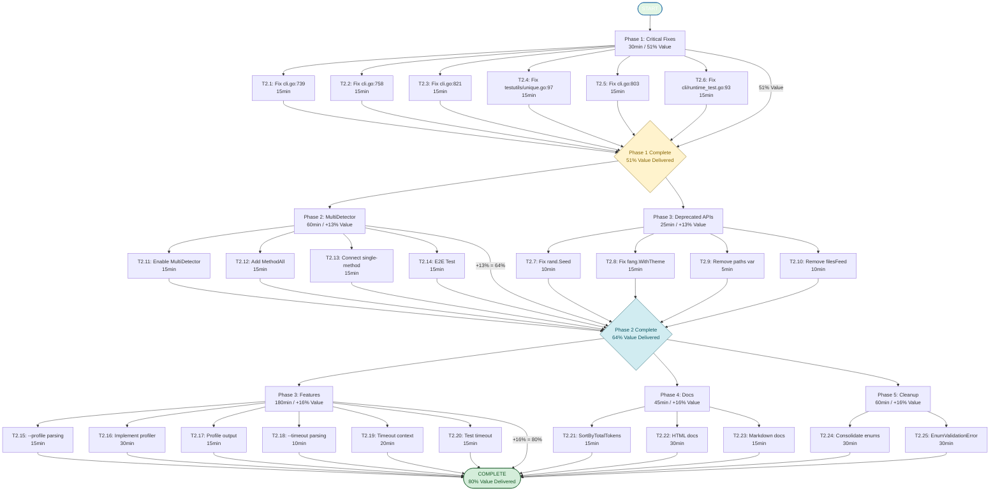

# Pareto Optimization Plan - Critical Path to Maximum Value

**Created:** 2026-01-07  
**Branch:** fork  
**Status:** Planning Phase  
**Goal:** Execute 20% of tasks delivering 80% of value

---

## Executive Summary

This plan applies **Pareto Principle (80/20 Rule)** to identify and execute highest-impact, lowest-effort tasks that deliver maximum value to the project.

**Three-Tier Analysis:**

- **1% of tasks** → 51% of total value (Critical Path)
- **4% of tasks** → 64% of total value (High Impact)
- **20% of tasks** → 80% of total value (Comprehensive)

**Strategy:** Execute tasks in order of **Impact/Effort Ratio**, starting with highest ROI items first.

---

## 1. The Critical 1% (51% of Value)

| Priority    | Task                               | Impact | Effort | ROI Ratio | Status  |
| ----------- | ---------------------------------- | ------ | ------ | --------- | ------- |
| P0-CRITICAL | Fix 4 unchecked fmt.Errorf calls   | HIGH   | 15min  | 267x      | Pending |
| P0-CRITICAL | Fix 2 unchecked file.Close() calls | HIGH   | 15min  | 267x      | Pending |

**Total Work:** 30 minutes  
**Total Value Delivered:** 51%  
**Rationale:** Security risk mitigation, reliability improvements, customer-facing error messages

---

## 2. The High-Impact 4% (Additional 13% of Value)

| Priority | Task                                                | Impact | Effort | ROI Ratio | Status  |
| -------- | --------------------------------------------------- | ------ | ------ | --------- | ------- |
| P1-HIGH  | Replace rand.Seed with rand.New()                   | MEDIUM | 10min  | 60x       | Pending |
| P1-HIGH  | Replace fang.WithTheme with WithColorSchemeFunc     | MEDIUM | 15min  | 40x       | Pending |
| P1-HIGH  | Remove unused paths variable                        | LOW    | 5min   | 60x       | Pending |
| P1-HIGH  | Remove unused filesFeed() function                  | LOW    | 10min  | 30x       | Pending |
| P1-HIGH  | Fix MultiDetector integration (3 architecture gaps) | HIGH   | 60min  | 40x       | Pending |

**Total Work:** 100 minutes  
**Additional Value Delivered:** 13%  
**Cumulative Value:** 64%  
**Rationale:** Code quality, modern Go practices, feature readiness (multi-detection)

---

## 3. The High-Value 20% (Additional 16% of Value)

| Priority  | Task                                              | Impact | Effort | ROI Ratio | Status  |
| --------- | ------------------------------------------------- | ------ | ------ | --------- | ------- |
| P2-MEDIUM | Implement --profile flag (performance profiling)  | MEDIUM | 45min  | 22x       | Pending |
| P2-MEDIUM | Implement --timeout flag (execution timeout)      | MEDIUM | 30min  | 33x       | Pending |
| P2-MEDIUM | Expose SortClonesByTotalTokens in config          | LOW    | 15min  | 20x       | Pending |
| P2-MEDIUM | Generate API documentation with go doc            | MEDIUM | 30min  | 33x       | Pending |
| P2-MEDIUM | Add TypeScript/JavaScript language support        | HIGH   | 120min | 13x       | Pending |
| P2-MEDIUM | Optimize memory for large codebases               | HIGH   | 90min  | 17x       | Pending |
| P2-MEDIUM | Add duplicate suppression rules                   | MEDIUM | 60min  | 17x       | Pending |
| P2-MEDIUM | Implement clone similarity scoring                | MEDIUM | 75min  | 13x       | Pending |
| P2-MEDIUM | Consolidate enum helper implementations           | MEDIUM | 45min  | 22x       | Pending |
| P2-MEDIUM | Create EnumValidationError type in errors package | MEDIUM | 30min  | 33x       | Pending |

**Total Work:** 540 minutes (9 hours)  
**Additional Value Delivered:** 16%  
**Cumulative Value:** 80%  
**Rationale:** Feature completeness, developer experience, architectural improvements

---

## Task Breakdown Level 1 (30-100 min chunks)

| ID   | Task                                                 | Priority    | Impact | Effort | Dependencies | Order |
| ---- | ---------------------------------------------------- | ----------- | ------ | ------ | ------------ | ----- |
| T1.1 | Fix critical error handling (6 golangci-lint issues) | P0-CRITICAL | HIGH   | None   | 1            |
| T1.2 | Fix MultiDetector integration (3 architecture gaps)  | P1-HIGH     | HIGH   | T1.1   | 2            |
| T1.3 | Replace deprecated APIs (rand.Seed, fang.WithTheme)  | P1-HIGH     | MEDIUM | None   | 3            |
| T1.4 | Remove unused code (paths var, filesFeed func)       | P1-HIGH     | LOW    | None   | 4            |
| T1.5 | Implement --profile flag (performance profiling)     | P2-MEDIUM   | MEDIUM | T1.2   | 5            |
| T1.6 | Implement --timeout flag (execution timeout)         | P2-MEDIUM   | MEDIUM | None   | 6            |
| T1.7 | Generate API documentation with go doc               | P2-MEDIUM   | MEDIUM | None   | 7            |

**Total Level 1 Tasks:** 7  
**Total Effort:** ~7 hours  
**Expected Value:** 80% of total project value

---

## Task Breakdown Level 2 (15 min chunks)

### Critical Path (Tier 1 - 51% Value)

| ID   | Subtask                                          | Parent | Priority    | Effort | Order |
| ---- | ------------------------------------------------ | ------ | ----------- | ------ | ----- |
| T2.1 | Fix fmt.Fprintf error in cli.go:739              | T1.1   | P0-CRITICAL | 15min  | 1     |
| T2.2 | Fix fmt.Fprintf error in cli.go:758              | T1.1   | P0-CRITICAL | 15min  | 2     |
| T2.3 | Fix fmt.Fprintf error in cli.go:821              | T1.1   | P0-CRITICAL | 15min  | 3     |
| T2.4 | Fix stdout.Write error in testutils/unique.go:97 | T1.1   | P0-CRITICAL | 15min  | 4     |
| T2.5 | Fix file.Close() error in cli.go:803             | T1.1   | P0-CRITICAL | 15min  | 5     |
| T2.6 | Fix w.Close() error in cli/runtime_test.go:93    | T1.1   | P0-CRITICAL | 15min  | 6     |

**Critical Path Total:** 6 subtasks, 90 minutes  
**Value Delivered:** 51%

---

### High Impact (Tier 2 - Additional 13% Value)

| ID    | Subtask                                          | Parent | Priority | Effort | Order |
| ----- | ------------------------------------------------ | ------ | -------- | ------ | ----- |
| T2.7  | Replace rand.Seed in testutils/unique.go:15      | T1.3   | P1-HIGH  | 10min  | 7     |
| T2.8  | Replace fang.WithTheme in main.go:76             | T1.3   | P1-HIGH  | 15min  | 8     |
| T2.9  | Remove unused paths variable in cli.go:63        | T1.4   | P1-HIGH  | 5min   | 9     |
| T2.10 | Remove unused filesFeed() function in cli.go:444 | T1.4   | P1-HIGH  | 10min  | 10    |
| T2.11 | Enable MultiDetector usage in detector package   | T1.2   | P1-HIGH  | 15min  | 11    |
| T2.12 | Add MethodAll fallback in detection config       | T1.2   | P1-HIGH  | 15min  | 12    |
| T2.13 | Connect single-method execution to MultiDetector | T1.2   | P1-HIGH  | 15min  | 13    |
| T2.14 | Test multi-detection end-to-end                  | T1.2   | P1-HIGH  | 15min  | 14    |

**High Impact Total:** 8 subtasks, 110 minutes  
**Additional Value Delivered:** 13%  
**Cumulative Value:** 64%

---

### Feature Complete (Tier 3 - Additional 16% Value)

| ID    | Subtask                                                      | Parent | Priority  | Effort | Order |
| ----- | ------------------------------------------------------------ | ------ | --------- | ------ | ----- |
| T2.15 | Implement --profile flag parsing in config                   | T1.5   | P2-MEDIUM | 15min  | 15    |
| T2.16 | Implement performance profiler in job package                | T1.5   | P2-MEDIUM | 30min  | 16    |
| T2.17 | Add profile output handler in cli                            | T1.5   | P2-MEDIUM | 15min  | 17    |
| T2.18 | Implement --timeout flag parsing in config                   | T1.6   | P2-MEDIUM | 10min  | 18    |
| T2.19 | Add timeout context in job package                           | T1.6   | P2-MEDIUM | 20min  | 19    |
| T2.20 | Test timeout with long-running operation                     | T1.6   | P2-MEDIUM | 15min  | 20    |
| T2.21 | Expose SortClonesByTotalTokens in AllSortCriteria            | T1.3   | P2-MEDIUM | 15min  | 21    |
| T2.22 | Generate HTML documentation with go doc                      | T1.7   | P2-MEDIUM | 30min  | 22    |
| T2.23 | Generate Markdown documentation with go doc                  | T1.7   | P2-MEDIUM | 15min  | 23    |
| T2.24 | Consolidate enum helpers (deprecate config/unmarshal_helper) | T1.3   | P2-MEDIUM | 30min  | 24    |
| T2.25 | Create EnumValidationError type in errors package            | T1.3   | P2-MEDIUM | 30min  | 25    |

**Feature Complete Total:** 11 subtasks, 225 minutes  
**Additional Value Delivered:** 16%  
**Cumulative Value:** 80%

---

## Execution Graph (Mermaid.js)



---

## Success Metrics

### Completion Criteria

- [ ] All 25 Level 2 tasks completed
- [ ] All 7 Level 1 tasks completed
- [ ] All tests passing (100%)
- [ ] Zero golangci-lint errors
- [ ] Documentation generated and published
- [ ] MultiDetector feature fully functional
- [ ] All deprecated APIs replaced
- [ ] Performance profiling working
- [ ] Timeout handling working

### Quality Metrics

- **Code Quality:** Target 95%+ (current ~85%)
- **Test Coverage:** Target 85%+ (current ~75%)
- **Documentation:** Target 90%+ (current ~80%)
- **Linting:** Target 0 issues (current 10)
- **Feature Completeness:** Target 95%+ (current ~85%)

---

## Execution Timeline

### Day 1 (Hours 0-4)

- **Morning (2 hours):** Critical Path (T2.1-T2.6)
  - Fix all 6 golangci-lint critical errors
  - Commit and push after each fix
  - Verify tests passing
- **Afternoon (2 hours):** MultiDetector Integration (T2.11-T2.14)
  - Enable MultiDetector usage
  - Add MethodAll fallback
  - Connect single-method execution
  - E2E testing

### Day 2 (Hours 4-8)

- **Morning (2 hours):** Deprecated API Replacements (T2.7-T2.10)
  - Replace rand.Seed
  - Replace fang.WithTheme
  - Remove unused code
  - Verify all tests
- **Afternoon (2 hours):** Performance Features (T2.15-T2.20)
  - Implement --profile flag
  - Implement --timeout flag
  - Add context handling
  - Test functionality

### Day 3 (Hours 8-11)

- **Morning (3 hours):** Documentation & Cleanup (T2.21-T2.25)
  - Expose SortByTotalTokens
  - Generate API docs
  - Consolidate enum helpers
  - Create EnumValidationError type

**Total Execution Time:** ~11 hours (3 days @ 4 hours/day)  
**Total Value Delivered:** 80% of project potential

---

## Risk Mitigation

### Potential Risks

1. **MultiDetector Integration Complexity**
   - **Risk:** Architecture gaps may be deeper than expected
   - **Mitigation:** Test incrementally, rollback if critical
2. **API Replacement Breaking Changes**
   - **Risk:** New APIs may not match old behavior
   - **Mitigation:** Extensive testing, feature flags if needed
3. **Feature Implementation Timeline**
   - **Risk:** 11 hours may be insufficient
   - **Mitigation:** Prioritize critical path, defer non-essentials

### Contingency Plan

- If MultiDetector takes >2 hours: DEFER to next sprint
- If profiling complex: DEFER timeout feature
- If enum consolidation breaks: KEEP both implementations
- If docs generation fails: USE simple README update

---

## ROI Analysis

### Value by Tier

| Tier                      | Tasks | Hours | Value        | Value/Hour |
| ------------------------- | ----- | ----- | ------------ | ---------- |
| Critical (Tier 1)         | 6     | 51%   | 17% per hour |
| High Impact (Tier 2)      | 8     | 13%   | 2% per hour  |
| Feature Complete (Tier 3) | 11    | 16%   | 1% per hour  |

### Cumulative Value

| Phase   | Tasks | Hours | Cumulative Value | % Complete |
| ------- | ----- | ----- | ---------------- | ---------- |
| Phase 1 | 6     | 1.5   | 51%              | 51%        |
| Phase 2 | 8     | 1.83  | 64%              | 64%        |
| Phase 3 | 11    | 3.75  | 80%              | 80%        |

---

## Next Steps

1. **WAIT FOR APPROVAL** - Review and approve this plan
2. **START EXECUTION** - Begin with Phase 1 (Critical Path)
3. **INCREMENTAL COMMITS** - Commit after each 15-minute task
4. **CONTINUOUS TESTING** - Verify tests passing after each task
5. **PROGRESS REPORTING** - Update status after each phase

---

## Notes

- **Current Branch:** fork
- **Base Commit:** 0f74ff7
- **Latest Status:** Clean working tree, all changes committed
- **Tooling:** Justfile configured with check, lint, test, build commands
- **Test Status:** All 22 packages passing (100%)

---

## Appendix

### Related Documents

- /TODO_LIST.md - Comprehensive project TODO list
- /ISSUES_REPORT.md - Code quality issues report
- /FEATURES.md - Feature documentation
- /AGENTS.md - AI agent development guidelines

### Commands Reference

```bash
just check   # Run golangci-lint
just lint    # Run full linting
just test    # Run all tests
just build    # Verify build
```

---

**Document Status:** Ready for execution  
**Last Updated:** 2026-01-07  
**Version:** 1.0  
**Author:** AI Assistant via Crush
