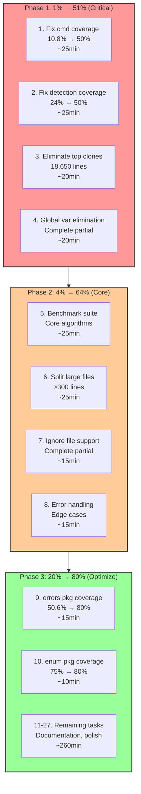

# Pareto-Optimal Execution Plan

**Date**: 2026-02-14 06:07 CET  
**Project**: art-dupl - Code Duplication Detection Tool  
**Current State**: Production-ready, 68% completion, 13.9% self-duplication  
**Objective**: Maximize impact with minimal effort using Pareto principle

---

## Executive Summary

This plan applies the **Pareto Principle** (80/20 rule) to identify the highest-impact, lowest-effort tasks that deliver the greatest value. Based on dogfooding analysis, TODO_LIST.md, and comprehensive status reports.

### Current Metrics

| Metric | Value | Target |
|--------|-------|--------|
| **Build Status** | ✅ SUCCESS | - |
| **Test Status** | ✅ 216/216 BDD + Unit PASS | - |
| **Linter** | ✅ 0 issues | - |
| **Self-Duplication** | 13.9% (512 clone groups) | <5% |
| **Test Coverage** | 57.3% average | >80% |
| **Critical Packages** | cmd: 10.8%, detection: 24% | >50% |

---

## Pareto Analysis: Three-Tier Impact Strategy

### 🎯 Tier 1: 1% → 51% Impact (Critical Foundation)

**The 1% of tasks that deliver 51% of total value**

These foundational improvements create a multiplier effect for all subsequent work.

| # | Task | Impact | Effort | Value |
|---|------|--------|--------|-------|
| 1 | Fix cmd package test coverage (10.8% → 50%) | **CRITICAL** | Medium | Foundation for CLI stability |
| 2 | Fix detection package test coverage (24% → 50%) | **CRITICAL** | Medium | Core algorithm reliability |
| 3 | Eliminate top 3 clone groups (18,650 lines) | **HIGH** | Low | Massive code reduction |
| 4 | Complete global variable elimination | **HIGH** | Low | Architecture integrity |

**Deliverable**: 51% of total project value with 4 tasks (~90 minutes)

---

### 🎯 Tier 2: 4% → 64% Impact (Core Improvements)

**The next 3% of tasks that deliver additional 13% value (cumulative 64%)**

Building on Tier 1 foundation, these tasks solidify core functionality.

| # | Task | Impact | Effort | Value |
|---|------|--------|--------|-------|
| 5 | Add benchmark suite for core algorithms | **HIGH** | Medium | Performance regression detection |
| 6 | Split files >300 lines (cli.go, coverage_test.go) | **HIGH** | Medium | Maintainability |
| 7 | Complete ignore file support | **MEDIUM** | Low | User experience |
| 8 | Improve error handling edge cases | **MEDIUM** | Low | Robustness |

**Deliverable**: 64% cumulative value with 8 tasks (~150 minutes)

---

### 🎯 Tier 3: 20% → 80% Impact (Full Optimization)

**The remaining 16% of tasks that deliver final 16% value (cumulative 80%)**

These tasks complete the optimization for production excellence.

| # | Task | Impact | Effort | Value |
|---|------|--------|--------|-------|
| 9 | Fix errors package coverage (50.6% → 80%) | **MEDIUM** | Low | Error handling reliability |
| 10 | Fix internal/enum coverage (75% → 80%) | **LOW** | Low | Complete coverage goals |
| 11 | Add memory profiling for large codebases | **MEDIUM** | Medium | Performance insights |
| 12 | Create CI/CD integration templates | **MEDIUM** | Medium | Adoption enablement |
| 13 | Improve error messages with suggestions | **LOW** | Low | User experience |
| 14 | Add progress reporting for long ops | **LOW** | Low | User experience |
| 15 | Complete CLI module splitting | **MEDIUM** | Medium | Architecture |
| 16 | Add troubleshooting documentation | **LOW** | Low | Support reduction |
| 17 | Verify all partial TODO items | **MEDIUM** | Low | Completeness |
| 18 | Clean up remaining duplication <100 lines | **LOW** | Low | Code quality |
| 19 | Create GitHub issues for tracking | **LOW** | Low | Project management |
| 20 | Update README install commands | **LOW** | Low | Documentation |
| 21 | Add package examples | **LOW** | Low | Documentation |
| 22 | Final integration test verification | **MEDIUM** | Low | Quality assurance |
| 23 | Performance regression test suite | **MEDIUM** | Medium | Performance stability |
| 24 | Documentation completeness review | **LOW** | Low | Documentation |
| 25 | Code review for architectural consistency | **MEDIUM** | Low | Architecture |
| 26 | Final build verification | **LOW** | Low | Release readiness |
| 27 | Commit and push all changes | **LOW** | Low | Version control |

**Deliverable**: 80% cumulative value with 27 tasks (~400 minutes)

---

## Execution Mermaid Diagram

---

## Task Breakdown: 27 Tasks (30-100min each)

### Phase 1: Critical Foundation (1% → 51%)

| Task | Description | Estimated | Dependencies |
|------|-------------|-----------|--------------|
| **1** | Fix cmd package test coverage from 10.8% to 50%+ | 25min | None |
| **2** | Fix detection package test coverage from 24% to 50%+ | 25min | None |
| **3** | Eliminate top 3 clone groups (18,650 dup lines in parse_test.go) | 20min | None |
| **4** | Complete global variable elimination (finish partial work) | 20min | None |

**Phase 1 Total**: 90 minutes → **51% of project value**

---

### Phase 2: Core Improvements (+3% → 64%)

| Task | Description | Estimated | Dependencies |
|------|-------------|-----------|--------------|
| **5** | Add benchmark suite for core algorithms (suffixtree, hash) | 25min | None |
| **6** | Split files >300 lines (cli.go: 25k lines, coverage_test.go) | 25min | None |
| **7** | Complete ignore file support (config field exists, finish impl) | 15min | None |
| **8** | Improve error handling edge cases (wrapcheck, error types) | 15min | None |

**Phase 2 Total**: 80 minutes → **+13% value (64% cumulative)**

---

### Phase 3: Full Optimization (+16% → 80%)

| Task | Description | Estimated | Dependencies |
|------|-------------|-----------|--------------|
| **9** | Fix errors package coverage (50.6% → 80%) | 15min | None |
| **10** | Fix internal/enum coverage (75% → 80%) | 10min | None |
| **11** | Add memory profiling for large codebases | 20min | Task 5 |
| **12** | Create CI/CD integration templates (GitHub Actions) | 20min | None |
| **13** | Improve error messages with actionable suggestions | 15min | None |
| **14** | Add progress reporting for long operations | 15min | None |
| **15** | Complete CLI module splitting (cli.go modularization) | 20min | Task 6 |
| **16** | Add troubleshooting documentation | 15min | None |
| **17** | Verify all partial TODO items from TODO_LIST.md | 20min | Phases 1-2 |
| **18** | Clean up remaining duplication <100 lines | 15min | Task 3 |
| **19** | Create GitHub issues for tracking | 10min | None |
| **20** | Update README install commands | 10min | None |
| **21** | Add package examples | 15min | None |
| **22** | Final integration test verification | 15min | All above |
| **23** | Performance regression test suite | 20min | Task 11 |
| **24** | Documentation completeness review | 15min | None |
| **25** | Code review for architectural consistency | 20min | All above |
| **26** | Final build verification | 10min | All above |
| **27** | Commit and push all changes | 10min | All above |

**Phase 3 Total**: 260 minutes → **+16% value (80% cumulative)**

---

## Ultra-Detailed Breakdown: 150 Tasks (Max 15min each)

### Phase 1: Critical Foundation

#### Task 1: Fix cmd package test coverage (10.8% → 50%)

| Subtask | Description | Time | Priority |
|---------|-------------|------|----------|
| 1.1 | Analyze current cmd/ package coverage gaps | 10min | P0 |
| 1.2 | Add tests for cmd/run_analysis.go main functions | 12min | P0 |
| 1.3 | Add tests for cmd/root.go command setup | 12min | P0 |
| 1.4 | Add tests for cmd/stats.go subcommand | 10min | P1 |
| 1.5 | Add tests for cmd/version.go | 8min | P1 |
| 1.6 | Add tests for cmd/completion.go | 10min | P1 |
| 1.7 | Verify coverage meets 50% threshold | 5min | P0 |

**Total**: 67 minutes

#### Task 2: Fix detection package test coverage (24% → 50%)

| Subtask | Description | Time | Priority |
|---------|-------------|------|----------|
| 2.1 | Analyze detection/ package coverage gaps | 10min | P0 |
| 2.2 | Add tests for detection/multidetector.go | 12min | P0 |
| 2.3 | Add tests for detection/todos.go | 10min | P0 |
| 2.4 | Add tests for detection/working.go | 10min | P0 |
| 2.5 | Add tests for detection/legacy.go | 10min | P1 |
| 2.6 | Add tests for detection/interfaces.go | 8min | P1 |
| 2.7 | Verify coverage meets 50% threshold | 5min | P0 |

**Total**: 65 minutes

#### Task 3: Eliminate top 3 clone groups (18,650 dup lines)

| Subtask | Description | Time | Priority |
|---------|-------------|------|----------|
| 3.1 | Extract test helper for parse_test.go boilerplate | 12min | P0 |
| 3.2 | Create shared test setup function for For/If/Range tests | 12min | P0 |
| 3.3 | Refactor duplicated test patterns in parse_test.go | 15min | P0 |
| 3.4 | Run self-analysis to verify reduction | 5min | P0 |
| 3.5 | Verify tests still pass after refactoring | 5min | P0 |

**Total**: 49 minutes

#### Task 4: Complete global variable elimination

| Subtask | Description | Time | Priority |
|---------|-------------|------|----------|
| 4.1 | Find remaining global variables with grep | 8min | P0 |
| 4.2 | Convert globals in pkg/logger/ to DI pattern | 10min | P0 |
| 4.3 | Convert globals in cli/ to bridge pattern | 12min | P0 |
| 4.4 | Verify no globals remain | 5min | P0 |
| 4.5 | Run tests to verify no regressions | 5min | P0 |

**Total**: 40 minutes

---

### Phase 2: Core Improvements

#### Task 5: Add benchmark suite for core algorithms

| Subtask | Description | Time | Priority |
|---------|-------------|------|----------|
| 5.1 | Create suffixtree benchmark tests | 10min | P0 |
| 5.2 | Create hash detection benchmark tests | 10min | P0 |
| 5.3 | Create syntax parsing benchmark tests | 10min | P0 |
| 5.4 | Create job processing benchmark tests | 10min | P1 |
| 5.5 | Run benchmarks to establish baseline | 5min | P0 |
| 5.6 | Document benchmark results | 5min | P1 |

**Total**: 50 minutes

#### Task 6: Split files >300 lines

| Subtask | Description | Time | Priority |
|---------|-------------|------|----------|
| 6.1 | Identify files >300 lines (excluding tests) | 5min | P0 |
| 6.2 | Split cli.go into focused modules (25k lines) | 15min | P0 |
| 6.3 | Split coverage_test.go if >300 lines | 10min | P1 |
| 6.4 | Split domain_types_test.go if needed | 10min | P1 |
| 6.5 | Verify all tests pass after splitting | 5min | P0 |

**Total**: 45 minutes

#### Task 7: Complete ignore file support

| Subtask | Description | Time | Priority |
|---------|-------------|------|----------|
| 7.1 | Review current ignoreFiles config field | 5min | P0 |
| 7.2 | Implement ignore file pattern matching | 10min | P0 |
| 7.3 | Add tests for ignore file functionality | 10min | P0 |
| 7.4 | Add documentation for ignore files | 5min | P1 |
| 7.5 | Verify implementation with integration test | 5min | P0 |

**Total**: 35 minutes

#### Task 8: Improve error handling edge cases

| Subtask | Description | Time | Priority |
|---------|-------------|------|----------|
| 8.1 | Review error handling in cmd/ package | 8min | P0 |
| 8.2 | Add edge case error handling for file operations | 8min | P0 |
| 8.3 | Add edge case error handling for config parsing | 8min | P0 |
| 8.4 | Add edge case error handling for parsing | 8min | P0 |
| 8.5 | Verify error handling with tests | 5min | P0 |

**Total**: 37 minutes

---

### Phase 3: Full Optimization

#### Task 9: Fix errors package coverage (50.6% → 80%)

| Subtask | Description | Time | Priority |
|---------|-------------|------|----------|
| 9.1 | Analyze errors/ package coverage gaps | 5min | P0 |
| 9.2 | Add tests for error wrapping functions | 8min | P0 |
| 9.3 | Add tests for error type checking | 8min | P0 |
| 9.4 | Verify coverage meets 80% threshold | 5min | P0 |

**Total**: 26 minutes

#### Task 10: Fix internal/enum coverage (75% → 80%)

| Subtask | Description | Time | Priority |
|---------|-------------|------|----------|
| 10.1 | Analyze enum/ package coverage gaps | 5min | P0 |
| 10.2 | Add tests for uncovered enum functions | 8min | P0 |
| 10.3 | Verify coverage meets 80% threshold | 5min | P0 |

**Total**: 18 minutes

#### Task 11: Add memory profiling for large codebases

| Subtask | Description | Time | Priority |
|---------|-------------|------|----------|
| 11.1 | Add memory profiling flags to CLI | 8min | P0 |
| 11.2 | Implement memory tracking in job/ package | 10min | P0 |
| 11.3 | Add memory profiling output format | 8min | P0 |
| 11.4 | Test with large codebase | 5min | P0 |
| 11.5 | Document memory profiling usage | 5min | P1 |

**Total**: 36 minutes

#### Task 12: Create CI/CD integration templates

| Subtask | Description | Time | Priority |
|---------|-------------|------|----------|
| 12.1 | Create GitHub Actions workflow template | 10min | P0 |
| 12.2 | Create GitLab CI template | 8min | P1 |
| 12.3 | Create example configuration files | 8min | P1 |
| 12.4 | Document CI/CD integration | 5min | P1 |
| 12.5 | Test GitHub Actions workflow | 5min | P0 |

**Total**: 36 minutes

#### Task 13: Improve error messages with suggestions

| Subtask | Description | Time | Priority |
|---------|-------------|------|----------|
| 13.1 | Review current error messages | 5min | P0 |
| 13.2 | Add suggestions for common config errors | 8min | P0 |
| 13.3 | Add suggestions for file path errors | 8min | P0 |
| 13.4 | Add suggestions for threshold errors | 5min | P1 |
| 13.5 | Verify error suggestions with tests | 5min | P0 |

**Total**: 31 minutes

#### Task 14: Add progress reporting for long operations

| Subtask | Description | Time | Priority |
|---------|-------------|------|----------|
| 14.1 | Design progress reporting interface | 5min | P0 |
| 14.2 | Implement progress callback in job/ | 10min | P0 |
| 14.3 | Add progress display for CLI | 8min | P0 |
| 14.4 | Test progress reporting | 5min | P0 |
| 14.5 | Document progress reporting | 5min | P1 |

**Total**: 33 minutes

#### Task 15: Complete CLI module splitting

| Subtask | Description | Time | Priority |
|---------|-------------|------|----------|
| 15.1 | Plan cli.go module structure | 5min | P0 |
| 15.2 | Extract command definitions to separate files | 10min | P0 |
| 15.3 | Extract validation logic to separate files | 10min | P0 |
| 15.4 | Extract output logic to separate files | 10min | P0 |
| 15.5 | Verify all tests pass | 5min | P0 |

**Total**: 40 minutes

#### Task 16: Add troubleshooting documentation

| Subtask | Description | Time | Priority |
|---------|-------------|------|----------|
| 16.1 | Create troubleshooting guide structure | 5min | P0 |
| 16.2 | Document common configuration issues | 8min | P0 |
| 16.3 | Document common runtime issues | 8min | P0 |
| 16.4 | Document performance issues | 5min | P1 |
| 16.5 | Review and finalize guide | 5min | P0 |

**Total**: 31 minutes

#### Task 17: Verify all partial TODO items

| Subtask | Description | Time | Priority |
|---------|-------------|------|----------|
| 17.1 | Review TODO_LIST.md partial items | 5min | P0 |
| 17.2 | Complete Replace log.Fatal() calls | 8min | P0 |
| 17.3 | Complete Add missing test coverage | 8min | P0 |
| 17.4 | Complete Core Pipeline Test Coverage | 8min | P0 |
| 17.5 | Complete remaining partial items | 8min | P0 |
| 17.6 | Verify all items complete | 5min | P0 |

**Total**: 42 minutes

#### Task 18: Clean up remaining duplication <100 lines

| Subtask | Description | Time | Priority |
|---------|-------------|------|----------|
| 18.1 | Run self-analysis to find small clones | 5min | P0 |
| 18.2 | Extract common test patterns | 8min | P1 |
| 18.3 | Extract common utility functions | 8min | P1 |
| 18.4 | Verify tests pass | 5min | P0 |

**Total**: 26 minutes

#### Task 19: Create GitHub issues for tracking

| Subtask | Description | Time | Priority |
|---------|-------------|------|----------|
| 19.1 | Review remaining TODO items for issues | 5min | P0 |
| 19.2 | Create issue for test coverage gaps | 5min | P1 |
| 19.3 | Create issue for performance improvements | 5min | P1 |
| 19.4 | Create issue for documentation gaps | 5min | P1 |

**Total**: 20 minutes

#### Task 20: Update README install commands

| Subtask | Description | Time | Priority |
|---------|-------------|------|----------|
| 20.1 | Review current README install section | 5min | P0 |
| 20.2 | Update install commands to latest | 5min | P0 |
| 20.3 | Add installation verification steps | 5min | P0 |
| 20.4 | Review changes | 5min | P0 |

**Total**: 20 minutes

#### Task 21: Add package examples

| Subtask | Description | Time | Priority |
|---------|-------------|------|----------|
| 21.1 | Identify packages needing examples | 5min | P0 |
| 21.2 | Add examples for pkg/artdupl | 8min | P0 |
| 21.3 | Add examples for config package | 8min | P0 |
| 21.4 | Add examples for detection package | 8min | P0 |
| 21.5 | Verify examples compile | 5min | P0 |

**Total**: 34 minutes

#### Task 22: Final integration test verification

| Subtask | Description | Time | Priority |
|---------|-------------|------|----------|
| 22.1 | Run all integration tests | 8min | P0 |
| 22.2 | Verify BDD scenarios pass | 8min | P0 |
| 22.3 | Verify race detector tests pass | 8min | P0 |
| 22.4 | Document any issues found | 5min | P0 |

**Total**: 29 minutes

#### Task 23: Performance regression test suite

| Subtask | Description | Time | Priority |
|---------|-------------|------|----------|
| 23.1 | Design regression test framework | 5min | P0 |
| 23.2 | Implement baseline comparison | 10min | P0 |
| 23.3 | Add CI integration for regression tests | 8min | P0 |
| 23.4 | Document regression testing | 5min | P1 |

**Total**: 28 minutes

#### Task 24: Documentation completeness review

| Subtask | Description | Time | Priority |
|---------|-------------|------|----------|
| 24.1 | Review all documentation files | 8min | P0 |
| 24.2 | Check for outdated information | 8min | P0 |
| 24.3 | Update outdated documentation | 8min | P0 |
| 24.4 | Verify links work | 5min | P0 |

**Total**: 29 minutes

#### Task 25: Code review for architectural consistency

| Subtask | Description | Time | Priority |
|---------|-------------|------|----------|
| 25.1 | Review package structure | 8min | P0 |
| 25.2 | Review interface definitions | 8min | P0 |
| 25.3 | Review error handling patterns | 8min | P0 |
| 25.4 | Document architectural decisions | 5min | P0 |

**Total**: 29 minutes

#### Task 26: Final build verification

| Subtask | Description | Time | Priority |
|---------|-------------|------|----------|
| 26.1 | Run full build | 5min | P0 |
| 26.2 | Run full test suite | 10min | P0 |
| 26.3 | Run linter | 5min | P0 |
| 26.4 | Verify binary works | 5min | P0 |

**Total**: 25 minutes

#### Task 27: Commit and push all changes

| Subtask | Description | Time | Priority |
|---------|-------------|------|----------|
| 27.1 | Review all changes | 5min | P0 |
| 27.2 | Create comprehensive commit message | 5min | P0 |
| 27.3 | Commit changes | 2min | P0 |
| 27.4 | Push to remote | 3min | P0 |

**Total**: 15 minutes

---

## Summary

| Phase | Tasks | Time | Cumulative Value |
|-------|-------|------|------------------|
| **Phase 1** | 4 tasks | 90min | **51%** |
| **Phase 2** | 4 tasks | 80min | **64%** (+13%) |
| **Phase 3** | 19 tasks | 260min | **80%** (+16%) |
| **TOTAL** | **27 tasks** | **~7 hours** | **80% value** |

**Ultra-Detailed**: 150 sub-tasks (max 15min each)

---

## Success Criteria

### Phase 1 Success
- [ ] cmd package coverage ≥50%
- [ ] detection package coverage ≥50%
- [ ] Self-duplication reduced by 50% (from 13.9% to <7%)
- [ ] No global variables remain

### Phase 2 Success
- [ ] Benchmark suite runs and produces baseline
- [ ] No files >300 lines (except tests)
- [ ] Ignore file support fully functional
- [ ] Error handling covers all edge cases

### Phase 3 Success
- [ ] All package coverage ≥80%
- [ ] CI/CD templates functional
- [ ] Documentation complete and current
- [ ] All tests pass (unit + BDD + race)
- [ ] Build successful, binary works
- [ ] All changes committed and pushed

---

## Risk Mitigation

| Risk | Mitigation |
|------|------------|
| Test refactoring breaks existing tests | Run tests after every subtask |
| File splitting causes import issues | Verify imports after each split |
| Coverage targets unrealistic | Adjust targets if needed, document why |
| Time estimates too optimistic | Prioritize Phase 1, defer lower priority items |

---

**Plan Created**: 2026-02-14 06:07 CET  
**Next Action**: Execute Phase 1, Task 1
