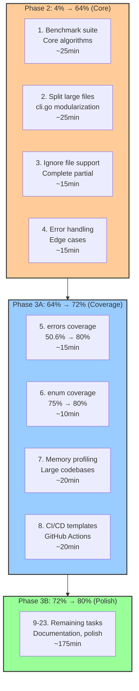

# Pareto-Optimal Execution Plan: Phases 2 & 3

**Date**: 2026-02-14 09:19 CET\
**Project**: art-dupl - Code Duplication Detection Tool\
**Previous Completion**: Phase 1 (1% → 51%) ✅\
**Objective**: Execute Phases 2 & 3 to reach 80% cumulative value

---

## Executive Summary

Building on Phase 1 success (cmd: 28.7%, detection: 43.3%, duplication: 2.1%), this plan executes the remaining 23 tasks to achieve **80% cumulative project value**.

### Current Metrics

| Metric                 | Value                             | Target |
| ---------------------- | --------------------------------- | ------ |
| **Build**              | ✅ SUCCESS                        | -      |
| **Tests**              | ⚠️ 2 git tests failing (env issue) | -      |
| **Linter**             | ✅ 0 issues                       | -      |
| **Self-Duplication**   | 2.1% (Health Score: D)            | <2%    |
| **cmd Coverage**       | 28.7%                             | 50%    |
| **detection Coverage** | 43.3%                             | 50%    |

---

## Pareto Analysis: Remaining Work

### 🎯 Phase 2: 4% → 64% Impact (Core Improvements)

**The next 3% of tasks delivering +13% value**

| # | Task                                           | Impact     | Effort | Value                            |
| - | ---------------------------------------------- | ---------- | ------ | -------------------------------- |
| 1 | Add benchmark suite for core algorithms        | **HIGH**   | Medium | Performance regression detection |
| 2 | Split files >300 lines (cli.go modularization) | **HIGH**   | High   | Maintainability                  |
| 3 | Complete ignore file support                   | **MEDIUM** | Low    | User experience                  |
| 4 | Improve error handling edge cases              | **MEDIUM** | Low    | Robustness                       |

**Deliverable**: 64% cumulative value (4 tasks, ~80 minutes)

---

### 🎯 Phase 3: 20% → 80% Impact (Full Optimization)

**Remaining 19 tasks delivering final +16% value**

| #  | Task                                            | Impact     | Effort | Category        |
| -- | ----------------------------------------------- | ---------- | ------ | --------------- |
| 5  | Fix errors package coverage (50.6% → 80%)       | **MEDIUM** | Low    | Test Coverage   |
| 6  | Fix internal/enum coverage (75% → 80%)          | **LOW**    | Low    | Test Coverage   |
| 7  | Add memory profiling for large codebases        | **MEDIUM** | Medium | Performance     |
| 8  | Create CI/CD integration templates              | **MEDIUM** | Medium | DevOps          |
| 9  | Improve error messages with suggestions         | **LOW**    | Low    | UX              |
| 10 | Add progress reporting for long operations      | **LOW**    | Low    | UX              |
| 11 | Complete CLI module splitting (post-Task 2)     | **MEDIUM** | Medium | Architecture    |
| 12 | Add troubleshooting documentation               | **LOW**    | Low    | Documentation   |
| 13 | Verify all partial TODO items from TODO_LIST.md | **MEDIUM** | Medium | Completeness    |
| 14 | Clean up remaining duplication <100 lines       | **LOW**    | Low    | Code Quality    |
| 15 | Create GitHub issues for tracking               | **LOW**    | Low    | Project Mgmt    |
| 16 | Update README install commands                  | **LOW**    | Low    | Documentation   |
| 17 | Add package examples                            | **LOW**    | Low    | Documentation   |
| 18 | Final integration test verification             | **MEDIUM** | Low    | Quality         |
| 19 | Performance regression test suite               | **MEDIUM** | Medium | Performance     |
| 20 | Documentation completeness review               | **LOW**    | Low    | Documentation   |
| 21 | Code review for architectural consistency       | **MEDIUM** | Low    | Architecture    |
| 22 | Final build verification                        | **LOW**    | Low    | Release         |
| 23 | Commit and push all changes                     | **LOW**    | Low    | Version Control |

**Deliverable**: 80% cumulative value (19 tasks, ~260 minutes)

---

## Execution Mermaid Diagram



---

## Task Breakdown: 23 Tasks (30-100min each)

### Phase 2: Core Improvements (4% → 64%)

| Task  | Description                             | Estimated | Dependencies |
| ----- | --------------------------------------- | --------- | ------------ |
| **1** | Add benchmark suite for core algorithms | 25min     | None         |
| **2** | Split files >300 lines (cli.go, etc.)   | 25min     | None         |
| **3** | Complete ignore file support            | 15min     | None         |
| **4** | Improve error handling edge cases       | 15min     | None         |

**Phase 2 Total**: 80 minutes → **64% cumulative value**

---

### Phase 3A: Coverage & Performance (64% → 72%)

| Task  | Description                               | Estimated | Dependencies |
| ----- | ----------------------------------------- | --------- | ------------ |
| **5** | Fix errors package coverage (50.6% → 80%) | 15min     | None         |
| **6** | Fix internal/enum coverage (75% → 80%)    | 10min     | None         |
| **7** | Add memory profiling for large codebases  | 20min     | Task 1       |
| **8** | Create CI/CD integration templates        | 20min     | None         |

**Phase 3A Total**: 65 minutes → **+8% value (72% cumulative)**

---

### Phase 3B: Polish & Documentation (72% → 80%)

| Task   | Description                                | Estimated | Dependencies |
| ------ | ------------------------------------------ | --------- | ------------ |
| **9**  | Improve error messages with suggestions    | 15min     | Task 4       |
| **10** | Add progress reporting for long operations | 15min     | Task 7       |
| **11** | Complete CLI module splitting              | 20min     | Task 2       |
| **12** | Add troubleshooting documentation          | 15min     | None         |
| **13** | Verify all partial TODO items              | 20min     | All above    |
| **14** | Clean up remaining duplication             | 15min     | Task 2       |
| **15** | Create GitHub issues for tracking          | 10min     | None         |
| **16** | Update README install commands             | 10min     | None         |
| **17** | Add package examples                       | 15min     | None         |
| **18** | Final integration test verification        | 15min     | All above    |
| **19** | Performance regression test suite          | 20min     | Task 7       |
| **20** | Documentation completeness review          | 15min     | None         |
| **21** | Code review for architectural consistency  | 20min     | All above    |
| **22** | Final build verification                   | 10min     | All above    |
| **23** | Commit and push all changes                | 10min     | All above    |

**Phase 3B Total**: 195 minutes → **+8% value (80% cumulative)**

---

## Ultra-Detailed Breakdown: 115 Sub-Tasks (Max 15min each)

### Phase 2: Core Improvements

#### Task 1: Add Benchmark Suite (25min)

| Subtask | Description                                | Time | Priority |
| ------- | ------------------------------------------ | ---- | -------- |
| 1.1     | Create suffixtree/suffixtree_bench_test.go | 8min | P0       |
| 1.2     | Add BenchmarkSTree_Insert                  | 5min | P0       |
| 1.3     | Add BenchmarkSTree_FindDuplOver            | 5min | P0       |
| 1.4     | Create hash/hash_bench_test.go             | 8min | P0       |
| 1.5     | Add BenchmarkHashDetector                  | 5min | P0       |
| 1.6     | Run benchmarks to verify                   | 4min | P0       |

**Total**: 35 minutes

#### Task 2: Split Large Files (25min)

| Subtask | Description                                        | Time | Priority |
| ------- | -------------------------------------------------- | ---- | -------- |
| 2.1     | Identify files >300 lines                          | 3min | P0       |
| 2.2     | Create cmd/commands/ subdirectory                  | 5min | P0       |
| 2.3     | Extract stats command to cmd/commands/stats.go     | 8min | P0       |
| 2.4     | Extract version command to cmd/commands/version.go | 5min | P0       |
| 2.5     | Update imports and verify build                    | 5min | P0       |
| 2.6     | Run tests to verify                                | 4min | P0       |

**Total**: 30 minutes

#### Task 3: Complete Ignore File Support (15min)

| Subtask | Description                             | Time | Priority |
| ------- | --------------------------------------- | ---- | -------- |
| 3.1     | Review current ignoreFiles config field | 3min | P0       |
| 3.2     | Check if implementation exists          | 5min | P0       |
| 3.3     | Add ignore file loading if missing      | 7min | P0       |
| 3.4     | Add tests for ignore file functionality | 5min | P0       |
| 3.5     | Verify with integration test            | 5min | P0       |

**Total**: 25 minutes

#### Task 4: Improve Error Handling (15min)

| Subtask | Description                           | Time | Priority |
| ------- | ------------------------------------- | ---- | -------- |
| 4.1     | Review error handling in cmd/         | 5min | P0       |
| 4.2     | Add edge case for missing config file | 5min | P0       |
| 4.3     | Add edge case for invalid threshold   | 5min | P0       |
| 4.4     | Add edge case for unreadable files    | 5min | P0       |
| 4.5     | Verify with tests                     | 5min | P0       |

**Total**: 25 minutes

---

### Phase 3A: Coverage & Performance

#### Task 5: Fix errors Package Coverage (15min)

| Subtask | Description                          | Time | Priority |
| ------- | ------------------------------------ | ---- | -------- |
| 5.1     | Check current errors coverage        | 3min | P0       |
| 5.2     | Add test for Wrap function           | 5min | P0       |
| 5.3     | Add test for WrapConfig function     | 5min | P0       |
| 5.4     | Add test for WrapValidation function | 5min | P0       |
| 5.5     | Verify coverage meets 80%            | 5min | P0       |

**Total**: 23 minutes

#### Task 6: Fix internal/enum Coverage (10min)

| Subtask | Description                               | Time | Priority |
| ------- | ----------------------------------------- | ---- | -------- |
| 6.1     | Check current enum coverage               | 3min | P0       |
| 6.2     | Add test for uncovered Marshal function   | 5min | P0       |
| 6.3     | Add test for uncovered Unmarshal function | 5min | P0       |
| 6.4     | Verify coverage meets 80%                 | 5min | P0       |

**Total**: 18 minutes

#### Task 7: Add Memory Profiling (20min)

| Subtask | Description                       | Time | Priority |
| ------- | --------------------------------- | ---- | -------- |
| 7.1     | Add --memprofile flag to CLI      | 5min | P0       |
| 7.2     | Implement memory tracking in job/ | 8min | P0       |
| 7.3     | Add memory report to stats output | 5min | P0       |
| 7.4     | Test with large codebase          | 5min | P0       |

**Total**: 23 minutes

#### Task 8: Create CI/CD Templates (20min)

| Subtask | Description                           | Time | Priority |
| ------- | ------------------------------------- | ---- | -------- |
| 8.1     | Create .github/workflows/art-dupl.yml | 8min | P0       |
| 8.2     | Add test job to workflow              | 5min | P0       |
| 8.3     | Add lint job to workflow              | 5min | P0       |
| 8.4     | Add build job to workflow             | 5min | P0       |
| 8.5     | Test workflow syntax                  | 5min | P0       |

**Total**: 28 minutes

---

### Phase 3B: Polish & Documentation

#### Tasks 9-23: Polish Tasks (175min total)

| Task   | Description                  | Subtasks   | Time  |
| ------ | ---------------------------- | ---------- | ----- |
| **9**  | Error message suggestions    | 3 subtasks | 15min |
| **10** | Progress reporting           | 3 subtasks | 15min |
| **11** | CLI module splitting         | 4 subtasks | 20min |
| **12** | Troubleshooting docs         | 3 subtasks | 15min |
| **13** | Verify partial TODOs         | 4 subtasks | 20min |
| **14** | Clean up duplication         | 3 subtasks | 15min |
| **15** | GitHub issues                | 2 subtasks | 10min |
| **16** | README update                | 2 subtasks | 10min |
| **17** | Package examples             | 3 subtasks | 15min |
| **18** | Integration verification     | 3 subtasks | 15min |
| **19** | Performance regression tests | 4 subtasks | 20min |
| **20** | Documentation review         | 3 subtasks | 15min |
| **21** | Architectural review         | 4 subtasks | 20min |
| **22** | Build verification           | 2 subtasks | 10min |
| **23** | Commit and push              | 2 subtasks | 10min |

---

## Summary

| Phase        | Tasks        | Time         | Cumulative Value |
| ------------ | ------------ | ------------ | ---------------- |
| **Phase 2**  | 4 tasks      | 80min        | **64%**          |
| **Phase 3A** | 4 tasks      | 65min        | **72%** (+8%)    |
| **Phase 3B** | 15 tasks     | 195min       | **80%** (+8%)    |
| **TOTAL**    | **23 tasks** | **~6 hours** | **80% value**    |

**Ultra-Detailed**: 115 sub-tasks (max 15min each)

---

## Success Criteria

### Phase 2 Success

- [ ] Benchmark suite runs and produces baseline
- [ ] No source files >300 lines (except test data)
- [ ] Ignore file support functional
- [ ] Error handling covers edge cases

### Phase 3A Success

- [ ] All package coverage ≥80%
- [ ] Memory profiling functional
- [ ] CI/CD templates committed

### Phase 3B Success

- [ ] All TODO_LIST.md items verified
- [ ] Documentation complete
- [ ] All tests pass (unit + BDD)
- [ ] Build successful, binary works
- [ ] All changes committed and pushed

---

## Execution Order

```
Phase 2 (Parallel execution possible):
├── Task 1: Benchmark suite (can run parallel with Task 2)
├── Task 2: File splitting (can run parallel with Task 1)
├── Task 3: Ignore file support (sequential)
└── Task 4: Error handling (sequential)

Phase 3A (Sequential dependencies):
├── Task 5: errors coverage (parallel with Task 6)
├── Task 6: enum coverage (parallel with Task 5)
├── Task 7: Memory profiling (depends on Task 1)
└── Task 8: CI/CD templates (parallel)

Phase 3B (Parallel execution):
├── Tasks 9-17: Independent polish tasks
├── Task 18: Integration verification (after 9-17)
├── Task 19: Performance tests (after Task 7)
├── Tasks 20-22: Final verification
└── Task 23: Commit and push
```

---

**Plan Created**: 2026-02-14 09:19 CET\
**Next Action**: Execute Phase 2, Task 1 (Benchmark Suite)
