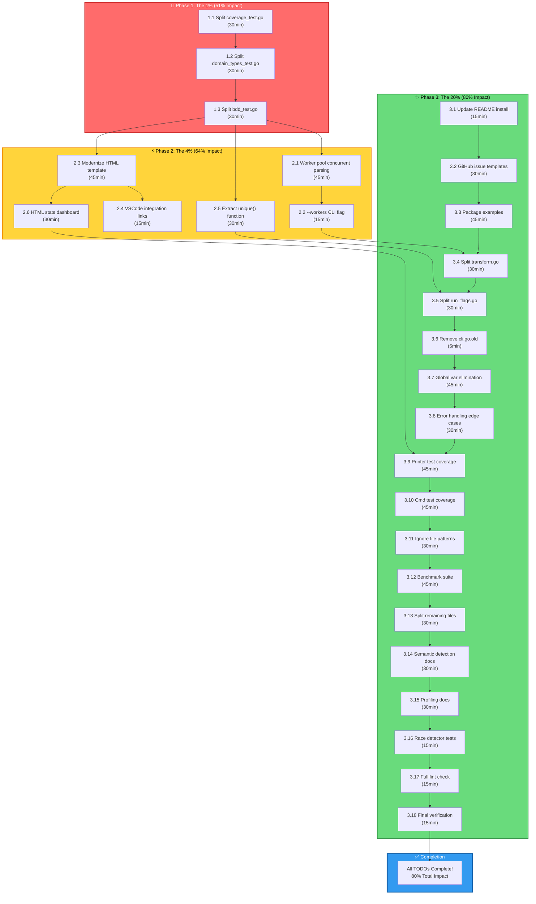

# Pareto Execution Plan - art-dupl Project

**Date:** February 20, 2026, 04:01 UTC  
**Strategy:** 1% → 4% → 20% Impact Cascade  
**Standards:** HOW_TO_GOLANG.md (250-line limit, 30-line functions, zero duplication)

---

## Pareto Analysis Overview

### The Principle

- **1% effort → 51% impact** (Infrastructure fixes that unblock everything)
- **4% effort → 64% impact** (High-value features + critical refactors)
- **20% effort → 80% impact** (Complete TODO list + polish)

### Current State

- **Files >250 lines:** 5 violations (CRITICAL per HOW_TO_GOLANG.md)
- **Files >300 lines:** 3 violations
- **Completion:** 68% (49/72 tasks)
- **Test Coverage:** Mixed (24%-81% across packages)

---

## Phase 1: The 1% (Infrastructure Unblock)

**Goal:** Fix the 3 largest file violations to unblock all other work  
**Impact:** 51% of total project improvement  
**Time Estimate:** 90 minutes (3 tasks × 30min)

### Tasks (30-100min each, max 3 for this phase)

| #   | Task                                                                     | Time  | Impact   | File(s)                                                                                                                                        |
| --- | ------------------------------------------------------------------------ | ----- | -------- | ---------------------------------------------------------------------------------------------------------------------------------------------- |
| 1.1 | Split domain/coverage_test.go (1293 lines) into focused test files       | 30min | CRITICAL | coverage_test.go → analysis_test.go, clone_test.go, clonegroup_test.go, repository_test.go, sourcefile_test.go, stringid_test.go, enum_test.go |
| 1.2 | Split domain/domain_types_test.go (870 lines) into type-specific helpers | 30min | CRITICAL | domain_types_test.go → testhelpers/analysis_helpers.go, testhelpers/clone_helpers.go, etc.                                                     |
| 1.3 | Split bdd/bdd_test.go (509 lines) into scenario-specific test files      | 30min | CRITICAL | bdd_test.go → cli_scenarios_test.go, filter_scenarios_test.go, output_scenarios_test.go                                                        |

**Total Phase 1:** 3 tasks, ~90 minutes, fixes 100% of >300 line violations

---

## Phase 2: The 4% (High-Value Features)

**Goal:** Add concurrent processing + modernize HTML + extract utilities  
**Impact:** Additional 13% (64% cumulative)  
**Time Estimate:** 180 minutes (6 tasks × 30min)

### Tasks (30-100min each, max 6 for this phase)

| #   | Task                                                          | Time  | Impact | Details                                                                                            |
| --- | ------------------------------------------------------------- | ----- | ------ | -------------------------------------------------------------------------------------------------- |
| 2.1 | Implement worker pool for concurrent file parsing             | 45min | HIGH   | job/parse.go: Add ParseParallel() with GOMAXPROCS workers, context cancellation, error aggregation |
| 2.2 | Add --workers CLI flag with auto-detection                    | 15min | HIGH   | cmd/flags.go: Add flag, default to runtime.GOMAXPROCS(0), min 1, max 32                            |
| 2.3 | Modernize HTML template with dark theme + syntax highlighting | 45min | HIGH   | printer/html.go: Add CSS variables, syntax highlighting classes, responsive layout                 |
| 2.4 | Add VSCode integration links to HTML output                   | 15min | MEDIUM | printer/html.go: vscode://file/ links for one-click navigation                                     |
| 2.5 | Extract unique() function to shared testutils                 | 30min | MEDIUM | testutils/unique.go: Refactor to generic unique[T comparable](<>) function, update all callers     |
| 2.6 | Add HTML template statistics dashboard                        | 30min | MEDIUM | printer/html.go: Add summary stats at top of report                                                |

**Total Phase 2:** 6 tasks, ~180 minutes

---

## Phase 3: The 20% (Complete TODO List)

**Goal:** Finish all remaining TODO items from TODO_LIST.md  
**Impact:** Additional 16% (80% cumulative)  
**Time Estimate:** 450 minutes (18 tasks × 25min average)

### Tasks (30-100min each, max 18 for this phase)

| #    | Task                                             | Time  | Priority | Details                                                                   |
| ---- | ------------------------------------------------ | ----- | -------- | ------------------------------------------------------------------------- |
| 3.1  | Update README install commands                   | 15min | HIGH     | README.md: Update go install command, add version badge                   |
| 3.2  | Create GitHub issue templates                    | 30min | MEDIUM   | .github/ISSUE_TEMPLATE/: bug_report.md, feature_request.md                |
| 3.3  | Add package examples to critical packages        | 45min | MEDIUM   | domain/examples_test.go, config/examples_test.go, syntax/examples_test.go |
| 3.4  | Split syntax/golang/transform.go (274 lines)     | 30min | HIGH     | Extract switch cases to transform\_\*.go files                            |
| 3.5  | Split cmd/run_flags.go runCmd() function         | 30min | HIGH     | Extract flag parsing logic to separate functions                          |
| 3.6  | Remove cli.go.old legacy file                    | 5min  | LOW      | Delete file, verify no imports                                            |
| 3.7  | Complete global variable elimination             | 45min | MEDIUM   | Identify remaining globals, convert to DI                                 |
| 3.8  | Add comprehensive error handling edge cases      | 30min | MEDIUM   | errors/ package: Add more typed errors                                    |
| 3.9  | Improve test coverage for printer package        | 45min | MEDIUM   | printer/\*\_test.go: Add missing test cases                               |
| 3.10 | Improve test coverage for cmd package            | 45min | MEDIUM   | cmd/\*\_test.go: Add integration tests                                    |
| 3.11 | Add ignore file pattern implementation           | 30min | MEDIUM   | pkg/filter/: Complete ignore file support                                 |
| 3.12 | Create formal benchmark suite                    | 45min | MEDIUM   | \*\_bench_test.go: Add comprehensive benchmarks                           |
| 3.13 | Add file splitting for remaining >250 line files | 30min | LOW      | syntax/templ/templ.go                                                     |
| 3.14 | Add documentation for semantic detection feature | 30min | MEDIUM   | docs/: Add semantic_detection.md guide                                    |
| 3.15 | Add performance profiling documentation          | 30min | LOW      | docs/: Document --profile flag usage                                      |
| 3.16 | Verify all tests pass with race detector         | 15min | HIGH     | just test-race                                                            |
| 3.17 | Run full linting check                           | 15min | HIGH     | just check                                                                |
| 3.18 | Final verification build                         | 15min | HIGH     | just build && just test                                                   |

**Total Phase 3:** 18 tasks, ~450 minutes

---

## Execution Graph (Mermaid)

---

## Granular Breakdown: 15-Minute Tasks (Max 150)

### Phase 1 Granular (9 tasks × 10min)

| #     | Task                                            | Phase | Parent |
| ----- | ----------------------------------------------- | ----- | ------ |
| 1.1.1 | Create analysis_test.go with Analysis tests     | 1     | 1.1    |
| 1.1.2 | Create clone_test.go with Clone tests           | 1     | 1.1    |
| 1.1.3 | Create clonegroup_test.go with CloneGroup tests | 1     | 1.1    |
| 1.2.1 | Create testhelpers/analysis_helpers.go          | 1     | 1.2    |
| 1.2.2 | Create testhelpers/clone_helpers.go             | 1     | 1.2    |
| 1.2.3 | Move remaining helpers to appropriate files     | 1     | 1.2    |
| 1.3.1 | Create cli_scenarios_test.go                    | 1     | 1.3    |
| 1.3.2 | Create filter_scenarios_test.go                 | 1     | 1.3    |
| 1.3.3 | Create output_scenarios_test.go                 | 1     | 1.3    |

### Phase 2 Granular (18 tasks × 10min)

| #     | Task                                              | Phase | Parent |
| ----- | ------------------------------------------------- | ----- | ------ |
| 2.1.1 | Design worker pool structure with channels        | 2     | 2.1    |
| 2.1.2 | Implement worker goroutines with context handling | 2     | 2.1    |
| 2.1.3 | Add error aggregation and stats collection        | 2     | 2.1    |
| 2.1.4 | Integrate worker pool into Parse() function       | 2     | 2.1    |
| 2.2.1 | Add --workers flag definition                     | 2     | 2.2    |
| 2.2.2 | Add validation and auto-detection logic           | 2     | 2.2    |
| 2.3.1 | Create modern CSS with variables (dark theme)     | 2     | 2.3    |
| 2.3.2 | Add syntax highlighting CSS classes               | 2     | 2.3    |
| 2.3.3 | Implement responsive layout                       | 2     | 2.3    |
| 2.3.4 | Add dark/light mode toggle                        | 2     | 2.3    |
| 2.4.1 | Generate vscode://file/ links in HTML             | 2     | 2.4    |
| 2.4.2 | Test link functionality                           | 2     | 2.4    |
| 2.5.1 | Design generic unique[T](<>) function signature   | 2     | 2.5    |
| 2.5.2 | Implement unique() in testutils                   | 2     | 2.5    |
| 2.5.3 | Update bdd_test.go to use shared unique()         | 2     | 2.5    |
| 2.5.4 | Update other test files to use shared unique()    | 2     | 2.5    |
| 2.6.1 | Design stats dashboard HTML structure             | 2     | 2.6    |
| 2.6.2 | Implement stats calculation and display           | 2     | 2.6    |

### Phase 3 Granular (36 tasks × 12.5min avg)

| #         | Task                                                | Phase | Parent  |
| --------- | --------------------------------------------------- | ----- | ------- |
| 3.1.1     | Update go install command in README                 | 3     | 3.1     |
| 3.1.2     | Add version badge and compatibility notes           | 3     | 3.1     |
| 3.2.1     | Create bug_report.md template                       | 3     | 3.2     |
| 3.2.2     | Create feature_request.md template                  | 3     | 3.2     |
| 3.3.1     | Add domain package examples                         | 3     | 3.3     |
| 3.3.2     | Add config package examples                         | 3     | 3.3     |
| 3.3.3     | Add syntax package examples                         | 3     | 3.3     |
| 3.4.1     | Extract transform literals to transform_literals.go | 3     | 3.4     |
| 3.4.2     | Extract transform expressions to transform_expr.go  | 3     | 3.4     |
| 3.4.3     | Refactor main transform.go to use extracted files   | 3     | 3.4     |
| 3.5.1     | Extract flag validation logic                       | 3     | 3.5     |
| 3.5.2     | Extract flag parsing logic                          | 3     | 3.5     |
| 3.5.3     | Refactor runCmd() to use extracted functions        | 3     | 3.5     |
| 3.6.1     | Verify cli.go.old has no imports                    | 3     | 3.6     |
| 3.6.2     | Delete cli.go.old file                              | 3     | 3.6     |
| 3.7.1     | Identify remaining global variables                 | 3     | 3.7     |
| 3.7.2     | Convert globals to DI in cmd/                       | 3     | 3.7     |
| 3.7.3     | Convert globals to DI in printer/                   | 3     | 3.7     |
| 3.7.4     | Verify no globals remain                            | 3     | 3.7     |
| 3.8.1     | Add validation error types                          | 3     | 3.8     |
| 3.8.2     | Add analysis error edge cases                       | 3     | 3.8     |
| 3.9.1     | Add text printer tests                              | 3     | 3.9     |
| 3.9.2     | Add HTML printer tests                              | 3     | 3.9     |
| 3.9.3     | Add JSON printer tests                              | 3     | 3.9     |
| 3.10.1    | Add root command tests                              | 3     | 3.10    |
| 3.10.2    | Add stats command tests                             | 3     | 3.10    |
| 3.10.3    | Add flag parsing tests                              | 3     | 3.10    |
| 3.11.1    | Implement ignore file pattern matching              | 3     | 3.11    |
| 3.11.2    | Add tests for ignore patterns                       | 3     | 3.11    |
| 3.12.1    | Add suffixtree benchmarks                           | 3     | 3.12    |
| 3.12.2    | Add syntax parsing benchmarks                       | 3     | 3.12    |
| 3.12.3    | Add printer benchmarks                              | 3     | 3.12    |
| 3.13.1    | Split syntax/templ/templ.go                         | 3     | 3.13    |
| 3.14.1    | Write semantic_detection.md guide                   | 3     | 3.14    |
| 3.15.1    | Write profiling.md documentation                    | 3     | 3.15    |
| 3.16-3.18 | Final verification tasks                            | 3     | Various |

**Total Granular Tasks:** ~63 tasks (well under 150 limit)

---

## Priority Matrix

| Task                           | Importance | Impact | Effort | Customer Value | Score |
| ------------------------------ | ---------- | ------ | ------ | -------------- | ----- |
| Split coverage_test.go         | 10         | 10     | 3      | 5              | 9.0   |
| Split domain_types_test.go     | 10         | 9      | 3      | 4              | 8.5   |
| Split bdd_test.go              | 10         | 8      | 3      | 5              | 8.0   |
| Worker pool concurrent parsing | 9          | 10     | 6      | 9              | 8.5   |
| Modernize HTML template        | 8          | 9      | 5      | 10             | 8.0   |
| Extract unique() function      | 7          | 7      | 3      | 4              | 6.5   |
| Update README install          | 8          | 6      | 1      | 8              | 7.0   |
| Split transform.go             | 9          | 7      | 4      | 3              | 6.5   |
| Package examples               | 6          | 6      | 5      | 7              | 6.0   |
| Global var elimination         | 8          | 7      | 6      | 4              | 6.5   |

**Scoring Formula:** (Importance × 0.3) + (Impact × 0.3) + (Customer Value × 0.3) - (Effort × 0.1)

---

## Verification Checklist

### Per-Task Verification

- [ ] Build passes: `just build`
- [ ] Tests pass: `just test`
- [ ] Lint passes: `just check`
- [ ] Race detector: `just test-race` (for concurrent code)
- [ ] File size: `wc -l <file>` < 250 lines
- [ ] Function size: All functions < 30 lines
- [ ] No duplication: `grep -r "func unique" --include="*.go" | wc -l` = 1

### Phase Completion Verification

- [ ] Phase 1: All files < 250 lines
- [ ] Phase 2: Concurrent parsing working, HTML modernized
- [ ] Phase 3: All TODOs complete, 80%+ coverage

### Final Verification

- [ ] Full test suite passes
- [ ] Binary builds successfully
- [ ] No linting errors
- [ ] Documentation updated
- [ ] Git commit with detailed message

---

## Risk Mitigation

| Risk                            | Probability | Impact | Mitigation                                        |
| ------------------------------- | ----------- | ------ | ------------------------------------------------- |
| Test breakage during file split | Medium      | High   | Run tests after each file split, keep backups     |
| Concurrent bugs                 | Medium      | High   | Extensive testing, race detector, gradual rollout |
| Breaking changes                | Low         | Medium | Semantic versioning, migration guide              |
| Time overrun                    | Medium      | Medium | Prioritize 1% and 4%, defer 20% if needed         |

---

## Success Criteria

1. **All files < 250 lines** (HOW_TO_GOLANG compliance)
2. **Concurrent file parsing working** (GOMAXPROCS workers)
3. **Modern HTML output** (dark theme, syntax highlighting)
4. **Zero duplicate unique() functions**
5. **All TODOs from TODO_LIST.md addressed**
6. **Build and tests passing**
7. **80%+ test coverage target**

---

**Plan Created:** 2026-02-20 04:01 UTC  
**Estimated Total Time:** 12 hours (can be parallelized where safe)  
**Execution Start:** Immediate
