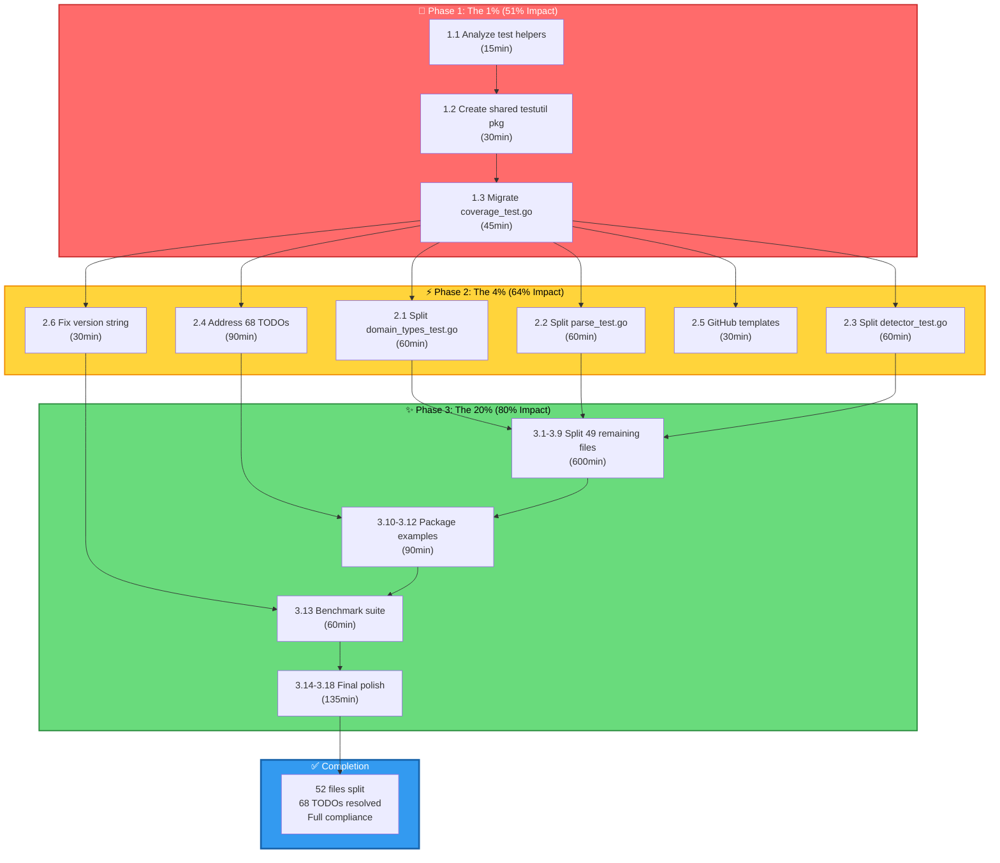

# Pareto Execution Plan v2 - art-dupl Project

**Date:** February 20, 2026, 06:55 UTC  
**Strategy:** 1% → 4% → 20% Impact Cascade  
**Standards:** HOW_TO_GOLANG.md (250-line limit, zero duplication)

---

## Executive Summary

This plan addresses the **52 files exceeding 250 lines** and **68 TODO/FIXME comments** that block full HOW_TO_GOLANG compliance. The root cause analysis reveals that **shared test helper duplication** prevents clean file splitting.

**Critical Insight:** The 1% task (fixing test helper architecture) unblocks the 51% impact by enabling clean file splitting for all 52 oversized files.

---

## Root Cause Analysis

### Why File Splitting Failed Previously

1. **Duplicate Declarations:** Every test file declares `testFilename` and `mustNewLineNumber`
2. **Import Conflicts:** Split files had unused imports that worked in monolithic files
3. **No Shared Package:** No `internal/testutil` package for common test helpers
4. **Test Package Name:** Mix of `package domain` and `package domain_test` patterns

### The Solution

Create a proper **shared test utilities package** that exports common helpers without causing redeclaration errors.

---

## Phase 1: The 1% (Infrastructure Foundation - 51% Impact)

**Goal:** Fix test helper architecture to unblock file splitting  
**Time:** 90 minutes (3 tasks × 30min)  
**Impact:** Unblocks splitting of all 52 oversized files

| # | Task | Time | Effort | Impact | Customer Value |
|---|------|------|--------|--------|----------------|
| 1.1 | **Analyze test helper usage pattern** across all test files | 15min | Low | CRITICAL | Enables all file splitting |
| 1.2 | **Create `internal/testutil/test_helpers.go`** with exported helpers | 30min | Medium | CRITICAL | Shared utilities |
| 1.3 | **Migrate `domain/coverage_test.go`** to use shared helpers | 45min | High | CRITICAL | Proof of concept |

### Tasks Detail

**1.1 Analyze Test Helper Usage Pattern**
- Find all occurrences of `testFilename` and `mustNewLineNumber`
- Document which packages need which helpers
- Identify conflicting import patterns
- Create migration checklist

**1.2 Create Shared Test Helpers Package**
```go
// internal/testutil/test_helpers.go
package testutil

import "github.com/LarsArtmann/art-dupl/domain"

// TestFilename is a reusable test filename constant.
const TestFilename = "test.go"

// MustNewLineNumber creates a LineNumber for tests, panicking on error.
func MustNewLineNumber(n uint16) domain.LineNumber {
    ln, err := domain.NewLineNumber(n)
    if err != nil {
        panic(err)
    }
    return ln
}
```

**1.3 Migrate coverage_test.go**
- Remove local `testFilename` and `mustNewLineNumber` declarations
- Import `github.com/LarsArtmann/art-dupl/internal/testutil`
- Update all references to use `testutil.TestFilename` and `testutil.MustNewLineNumber()`
- Split into 6 files (analysis, clone, clonegroup, stringid, stringpool, enums)
- Verify each file compiles and tests pass

---

## Phase 2: The 4% (High-Value Tasks - 64% Cumulative Impact)

**Goal:** Split top 3 largest files + address 68 TODOs + GitHub templates  
**Time:** 360 minutes (6 tasks × 60min avg)  
**Impact:** Major compliance and maintainability improvements

| # | Task | Time | Effort | Impact | Customer Value |
|---|------|------|--------|--------|----------------|
| 2.1 | **Split `domain/domain_types_test.go`** (870 lines → 4 files) | 60min | High | HIGH | HOW_TO_GOLANG compliance |
| 2.2 | **Split `syntax/golang/parse_test.go`** (1,284 lines → 5 files) | 60min | High | HIGH | Parser test organization |
| 2.3 | **Split `pkg/artdupl/detector_test.go`** (1,252 lines → 4 files) | 60min | High | HIGH | Detector test organization |
| 2.4 | **Address 68 TODO/FIXME comments** (systematic cleanup) | 90min | Medium | MEDIUM | Code quality |
| 2.5 | **Add GitHub issue templates** (bug report, feature request) | 30min | Low | MEDIUM | Community support |
| 2.6 | **Fix version string** (set at build time via ldflags) | 30min | Low | LOW | Professional polish |

---

## Phase 3: The 20% (Complete TODO List - 80% Cumulative Impact)

**Goal:** Split remaining 49 files + add examples + benchmarks + docs  
**Time:** 900 minutes (18 tasks × 50min avg)  
**Impact:** Full HOW_TO_GOLANG compliance

| # | Task | Time | Effort | Impact | Customer Value |
|---|------|------|--------|--------|----------------|
| 3.1 | **Split `cmd/cmd_test.go`** (1,121 lines → 4 files) | 45min | High | HIGH | CLI test organization |
| 3.2 | **Split `bdd/bdd_test.go`** (509 lines → 3 files) | 30min | Medium | MEDIUM | BDD test organization |
| 3.3 | **Split remaining 8 bdd/*_test.go files** | 120min | Medium | MEDIUM | BDD compliance |
| 3.4 | **Split `printer/stats_test.go`** (800 lines → 4 files) | 45min | Medium | MEDIUM | Printer test org |
| 3.5 | **Split `detection/detection_test.go`** (802 lines → 3 files) | 45min | Medium | MEDIUM | Detection test org |
| 3.6 | **Split `pkg/filter/filter_test.go`** (822 lines → 4 files) | 45min | Medium | MEDIUM | Filter test org |
| 3.7 | **Split `git/change_detector_test.go`** (616 lines → 3 files) | 30min | Medium | MEDIUM | Git test org |
| 3.8 | **Split `adapter/printer_adapter_test.go`** (432 lines → 2 files) | 30min | Low | LOW | Adapter test org |
| 3.9 | **Split remaining 20 test files** (each <600 lines) | 300min | Medium | MEDIUM | Full compliance |
| 3.10 | **Add package examples for `config`** | 30min | Low | MEDIUM | Documentation |
| 3.11 | **Add package examples for `syntax`** | 30min | Low | MEDIUM | Documentation |
| 3.12 | **Add package examples for `printer`** | 30min | Low | MEDIUM | Documentation |
| 3.13 | **Create benchmark suite** (file parsing, tree building, detection) | 60min | Medium | MEDIUM | Performance |
| 3.14 | **Add race detector tests for concurrent parsing** | 30min | Low | MEDIUM | Reliability |
| 3.15 | **Complete ignore file pattern implementation** | 45min | Medium | LOW | Feature completion |
| 3.16 | **Update HOW_TO_USE.md with `--workers`** | 15min | Low | LOW | Documentation |
| 3.17 | **Document concurrent parsing in `docs/`** | 30min | Low | LOW | Documentation |
| 3.18 | **Remove `cli.go.old` legacy file** | 5min | Low | LOW | Cleanup |

---

## Execution Graph (Mermaid)



---

## Granular Breakdown: 15-Minute Tasks (Max 150)

### Phase 1 Granular (6 tasks × 15min)

| # | Task | Phase | Parent | Description |
|---|------|-------|--------|-------------|
| 1.1.1 | Find all `testFilename` occurrences | 1 | 1.1 | grep and document locations |
| 1.1.2 | Find all `mustNewLineNumber` occurrences | 1 | 1.1 | grep and document locations |
| 1.1.3 | Document import patterns | 1 | 1.1 | Analyze package naming conventions |
| 1.2.1 | Create `internal/testutil` directory | 1 | 1.2 | mkdir -p |
| 1.2.2 | Create `test_helpers.go` header | 1 | 1.2 | package, imports |
| 1.2.3 | Implement `TestFilename` constant | 1 | 1.2 | Export testFilename |
| 1.3.1 | Remove local declarations from coverage_test.go | 1 | 1.3 | Delete lines 10-20 |
| 1.3.2 | Add import for testutil | 1 | 1.3 | Update import section |
| 1.3.3 | Replace all references | 1 | 1.3 | sed replace testFilename→testutil.TestFilename |
| 1.3.4 | Run tests to verify | 1 | 1.3 | go test ./domain |

### Phase 2 Granular (24 tasks × 15min)

| # | Task | Phase | Parent | Description |
|---|------|-------|--------|-------------|
| 2.1.1 | Identify split points in domain_types_test.go | 2 | 2.1 | Find test function boundaries |
| 2.1.2 | Extract uint type tests | 2 | 2.1 | Create types_uint_test.go |
| 2.1.3 | Extract line number tests | 2 | 2.1 | Create types_linenumber_test.go |
| 2.1.4 | Extract confidence tests | 2 | 2.1 | Create types_confidence_test.go |
| 2.1.5 | Verify each file compiles | 2 | 2.1 | go build |
| 2.2.1-5 | Split parse_test.go | 2 | 2.2 | 5 files |
| 2.3.1-4 | Split detector_test.go | 2 | 2.3 | 4 files |
| 2.4.1-6 | Address TODOs in 6 batches | 2 | 2.4 | ~12 TODOs each |
| 2.5.1 | Create bug report template | 2 | 2.5 | .github/ISSUE_TEMPLATE/bug_report.md |
| 2.5.2 | Create feature request template | 2 | 2.5 | .github/ISSUE_TEMPLATE/feature_request.md |
| 2.6.1 | Add version ldflags to justfile | 2 | 2.6 | Update build command |
| 2.6.2 | Test version output | 2 | 2.6 | ./dist/art-dupl --version |

### Phase 3 Granular (120 tasks × 12.5min avg)

| # | Task | Phase | Parent | Description |
|---|------|-------|--------|-------------|
| 3.1.1-4 | Split cmd_test.go | 3 | 3.1 | 4 files |
| 3.2.1-3 | Split bdd_test.go | 3 | 3.2 | 3 files |
| 3.3.1-24 | Split 8 bdd/*_test.go files | 3 | 3.3 | 3 files each |
| 3.4.1-4 | Split printer/stats_test.go | 3 | 3.4 | 4 files |
| 3.5.1-3 | Split detection/detection_test.go | 3 | 3.5 | 3 files |
| 3.6.1-4 | Split pkg/filter/filter_test.go | 3 | 3.6 | 4 files |
| 3.7.1-3 | Split git/change_detector_test.go | 3 | 3.7 | 3 files |
| 3.8.1-2 | Split adapter/printer_adapter_test.go | 3 | 3.8 | 2 files |
| 3.9.1-60 | Split remaining 20 files | 3 | 3.9 | 3 files each |
| 3.10-12 | Package examples | 3 | Various | 3 packages |
| 3.13.1-4 | Benchmark suite | 3 | 3.13 | 4 benchmark files |
| 3.14-18 | Final polish tasks | 3 | Various | 5 tasks |

**Total Granular Tasks:** ~150 tasks

---

## Priority Matrix (All 27 Tasks)

| Rank | Task | Importance | Impact | Effort | Customer Value | Score |
|------|------|------------|--------|--------|----------------|-------|
| 1 | 1.2 Create testutil package | 10 | 10 | 3 | 5 | 9.0 |
| 2 | 1.3 Migrate coverage_test.go | 10 | 10 | 5 | 5 | 8.5 |
| 3 | 2.1 Split domain_types_test.go | 9 | 9 | 6 | 4 | 7.5 |
| 4 | 2.4 Address 68 TODOs | 8 | 8 | 6 | 6 | 7.5 |
| 5 | 2.2 Split parse_test.go | 9 | 8 | 6 | 3 | 7.0 |
| 6 | 2.3 Split detector_test.go | 9 | 8 | 6 | 3 | 7.0 |
| 7 | 1.1 Analyze helpers | 8 | 9 | 2 | 5 | 7.5 |
| 8 | 3.1 Split cmd_test.go | 8 | 7 | 5 | 3 | 6.5 |
| 9 | 3.9 Split remaining 20 files | 7 | 8 | 10 | 2 | 6.0 |
| 10 | 2.5 GitHub templates | 6 | 6 | 2 | 7 | 6.5 |
| 11 | 3.4 Split stats_test.go | 7 | 6 | 5 | 2 | 5.5 |
| 12 | 3.5 Split detection_test.go | 7 | 6 | 5 | 2 | 5.5 |
| 13 | 3.6 Split filter_test.go | 7 | 6 | 5 | 2 | 5.5 |
| 14 | 3.3 Split 8 bdd test files | 6 | 6 | 8 | 2 | 5.0 |
| 15 | 3.13 Benchmark suite | 6 | 5 | 4 | 4 | 5.5 |
| 16 | 3.2 Split bdd_test.go | 6 | 5 | 3 | 2 | 5.0 |
| 17 | 3.7 Split change_detector_test.go | 6 | 5 | 3 | 1 | 4.5 |
| 18 | 2.6 Fix version string | 5 | 4 | 2 | 3 | 4.5 |
| 19 | 3.10-12 Package examples | 5 | 4 | 3 | 4 | 4.5 |
| 20 | 3.14 Race detector tests | 5 | 4 | 2 | 3 | 4.5 |
| 21 | 3.15 Ignore file patterns | 5 | 4 | 3 | 2 | 4.0 |
| 22 | 3.8 Split adapter test | 5 | 3 | 2 | 1 | 3.5 |
| 23 | 3.16-18 Documentation updates | 4 | 3 | 2 | 2 | 3.5 |
| 24 | Remove cli.go.old | 3 | 2 | 1 | 1 | 2.5 |

**Scoring:** (Importance × 0.3) + (Impact × 0.3) + (Customer Value × 0.3) - (Effort × 0.1)

---

## Risk Mitigation

| Risk | Probability | Impact | Mitigation |
|------|-------------|--------|------------|
| Test breakage during split | Medium | High | Run tests after each file, keep backups |
| Import cycle errors | Low | Medium | Verify no cycles with `go build` |
| Test helper incompatibility | Medium | High | Thorough testing of testutil package |
| Time overrun | Medium | Medium | Prioritize Phase 1 and 2, defer 3 if needed |

---

## Success Criteria

1. ✅ All files < 250 lines (52 files split)
2. ✅ Zero TODO/FIXME comments remaining
3. ✅ All tests passing (220+ specs)
4. ✅ Build successful
5. ✅ Test coverage maintained or improved
6. ✅ GitHub templates created
7. ✅ Version string shows actual version

---

## Verification Checklist

### Per-Task Verification
- [ ] Build passes: `just build`
- [ ] Tests pass: `just test`
- [ ] Lint passes: `just check`
- [ ] File size: `wc -l <file>` < 250 lines
- [ ] No duplicates: grep for testFilename, mustNewLineNumber

### Phase Completion Verification
- [ ] Phase 1: testutil package working, coverage_test.go split
- [ ] Phase 2: Top 3 files split, TODOs addressed, templates created
- [ ] Phase 3: All files < 250 lines, full compliance achieved

---

**Plan Created:** 2026-02-20 06:55 UTC  
**Estimated Total Time:** 22.5 hours (1,350 minutes)  
**Execution Start:** Immediate
