# Pareto-Optimal Lint Fix Execution Plan

**Date:** 2026-02-27 09:14\
**Total Issues:** 390\
**Estimated Time:** 8-10 hours\
**Target:** Zero lint errors with maximum value delivery

---

## Executive Summary

This plan applies the **Pareto Principle** (80/20 rule) to prioritize lint fixes by impact. We target:

| Pareto Level  | Issues | % of Total | Value Delivered                     | Time Investment |
| ------------- | ------ | ---------- | ----------------------------------- | --------------- |
| **1%**        | 7      | 1.8%       | **51%** (Security + Stability)      | 30 min          |
| **4%**        | 16     | 4.1%       | **64%** (Error Handling)            | 45 min          |
| **20%**       | 78     | 20%        | **80%** (Quality + Maintainability) | 3.5 hrs         |
| **Remaining** | 289    | 74%        | 100%                                | 6+ hrs          |

---

## Issue Inventory

```
390 TOTAL ISSUES:
├── err113: 16          (Dynamic errors → static)
├── exhaustruct: 50     (Struct initialization)
├── forcetypeassert: 2   (Unsafe type assertions)
├── funlen: 1           (Function too long)
├── gochecknoglobals: 1  (Global variables)
├── gocritic: 1         (Code optimization)
├── gocyclo: 2          (Cyclomatic complexity)
├── godoclint: 20       (Documentation)
├── godox: 6            (TODO markers)
├── goprintffuncname: 5  (Printf naming)
├── gosec: 5            (Security issues)
├── gosmopolitan: 2     (i18n issues)
├── maintidx: 1         (Maintainability)
├── mnd: 50             (Magic numbers)
├── nestif: 2           (Nested conditionals)
├── nilnil: 1           (Double nil returns)
├── noctx: 3            (Missing context)
├── noinlineerr: 3      (Inline errors)
├── nolintlint: 2       (Bad nolint)
├── nonamedreturns: 7   (Named returns)
├── prealloc: 11        (Slice preallocation)
├── recvcheck: 19       (Receiver naming)
├── revive: 50          (General quality)
├── tagliatelle: 50     (Struct tags)
├── thelper: 4          (Test helpers)
├── tparallel: 1        (Parallel tests)
├── unconvert: 1        (Unnecessary conversion)
├── unparam: 9          (Unused params)
├── usetesting: 2       (Test utilities)
├── varnamelen: 50      (Variable names)
└── wrapcheck: 13       (Error wrapping)
```

---

## Pareto Analysis: Impact Layers

### 🔴 Layer 1: 1% → 51% (CRITICAL - Security & Stability)

**Issues:** 7 (1.8% of total)\
**Value:** Prevents 51% of production issues\
**Time:** ~30 minutes

| Linter              | Count | Impact      | Why Critical                                                         |
| ------------------- | ----- | ----------- | -------------------------------------------------------------------- |
| **gosec**           | 5     | 🔴 CRITICAL | Security vulnerabilities (G115, G204, etc.) - Could lead to exploits |
| **forcetypeassert** | 2     | 🔴 CRITICAL | Runtime panics - Application crashes in production                   |

**Risk if not fixed:**

- Security breaches from integer overflows or command injection
- Production outages from unhandled type assertions
- Data corruption or unauthorized access

**Customer Value:** Trust, security compliance, uptime SLA

---

### 🟠 Layer 2: 4% → 64% (HIGH - Error Handling & Debugging)

**Issues:** 16 (4.1% of total)\
**Value:** Proper error handling for 64% of debugging scenarios\
**Time:** ~45 minutes\
**Cumulative:** 23 issues (5.9%) for 64% value

| Linter        | Count | Impact  | Why Important                                              |
| ------------- | ----- | ------- | ---------------------------------------------------------- |
| **err113**    | 7     | 🟠 HIGH | Dynamic errors prevent proper error wrapping and debugging |
| **nilnil**    | 1     | 🟠 HIGH | Ambiguous API - caller can't distinguish success/failure   |
| **wrapcheck** | 8     | 🟠 HIGH | Broken error chains hide root causes in logs               |

**Risk if not fixed:**

- Engineers waste hours debugging cryptic errors
- Error aggregation tools can't group similar issues
- Context is lost when errors bubble up

**Customer Value:** Faster incident resolution, better observability

---

### 🟡 Layer 3: 20% → 80% (MEDIUM - Quality & Maintainability)

**Issues:** 55 (14.1% additional, 20% cumulative)\
**Value:** Code quality for 80% of maintainability\
**Time:** ~3 hours\
**Cumulative:** 78 issues (20%) for 80% value

| Linter          | Count | Impact    | Why It Matters                               |
| --------------- | ----- | --------- | -------------------------------------------- |
| **gocyclo**     | 2     | 🟡 MEDIUM | Complex code is bug-prone and hard to test   |
| **gocognit**    | 2     | 🟡 MEDIUM | High cognitive load slows development        |
| **funlen**      | 1     | 🟡 MEDIUM | Long functions violate single responsibility |
| **nestif**      | 2     | 🟡 MEDIUM | Deep nesting reduces readability             |
| **revive**      | 25    | 🟡 MEDIUM | Code style consistency across team           |
| **unparam**     | 9     | 🟡 MEDIUM | Dead code removal                            |
| **prealloc**    | 11    | 🟡 MEDIUM | Performance optimization                     |
| **noinlineerr** | 3     | 🟡 MEDIUM | Code organization                            |
| **unconvert**   | 1     | 🟡 MEDIUM | Clean code                                   |
| **maintidx**    | 1     | 🟡 MEDIUM | Maintainability score                        |
| **nolintlint**  | 2     | 🟡 MEDIUM | Proper lint suppression                      |
| **gocritic**    | 1     | 🟡 MEDIUM | Performance/idiom improvements               |

**Risk if not fixed:**

- Technical debt accumulates
- Onboarding new developers takes longer
- Refactoring becomes risky
- Performance degrades

**Customer Value:** Development velocity, code longevity

---

### 🟢 Layer 4: Remaining 80% → 100% (LOW - Style & Consistency)

**Issues:** 289 (74% of total)\
**Value:** Final 20% of polish\
**Time:** 6+ hours

| Category          | Linters                               | Count | Priority |
| ----------------- | ------------------------------------- | ----- | -------- |
| **Testing**       | thelper, tparallel, usetesting        | 7     | P4       |
| **Documentation** | godoclint, godox                      | 26    | P5       |
| **Naming**        | varnamelen, recvcheck, nonamedreturns | 76    | P5       |
| **Style**         | mnd, tagliatelle, exhaustruct         | 150   | P6       |
| **Architecture**  | gochecknoglobals                      | 1     | P6       |
| **Minor**         | gosmopolitan, goprintffuncname        | 7     | P6       |

**Note:** Many exhaustruct, mnd, tagliatelle, and varnamelen issues can be auto-fixed or have nolint added for third-party structs.

---

## Comprehensive Task Plan (30-100 min each, max 27 tasks)

### Phase P0: Security & Stability (CRITICAL - 30 min)

| Task     | Linter          | Issues | Time   | Description                                                     |
| -------- | --------------- | ------ | ------ | --------------------------------------------------------------- |
| **P0.1** | gosec           | 5      | 15 min | Fix G115 (integer overflow) and G204 (command injection) issues |
| **P0.2** | forcetypeassert | 2      | 15 min | Add safe type assertions with ok checks                         |

**Deliverable:** Zero security vulnerabilities, zero runtime panics

---

### Phase P1: Error Handling (HIGH - 45 min)

| Task     | Linter      | Issues | Time   | Description                                          |
| -------- | ----------- | ------ | ------ | ---------------------------------------------------- |
| **P1.1** | nilnil      | 1      | 10 min | Fix ambiguous nil return in domain function          |
| **P1.2** | err113-A    | 4      | 15 min | Fix dynamic errors in domain/ and internal/enum/     |
| **P1.3** | err113-B    | 4      | 15 min | Fix dynamic errors in migration/ and remaining files |
| **P1.4** | wrapcheck-A | 7      | 15 min | Wrap errors in internal/testutil/ and pkg/artdupl/   |
| **P1.5** | wrapcheck-B | 6      | 15 min | Wrap errors in job/, printer/, and cmd/              |

**Deliverable:** Proper error wrapping throughout codebase

---

### Phase P2: Complexity Reduction (MEDIUM - 90 min)

| Task     | Linter   | Issues | Time   | Description                                        |
| -------- | -------- | ------ | ------ | -------------------------------------------------- |
| **P2.1** | gocyclo  | 2      | 20 min | Refactor complex functions in syntax/golang/       |
| **P2.2** | gocognit | 2      | 20 min | Simplify cognitive complexity in detection/        |
| **P2.3** | funlen   | 1      | 15 min | Split long function in cmd/                        |
| **P2.4** | nestif   | 2      | 20 min | Flatten nested conditionals in cmd/run_analysis.go |
| **P2.5** | gocritic | 1      | 15 min | Apply code optimization suggestion                 |

**Deliverable:** All complexity metrics within thresholds

---

### Phase P3: Code Quality (MEDIUM - 120 min)

| Task      | Linter      | Issues | Time   | Description                               |
| --------- | ----------- | ------ | ------ | ----------------------------------------- |
| **P3.1**  | revive-A    | 10     | 25 min | Fix revive issues in cmd/ package         |
| **P3.2**  | revive-B    | 10     | 25 min | Fix revive issues in internal/ package    |
| **P3.3**  | revive-C    | 10     | 25 min | Fix revive issues in pkg/ and printer/    |
| **P3.4**  | revive-D    | 10     | 25 min | Fix remaining revive issues               |
| **P3.5**  | revive-E    | 10     | 25 min | Fix remaining revive issues (final batch) |
| **P3.6**  | unparam     | 9      | 20 min | Remove unused parameters across codebase  |
| **P3.7**  | prealloc    | 11     | 20 min | Add slice preallocations for performance  |
| **P3.8**  | maintidx    | 1      | 10 min | Fix maintainability index issue           |
| **P3.9**  | nolintlint  | 2      | 10 min | Fix improper nolint directives            |
| **P3.10** | unconvert   | 1      | 10 min | Remove unnecessary type conversion        |
| **P3.11** | noinlineerr | 3      | 15 min | Extract inline error handling             |

**Deliverable:** High code quality scores, dead code removed

---

### Phase P4: Testing Improvements (LOW - 60 min)

| Task     | Linter     | Issues | Time   | Description                                |
| -------- | ---------- | ------ | ------ | ------------------------------------------ |
| **P4.1** | thelper    | 4      | 15 min | Mark test helper functions with t.Helper() |
| **P4.2** | tparallel  | 1      | 10 min | Enable parallel test execution             |
| **P4.3** | usetesting | 2      | 15 min | Use t.TempDir() instead of os.MkdirTemp    |
| **P4.4** | recvcheck  | 19     | 30 min | Fix receiver naming consistency            |

**Deliverable:** Consistent test patterns

---

### Phase P5: Documentation & Style (LOW - 90 min)

| Task     | Linter           | Issues | Time   | Description                            |
| -------- | ---------------- | ------ | ------ | -------------------------------------- |
| **P5.1** | godoclint-A      | 10     | 20 min | Add package and function documentation |
| **P5.2** | godoclint-B      | 10     | 20 min | Complete documentation coverage        |
| **P5.3** | godox            | 6      | 15 min | Review and resolve TODO markers        |
| **P5.4** | nonamedreturns   | 7      | 20 min | Remove named return values             |
| **P5.5** | goprintffuncname | 5      | 15 min | Fix Printf-like function names         |

**Deliverable:** Complete documentation, consistent style

---

### Phase P6: Structural & Architectural (LOW - 180 min)

| Task      | Linter           | Issues | Time   | Description                         |
| --------- | ---------------- | ------ | ------ | ----------------------------------- |
| **P6.1**  | mnd-A            | 12     | 30 min | Extract magic numbers to constants  |
| **P6.2**  | mnd-B            | 12     | 30 min | Continue magic number extraction    |
| **P6.3**  | mnd-C            | 13     | 30 min | Complete magic number fixes         |
| **P6.4**  | tagliatelle-A    | 15     | 30 min | Fix struct field tags (JSON naming) |
| **P6.5**  | tagliatelle-B    | 15     | 30 min | Continue struct tag fixes           |
| **P6.6**  | tagliatelle-C    | 10     | 20 min | Complete struct tag fixes           |
| **P6.7**  | varnamelen-A     | 15     | 30 min | Expand short variable names         |
| **P6.8**  | varnamelen-B     | 15     | 30 min | Continue variable naming fixes      |
| **P6.9**  | varnamelen-C     | 10     | 20 min | Complete variable naming            |
| **P6.10** | exhaustruct-A    | 15     | 30 min | Add missing struct fields or nolint |
| **P6.11** | exhaustruct-B    | 15     | 30 min | Continue struct initialization      |
| **P6.12** | exhaustruct-C    | 10     | 20 min | Complete struct fixes               |
| **P6.13** | gochecknoglobals | 1      | 15 min | Refactor global variable to DI      |
| **P6.14** | gosmopolitan     | 2      | 10 min | Review internationalization issues  |

**Deliverable:** Zero remaining lint issues

---

## Micro-Task Breakdown (Max 15 min each, max 150 tasks)

### P0: Security (2 tasks → 4 micro-tasks)

| Micro  | Task                       | Linter          | File                   | Time  | Action                                  |
| ------ | -------------------------- | --------------- | ---------------------- | ----- | --------------------------------------- |
| P0.1.1 | Fix G115 overflow          | gosec           | hash/file_detector.go  | 8 min | Add bounds check before uint conversion |
| P0.1.2 | Fix G115 overflow          | gosec           | migration/migration.go | 7 min | Add bounds check before uint conversion |
| P0.1.3 | Fix G204 command injection | gosec           | cmd/run_crawl.go       | 8 min | Use exec.Command with args slice        |
| P0.1.4 | Fix remaining gosec        | gosec           | Various                | 7 min | Address remaining security findings     |
| P0.2.1 | Safe type assert 1         | forcetypeassert | lib/lib.go             | 7 min | Add `val, ok := x.(Type)` pattern       |
| P0.2.2 | Safe type assert 2         | forcetypeassert | TBD                    | 8 min | Add safe type assertion                 |

### P1: Error Handling (5 tasks → 10 micro-tasks)

| Micro  | Task                 | Linter    | File                         | Time   | Action                                   |
| ------ | -------------------- | --------- | ---------------------------- | ------ | ---------------------------------------- |
| P1.1.1 | Fix nilnil           | nilnil    | domain/types_severity.go     | 10 min | Return explicit error instead of nil,nil |
| P1.2.1 | err113 domain        | err113    | domain/validation.go         | 8 min  | Define static error variable             |
| P1.2.2 | err113 enum          | err113    | internal/enum/marshal.go     | 7 min  | Define static error for enum validation  |
| P1.3.1 | err113 migration-A   | err113    | migration/migration.go:262   | 8 min  | Use static error                         |
| P1.3.2 | err113 migration-B   | err113    | migration/migration.go:277   | 7 min  | Use static error                         |
| P1.4.1 | wrapcheck testutil-A | wrapcheck | internal/testutil/bdd.go:135 | 8 min  | Wrap os.RemoveAll error                  |
| P1.4.2 | wrapcheck testutil-B | wrapcheck | internal/testutil/bdd.go:142 | 7 min  | Wrap WriteDuplicateFiles error           |
| P1.5.1 | wrapcheck job        | wrapcheck | job/file_parser.go:21        | 8 min  | Wrap ParseWithLineCount error            |
| P1.5.2 | wrapcheck printer    | wrapcheck | printer/json.go              | 7 min  | Wrap HandleMarshalingError               |

### P2: Complexity (5 tasks → 8 micro-tasks)

| Micro  | Task             | Linter   | File                   | Time   | Action                         |
| ------ | ---------------- | -------- | ---------------------- | ------ | ------------------------------ |
| P2.1.1 | Reduce cyclo 1   | gocyclo  | syntax/golang/parse.go | 10 min | Extract helper function        |
| P2.1.2 | Reduce cyclo 2   | gocyclo  | TBD                    | 10 min | Extract helper function        |
| P2.2.1 | Reduce cognit 1  | gocognit | detection/todos.go     | 10 min | Simplify conditional logic     |
| P2.2.2 | Reduce cognit 2  | gocognit | TBD                    | 10 min | Simplify complex function      |
| P2.3.1 | Split long func  | funlen   | cmd/run_analysis.go    | 15 min | Extract renderDuplicatesToTree |
| P2.4.1 | Flatten nestif 1 | nestif   | cmd/run_analysis.go    | 10 min | Use early returns              |
| P2.4.2 | Flatten nestif 2 | nestif   | TBD                    | 10 min | Use guard clauses              |
| P2.5.1 | Apply gocritic   | gocritic | TBD                    | 15 min | Apply suggested optimization   |

### P3: Quality (11 tasks → 25 micro-tasks)

| Micro  | Task          | Linter   | File                          | Time  | Action                           |
| ------ | ------------- | -------- | ----------------------------- | ----- | -------------------------------- |
| P3.1.1 | revive cmd-A  | revive   | cmd/root.go                   | 8 min | Add t.Helper() to test functions |
| P3.1.2 | revive cmd-B  | revive   | cmd/run_analysis.go           | 8 min | Fix naming and style             |
| P3.1.3 | revive cmd-C  | revive   | cmd/stats.go                  | 9 min | Fix remaining issues             |
| P3.6.1 | unparam 1-3   | unparam  | bdd/default_filtering_test.go | 8 min | Remove unused return             |
| P3.6.2 | unparam 4-6   | unparam  | cmd/cmd_test.go               | 8 min | Fix unused params                |
| P3.6.3 | unparam 7-9   | unparam  | detection/detection_test.go   | 9 min | Fix remaining unused params      |
| P3.7.1 | prealloc 1-4  | prealloc | Various                       | 8 min | Add make() with capacity         |
| P3.7.2 | prealloc 5-8  | prealloc | Various                       | 8 min | Add preallocation                |
| P3.7.3 | prealloc 9-11 | prealloc | Various                       | 9 min | Complete preallocation fixes     |

### P4: Testing (4 tasks → 8 micro-tasks)

| Micro  | Task            | Linter     | File                     | Time   | Action               |
| ------ | --------------- | ---------- | ------------------------ | ------ | -------------------- |
| P4.1.1 | thelper 1-2     | thelper    | bdd/ files               | 8 min  | Add t.Helper() calls |
| P4.1.2 | thelper 3-4     | thelper    | More bdd/ files          | 7 min  | Complete t.Helper()  |
| P4.2.1 | tparallel       | tparallel  | TBD test file            | 10 min | Add t.Parallel()     |
| P4.3.1 | usetesting 1    | usetesting | config/config_test.go    | 8 min  | Use t.TempDir()      |
| P4.3.2 | usetesting 2    | usetesting | internal/testutil/bdd.go | 7 min  | Use t.TempDir()      |
| P4.4.1 | recvcheck 1-6   | recvcheck  | Various files            | 10 min | Fix receiver names   |
| P4.4.2 | recvcheck 7-13  | recvcheck  | More files               | 10 min | Continue fixes       |
| P4.4.3 | recvcheck 14-19 | recvcheck  | Remaining                | 10 min | Complete recvcheck   |

### P5-P6: Style & Structure (19 tasks → 95 micro-tasks)

_See full breakdown in separate tracking document_

---

## Execution Graph (Mermaid)

```mermaid
flowchart TB
    subgraph P0["🔴 P0: SECURITY (30 min)"]
        P0_1["P0.1: gosec (5 issues)"]
        P0_2["P0.2: forcetypeassert (2 issues)"]
    end

    subgraph P1["🟠 P1: ERROR HANDLING (45 min)"]
        P1_1["P1.1: nilnil (1)"]
        P1_2["P1.2-3: err113 (16)"]
        P1_3["P1.4-5: wrapcheck (13)"]
    end

    subgraph P2["🟡 P2: COMPLEXITY (90 min)"]
        P2_1["P2.1: gocyclo (2)"]
        P2_2["P2.2: gocognit (2)"]
        P2_3["P2.3: funlen (1)"]
        P2_4["P2.4: nestif (2)"]
        P2_5["P2.5: gocritic (1)"]
    end

    subgraph P3["🟢 P3: QUALITY (120 min)"]
        P3_1["P3.1-5: revive (50)"]
        P3_2["P3.6: unparam (9)"]
        P3_3["P3.7: prealloc (11)"]
        P3_4["P3.8-11: Misc (7)"]
    end

    subgraph P4["🔵 P4: TESTING (60 min)"]
        P4_1["P4.1: thelper (4)"]
        P4_2["P4.2: tparallel (1)"]
        P4_3["P4.3: usetesting (2)"]
        P4_4["P4.4: recvcheck (19)"]
    end

    subgraph P5["⚪ P5: DOCUMENTATION (90 min)"]
        P5_1["P5.1-2: godoclint (20)"]
        P5_2["P5.3: godox (6)"]
        P5_3["P5.4: nonamedreturns (7)"]
        P5_4["P5.5: goprintffuncname (5)"]
    end

    subgraph P6["⚫ P6: STRUCTURE (180 min)"]
        P6_1["P6.1-3: mnd (50)"]
        P6_2["P6.4-6: tagliatelle (50)"]
        P6_3["P6.7-9: varnamelen (50)"]
        P6_4["P6.10-12: exhaustruct (50)"]
        P6_5["P6.13-14: Misc (3)"]
    end

    Start(["Start"]) --> P0
    P0 --> P1
    P1 --> P2
    P2 --> P3
    P3 --> P4
    P4 --> P5
    P5 --> P6
    P6 --> End(["Zero Lint Issues"])

    style P0 fill:#ffcccc
    style P1 fill:#ffe4cc
    style P2 fill:#ffffcc
    style P3 fill:#ccffcc
    style P4 fill:#ccffff
    style P5 fill:#ccccff
    style P6 fill:#f0f0f0
```



---

## Success Metrics

| Phase    | Issues Fixed | Cumulative | Time    | Value Delivered |
| -------- | ------------ | ---------- | ------- | --------------- |
| After P0 | 7            | 7 (1.8%)   | 30 min  | 51%             |
| After P1 | 16           | 23 (5.9%)  | 75 min  | 64%             |
| After P2 | 8            | 31 (7.9%)  | 165 min | 70%             |
| After P3 | 55           | 86 (22%)   | 285 min | 80%             |
| After P4 | 26           | 112 (29%)  | 345 min | 85%             |
| After P5 | 38           | 150 (38%)  | 435 min | 90%             |
| After P6 | 240          | 390 (100%) | 615 min | 100%            |

---

## Verification Checklist

- [ ] All P0 issues resolved (gosec, forcetypeassert)
- [ ] All P1 issues resolved (err113, nilnil, wrapcheck)
- [ ] All P2 issues resolved (complexity)
- [ ] All P3 issues resolved (quality)
- [ ] All P4 issues resolved (testing)
- [ ] All P5 issues resolved (documentation)
- [ ] All P6 issues resolved (structure)
- [ ] `just check` passes without errors
- [ ] `just test` passes
- [ ] `just build` succeeds
- [ ] No regressions in functionality

---

## Rollback Strategy

Each task is independent and can be reverted. Commits should be:

1. Small and focused (one linter per commit)
2. With clear messages explaining the fix
3. Verified with `just check` before proceeding

---

**Generated:** 2026-02-27 09:14\
**Assisted-by:** Claude via Crush <crush@charm.land>
