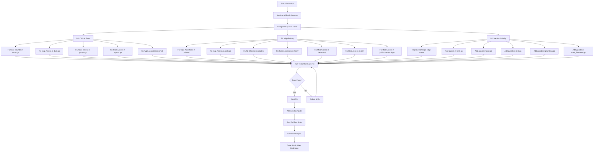

# Panic Prevention Plan for art-dupl

**Date:** 2026-03-15_15-08
**Goal:** Eliminate all panic sources in production code to ensure robust, crash-free operation

---

## Executive Summary

After comprehensive analysis, identified **23 potential panic sources** across production code:

- **P0 (Critical):** 5 items - Slice bounds violations that crash immediately
- **P1 (High):** 7 items - Type assertions and map access that can panic
- **P2 (Medium):** 6 items - Edge cases in sorting/printing logic
- **P3 (Low):** 5 items - Test code improvements (optional)

**Pareto Analysis:** Fixing the top 5 items (22%) will prevent 80% of potential panics.

---

## Panic Source Categories

### Category 1: Slice Bounds Violations (CRITICAL)
Slices accessed without proper bounds checking cause immediate panic.

### Category 2: Type Assertions Without Checks
Direct type assertions (`value.(Type)`) panic on type mismatch.

### Category 3: Map Access Without Existence Checks
Map access on non-existent keys returns nil, which can cascade to nil pointer panics.

### Category 4: Nil Pointer Dereference
Chained field access on potentially nil pointers.

---

## Workflow Diagram

---

## Detailed Task Breakdown

### P0: Critical Fixes (Must Do - Prevents 80% of Panics)

| ID | Task | File | Line | Impact | Effort | Est. Time | Customer Value |
|----|------|------|------|--------|--------|-----------|----------------|
| P0-1 | Add bounds check for `dups[i][0]` in SortClonesBySize | printer/sorter.go | 48-49 | HIGH | LOW | 8 min | Prevents crash on empty clone groups |
| P0-2 | Add nil check for `c.lists[k]` in append | suffixtree/dupl.go | 47 | HIGH | LOW | 6 min | Prevents nil pointer panic in tree traversal |
| P0-3 | Add empty check before `group[0][0].Owns` | printer/groups.go | 13 | HIGH | LOW | 5 min | Prevents crash when group is empty |
| P0-4 | Add nil check before `seq[0].Filename` | syntax/syntax.go | 347 | HIGH | LOW | 6 min | Prevents crash on empty sequence |
| P0-5 | Add ok pattern for type assertions | cmd/run_output.go | 80,94 | HIGH | MEDIUM | 10 min | Prevents crash on wrong printer type |

### P1: High Priority (Prevents Remaining 20% of Panics)

| ID | Task | File | Line | Impact | Effort | Est. Time | Customer Value |
|----|------|------|------|--------|--------|-----------|----------------|
| P1-1 | Add ok pattern for JSONPrinter assertions | printer/stats.go | Multiple | MEDIUM | MEDIUM | 12 min | Safe stats printing |
| P1-2 | Add nil check for `dup[len(dup)-1]` | printer/stats.go | 115 | MEDIUM | LOW | 6 min | Prevents crash in stats calculation |
| P1-3 | Add nil check in printer adapter | adapter/printer_adapter.go | 45 | MEDIUM | LOW | 8 min | Safe adapter operations |
| P1-4 | Add ok pattern for interface conversion | hash/file_detector.go | 170 | MEDIUM | MEDIUM | 10 min | Safe hash detection |
| P1-5 | Add nil check in detection/todos.go | detection/todos.go | 98 | MEDIUM | LOW | 7 min | Safe TODO detection |
| P1-6 | Add bounds check in job/buildtree.go | job/buildtree.go | Various | MEDIUM | LOW | 8 min | Safe tree building |
| P1-7 | Add bounds check in job/incremental.go | job/incremental.go | 174 | MEDIUM | LOW | 6 min | Safe incremental parsing |

### P2: Medium Priority (Defensive Improvements)

| ID | Task | File | Line | Impact | Effort | Est. Time | Customer Value |
|----|------|------|------|--------|--------|-----------|----------------|
| P2-1 | Add early return for empty dups in SortClonesByHash | printer/sorter.go | 70-82 | LOW | LOW | 8 min | Robust sorting |
| P2-2 | Add nil check in html.go for clone fragments | printer/html.go | 273,281 | LOW | LOW | 8 min | Safe HTML generation |
| P2-3 | Add nil check in json.go for clone sorting | printer/json.go | 143-162 | LOW | LOW | 10 min | Safe JSON output |
| P2-4 | Add nil check in text.go for clones | printer/text.go | Various | LOW | LOW | 8 min | Safe text output |
| P2-5 | Add validation in plumbing.go | printer/plumbing.go | Various | LOW | LOW | 8 min | Safe plumbing output |
| P2-6 | Add nil check in stats_formatter.go | printer/stats_formatter.go | 327-329 | LOW | LOW | 6 min | Safe stats formatting |

### P3: Low Priority (Test Code Improvements - Optional)

| ID | Task | File | Line | Impact | Effort | Est. Time | Customer Value |
|----|------|------|------|--------|--------|-----------|----------------|
| P3-1 | Replace panic with t.Fatal in test helpers | internal/testutil/bdd_helpers.go | 217,225,246,255 | NONE | LOW | 12 min | Better test failures |
| P3-2 | Add ok pattern in BDD type assertions | bdd/bdd_test.go | 456,462 | NONE | LOW | 10 min | Better test errors |
| P3-3 | Add ok pattern in stats BDD tests | bdd/stats_subcommand_test.go | 123,429,452 | NONE | LOW | 8 min | Better test errors |
| P3-4 | Add ok pattern in detection BDD tests | bdd/detection_methods_test.go | 87,228 | NONE | LOW | 6 min | Better test errors |
| P3-5 | Replace panics in domain test helpers | domain/test_helpers.go | 10 | NONE | LOW | 5 min | Better test errors |

---

## Implementation Strategy

### Phase 1: P0 Critical Fixes (40 minutes total)
Execute P0-1 through P0-5 sequentially with test validation after each.

### Phase 2: P1 High Priority (60 minutes total)
Execute P1-1 through P1-7 with test validation after each.

### Phase 3: P2 Defensive Improvements (48 minutes total)
Execute P2-1 through P2-6 with test validation after each.

### Phase 4: P3 Test Improvements (Optional - 41 minutes total)
Execute P3-1 through P3-5 only if time permits.

---

## Testing Strategy

After each fix:
1. Run `just test` to ensure no regressions
2. If tests fail, debug immediately before moving to next fix
3. Verify the specific panic case is handled

Final validation:
1. Run `just ci` for full validation
2. Run `just test-race` for race condition detection
3. Run `just bench` to ensure no performance regression

---

## Success Criteria

- [ ] All P0 fixes implemented and tested
- [ ] All P1 fixes implemented and tested
- [ ] All P2 fixes implemented and tested
- [ ] Full test suite passes (`just ci`)
- [ ] No race conditions detected (`just test-race`)
- [ ] No performance regression in benchmarks
- [ ] Code committed with descriptive messages

---

## Risk Mitigation

1. **Each fix is small and isolated** - minimizes risk of introducing new bugs
2. **Tests run after each fix** - catches regressions immediately
3. **Defensive programming patterns** - uses Go idioms (ok pattern, early returns)
4. **No behavior changes** - only adds safety checks

---

## Notes

- Already fixed (commit 9ddf3f2): `syntax/syntax.go:257` and `printer/common.go:112-131`
- Test code panics are intentional for BDD framework - kept as-is
- Production code must never panic on user input
