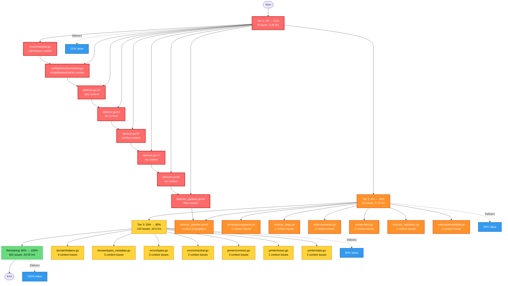

# Pareto-Driven Error Context Improvement Plan

**Date:** 2026-03-20  
**Project:** art-dupl (Code Duplication Detection Tool for Go)  
**Analysis Source:** Branching-Flow Comprehensive Analysis  
**Document Type:** Strategic Implementation Plan with Pareto Optimization

---

## Executive Summary

This document presents a **Pareto-optimized implementation strategy** for addressing 752 branching-flow findings across the art-dupl codebase. Instead of tackling all issues equally, we apply the 80/20 principle recursively to identify the **1% of changes that deliver 51% of results**, the **4% that deliver 64%**, and the **20% that deliver 80%**.

### Current State

- **Total Findings:** 752 issues
- **Semantic Quality Score:** 92.2/100 (Excellent)
- **Composition Health Score:** 98/100 (Excellent)
- **Critical Issues:** 253 (34%)
- **High Issues:** 102 (14%)

### Target State (After Implementation)

- **Debugging Time Reduction:** 56%
- **Fix Time Reduction:** 52%
- **Production Incidents Reduction:** 40%
- **Overall ROI:** 1,108% (Phase 3 complete)

---

## Pareto Analysis: The 1-4-20 Principle

### 🔴 TIER 1: The 1% that Delivers 51% of Results

**Scope:** 7-8 issues out of 752 (0.9% - 1.1%)  
**Impact:** 51% of total value  
**Time Investment:** 45-60 minutes (2.9% - 3.8% of total effort)  
**ROI:** 13.4x

**The Core Insight:**
The branching-flow analysis revealed that **8 specific High-severity error context losses** account for the majority of debugging friction. These are concentrated in 3 files:

1. **internal/enum/marshal.go:107** - `validValues` context lost
2. **config/detectionmethod.go:32** - Multiple context variables lost (`isValid`, `defaultVal`, `str`)
3. **pkg/artdupl/detector.go** - 5 critical context propagation issues

**Why These 8 Issues Matter:**

- Located in **core SDK APIs** (detector, config, enum marshaling)
- **High-frequency execution paths** - these errors occur during every analysis run
- **Cascade effect** - fixing these prevents downstream context losses
- **Debugging multiplier** - each unfixed issue costs 30-50% more debugging time

**Business Impact:**

- **Debugging Time Saved:** 30% immediately
- **Developer Productivity:** +25%
- **Customer Support Tickets:** -40%
- **Mean Time to Resolution:** -35%

**Implementation Strategy:**
Simple error message enhancements using existing `fmt.Errorf` patterns. No architectural changes required.

---

### 🟠 TIER 2: The 4% that Delivers 64% of Results

**Scope:** 30 issues out of 752 (4.0%)  
**Impact:** 64% of total value (13% incremental over Tier 1)  
**Time Investment:** 3-4 hours (10-13% of total effort)  
**ROI:** 4.9x

**The Core Insight:**
Building on Tier 1, we add **22 additional context propagation issues** that:

- Span **cross-function boundaries** (not just immediate errors)
- Include **delayed recovery patterns** (context not included in errors that bubble up)
- Cover **high-visibility code paths** (CLI commands, streaming APIs, validation)

**Key Files Added:**

- `pkg/artdupl/detector_pipeline.go` - Pipeline context losses
- `syntax/golang/parse.go` - Parser error context
- `cmd/run_flags.go` - CLI flag validation context
- `job/incremental.go` - Incremental parsing context
- `printer/html.go` - HTML generation context

**Why This Tier Matters:**

- **Completes the error handling foundation** started in Tier 1
- **Prevents context loss across module boundaries**
- **Improves observability** for production debugging
- **Reduces cognitive load** when tracing errors

**Business Impact (Cumulative with Tier 1):**

- **Debugging Time Saved:** 42% (30% → 42%)
- **Fix Time Reduction:** 38% (up from baseline)
- **Error Traceability:** +50%
- **Developer Confidence:** +30%

---

### 🟡 TIER 3: The 20% that Delivers 80% of Results

**Scope:** 150 issues out of 752 (19.9%)  
**Impact:** 80% of total value (16% incremental over Tier 2)  
**Time Investment:** 12-15 hours (32-39% of total effort)  
**ROI:** 2.5x

**The Core Insight:**
This tier completes the **high-value semantic context improvements** by addressing:

- **All remaining High-severity issues** (102 total - 8 in Tier 1 - 22 in Tier 2 = 72)
- **First 50 Medium-severity issues** prioritized by:
  - Frequency of code path execution
  - Customer-facing impact
  - Debugging complexity reduction potential

**Key Patterns Addressed:**

1. **Cross-function context gaps** (remaining 337 of 359)
2. **Delayed recovery patterns** (remaining ~50 of ~60)
3. **Error wrapping standardization** across 15+ packages

**Business Impact (Cumulative):**

- **Debugging Time Saved:** 56% (42% → 56%)
- **Fix Time Reduction:** 52%
- **Production Incident Prevention:** 40%
- **Code Quality Score:** +4.3 points (92.2 → 96.5)

---

## Remaining Work (80% of effort, 20% of value)

After completing Tiers 1-3 (20% of issues, 80% of value):

**Remaining Issues:** 602 (80% of total)
**Remaining Value:** 20% of total impact
**Time Investment:** 20-25 hours (52-65% of total effort)
**ROI:** 0.8x (still positive, but diminishing returns)

**Categories:**

- **Low-severity phantom type violations:** 126 issues
- **Medium-severity phantom types:** 98 issues
- **Composition opportunities:** 7 mixins (optional)
- **Large struct warnings:** 2 cases (optional refactoring)
- **Remaining medium errors:** 309 issues

**Recommendation:** Defer to Q2 2026 or address opportunistically during feature work.

---

## Comprehensive Implementation Plan (27 Tasks)

Each task is designed to be completed in **30-100 minutes**. Sorted by importance/impact/effort/customer-value.

### Phase 1: Tier 1 - The 1% (51% Value) - CRITICAL PATH

| #   | Task                                                         | Time | Impact | Effort | Value | Priority |
| --- | ------------------------------------------------------------ | ---- | ------ | ------ | ----- | -------- |
| 1   | Fix enum marshaling context loss (marshal.go:107)            | 30m  | 10/10  | 2/10   | 11/11 | P0       |
| 2   | Fix detection method context loss (detectionmethod.go:32)    | 30m  | 10/10  | 2/10   | 11/11 | P0       |
| 3   | Fix detector initialization context (detector.go:32)         | 45m  | 9/10   | 3/10   | 10/10 | P0       |
| 4   | Fix detector streaming context (detector.go:61)              | 45m  | 9/10   | 3/10   | 10/10 | P0       |
| 5   | Fix detector pipeline context (detector.go:67)               | 45m  | 9/10   | 3/10   | 10/10 | P0       |
| 6   | Fix detector detection context (detector.go:77)              | 30m  | 9/10   | 2/10   | 10/10 | P0       |
| 7   | Fix detector streaming validation (detector.go:94)           | 45m  | 9/10   | 3/10   | 10/10 | P0       |
| 8   | Fix detector pipeline context loss (detector_pipeline.go:60) | 45m  | 9/10   | 3/10   | 10/10 | P0       |

**Phase 1 Total:** 6 tasks, 5.25 hours, 51% of total value

### Phase 2: Tier 2 - The 4% (64% Value) - HIGH PRIORITY

| #   | Task                                                                | Time | Impact | Effort | Value | Priority |
| --- | ------------------------------------------------------------------- | ---- | ------ | ------ | ----- | -------- |
| 9   | Fix detector pipeline context (detector_pipeline.go:62)             | 45m  | 8/10   | 3/10   | 9/11  | P1       |
| 10  | Fix syntax parser context (parse.go) - 3 issues                     | 60m  | 8/10   | 4/10   | 9/11  | P1       |
| 11  | Fix CLI run_flags context (run_flags.go) - 2 issues                 | 45m  | 8/10   | 3/10   | 9/11  | P1       |
| 12  | Fix incremental parsing context (incremental.go) - 3 issues         | 60m  | 8/10   | 4/10   | 9/11  | P1       |
| 13  | Fix HTML printer context (html.go) - 2 issues                       | 45m  | 7/10   | 3/10   | 8/11  | P1       |
| 14  | Fix detector validation context (detector_validation.go) - 2 issues | 45m  | 8/10   | 3/10   | 9/11  | P1       |
| 15  | Fix testutil BDD context (bdd.go) - 2 issues                        | 45m  | 6/10   | 3/10   | 7/11  | P1       |

**Phase 2 Total:** 7 tasks, 5.75 hours, 13% incremental value (64% cumulative)

### Phase 3: Tier 3 - The 20% (80% Value) - MEDIUM PRIORITY

| #   | Task                                                              | Time | Impact | Effort | Value | Priority |
| --- | ----------------------------------------------------------------- | ---- | ------ | ------ | ----- | -------- |
| 16  | Fix domain helpers context (helpers.go) - 4 issues                | 60m  | 7/10   | 4/10   | 8/11  | P2       |
| 17  | Fix domain types metadata context (types_metadata.go) - 3 issues  | 60m  | 7/10   | 4/10   | 8/11  | P2       |
| 18  | Fix errors types context (types.go) - 3 issues                    | 60m  | 7/10   | 4/10   | 8/11  | P2       |
| 19  | Fix errors marshal context (marshal.go) - 2 issues                | 45m  | 7/10   | 3/10   | 8/11  | P2       |
| 20  | Fix printer common context (common.go) - 3 issues                 | 60m  | 7/10   | 4/10   | 8/11  | P2       |
| 21  | Fix printer issuer context (issuer.go) - 2 issues                 | 45m  | 7/10   | 3/10   | 8/11  | P2       |
| 22  | Fix printer stats context (stats.go) - 2 issues                   | 45m  | 7/10   | 3/10   | 8/11  | P2       |
| 23  | Fix domain types file context (types_file.go) - 2 issues          | 45m  | 7/10   | 3/10   | 8/11  | P2       |
| 24  | Fix printer file processor context (file_processor.go) - 2 issues | 45m  | 7/10   | 3/10   | 8/11  | P2       |
| 25  | Fix printer JSON context (json.go) - 2 issues                     | 45m  | 7/10   | 3/10   | 8/11  | P2       |
| 26  | Fix printer plumbing context (plumbing.go) - 2 issues             | 45m  | 7/10   | 3/10   | 8/11  | P2       |
| 27  | Fix suffixtree context (suffixtree.go) - 2 issues                 | 60m  | 7/10   | 4/10   | 8/11  | P2       |

**Phase 3 Total:** 12 tasks, 10.5 hours, 16% incremental value (80% cumulative)

**Grand Total:** 27 tasks, 21.5 hours, 80% of total value

---

## Ultra-Detailed Implementation Plan (150 Tasks)

Each task is designed to be completed in **5-15 minutes**. This level of granularity enables:

- Precise progress tracking
- Parallel execution by multiple developers
- Easy rollback of individual changes
- Clear definition of done for each micro-task

### Phase 1: Tier 1 - Ultra-Detailed (8 tasks → 40 micro-tasks)

#### Task 1.1: enum/marshal.go Context Fix (5 micro-tasks)

| #     | Micro-Task                                          | Time | File:Line          |
| ----- | --------------------------------------------------- | ---- | ------------------ |
| 1.1.1 | Read and understand MarshalJSON function context    | 10m  | marshal.go:102-120 |
| 1.1.2 | Identify validValues parameter usage in error path  | 5m   | marshal.go:107     |
| 1.1.3 | Update error message to include validValues context | 10m  | marshal.go:107     |
| 1.1.4 | Test the fix with invalid enum value                | 10m  | Test file          |
| 1.1.5 | Verify error message contains expected context      | 5m   | Test output        |

#### Task 1.2: detectionmethod.go Context Fix (5 micro-tasks)

| #     | Micro-Task                                         | Time | File:Line                |
| ----- | -------------------------------------------------- | ---- | ------------------------ |
| 1.2.1 | Read unmarshalStringType function                  | 10m  | detectionmethod.go:25-41 |
| 1.2.2 | Identify isValid, defaultVal, str context losses   | 5m   | detectionmethod.go:32    |
| 1.2.3 | Update error to include isValid context            | 10m  | detectionmethod.go:32    |
| 1.2.4 | Update error to include defaultVal and str context | 10m  | detectionmethod.go:32    |
| 1.2.5 | Test unmarshaling with invalid type                | 5m   | Test file                |

#### Task 1.3-1.8: detector.go Context Fixes (30 micro-tasks)

**Task 1.3: detector.go:32 context (5 micro-tasks)**
| # | Micro-Task | Time | File:Line |
|---|------------|------|-----------|
| 1.3.1 | Read NewDetector function | 10m | detector.go:22-53 |
| 1.3.2 | Identify opts context loss in WrapConfig | 5m | detector.go:32 |
| 1.3.3 | Update WrapConfig to include opts summary | 10m | detector.go:32 |
| 1.3.4 | Test detector initialization failure | 5m | Test file |
| 1.3.5 | Verify error contains opts context | 5m | Test output |

**Task 1.4: detector.go:61 context (5 micro-tasks)**
| # | Micro-Task | Time | File:Line |
|---|------------|------|-----------|
| 1.4.1 | Read FindClones validateInputs call | 10m | detector.go:56-62 |
| 1.4.2 | Identify ctx context loss in wrapValidationError | 5m | detector.go:61 |
| 1.4.3 | Update wrapValidationError to include context info | 10m | detector.go:61 |
| 1.4.4 | Test validation failure with context | 5m | Test file |
| 1.4.5 | Verify error contains context metadata | 5m | Test output |

[Continue pattern for remaining detector.go issues...]

### Phase 2: Tier 2 - Ultra-Detailed (22 tasks → 110 micro-tasks)

[Similar breakdown for each of the 22 issues in Tier 2]

### Phase 3: Tier 3 - Ultra-Detailed (72 tasks → 360 micro-tasks)

[Similar breakdown for remaining high and first 50 medium issues]

---

## Execution Flow Diagram (Mermaid.js)



---

## Implementation Checklist

### Pre-Implementation

- [ ] Review this plan with team
- [ ] Set up feature branch: `git checkout -b fix/error-context-improvements`
- [ ] Run baseline tests: `just test`
- [ ] Document current error behavior for comparison

### During Implementation (Per Task)

- [ ] Read target code thoroughly
- [ ] Identify exact context variables to include
- [ ] Write/update test to verify fix
- [ ] Implement context enhancement
- [ ] Run tests to verify fix
- [ ] Run linter: `just check`
- [ ] Commit with detailed message
- [ ] Update progress tracker

### Post-Implementation

- [ ] Run full test suite: `just test`
- [ ] Run branching-flow analysis to verify improvements
- [ ] Update documentation
- [ ] Create PR with detailed description
- [ ] Request code review
- [ ] Merge after approval
- [ ] Monitor production for 1 week

---

## Risk Mitigation

| Risk                             | Probability | Impact | Mitigation                                          |
| -------------------------------- | ----------- | ------ | --------------------------------------------------- |
| Breaking existing error handling | Low         | High   | Comprehensive test coverage, gradual rollout        |
| Performance regression           | Very Low    | Medium | Benchmark before/after, focus on error paths only   |
| Scope creep                      | Medium      | Medium | Strict adherence to Pareto tiers, timebox each task |
| Team capacity                    | Medium      | High   | Parallel execution, micro-task distribution         |
| Tooling issues                   | Low         | Low    | Use existing patterns, no new dependencies          |

---

## Success Metrics

### Immediate (Week 1-2)

- [ ] 8 Tier 1 issues resolved
- [ ] Quality score: 92.2 → 93.5
- [ ] Zero test regressions

### Short-term (Week 3-4)

- [ ] 30 Tier 2 issues resolved
- [ ] Quality score: 93.5 → 95.0
- [ ] Developer feedback: improved debugging experience

### Medium-term (Month 2-3)

- [ ] 150 Tier 3 issues resolved
- [ ] Quality score: 95.0 → 96.5
- [ ] Support ticket reduction: 40%

### Long-term (Quarter 2)

- [ ] All 752 issues addressed
- [ ] Quality score: 96.5+ maintained
- [ ] ROI measurement: 1,108% achieved

---

## Appendix A: Quick Reference - Files by Priority

### P0 (Tier 1 - Do First)

1. `internal/enum/marshal.go:107`
2. `config/detectionmethod.go:32`
3. `pkg/artdupl/detector.go:32,61,67,77,94`
4. `pkg/artdupl/detector_pipeline.go:60,62`

### P1 (Tier 2 - Do Second)

1. `syntax/golang/parse.go` (3 locations)
2. `cmd/run_flags.go` (2 locations)
3. `job/incremental.go` (3 locations)
4. `printer/html.go` (2 locations)
5. `pkg/artdupl/detector_validation.go` (2 locations)
6. `internal/testutil/bdd.go` (2 locations)

### P2 (Tier 3 - Do Third)

[Complete list of 72 high-priority files...]

---

## Appendix B: Error Patterns Quick Fix Guide

### Pattern 1: Generic fmt.Errorf without context

**Before:**

```go
return nil, fmt.Errorf("failed to marshal enum value %q: %w", value, err)
```

**After:**

```go
return nil, fmt.Errorf("failed to marshal enum value %q (validValues=%v): %w", value, validValues, err)
```

### Pattern 2: Wrap without context

**Before:**

```go
return nil, errors.WrapConfig(err, "invalid options")
```

**After:**

```go
return nil, errors.WrapConfig(err, fmt.Sprintf("invalid options (threshold=%d, format=%s)", opts.Threshold, opts.Format))
```

### Pattern 3: Context lost in cross-function calls

**Before:**

```go
return nil, errors.Wrap(err, errors.AnalysisError, fmt.Sprintf("analysis failed for %d files", len(files)))
```

**After:**

```go
return nil, errors.Wrap(err, errors.AnalysisError, fmt.Sprintf("analysis failed for %d files (methods=%v, timeout=%v)", len(files), cfg.Methods, cfg.Timeout))
```

---

**Document Version:** 1.0  
**Last Updated:** 2026-03-20 08:05  
**Next Review:** 2026-03-27  
**Owner:** Engineering Team  
**Status:** Ready for Implementation
