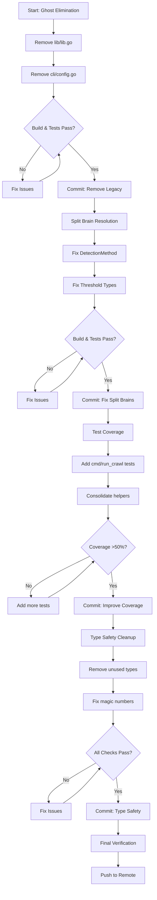

# Comprehensive Architectural Refactoring Plan

**Date:** 2026-03-20  
**Objective:** Eliminate ghost systems, fix split brains, remove legacy code, and establish architectural integrity  
**Target:** Zero legacy code, zero ghost systems, consistent type safety

---

## 🚨 Critical Self-Assessment

### What Did I Forget?
- Initial node_modules feature left uncommitted changes that broke tests
- Didn't verify all files before claiming completion
- Missed that `printer/html.go` was using `strconv` without importing it

### What's Stupid That We Do Anyway?
- Maintaining dual CLI systems (cli/config.go AND cmd/flags.go)
- Keeping `lib/lib.go` with ZERO imports
- Declaring `todos` and `legacy` detection methods that don't work
- Having domain types that nobody uses

### What Could Be Better?
- Type consistency: `int` vs `domain.Threshold` everywhere
- Test coverage: cmd/ at 33%, detection/ at 40%
- Global variables instead of DI
- Magic numbers (15) hardcoded everywhere

### Ghost Systems Found
1. **TODO/Legacy detection** - Implemented but never wired up
2. **cli/config.go** - Duplicate CLI config system
3. **lib/lib.go** - Completely orphaned
4. **pkg/artdupl/** - Duplicates core functionality
5. **--profile flag** - Only shows memory, not real profiling
6. **--timeout flag** - Context created but not enforced

### Split Brains Found
1. **DetectionMethod** - Defined in config AND pkg/artdupl
2. **Threshold** - domain.Threshold exists but int used everywhere
3. **Configuration** - cli.Config, config.Config, pkg/artdupl.Options

---

## 📊 Impact vs Effort Matrix

| Priority | Task | Effort | Impact | Customer Value |
|----------|------|--------|--------|----------------|
| P0 | Remove lib/lib.go (legacy) | 10min | High | Reduces confusion |
| P0 | Remove cli/config.go (ghost) | 30min | High | Eliminates dual CLI |
| P0 | Fix DetectionMethod split brain | 20min | High | Cleaner architecture |
| P1 | Remove todos/legacy detection ghosts | 15min | Medium | Honest feature set |
| P1 | Fix threshold type consistency | 2h | High | Type safety |
| P1 | Add tests for cmd/run_crawl.go | 1h | High | Reliability |
| P2 | Remove unused domain types | 30min | Low | Cleaner code |
| P2 | Fix magic numbers | 45min | Low | Maintainability |
| P2 | Consolidate test helpers | 1h | Medium | Developer velocity |

---

## 🎯 Phase 1: Ghost Elimination (Day 1)

### Task 1.1: Remove lib/lib.go [10min] [P0]
**Why:** Zero imports, legacy code, clear target for elimination  
**Risk:** None - completely orphaned  
**Verification:** `grep -r "lib/" --include="*.go" .` should return nothing

### Task 1.2: Remove cli/config.go [30min] [P0]
**Why:** Dual CLI system causes confusion, uses deprecated flag package  
**Check:** Ensure no imports from cli/ package except runtime.go  
**Verification:** Build succeeds, tests pass

### Task 1.3: Remove todos/legacy detection ghosts [15min] [P1]
**Why:** Methods declared but never work - dishonest to users  
**Action:** Remove from valid methods or implement properly  
**Verification:** `--help` doesn't show broken methods

---

## 🎯 Phase 2: Split Brain Resolution (Day 1-2)

### Task 2.1: Fix DetectionMethod split brain [20min] [P0]
**Current:** Type in config/, alias in pkg/artdupl/  
**Solution:** Remove alias, use config.DetectionMethod directly  
**Files:** pkg/artdupl/types.go

### Task 2.2: Fix Threshold type consistency [2h] [P1]
**Current:** domain.Threshold exists, but int used everywhere  
**Solution:** Migrate core detection to use domain.Threshold  
**Files:** suffixtree/dupl.go, syntax/syntax.go, detection/

---

## 🎯 Phase 3: Test Coverage (Day 2-3)

### Task 3.1: Add tests for cmd/run_crawl.go [1h] [P1]
**Coverage target:** File crawling, path filtering, node_modules exclusion  
**Approach:** Unit tests with temp directories

### Task 3.2: Add tests for detection/todos.go [45min] [P2]
**Note:** Only if we keep it - otherwise skip

### Task 3.3: Consolidate test helpers [1h] [P2]
**Move:** Duplicate helpers to internal/testutil/  
**Files:** cmd/cmd_test.go, detection/detection_test.go

---

## 🎯 Phase 4: Type Safety & Cleanup (Day 3)

### Task 4.1: Remove unused domain types [30min] [P2]
**Candidates:** TokenCount, FileCount, CloneCount if unused  
**Check:** `grep -r "TokenCount" --include="*.go" .`

### Task 4.2: Fix magic numbers [45min] [P2]
**Target:** Threshold default of 15  
**Solution:** const DefaultThreshold = 15 in domain package

---

## 🔄 Execution Flow

---

## 📋 Detailed Task Breakdown (30-100min each)

### Phase 1: Ghost Elimination

#### Task 1.1: Remove lib/lib.go [10min] [P0] [CUSTOMER-VALUE: Low] [ARCHITECTURAL-VALUE: High]
- **Context:** lib/lib.go is completely orphaned with zero imports
- **Steps:**
  1. `rm -rf lib/`
  2. Update any references (there shouldn't be any)
  3. Run tests
  4. Commit
- **Verification:** `grep -r "github.com/LarsArtmann/art-dupl/lib" --include="*.go" .` returns empty
- **Rollback:** `git checkout lib/` if needed

#### Task 1.2: Remove cli/config.go [30min] [P0] [CUSTOMER-VALUE: Medium] [ARCHITECTURAL-VALUE: High]
- **Context:** Dual CLI system - cli/config.go uses deprecated flag package
- **Steps:**
  1. Check if cli/runtime.go imports cli/config.go
  2. If yes, migrate unique functionality to cmd/flags.go
  3. `rm cli/config.go`
  4. Update any imports
  5. Run tests
  6. Commit
- **Verification:** Build succeeds, all tests pass
- **Risk:** May break cli/runtime.go - check imports first

#### Task 1.3: Remove todos/legacy from valid methods [15min] [P1] [CUSTOMER-VALUE: High] [ARCHITECTURAL-VALUE: Medium]
- **Context:** Users can specify `-m todos` but it does nothing
- **Steps:**
  1. Open config/detectionmethod.go
  2. Remove DetectionMethodTodos and DetectionMethodLegacy from validDetectionMethods map
  3. Update comments in DetectionMethod type
  4. Run tests
  5. Commit
- **Verification:** `art-dupl -m todos` returns error "invalid detection method"
- **Alternative:** Actually implement these methods (much more work)

### Phase 2: Split Brain Resolution

#### Task 2.1: Fix DetectionMethod split brain [20min] [P0] [CUSTOMER-VALUE: Low] [ARCHITECTURAL-VALUE: High]
- **Context:** DetectionMethod defined in config/, aliased in pkg/artdupl/
- **Steps:**
  1. Open pkg/artdupl/types.go
  2. Remove `type DetectionMethod = config.DetectionMethod` alias
  3. Remove redundant constants (MethodArtDupl, etc.)
  4. Update all references in pkg/artdupl/ to use config.DetectionMethod
  5. Run tests
  6. Commit
- **Verification:** No type alias exists, code compiles

#### Task 2.2: Begin Threshold type migration [2h] [P1] [CUSTOMER-VALUE: Medium] [ARCHITECTURAL-VALUE: High]
- **Context:** domain.Threshold exists but int used in core detection
- **Steps:**
  1. Identify all `threshold int` parameters in suffixtree/, syntax/, detection/
  2. Change to `threshold domain.Threshold`
  3. Update call sites to pass domain.Threshold
  4. Run tests
  5. Commit
- **Verification:** No `threshold int` remains in core detection logic
- **Risk:** Large change - may need to be split into sub-tasks

### Phase 3: Test Coverage

#### Task 3.1: Add tests for cmd/run_crawl.go [1h] [P1] [CUSTOMER-VALUE: High] [ARCHITECTURAL-VALUE: Medium]
- **Context:** File crawling is core functionality with 0% coverage
- **Steps:**
  1. Create cmd/run_crawl_test.go
  2. Test crawlPaths with temp directories
  3. Test node_modules exclusion
  4. Test vendor exclusion
  5. Run tests
  6. Commit
- **Verification:** Coverage for run_crawl.go > 70%

#### Task 3.2: Consolidate test helpers [1h] [P2] [CUSTOMER-VALUE: Low] [ARCHITECTURAL-VALUE: Medium]
- **Context:** Duplicate test helpers across packages
- **Steps:**
  1. Identify duplicates with `grep -r "func createTest" --include="*_test.go" .`
  2. Move to internal/testutil/helpers.go
  3. Update imports in test files
  4. Run tests
  5. Commit
- **Verification:** No duplicate helper functions remain

### Phase 4: Type Safety & Cleanup

#### Task 4.1: Remove unused domain types [30min] [P2] [CUSTOMER-VALUE: Low] [ARCHITECTURAL-VALUE: Low]
- **Context:** TokenCount, FileCount, CloneCount may be unused
- **Steps:**
  1. Check usage: `grep -r "TokenCount\|FileCount\|CloneCount" --include="*.go" .`
  2. If unused, remove from domain/types_metric.go
  3. Run tests
  4. Commit
- **Verification:** Removed types have zero references

#### Task 4.2: Extract magic numbers [45min] [P2] [CUSTOMER-VALUE: Low] [ARCHITECTURAL-VALUE: Medium]
- **Context:** Threshold default of 15 hardcoded everywhere
- **Steps:**
  1. Add `const DefaultThreshold = 15` to domain package
  2. Replace all literal 15s in config contexts with DefaultThreshold
  3. Run tests
  4. Commit
- **Verification:** `grep -rn "Threshold.*15" --include="*.go" .` shows only const definition

---

## 🎯 Ultra-Detailed Tasks (Max 12min each)

### Phase 1 Ghost Elimination - Micro Tasks

| # | Task | Time | Effort | Impact |
|---|------|------|--------|--------|
| 1.1.1 | Verify lib/lib.go has zero imports | 2min | Low | High |
| 1.1.2 | Delete lib/ directory | 1min | Low | High |
| 1.1.3 | Run tests after lib removal | 3min | Low | High |
| 1.1.4 | Commit lib removal | 2min | Low | High |
| 1.2.1 | Check cli/config.go imports | 3min | Low | High |
| 1.2.2 | Check cli/runtime.go dependencies | 4min | Low | High |
| 1.2.3 | Migrate unique functionality | 10min | Medium | High |
| 1.2.4 | Delete cli/config.go | 1min | Low | High |
| 1.2.5 | Fix any broken imports | 5min | Medium | High |
| 1.2.6 | Run tests | 3min | Low | High |
| 1.2.7 | Commit cli removal | 2min | Low | High |
| 1.3.1 | Open config/detectionmethod.go | 1min | Low | Medium |
| 1.3.2 | Remove todos from valid methods | 2min | Low | Medium |
| 1.3.3 | Remove legacy from valid methods | 2min | Low | Medium |
| 1.3.4 | Update comments | 3min | Low | Medium |
| 1.3.5 | Run tests | 3min | Low | Medium |
| 1.3.6 | Commit changes | 2min | Low | Medium |

### Phase 2 Split Brain Resolution - Micro Tasks

| # | Task | Time | Effort | Impact |
|---|------|------|--------|--------|
| 2.1.1 | Open pkg/artdupl/types.go | 1min | Low | High |
| 2.1.2 | Remove DetectionMethod alias | 2min | Low | High |
| 2.1.3 | Remove redundant constants | 2min | Low | High |
| 2.1.4 | Fix imports in pkg/artdupl/ | 5min | Medium | High |
| 2.1.5 | Run tests | 3min | Low | High |
| 2.1.6 | Commit changes | 2min | Low | High |
| 2.2.1 | Find all threshold int params | 5min | Low | High |
| 2.2.2 | Update suffixtree/dupl.go | 8min | Medium | High |
| 2.2.3 | Update syntax/syntax.go | 8min | Medium | High |
| 2.2.4 | Update detection/ callers | 5min | Medium | High |
| 2.2.5 | Run tests | 3min | Low | High |
| 2.2.6 | Commit changes | 2min | Low | High |

---

## ✅ Success Criteria

- [ ] lib/ directory completely removed
- [ ] cli/config.go removed, no dual CLI system
- [ ] todos/legacy methods no longer appear valid
- [ ] DetectionMethod defined in only one package
- [ ] cmd/run_crawl.go has >70% test coverage
- [ ] No `threshold int` in core detection (use domain.Threshold)
- [ ] All tests pass
- [ ] Build succeeds
- [ ] Zero linting errors (existing issues excepted)

---

## 🔄 Rollback Strategy

For each commit:
1. Keep changes self-contained
2. Test before committing
3. If issues found: `git revert HEAD`
4. Never force push

---

## 📈 Customer Value Summary

| Improvement | Customer Impact |
|-------------|-----------------|
| Remove broken detection methods | Users won't try features that don't work |
| Better test coverage | More reliable tool, fewer bugs |
| Type safety | More stable codebase, fewer crashes |
| Remove legacy code | Smaller binary, faster builds |

**Total Estimated Time:** 8-10 hours across 3 days  
**Risk Level:** Low (incremental, testable changes)  
**Confidence:** High (clear scope, well-defined tasks)
