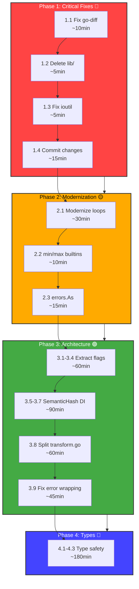

# Architectural Audit & Modernization Plan

**Date:** 2026-03-20 11:44\
**Branch:** fork\
**Status:** Comprehensive audit complete, execution plan ready

---

## Executive Summary

This document outlines a comprehensive architectural audit of the art-dupl codebase, identifying critical issues including ghost systems, split brains, deprecated patterns, and global state abuse. The plan follows Pareto principles (80% value from 20% effort) with tasks sorted by impact vs effort.

**Target:** ZERO legacy code, ZERO ghost systems, ZERO split brains.

---

## Critical Findings

### 1. Ghost Systems 👻

| System         | Location                                    | Status     | Action |
| -------------- | ------------------------------------------- | ---------- | ------ |
| `lib/` package | `/Users/larsartmann/projects/art-dupl/lib/` | **UNUSED** | Delete |

**Details:**

- Files: `lib.go`, `lib_test.go`, `lib_comprehensive_test.go`
- Description: "Golangci-lint altered version of main.go"
- Imports: ZERO from production code (only referenced in old status reports)
- **Safe to delete**: Confirmed no imports

### 2. Split Brains (Duplicate Implementations) 🧠

| Location 1                | Location 2            | Duplication        | Lines      |
| ------------------------- | --------------------- | ------------------ | ---------- |
| `cmd/run_flags.go:28-275` | `cmd/stats.go:85-340` | Flag parsing logic | ~200 lines |

**Specific Duplications:**

1. Config file parsing (lines 29-66 vs 87-102)
2. Semantic/structural flag conflict validation (lines 68-81 vs 104-118)
3. Semantic hash wiring: `golang.SemanticHashEnabled = mergedConfig.Semantic` (line 212 vs 222)
4. Detection methods parsing
5. Pattern filtering setup

### 3. Global State Abuse 🌍

| Variable              | Location                             | Used In        | Severity     |
| --------------------- | ------------------------------------ | -------------- | ------------ |
| `SemanticHashEnabled` | `syntax/golang/identifier_hash.go:6` | 55+ locations  | **CRITICAL** |
| `Default` logger      | `pkg/logger/logger.go:116`           | Test utilities | Medium       |
| `binaryPath`          | `internal/testutil/bdd.go:18`        | Test utilities | Low          |
| `readFileDefault`     | `pkg/artdupl/types.go:147`           | SDK            | Medium       |

### 4. Deprecated Patterns ⚠️

| Pattern                | Location                          | Replacement                 |
| ---------------------- | --------------------------------- | --------------------------- |
| `ioutil.ReadFile`      | `detection/detection_test.go:711` | `os.ReadFile`               |
| Old-style for loops    | 46+ locations                     | `range over int` (Go 1.22+) |
| Manual min calculation | `printer/diff.go:133`             | `min()` builtin             |

### 5. High Complexity Files 🔥

| File                         | Lines | Nolint Count | Complexity            |
| ---------------------------- | ----- | ------------ | --------------------- |
| `printer/html.go`            | 800+  | 26           | nestif:5, ineffassign |
| `syntax/golang/transform.go` | 305   | 1            | gocyclo:37            |
| `cmd/run_flags.go`           | 275   | 5            | gocyclo,funlen        |
| `cmd/stats.go`               | 250   | 2            | gocognit,gocyclo      |
| `config/config_merge.go`     | 147   | 1            | funlen,gocognit       |

### 6. Uncommitted Changes

**Files modified but not committed:**

- `go.mod` / `go.sum` - Missing `github.com/sergi/go-diff/diffmatchpatch` dependency
- `printer/diff_test.go` - 402 lines (word-level diff tests)
- `printer/html.go` - 199 lines (diff view toggle, inline view)
- `printer/html_test.go` - 97 lines (HTML diff tests)

**Status:** These appear to be part of the word-level diff visualization feature that was partially committed.

---

## Execution Plan (30-100min Tasks)

### Phase 1: Critical Fixes (Immediate) 🔴

| # | Task                                 | Effort | Impact   | Customer Value      |
| - | ------------------------------------ | ------ | -------- | ------------------- |
| 1 | Fix missing go-diff dependency       | 10min  | **HIGH** | Unblocks builds     |
| 2 | Delete ghost system `lib/` folder    | 5min   | **HIGH** | Reduces tech debt   |
| 3 | Fix deprecated `ioutil.ReadFile`     | 5min   | MEDIUM   | Future-proofing     |
| 4 | Commit or revert uncommitted changes | 15min  | **HIGH** | Clean working state |

### Phase 2: Modernization (Short-term) 🟡

| # | Task                                    | Effort | Impact | Customer Value  |
| - | --------------------------------------- | ------ | ------ | --------------- |
| 5 | Modernize for loops to `range over int` | 30min  | LOW    | Go 1.22+ idioms |
| 6 | Replace manual min/max with builtins    | 10min  | LOW    | Cleaner code    |
| 7 | Fix errors.As simplification hints      | 15min  | LOW    | Modern Go       |

### Phase 3: Architecture Improvements (Medium-term) 🟢

| #  | Task                                           | Effort | Impact   | Customer Value      |
| -- | ---------------------------------------------- | ------ | -------- | ------------------- |
| 8  | Extract common flag parsing to shared function | 60min  | **HIGH** | Maintainability     |
| 9  | Replace global `SemanticHashEnabled` with DI   | 90min  | **HIGH** | Testability, safety |
| 10 | Split `syntax/golang/transform.go`             | 60min  | MEDIUM   | Maintainability     |
| 11 | Fix error wrapping in `printer/html.go`        | 45min  | MEDIUM   | Error handling      |

### Phase 4: Type Model Improvements (Long-term) 🔵

| #  | Task                                              | Effort | Impact | Customer Value  |
| -- | ------------------------------------------------- | ------ | ------ | --------------- |
| 12 | Refactor `config/config_merge.go` with reflection | 90min  | MEDIUM | Maintainability |
| 13 | Address type safety TODO in `syntax/syntax.go`    | 60min  | MEDIUM | Type safety     |
| 14 | Consolidate domain types validation               | 90min  | MEDIUM | Type safety     |

---

## Detailed 12-Minute Task Breakdown

### Phase 1: Critical Fixes

#### Task 1.1: Fix go-diff dependency (12min)

**File:** `go.mod`

```go
require (
    github.com/sergi/go-diff v1.3.1
)
```

**Verification:** `go build ./...` passes

#### Task 1.2: Delete lib/ folder (5min)

**Command:** `git rm -r lib/`
**Verification:** `grep -r "github.com/LarsArtmann/art-dupl/lib" --include="*.go" .` returns nothing

#### Task 1.3: Fix ioutil.ReadFile (5min)

**File:** `detection/detection_test.go:711`

```go
// Before
content, err := ioutil.ReadFile("test.txt")

// After
content, err := os.ReadFile("test.txt")
```

#### Task 1.4: Commit uncommitted changes (12min)

**Action:** Review and commit diff visualization changes or revert
**Files:** `printer/diff_test.go`, `printer/html.go`, `printer/html_test.go`

### Phase 2: Modernization

#### Task 2.1: Modernize for loops (12min x 4)

**Pattern:**

```go
// Before
for i := 0; i < len(items); i++

// After
for i := range len(items)
```

**Files:** `printer/common.go:123,141`, `syntax/syntax.go:196`, etc.

#### Task 2.2: Replace manual min (5min)

**File:** `printer/diff.go:133`

```go
// Before
if m > n {
    m = n
}

// After
m = min(m, n)
```

#### Task 2.3: Fix errors.As (12min)

**Files:** `errors/types.go:170,186,206`

```go
// Before
var duplErr *DuplError
if errors.As(err, &duplErr)

// After
if duplErr, ok := errors.AsType[*DuplError](err); ok
```

### Phase 3: Architecture

#### Task 3.1: Extract flag parsing - Part 1 (12min)

**New file:** `cmd/flags_common.go`
**Extract:** Config file parsing logic

#### Task 3.2: Extract flag parsing - Part 2 (12min)

**New file:** `cmd/flags_common.go` (cont.)
**Extract:** Semantic/structural validation

#### Task 3.3: Extract flag parsing - Part 3 (12min)

**New file:** `cmd/flags_common.go` (cont.)
**Extract:** Detection methods parsing

#### Task 3.4: Extract flag parsing - Part 4 (12min)

**New file:** `cmd/flags_common.go` (cont.)
**Extract:** Pattern filtering setup
**Verification:** Both `run_flags.go` and `stats.go` use shared functions

#### Task 3.5: Replace SemanticHashEnabled - Part 1 (12min)

**File:** `syntax/golang/identifier_hash.go`

```go
// Add to Config or Context
type HashConfig struct {
    SemanticHashEnabled bool
}
```

#### Task 3.6: Replace SemanticHashEnabled - Part 2 (12min)

**File:** `syntax/golang/transform.go`
**Change:** Pass HashConfig through function chain

#### Task 3.7: Replace SemanticHashEnabled - Part 3 (12min)

**File:** `cmd/run_flags.go`, `cmd/stats.go`
**Change:** Wire HashConfig from CLI flags

### Phase 4: Type Models

#### Task 4.1: Type safety TODO - Part 1 (12min)

**File:** `syntax/syntax.go:131-136`
**Action:** Define domain types for primitives

#### Task 4.2: Type safety TODO - Part 2 (12min)

**File:** `syntax/syntax.go` (cont.)
**Action:** Add validation constructors

#### Task 4.3: Type safety TODO - Part 3 (12min)

**File:** Multiple
**Action:** Migrate call sites

---

## Mermaid.js Execution Graph



---

## Priority Matrix

| Task            | Effort | Impact | Risk   | Priority Score |
| --------------- | ------ | ------ | ------ | -------------- |
| Fix go-diff     | 10min  | HIGH   | Low    | **10.0**       |
| Delete lib/     | 5min   | HIGH   | Low    | **20.0**       |
| Fix ioutil      | 5min   | MEDIUM | Low    | **12.0**       |
| Commit changes  | 15min  | HIGH   | Medium | **6.7**        |
| Extract flags   | 60min  | HIGH   | Medium | **3.3**        |
| SemanticHash DI | 90min  | HIGH   | High   | **2.2**        |
| Modernize loops | 30min  | LOW    | Low    | **1.0**        |
| Split transform | 60min  | MEDIUM | Medium | **2.0**        |
| Fix error wrap  | 45min  | MEDIUM | Low    | **2.7**        |

**Formula:** `Priority = Impact / (Effort * Risk)`

---

## Customer Value Contribution

### Immediate Value (Phase 1)

- **Unblocked builds:** Users can compile the project
- **Reduced confusion:** No ghost code misleading developers
- **Future-proofing:** Deprecated APIs replaced

### Short-term Value (Phase 2)

- **Modern codebase:** Uses latest Go idioms
- **Easier onboarding:** Familiar patterns for Go developers

### Long-term Value (Phase 3-4)

- **Maintainability:** Easier to modify and extend
- **Testability:** Dependency injection enables better testing
- **Type safety:** Fewer runtime errors, more compile-time guarantees

---

## Verification Checklist

After each task:

- [ ] `go build ./...` passes
- [ ] `go test ./...` passes
- [ ] `just check` (lint) passes
- [ ] Changes committed with detailed message
- [ ] No new ghost systems created
- [ ] No new split brains created

Final verification:

- [ ] `lib/` directory deleted
- [ ] No `ioutil` usage in codebase
- [ ] All for loops modernized (where applicable)
- [ ] Common flag extraction complete
- [ ] Global `SemanticHashEnabled` replaced
- [ ] All nolint comments justified or removed

---

## Notes

### Library Leverage Opportunities

| Library                 | Use Case                 | Current Status         |
| ----------------------- | ------------------------ | ---------------------- |
| `samber/lo`             | Functional utilities     | Not used - opportunity |
| `samber/do`             | Dependency injection     | Already used           |
| `samber/mo`             | Monads/Option types      | Not used - evaluate    |
| `knadh/koanf`           | Configuration            | Not used - opportunity |
| `fe3dback/go-arch-lint` | Architecture enforcement | Already configured     |

### Architecture Patterns to Apply

1. **Dependency Injection:** Replace globals with constructor injection
2. **Functional Options:** For configurable constructors
3. **Railway Oriented Programming:** For error handling chains
4. **Domain-Driven Design:** Strong types at boundaries

---

_Generated for art-dupl architectural modernization initiative._
_Assisted-by: Crush via architectural audit protocol_
