# Remove pkg/filter/ Wrapper — Direct gogenfilter Integration

**Date:** 2026-04-15\
**Branch:** fork\
**Status:** Planning

---

## Context

`pkg/filter/` is a 4-file, ~70-line wrapper around `github.com/LarsArtmann/gogenfilter` that:

- Re-exports types via aliases (`Filter`, `FilterOption`, `FilterReason`, `Metrics`, `FilterStats`)
- Re-exports constants (`FilterSQLC`, `FilterTempl`, `FilterGoEnum`, `FilterAll`, etc.)
- Re-exports constructors (`NewFilter`, `NewMetrics`)
- Wraps `FindSQLCConfigs` and `GetSQLOutputDirs` — **downgrading typed errors to plain `error`**
- Hides newer SDK features: `FilterProtobuf`, `FilterMockgen`, `FilterStringer`, `FilterGeneric`
- Is used by 8 consumer files; 1 file (`cmd/stats.go`) already imports gogenfilter directly

**Goal:** Delete `pkg/filter/`, import `gogenfilter` directly, expose all SDK features.

---

## Pareto Analysis

### 1% → 51% of result

- Delete `pkg/filter/` files, update imports in `cmd/` (the core runtime path)
- This makes the tool work with direct gogenfilter

### 4% → 64% of result

- Update all test files (`internal/filtertest/`, `cmd/*_test.go`)
- Fix `sqlc_yaml.go` error handling (restore typed errors)

### 20% → 80% of result

- Expose hidden SDK features (`FilterProtobuf`, `FilterMockgen`, `FilterStringer`)
- Add CLI flags for new filter options
- Update BDD tests for new features
- Remove `replace` directive from go.mod (if gogenfilter is published)

---

## Execution Graph

```mermaid
graph TD
    subgraph Phase1["Phase 1: Core Migration (1% → 51%)"]
        A1["Update cmd/run_analysis.go imports"]
        A2["Update cmd/run_crawl.go imports"]
        A3["Update cmd/util.go imports"]
        A4["Update cmd/stats.go (already direct)"]
        A5["Delete pkg/filter/filter.go"]
        A6["Delete pkg/filter/types.go"]
        A7["Delete pkg/filter/metrics.go"]
        A8["Delete pkg/filter/sqlc_yaml.go"]
    end

    subgraph Phase2["Phase 2: Test Migration (4% → 64%)"]
        B1["Update cmd/cmd_test.go imports"]
        B2["Update cmd/cmd_utils_test.go imports"]
        B3["Update internal/filtertest/assertions.go"]
        B4["Update internal/filtertest/integration_filter_test.go"]
        B5["Update internal/filtertest/user_scenario_test.go"]
        B6["Delete pkg/filter/filter_wrapper_test.go"]
        B7["Fix SQLC config error handling in callers"]
    end

    subgraph Phase3["Phase 3: Feature Unlock (20% → 80%)"]
        C1["Expose FilterProtobuf/Mockgen/Stringer in CLI"]
        C2["Update setupFilter() to support new options"]
        C3["Update config struct for new filter options"]
        C4["Add --filter-protobuf, --filter-mockgen, --filter-stringer flags"]
        C5["Update BDD tests for new filter options"]
        C6["Update AGENTS.md documentation"]
    end

    subgraph Phase4["Phase 4: Cleanup"]
        D1["Run go mod tidy"]
        D2["Run just build + just test"]
        D3["Run just check (lint)"]
        D4["Final verification"]
    end

    Phase1 --> Phase2 --> Phase3 --> Phase4
```

---

## Task Breakdown: Coarse (≤100min each, max 27 tasks)

| #  | Task                                                                                                                                                                                                                                                                                                                             | Impact | Effort | Priority |
| -- | -------------------------------------------------------------------------------------------------------------------------------------------------------------------------------------------------------------------------------------------------------------------------------------------------------------------------------- | ------ | ------ | -------- |
| 1  | Update cmd/run_analysis.go: replace `filter.Filter` → `gogenfilter.Filter`, `filter.FilterOption` → `gogenfilter.FilterOption`, `filter.NewFilter` → `gogenfilter.NewFilter`, `filter.FilterSQLC` → `gogenfilter.FilterSQLC`, `filter.FilterTempl` → `gogenfilter.FilterTempl`, `filter.FilterStats` → `gogenfilter.FilterStats` | HIGH   | 15min  | P0       |
| 2  | Update cmd/run_crawl.go: replace `filter.Filter` → `gogenfilter.Filter`                                                                                                                                                                                                                                                          | HIGH   | 10min  | P0       |
| 3  | Update cmd/util.go: replace `filter.Filter` → `gogenfilter.Filter`, `filter.ShouldFilter` → `gogenfilter.ShouldFilter`                                                                                                                                                                                                           | HIGH   | 10min  | P0       |
| 4  | Update cmd/stats.go: verify already uses `gogenfilter` directly, fix the `"not_filtered"` string literal to use `gogenfilter.ReasonNotFiltered` const                                                                                                                                                                            | MED    | 10min  | P1       |
| 5  | Update internal/filtertest/assertions.go: replace `filter.Filter` → `gogenfilter.Filter`                                                                                                                                                                                                                                         | HIGH   | 10min  | P0       |
| 6  | Update internal/filtertest/integration_filter_test.go: replace all `filter.*` → `gogenfilter.*`                                                                                                                                                                                                                                  | HIGH   | 15min  | P0       |
| 7  | Update internal/filtertest/user_scenario_test.go: replace all `filter.*` → `gogenfilter.*`                                                                                                                                                                                                                                       | HIGH   | 15min  | P0       |
| 8  | Update cmd/cmd_test.go: replace `filter.Filter` → `gogenfilter.Filter`, `filter.NewFilter` → `gogenfilter.NewFilter`                                                                                                                                                                                                             | MED    | 10min  | P1       |
| 9  | Update cmd/cmd_utils_test.go: replace `filter.NewFilter` → `gogenfilter.NewFilter`, `filter.Filter` → `gogenfilter.Filter`                                                                                                                                                                                                       | MED    | 10min  | P1       |
| 10 | Delete pkg/filter/filter.go, pkg/filter/types.go, pkg/filter/metrics.go, pkg/filter/sqlc_yaml.go                                                                                                                                                                                                                                 | HIGH   | 5min   | P0       |
| 11 | Delete pkg/filter/filter_wrapper_test.go                                                                                                                                                                                                                                                                                         | MED    | 2min   | P1       |
| 12 | Restore typed SQLC error handling: callers of FindSQLCConfigs/GetSQLOutputDirs should use `*gogenfilter.SQLCConfigError` instead of plain `error`                                                                                                                                                                                | MED    | 30min  | P2       |
| 13 | Run `go mod tidy` to remove stale pkg/filter references                                                                                                                                                                                                                                                                          | HIGH   | 5min   | P0       |
| 14 | Run `just build` to verify compilation                                                                                                                                                                                                                                                                                           | HIGH   | 5min   | P0       |
| 15 | Run `just test` to verify all tests pass                                                                                                                                                                                                                                                                                         | HIGH   | 10min  | P0       |
| 16 | Expose FilterProtobuf, FilterMockgen, FilterStringer, FilterGeneric in setupFilter() and config                                                                                                                                                                                                                                  | MED    | 30min  | P2       |
| 17 | Add CLI flags: --filter-protobuf, --filter-mockgen, --filter-stringer                                                                                                                                                                                                                                                            | MED    | 30min  | P2       |
| 18 | Update config struct, FlagValues, applyFlagValues for new filter options                                                                                                                                                                                                                                                         | MED    | 30min  | P2       |
| 19 | Update BDD tests for new filter options                                                                                                                                                                                                                                                                                          | MED    | 30min  | P2       |
| 20 | Update AGENTS.md to reflect direct gogenfilter usage                                                                                                                                                                                                                                                                             | LOW    | 15min  | P3       |
| 21 | Run `just check` (lint) to verify no issues                                                                                                                                                                                                                                                                                      | HIGH   | 10min  | P1       |
| 22 | Run `just test-race` for concurrency safety                                                                                                                                                                                                                                                                                      | MED    | 15min  | P2       |
| 23 | Verify replace directive in go.mod — document if still needed                                                                                                                                                                                                                                                                    | LOW    | 5min   | P3       |

---

## Task Breakdown: Fine-grained (≤15min each)

| #  | Task                                                                                                       | Coarse Ref | Est   | Priority |
| -- | ---------------------------------------------------------------------------------------------------------- | ---------- | ----- | -------- |
| 1  | In cmd/run_analysis.go: change import from `pkg/filter` to `gogenfilter`, update all `filter.X` references | T1         | 10min | P0       |
| 2  | In cmd/run_crawl.go: change import, update `filter.Filter` type references                                 | T2         | 5min  | P0       |
| 3  | In cmd/util.go: change import, update `filter.Filter` and `filter.ShouldFilter`                            | T3         | 5min  | P0       |
| 4  | In cmd/stats.go: replace `"not_filtered"` string literal with `gogenfilter.ReasonNotFiltered` comparison   | T4         | 5min  | P1       |
| 5  | In internal/filtertest/assertions.go: change import, update `filter.Filter`                                | T5         | 5min  | P0       |
| 6  | In internal/filtertest/integration_filter_test.go: change import, update all `filter.*` refs               | T6         | 10min | P0       |
| 7  | In internal/filtertest/user_scenario_test.go: change import, update all `filter.*` refs                    | T7         | 10min | P0       |
| 8  | In cmd/cmd_test.go: change import, update `filter.Filter` and `filter.NewFilter`                           | T8         | 5min  | P1       |
| 9  | In cmd/cmd_utils_test.go: change import, update `filter.NewFilter` and `filter.Filter`                     | T9         | 5min  | P1       |
| 10 | Delete file: pkg/filter/filter.go                                                                          | T10        | 1min  | P0       |
| 11 | Delete file: pkg/filter/types.go                                                                           | T10        | 1min  | P0       |
| 12 | Delete file: pkg/filter/metrics.go                                                                         | T10        | 1min  | P0       |
| 13 | Delete file: pkg/filter/sqlc_yaml.go                                                                       | T10        | 1min  | P0       |
| 14 | Delete file: pkg/filter/filter_wrapper_test.go                                                             | T11        | 1min  | P1       |
| 15 | Run `go mod tidy`                                                                                          | T13        | 2min  | P0       |
| 16 | Run `just build` and verify compilation                                                                    | T14        | 3min  | P0       |
| 17 | Run `just test` and verify all tests pass                                                                  | T15        | 5min  | P0       |
| 18 | In config/config.go: add FilterProtobuf, FilterMockgen, FilterStringer bool fields                         | T18        | 5min  | P2       |
| 19 | In cmd/flags.go: add --filter-protobuf, --filter-mockgen, --filter-stringer flags                          | T17        | 5min  | P2       |
| 20 | In cmd/config_builder.go: add fields to FlagValues, extractFlagValues, applyFlagValues                     | T18        | 10min | P2       |
| 21 | In cmd/run_analysis.go setupFilter(): add protobuf/mockgen/stringer filter options                         | T16        | 5min  | P2       |
| 22 | Update BDD test: add scenario for --filter-protobuf flag                                                   | T19        | 10min | P2       |
| 23 | Update BDD test: add scenario for --filter-mockgen flag                                                    | T19        | 10min | P2       |
| 24 | Update BDD test: add scenario for --filter-stringer flag                                                   | T19        | 10min | P2       |
| 25 | Update internal/filtertest: add integration tests for new filter types                                     | T19        | 10min | P2       |
| 26 | Update AGENTS.md: remove pkg/filter/ references, document direct gogenfilter usage                         | T20        | 10min | P3       |
| 27 | Run `just check` (lint) and fix any issues                                                                 | T21        | 5min  | P1       |
| 28 | Run `just test-race`                                                                                       | T22        | 5min  | P2       |
| 29 | Document go.mod replace directive status                                                                   | T23        | 5min  | P3       |
| 30 | Add stats command flags for new filter options (in NewStatsCommand)                                        | T17        | 5min  | P2       |
