# Comprehensive Execution Plan — Ghost System Cleanup & Architecture Hardening

**Date:** 2026-04-15 22:36  
**Branch:** `fork`  
**Base Commit:** `8b3a386`  
**Author Context:** Post-filter-refactoring session. Codebase is clean, build passes, 234/240 BDD tests pass. Now addressing architectural debt before it compounds.

---

## Brutally Honest Self-Assessment

### What did we forget?
We deleted `pkg/filter/` but never updated `FEATURES.md` (last updated 2026-02-12) or `HOW_TO_USE.md` (last updated 2026-02-24) to reflect the new `--include-protobuf`, `--include-mockgen`, `--include-stringer` flags. Users literally cannot discover these features.

### What is something stupid we do?
We have **3,184 lines of dead code** across 6 ghost packages (`git/`, `adapter/`, `migration/`, `pkg/errors/`, `testutils/`, `internal/enum/`) that we compile on every build but never use. That's **17% of our production codebase** (3,184 / 18,963 LOC).

### What could we have done better?
The 18 duplicated flag definitions between `cmd/flags.go` and `cmd/stats.go` is a maintenance nightmare. Every time we add a flag (like we just did with protobuf/mockgen/stringer), we must add it in two places and keep descriptions in sync. We WILL forget eventually.

### What could we still improve?
1. **No `.golangci.yml`** — 21 lint warnings invisible in CI. We're running `golangci-lint` with defaults only.
2. **`build-all` in justfile is broken** — missing `./cmd/art-dupl` source path on cross-compile targets.
3. **`justfile test` runs tests twice** on success (silent then verbose). Wastes developer time.
4. **`debug.Stack()` on every error creation** — expensive in hot paths.
5. **BDD tests run as subprocesses** — zero coverage data for integration paths.

### Did we lie to you?
No. The 6 BDD test failures are genuinely pre-existing (confirmed on clean git state). The `justfile build-all` has been broken since it was written. The ghost packages have accumulated over months of feature development without cleanup.

### How can we be less stupid?
1. **Delete ghost code immediately.** 3,184 lines of dead code is embarrassing.
2. **Extract shared flag registration.** One function, called by both root and stats commands.
3. **Create `.golangci.yml`.** Catch lint issues in CI, not just in IDE.
4. **Fix justfile.** Broken build targets and double-test runs waste everyone's time.

### Are we building ghost systems?
**YES.** Six ghost packages found:

| Ghost Package | Lines | Imported By | Verdict |
|---|---|---|---|
| `pkg/errors/` | 24 | ZERO imports | Delete — duplicates `errors/` |
| `testutils/` | 173 | ZERO imports | Delete — duplicates `internal/testutil/` |
| `internal/enum/` | 684 | ZERO imports | Delete — never adopted |
| `git/` | 1,064 | ZERO non-test imports | Delete — complete disconnected feature |
| `migration/` + `adapter/` | 1,239 | Only each other | Delete — dead chain |

**Total removable: 3,184 lines**

The `git/` package is particularly interesting — it's a complete, well-documented git change detection system that could power incremental analysis. But `job/incremental.go` doesn't use it. It's a ghost that should either be integrated or deleted. **Recommendation: delete for now.** If incremental analysis via git becomes a priority, we can extract it from git history.

### Are we focusing on scope creep?
**Mildly.** The TODO_LIST.md has been growing without shrinking. Items like "Optimize memory layouts for SIMD" and "Implement CSV output via encoding/csv" have been sitting there for months. We should focus on what delivers customer value: fixing tests, updating docs, and cleaning up dead code.

### Did we remove something useful?
No. The `pkg/filter/` removal was correct — it provided negative value. The `git/` package IS useful but is completely disconnected. Deleting it is safe since it's in git history.

### Did we create split brains?
**YES. Four found:**

1. **SB-1: Four Clone Representations** — `domain.Clone` (strong types), `printer.clone` (private primitives), `pkg/artdupl.Clone` (public primitives), `syntax.Node` (int32). The domain type should be canonical.

2. **SB-2: Duplicated Detection Pipelines** — `cmd/run_analysis.go` builds suffix trees directly while `pkg/artdupl/detector_pipeline.go` reimplements the same pipeline. Both should delegate to `detection.MultiDetector`.

3. **SB-3: Duplicated Clone-Info Preparation** — `printer/text.go`, `printer/html.go`, `printer/json.go` each independently convert nodes → read file → extract content. Should be one shared function.

4. **SB-4: SimpleDetector Interface** — Dead interface in `detection/simple_detector.go` that nothing implements.

### How are we doing on tests?
- **234/240 BDD tests pass** (6 pre-existing failures in filter and CLI docs)
- **All unit tests pass**
- **Coverage averages ~75%** (domain 97%, printer 63%, hash 69%)
- **SIMD race condition** pre-existing
- **BDD tests are subprocess-only** — no coverage data for integration paths
- **Missing BDD tests for new filter flags** (protobuf, mockgen, stringer)

**Improvements:**
1. Fix the 6 pre-existing BDD failures
2. Add BDD tests for new filter flags
3. Consider in-process integration tests for coverage data
4. Target >80% coverage on printer and hash packages

---

## Architecture: What's Causing Problems

| Issue | Root Cause | Impact |
|---|---|---|
| 18 duplicated flag definitions | No shared flag registration function | Every new flag requires 2 edits, descriptions drift |
| 3,184 lines dead code | No cleanup discipline | Slower builds, confusing codebase, misleading LOC |
| No `.golangci.yml` | Never created | 21 warnings invisible in CI |
| Broken `build-all` justfile | Missing source path | Cross-compilation impossible |
| `debug.Stack()` on every error | Performance anti-pattern | Unnecessary overhead in hot paths |
| 4 clone representations | No canonical type | Conversion bugs, confusion |
| Duplicated printer preparation | No shared extraction | ~200 lines duplicated |

---

## Execution Plan — 24 Tasks (30-100min each)

Sorted by: Impact × Customer-Value / Effort (highest first)

### Phase 1: Ghost Cleanup (Quick Wins, ~2h total)

| # | Task | Impact | Effort | Time | Customer Value |
|---|------|--------|--------|------|----------------|
| 1 | Delete `pkg/errors/` (24 lines, zero imports) | HIGH | LOW | 5min | Codebase clarity |
| 2 | Delete `testutils/` (173 lines, zero imports) | HIGH | LOW | 5min | Codebase clarity |
| 3 | Delete `internal/enum/` (684 lines, zero imports) | HIGH | LOW | 5min | Codebase clarity |
| 4 | Delete `migration/` + `adapter/` (1,239 lines, only each other) | HIGH | LOW | 10min | Codebase clarity |
| 5 | Delete `git/` (1,064 lines, zero production imports) | HIGH | LOW | 10min | Codebase clarity |
| 6 | Remove ghost package references from AGENTS.md and go.mod comments | MEDIUM | LOW | 10min | Documentation accuracy |
| 7 | Verify build + tests still pass after ghost cleanup | HIGH | LOW | 15min | Confidence |

### Phase 2: Build System & Linting (~1.5h total)

| # | Task | Impact | Effort | Time | Customer Value |
|---|------|--------|--------|------|----------------|
| 8 | Fix `justfile build-all` (add `./cmd/art-dupl` source path) | HIGH | LOW | 5min | Cross-compilation works |
| 9 | Fix `justfile test` double-run (run verbose once, capture output) | MEDIUM | LOW | 10min | Developer time |
| 10 | Create `.golangci.yml` with rules matching IDE diagnostics | HIGH | MEDIUM | 30min | CI catches lint issues |
| 11 | Fix linter warnings in `cmd/config_builder.go` (gocyclo, nlreturn, wsl, gci) | MEDIUM | MEDIUM | 30min | Code quality |
| 12 | Fix remaining linter warnings across codebase | LOW | MEDIUM | 30min | Code quality |

### Phase 3: Flag Deduplication (~1.5h total)

| # | Task | Impact | Effort | Time | Customer Value |
|---|------|--------|--------|------|----------------|
| 13 | Extract `addCommonFlags(cmd *cobra.Command)` from `cmd/flags.go` | HIGH | MEDIUM | 30min | Maintainability |
| 14 | Refactor `cmd/stats.go` to use `addCommonFlags()` | HIGH | LOW | 15min | Maintainability |
| 15 | Verify all flags work identically after deduplication | HIGH | MEDIUM | 30min | Confidence |
| 16 | Delete dead `SimpleDetector` interface in `detection/simple_detector.go` | LOW | LOW | 5min | Code clarity |

### Phase 4: Documentation Updates (~1h total)

| # | Task | Impact | Effort | Time | Customer Value |
|---|------|--------|--------|------|----------------|
| 17 | Update `FEATURES.md` with protobuf/mockgen/stringer filters + all recent features | HIGH | LOW | 20min | Users discover features |
| 18 | Update `HOW_TO_USE.md` with new flags and examples | HIGH | LOW | 20min | Users use features |
| 19 | Update `README.md` with semantic default behavior | MEDIUM | LOW | 10min | First impression |
| 20 | Update `TODO_LIST.md` — mark completed items, add new ones | MEDIUM | LOW | 10min | Planning accuracy |

### Phase 5: Test Quality (~2h total)

| # | Task | Impact | Effort | Time | Customer Value |
|---|------|--------|--------|------|----------------|
| 21 | Investigate and fix 6 pre-existing BDD test failures | HIGH | HIGH | 60min | Test reliability |
| 22 | Add BDD tests for `--include-protobuf`, `--include-mockgen`, `--include-stringer` | HIGH | MEDIUM | 40min | Feature coverage |
| 23 | Add tests for `printer/` package (target 80%+, currently 63.4%) | MEDIUM | HIGH | 60min | Reliability |
| 24 | Create `go.work` file for multi-module development | LOW | LOW | 5min | Developer experience |

---

## Micro-Task Breakdown — 60 Tasks (max 12min each)

Sorted by: Impact × Customer-Value / Effort (highest first)

### Phase 1: Ghost Cleanup (Tasks 1-10)

| # | Task | Time | File(s) |
|---|------|------|---------|
| 1 | `git rm pkg/errors/errors.go` | 2min | `pkg/errors/errors.go` |
| 2 | `git rm testutils/unique.go testutils/unique_test_clean.go` | 2min | `testutils/` |
| 3 | `git rm internal/enum/marshal.go internal/enum/marshal_test.go` | 2min | `internal/enum/` |
| 4 | `git rm migration/migration.go migration/migration_test.go migration/package.go` | 3min | `migration/` |
| 5 | `git rm adapter/adapter.go adapter/printer_adapter.go adapter/printer_adapter_test.go` | 3min | `adapter/` |
| 6 | `git rm git/change_detector.go git/change_detector_test.go git/errors.go git/helpers.go` | 3min | `git/` |
| 7 | Verify `go build ./...` passes | 2min | — |
| 8 | Verify `go test ./...` passes (expect 6 pre-existing BDD failures) | 5min | — |
| 9 | Update AGENTS.md: remove ghost packages from directory tree and descriptions | 5min | `AGENTS.md` |
| 10 | Update go.mod comment: remove reference to nonexistent `domain/domain_types.go` | 2min | `go.mod` |

### Phase 2: Build System & Linting (Tasks 11-20)

| # | Task | Time | File(s) |
|---|------|------|---------|
| 11 | Fix justfile `build-all`: add `./cmd/art-dupl` to each cross-compile line | 3min | `justfile` |
| 12 | Fix justfile `test`: use `go test -v -cover ./...` directly, remove double-run | 5min | `justfile` |
| 13 | Add `go.work` file: `use .` + `use ../gogenfilter` | 2min | `go.work` |
| 14 | Create `.golangci.yml` with gocyclo, wsl, nlreturn, gci, copyloopvar, noinlineerr rules | 10min | `.golangci.yml` |
| 15 | Fix `cmd/config_builder.go` gci formatting issue | 2min | `cmd/config_builder.go` |
| 16 | Fix `cmd/config_builder.go` nlreturn warnings (blank lines before returns) | 5min | `cmd/config_builder.go` |
| 17 | Fix `cmd/config_builder.go` wsl_v5 warnings (whitespace above assigns) | 5min | `cmd/config_builder.go` |
| 18 | Fix `cmd/config_builder.go` noinlineerr warnings | 5min | `cmd/config_builder.go` |
| 19 | Fix `cmd/cmd_test.go` copyloopvar warning | 2min | `cmd/cmd_test.go` |
| 20 | Run `golangci-lint run` and verify warnings reduced | 5min | — |

### Phase 3: Flag Deduplication (Tasks 21-30)

| # | Task | Time | File(s) |
|---|------|------|---------|
| 21 | Create `cmd/common_flags.go` with `addCommonFlags(cmd *cobra.Command)` function | 8min | `cmd/common_flags.go` |
| 22 | Move common flag registrations from `cmd/flags.go` to `addCommonFlags()` | 8min | `cmd/flags.go`, `cmd/common_flags.go` |
| 23 | Update `cmd/flags.go` AddFlags to call `addCommonFlags()` + add root-only flags | 5min | `cmd/flags.go` |
| 24 | Update `cmd/stats.go` NewStatsCommand to call `addCommonFlags()` + add stats-only flags | 5min | `cmd/stats.go` |
| 25 | Verify `go build ./...` passes | 2min | — |
| 26 | Verify all flags still work: `art-dupl --help`, `art-dupl stats --help` | 5min | — |
| 27 | Run `cmd/` tests to verify flag extraction still works | 5min | — |
| 28 | Delete `detection/simple_detector.go` (dead interface) | 2min | `detection/simple_detector.go` |
| 29 | Verify `go test ./detection/` passes | 3min | — |
| 30 | Run full test suite to verify no regressions | 5min | — |

### Phase 4: Documentation (Tasks 31-40)

| # | Task | Time | File(s) |
|---|------|------|---------|
| 31 | Add protobuf/mockgen/stringer to FEATURES.md Smart Filtering table | 5min | `FEATURES.md` |
| 32 | Add protobuf/mockgen/stringer to FEATURES.md CLI Features section | 5min | `FEATURES.md` |
| 33 | Update FEATURES.md "Last Updated" date | 1min | `FEATURES.md` |
| 34 | Add `--include-protobuf`, `--include-mockgen`, `--include-stringer` examples to HOW_TO_USE.md | 8min | `HOW_TO_USE.md` |
| 35 | Add note about default protobuf/mockgen/stringer filtering to HOW_TO_USE.md | 5min | `HOW_TO_USE.md` |
| 36 | Update README.md: semantic detection is ON by default | 5min | `README.md` |
| 37 | Update README.md: add new filter flags to usage examples | 5min | `README.md` |
| 38 | Update TODO_LIST.md: mark completed items, remove ghost cleanup (done) | 5min | `TODO_LIST.md` |
| 39 | Update AGENTS.md: add new filter flags to CLI Usage Patterns section | 5min | `AGENTS.md` |
| 40 | Update AGENTS.md: remove ghost packages from directory tree and import paths | 5min | `AGENTS.md` |

### Phase 5: Test Quality (Tasks 41-50)

| # | Task | Time | File(s) |
|---|------|------|---------|
| 41 | Read failing BDD tests in `bdd/filter_test.go` to understand expected behavior | 10min | `bdd/` |
| 42 | Read failing BDD test `bdd/cli_commands_test.go` (examples in help) | 5min | `bdd/` |
| 43 | Fix BDD: include pattern test (understand `--filter-generated` interaction) | 10min | `bdd/` |
| 44 | Fix BDD: exclude pattern test | 10min | `bdd/` |
| 45 | Fix BDD: combined include/exclude pattern test | 10min | `bdd/` |
| 46 | Fix BDD: sqlc filtering test | 10min | `bdd/` |
| 47 | Fix BDD: CLI documentation examples test | 10min | `bdd/` |
| 48 | Add BDD test for `--include-protobuf` filtering | 10min | `bdd/` |
| 49 | Add BDD test for `--include-mockgen` filtering | 10min | `bdd/` |
| 50 | Add BDD test for `--include-stringer` filtering | 10min | `bdd/` |

### Phase 6: Printer Coverage & Final Verification (Tasks 51-60)

| # | Task | Time | File(s) |
|---|------|------|---------|
| 51 | Add tests for `printer/text.go` uncovered paths | 10min | `printer/` |
| 52 | Add tests for `printer/json.go` uncovered paths (especially LineEnd) | 10min | `printer/` |
| 53 | Add tests for `printer/html.go` uncovered paths | 10min | `printer/` |
| 54 | Run coverage report and verify printer >= 80% | 5min | — |
| 55 | Run full test suite including BDD | 5min | — |
| 56 | Run `golangci-lint run` — verify zero warnings | 3min | — |
| 57 | Run `just build` and verify binary works: `./dist/art-dupl --version` | 2min | — |
| 58 | Run `just build-all` and verify cross-compilation works | 5min | — |
| 59 | Final `git status` review — ensure nothing missed | 2min | — |
| 60 | Update TODO_LIST.md with remaining items and priorities | 5min | `TODO_LIST.md` |

---

## Mermaid.js Execution Graph

```mermaid
graph TD
    subgraph "Phase 1: Ghost Cleanup"
        T1[Task 1: Delete pkg/errors/] --> T2[Task 2: Delete testutils/]
        T2 --> T3[Task 3: Delete internal/enum/]
        T3 --> T4[Task 4: Delete migration/ + adapter/]
        T4 --> T5[Task 5: Delete git/]
        T5 --> T6[Task 6: Verify build]
        T6 --> T7[Task 7: Update AGENTS.md]
        T7 --> T8[Task 8: Update go.mod comment]
        T8 --> G1[COMMIT: ghost-cleanup]
    end

    subgraph "Phase 2: Build System & Linting"
        G1 --> T9[Task 9: Fix justfile build-all]
        T9 --> T10[Task 10: Fix justfile test double-run]
        T10 --> T11[Task 11: Create go.work]
        T11 --> T12[Task 12: Create .golangci.yml]
        T12 --> T13[Task 13-16: Fix config_builder lint warnings]
        T13 --> T14[Task 17: Fix cmd_test copyloopvar]
        T14 --> T15[Task 18: Verify lint passes]
        T15 --> G2[COMMIT: build-lint-fixes]
    end

    subgraph "Phase 3: Flag Deduplication"
        G2 --> T19[Task 19: Create common_flags.go]
        T19 --> T20[Task 20: Refactor flags.go]
        T20 --> T21[Task 21: Refactor stats.go]
        T21 --> T22[Task 22: Verify flag functionality]
        T22 --> T23[Task 23: Delete simple_detector.go]
        T23 --> T24[Task 24: Full test suite]
        T24 --> G3[COMMIT: flag-deduplication]
    end

    subgraph "Phase 4: Documentation"
        G3 --> T25[Task 25: Update FEATURES.md]
        T25 --> T26[Task 26: Update HOW_TO_USE.md]
        T26 --> T27[Task 27: Update README.md]
        T27 --> T28[Task 28: Update TODO_LIST.md + AGENTS.md]
        T28 --> G4[COMMIT: docs-update]
    end

    subgraph "Phase 5: Test Quality"
        G4 --> T29[Task 29: Fix 6 BDD test failures]
        T29 --> T30[Task 30: Add BDD tests for new filters]
        T30 --> G5[COMMIT: test-fixes]
    end

    subgraph "Phase 6: Coverage & Verification"
        G5 --> T31[Task 31: Add printer tests]
        T31 --> T32[Task 32: Full verification]
        T32 --> T33[Task 33: Final TODO_LIST update]
        T33 --> G6[COMMIT: final-verification]
    end

    style G1 fill:#4CAF50,color:#fff
    style G2 fill:#4CAF50,color:#fff
    style G3 fill:#4CAF50,color:#fff
    style G4 fill:#4CAF50,color:#fff
    style G5 fill:#4CAF50,color:#fff
    style G6 fill:#4CAF50,color:#fff
```

---

## Customer Value Mapping

| Phase | Customer Value | How It Helps Users |
|-------|---------------|-------------------|
| Phase 1: Ghost Cleanup | Faster builds, cleaner codebase | Indirect — less confusion, faster CI |
| Phase 2: Build & Lint | Reliable CI, cross-compilation | Users can download pre-built binaries |
| Phase 3: Flag Dedup | Consistent CLI experience | Flags always in sync between commands |
| Phase 4: Documentation | Users discover ALL features | The new protobuf/mockgen/stringer flags are documented |
| Phase 5: Test Quality | Reliable releases | 240/240 BDD tests, no false confidence |
| Phase 6: Coverage | Fewer bugs in output | Printer bugs caught before release |

---

## Risk Assessment

| Risk | Probability | Impact | Mitigation |
|------|-------------|--------|------------|
| Ghost packages imported by code we missed | LOW | MEDIUM | Grep verified zero imports before deletion |
| Flag deduplication changes behavior | LOW | HIGH | Verify `--help` output identical before/after |
| BDD test fixes change intended behavior | MEDIUM | MEDIUM | Read tests carefully, understand intent |
| `.golangci.yml` too strict | MEDIUM | LOW | Start with current warnings, not aspirational rules |

---

## What We Should NOT Do (Scope Guard)

1. **Don't refactor the detection pipeline** (SB-2) — too risky, no customer value right now
2. **Don't unify clone representations** (SB-1) — affects every package, schedule for dedicated session
3. **Don't add new features** — fix what we have first
4. **Don't add dependency injection** — explicitly rejected in earlier analysis
5. **Don't integrate the `git/` package** — delete it, re-implement when needed with current architecture
