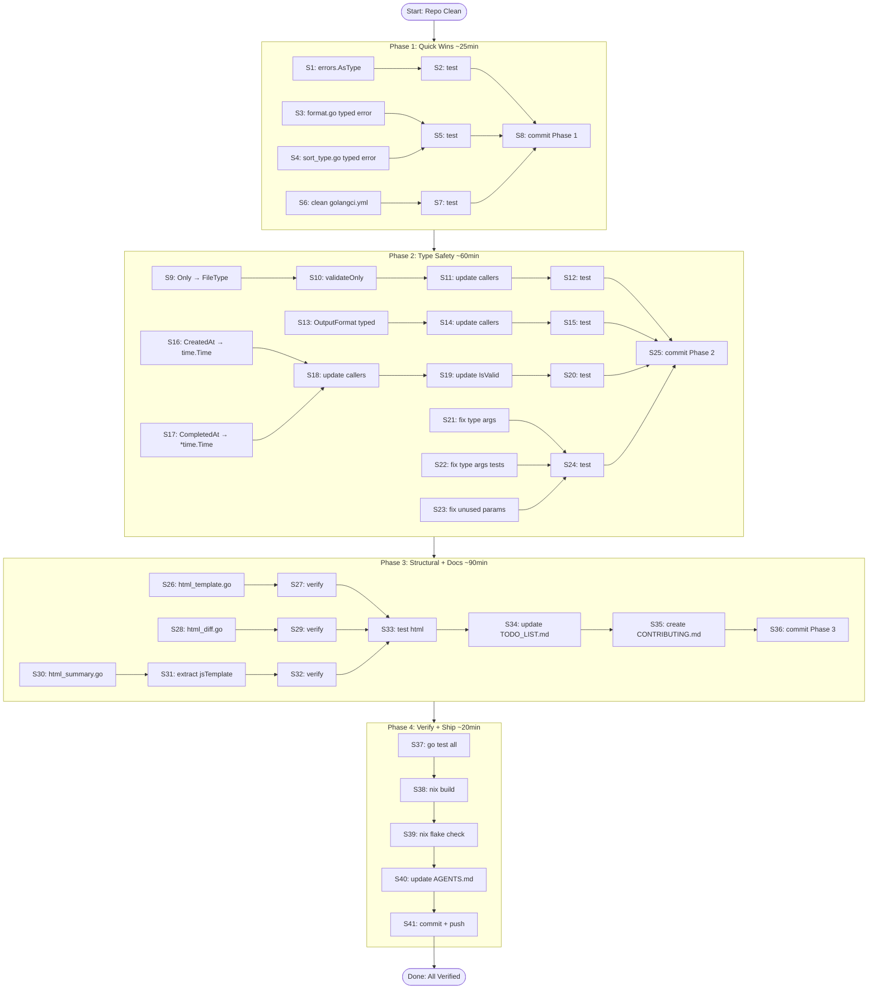

# Execution Plan: Codebase Quality & Type Safety Sprint

**Date:** 2026-04-30 21:39
**Branch:** fork (commit b9e33dc)
**Author:** Crush (GLM-5.1) + Lars

---

## Pareto Analysis

### The 1% that delivers 51% of the result

**Fix the most impactful type safety issues in domain + errors modernization.** These are trivial changes that cascade into better compiler checking across the entire codebase:

- `errors.As` → `errors.AsType` (3 instances, 1 file)
- Fix `//nolint:err113` with typed errors (2 files)
- Clean dead `migration/` rules from `.golangci.yml`

### The 4% that delivers 64% of the result

**Complete the type safety sweep across domain + config.** Use the types we already have:

- `config.Config.Only string` → `config.FileType` (type already exists!)
- `domain.Options.OutputFormat string` → proper typed field
- `domain.Analysis` timestamps → `time.Time`
- Fix LSP hints (unnecessary type args, unused params)

### The 20% that delivers 80% of the result

**Split printer/html.go (1484L → 4 files) + update TODO_LIST.md + create CONTRIBUTING.md.** The html.go split is the single biggest code health improvement. Combined with the documentation updates, this brings the codebase to a professional standard.

---

## Phase 1: Quick Wins (1% → 51%) — ~10 min each

| #  | Task                                              | File(s)                                 | Impact | Effort |
| -- | ------------------------------------------------- | --------------------------------------- | ------ | ------ |
| T1 | Modernize `errors.As` → `errors.AsType`           | errors/types.go                         | Medium | 5min   |
| T2 | Replace `//nolint:err113` with typed errors       | printer/format.go, printer/sort_type.go | Medium | 10min  |
| T3 | Remove dead `migration/` rules from .golangci.yml | .golangci.yml                           | Low    | 5min   |
| T4 | Run tests + verify                                | All                                     | —      | 5min   |

## Phase 2: Type Safety Sweep (4% → 64%) — ~15 min each

| #   | Task                                       | File(s)                      | Impact | Effort |
| --- | ------------------------------------------ | ---------------------------- | ------ | ------ |
| T5  | `config.Config.Only` → `config.FileType`   | config/config.go + callers   | High   | 15min  |
| T6  | `domain.Options.OutputFormat` → typed      | domain/options.go + callers  | High   | 15min  |
| T7  | `domain.Analysis` timestamps → `time.Time` | domain/analysis.go + callers | High   | 15min  |
| T8  | Fix LSP hints: unnecessary type args       | config/, domain/ tests       | Low    | 10min  |
| T9  | Fix LSP hints: unused params in tests      | domain/ tests                | Low    | 5min   |
| T10 | Run tests + verify                         | All                          | —      | 5min   |

## Phase 3: Documentation & Cleanup (20% → 80%) — ~15-30 min each

| #   | Task                                                         | File(s)                            | Impact | Effort |
| --- | ------------------------------------------------------------ | ---------------------------------- | ------ | ------ |
| T11 | Split html.go: extract htmlTemplate const → html_template.go | printer/html.go → html_template.go | High   | 15min  |
| T12 | Split html.go: extract diff functions → html_diff.go         | printer/html.go → html_diff.go     | High   | 15min  |
| T13 | Split html.go: extract summary/footer → html_summary.go      | printer/html.go → html_summary.go  | High   | 15min  |
| T14 | Split html.go: extract JS → const jsTemplate                 | printer/html.go                    | Medium | 10min  |
| T15 | Update TODO_LIST.md with current state                       | TODO_LIST.md                       | Medium | 10min  |
| T16 | Create CONTRIBUTING.md                                       | CONTRIBUTING.md                    | Medium | 15min  |
| T17 | Run tests + verify                                           | All                                | —      | 5min   |

## Phase 4: Polish & Verify

| #   | Task                                              | File(s)   | Impact | Effort |
| --- | ------------------------------------------------- | --------- | ------ | ------ |
| T18 | Run full test suite + nix build + nix flake check | All       | —      | 10min  |
| T19 | Update AGENTS.md with changes made                | AGENTS.md | Low    | 5min   |
| T20 | Final commit + push                               | —         | —      | 5min   |

---

## Detailed Subtask Breakdown (max 15min each)

### Phase 1 Subtasks

| ID | Subtask                                                                                                  | Parent | Est  |
| -- | -------------------------------------------------------------------------------------------------------- | ------ | ---- |
| S1 | Replace 3x `errors.As(err, &duplErr)` with `errors.AsType[*DuplError](err) != nil` in errors/types.go    | T1     | 3min |
| S2 | Run tests                                                                                                | T1     | 2min |
| S3 | In printer/format.go: import errors pkg, replace fmt.Errorf+nolint with errors.NewEnumValidationError    | T2     | 5min |
| S4 | In printer/sort_type.go: import errors pkg, replace fmt.Errorf+nolint with errors.NewEnumValidationError | T2     | 5min |
| S5 | Run tests                                                                                                | T2     | 2min |
| S6 | Remove all 6 `migration/` path exclusion blocks from .golangci.yml                                       | T3     | 3min |
| S7 | Run tests                                                                                                | T3     | 2min |
| S8 | Git commit Phase 1                                                                                       | T4     | 2min |

### Phase 2 Subtasks

| ID  | Subtask                                                                      | Parent | Est   |
| --- | ---------------------------------------------------------------------------- | ------ | ----- |
| S9  | Change `Only string` → `Only FileType` in config/config.go                   | T5     | 2min  |
| S10 | Update validateOnly() to use FileType constants                              | T5     | 5min  |
| S11 | Update all callers of config.Only (grep for `.Only`)                         | T5     | 5min  |
| S12 | Run tests                                                                    | T5     | 3min  |
| S13 | Define domain OutputFormat type (or import from config) in domain/options.go | T6     | 5min  |
| S14 | Update all callers of Options.OutputFormat                                   | T6     | 10min |
| S15 | Run tests                                                                    | T6     | 3min  |
| S16 | Change CreatedAt string → time.Time in domain/analysis.go                    | T7     | 3min  |
| S17 | Change CompletedAt *string → *time.Time                                      | T7     | 2min  |
| S18 | Update IsValid() to use .IsZero()                                            | T7     | 2min  |
| S19 | Update all callers/constructors                                              | T7     | 5min  |
| S20 | Run tests                                                                    | T7     | 3min  |
| S21 | Remove unnecessary type arguments in config/enum_helpers.go                  | T8     | 2min  |
| S22 | Remove unnecessary type arguments in domain tests                            | T8     | 5min  |
| S23 | Fix unused params in domain tests                                            | T9     | 3min  |
| S24 | Run tests                                                                    | T10    | 3min  |
| S25 | Git commit Phase 2                                                           | T10    | 2min  |

### Phase 3 Subtasks

| ID  | Subtask                                                                                                                                                                                     | Parent | Est   |
| --- | ------------------------------------------------------------------------------------------------------------------------------------------------------------------------------------------- | ------ | ----- |
| S26 | Create printer/html_template.go, move `htmlTemplate` const (lines 86-607)                                                                                                                   | T11    | 5min  |
| S27 | Verify compilation                                                                                                                                                                          | T11    | 2min  |
| S28 | Create printer/html_diff.go, move diff functions (writeDiffView, writeDiffViewToggle, writeDiffSelector, writeDiffComparison, writeDiffPanelsWithWordDiff, renderDiffLines, countDiffStats) | T12    | 10min |
| S29 | Verify compilation                                                                                                                                                                          | T12    | 2min  |
| S30 | Create printer/html_summary.go, move (buildSummarySection, orderedCategories, orderedPriorities, PrintFooter)                                                                               | T13    | 10min |
| S31 | Extract inline JS from PrintFooter to const jsTemplate in html_summary.go                                                                                                                   | T14    | 5min  |
| S32 | Verify compilation                                                                                                                                                                          | T13    | 2min  |
| S33 | Run html printer tests                                                                                                                                                                      | T13    | 3min  |
| S34 | Update TODO_LIST.md: remove stale refs, add current items                                                                                                                                   | T15    | 10min |
| S35 | Create CONTRIBUTING.md                                                                                                                                                                      | T16    | 15min |
| S36 | Git commit Phase 3                                                                                                                                                                          | T17    | 2min  |

### Phase 4 Subtasks

| ID  | Subtask                    | Parent | Est  |
| --- | -------------------------- | ------ | ---- |
| S37 | Run go test -count=1 ./... | T18    | 5min |
| S38 | Run nix build              | T18    | 3min |
| S39 | Run nix flake check        | T18    | 5min |
| S40 | Update AGENTS.md           | T19    | 5min |
| S41 | Final commit + push        | T20    | 3min |

---

## Execution Graph



## Risk Mitigation

- **html.go split**: Mechanical file split within same package — no API changes, no import cycle risk
- **Type changes**: Compiler catches all breakage; tests verify behavior
- **Each phase committed separately**: Easy to revert if issues found
- **Tests run after every change**: Catch regressions immediately

## Commands for Verification

```bash
go test -count=1 ./...     # All 24 packages must PASS
go vet ./...                # Must be clean
nix build                   # Must succeed
nix flake check             # Must pass (including test derivation)
```
