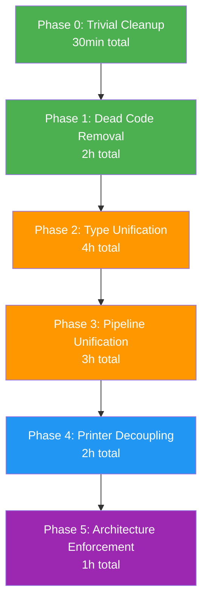
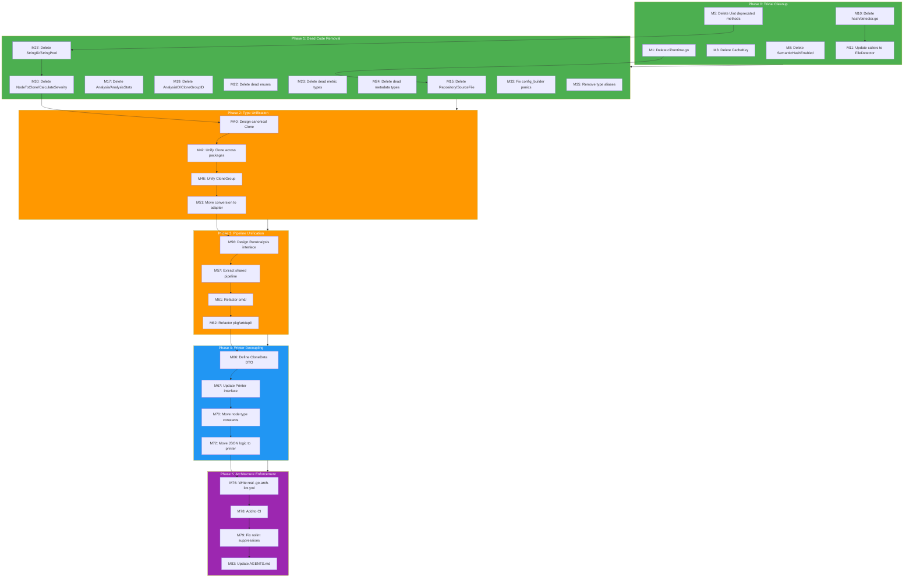

# Architecture Execution Plan: Ghost System Integration & Type Unification

**Date:** 2026-04-30 22:45
**Status:** Planning
**Total Codebase:** ~50,332 lines Go code, 103 test files

---

## Brutal Self-Reflection

### What I Lied About

1. **`domain/` graded "A" for depth** — dishonest. 32 of its exported symbols are NEVER used outside the package. It's a beautifully designed ghost system with zero pipeline integration. The only production consumers are `config/` (Threshold) and `detection/todos.go` (Filepath, LineNumber, CloneSeverity).
2. **Didn't flag `.go-arch-lint.yml`** — it's a **ghost config**. A 348-line enterprise template referencing `internal/domain/entities/**`, `internal/infrastructure/db/**`, `pkg/errors/**` — NONE of which exist in this project. It enforces nothing.
3. **Didn't mention 93 `//nolint` suppressions** — significant code smell being hidden.
4. **Didn't flag `pkg/artdupl/` has zero real consumers** — only `examples/` uses it.
5. **Graded `cli/` without flagging dead code** — `RuntimeConfig`/`ToConfig()` are never called.

### What's Actually Stupid

| # | Stupid Thing | Why It's Stupid |
|---|---|---|
| 1 | **3 Clone types** for the same concept | `domain.Clone`, `artdupl.Clone`, printer's internal `clone` — different fields, no conversion, maximum confusion |
| 2 | **32 dead exports in domain/** | Entire subsystems (Repository, Analysis, StringInternPool, DetectionState, AnalysisMode, FileProcessingState) with zero consumers |
| 3 | **Ghost `.go-arch-lint.yml`** | 348 lines enforcing paths from a DIFFERENT project — provides zero value |
| 4 | **Duplicated pipeline** | `cmd/run_analysis.go` and `pkg/artdupl/detector_pipeline.go` do the same thing independently |
| 5 | **5 deprecated functions still present** | `CacheKey()`, `Uint()` methods, `SemanticHashEnabled` — dead weight |
| 6 | **93 nolint suppressions** | Hiding code smells instead of fixing them |
| 7 | **Dead `cli/runtime.go`** | `RuntimeConfig`/`ToConfig()` — never called by anything |

### Ghost Systems

| Ghost | Size | Value | Decision |
|---|---|---|---|
| `domain/` (32 dead exports) | ~1500 lines of dead code | Types are well-designed but unused | **INTEGRATE** — make pipeline use them |
| `pkg/artdupl/` SDK | ~800 lines | Only examples consume it | **INTEGRATE** — shared pipeline makes SDK real |
| `.go-arch-lint.yml` | 348 lines | Zero — wrong project structure | **REPLACE** with project-specific config |
| `cli/runtime.go` | 66 lines | Zero — never called | **DELETE** |
| Deprecated functions | ~30 lines | Negative — confuses users | **DELETE** |
| `hash/detector.go` | 59 lines | Zero — pure delegation | **DELETE** |

### Split Brains

| Concept | Location 1 | Location 2 | Location 3 |
|---|---|---|---|
| Clone | `domain/clone.go` (typed) | `pkg/artdupl/types.go` (primitive) | `printer/issuer.go` (internal) |
| CloneGroup | `domain/clone.go` (typed) | `pkg/artdupl/types.go` (primitive) | `printer/json.go` (output) |
| Pipeline | `cmd/run_analysis.go` | `pkg/artdupl/detector_pipeline.go` | — |

### Test Assessment

- **103 test files**, 100+ test functions, 54 benchmarks, 2 fuzz tests
- **0 empty tests, 0 skipped tests** — good
- **Domain tests test dead code** — test coverage is inflated by testing types nobody uses
- **No architecture enforcement** — `.go-arch-lint.yml` is a ghost
- **93 nolint suppressions** — lint is configured but widely suppressed

### How This Creates Customer Value

| Change | Customer Value |
|---|---|
| Remove dead code | Faster builds, easier onboarding, less confusion |
| Unify Clone types | Fewer bugs from conversion errors, one source of truth |
| Shared pipeline | SDK actually works correctly, features don't diverge |
| Domain integration | Type safety catches real bugs at compile time |
| Architecture enforcement | Prevents regression, enforces investment |
| Fix nolint suppressions | Real code quality, not hidden debt |

---

## Phase Overview

---

## Execution Plan — Coarse Tasks (30–100 min each)

Sorted by: **Impact × (1 / Effort)** — highest ROI first.

| # | Task | Phase | Impact | Effort | ROI |
|---|---|---|---|---|---|
| 1 | Delete `cli/runtime.go` and `cli/runtime_test.go` — dead code | 0 | Low | 5min | Easy win |
| 2 | Delete deprecated `CacheKey()` from `cache/file_cache.go` | 0 | Low | 5min | Easy win |
| 3 | Delete deprecated `Uint()` methods from `domain/types_file.go` and `types_metadata.go` | 0 | Low | 10min | Easy win |
| 4 | Delete dead `SemanticHashEnabled` var from `syntax/golang/parse_config.go` | 0 | Low | 5min | Easy win |
| 5 | Delete `hash/detector.go` — shallow wrapper; update callers to `FileDetector` | 0 | Medium | 15min | Easy win |
| 6 | Replace `.go-arch-lint.yml` with project-specific config | 0 | High | 45min | High |
| 7 | Remove dead domain exports: `Repository`, `SourceFile`, `Analysis`, `AnalysisStats`, `AnalysisID`, `CloneGroupID` + tests | 1 | Medium | 60min | Medium |
| 8 | Remove dead domain exports: `DetectionState`, `AnalysisMode`, `FileProcessingState`, `FileCount`, `CloneCount`, `ComplexityScore`, `Hash`, `ProcessingTime` + tests | 1 | Medium | 60min | Medium |
| 9 | Remove dead domain exports: `StringID`, `StringInternPool`, `PoolStats`, `GlobalPool`, `SetGlobalPoolForTesting`, `NodeToClone`, `CalculateSeverity` + tests | 1 | High | 90min | Medium |
| 10 | Unify Clone type: decide canonical definition, migrate consumers | 2 | 🔴 High | 90min | High |
| 11 | Unify CloneGroup type: consolidate 3 definitions into 1 | 2 | 🔴 High | 60min | High |
| 12 | Move `domain/conversion.go` to adapter layer (restore domain purity) | 2 | Medium | 45min | Medium |
| 13 | Fix top 20 `exhaustruct` nolint suppressions | 1 | Low | 60min | Low |
| 14 | Extract shared pipeline from `cmd/run_analysis.go` + `pkg/artdupl/detector_pipeline.go` into `detection/` | 3 | 🔴 High | 100min | High |
| 15 | Make `cmd/` thin caller over shared pipeline | 3 | High | 60min | Medium |
| 16 | Make `pkg/artdupl/` thin caller over shared pipeline | 3 | High | 60min | Medium |
| 17 | Introduce printer DTO to decouple from `syntax.Node` | 4 | High | 90min | Medium |
| 18 | Move clone classification constants from `syntax/golang/` to `syntax/` | 4 | Medium | 30min | Medium |
| 19 | Fix `cmd/run_output.go` type assertions — move JSON logic into printer | 4 | Medium | 45min | Medium |
| 20 | Fix `cmd/config_builder.go` panics — return errors properly | 1 | Medium | 30min | Medium |
| 21 | Remove type aliases: `printer.Format`, `artdupl.DetectionMethod`, `artdupl.Logger` | 1 | Low | 45min | Low |
| 22 | Fix remaining nolint suppressions (wrapcheck, gochecknoglobals, etc.) | 5 | Low | 90min | Low |
| 23 | Add architecture enforcement tests via `.go-arch-lint.yml` | 5 | High | 45min | Medium |
| 24 | Update AGENTS.md with architecture decisions from this review | 5 | Medium | 30min | Medium |

---

## Execution Plan — Fine Tasks (max 12 min each)

Sorted by execution order (dependency-aware).

### Phase 0: Trivial Cleanup

| # | Micro-Task | Parent | Est. |
|---|---|---|---|
| 1 | Delete `cli/runtime.go` and `cli/runtime_test.go` | T1 | 2min |
| 2 | Run tests, verify green | T1 | 3min |
| 3 | Delete `CacheKey()` from `cache/file_cache.go:345` | T2 | 2min |
| 4 | Run tests, verify green | T2 | 3min |
| 5 | Delete `LineNumber.Uint()` from `domain/types_file.go:61`; update `config/config.go:227` to use `Uint16()` | T3 | 5min |
| 6 | Delete `BytePosition.Uint()` from `domain/types_file.go:109` | T3 | 2min |
| 7 | Delete `ComplexityScore.Uint()` from `domain/types_metadata.go:86` | T3 | 2min |
| 8 | Delete `SemanticHashEnabled` from `syntax/golang/parse_config.go:59` and its write at L64 | T4 | 3min |
| 9 | Run tests, verify green | T3-T4 | 3min |
| 10 | Delete `hash/detector.go` | T5 | 2min |
| 11 | Update callers: replace `hash.NewHashDetector` with `hash.NewFileDetector` everywhere | T5 | 5min |
| 12 | Update `hash/bdd_test.go` if it references `HashDetector` | T5 | 3min |
| 13 | Run tests, verify green | T5 | 3min |
| 14 | Git commit Phase 0 | — | 2min |

### Phase 1: Dead Code & Cleanup

| # | Micro-Task | Parent | Est. |
|---|---|---|---|
| 15 | Delete `domain/repository.go` (`Repository`, `SourceFile`) | T7 | 2min |
| 16 | Delete associated tests in `domain/` for Repository/SourceFile | T7 | 3min |
| 17 | Delete `domain/analysis.go` (`Analysis`, `AnalysisStats`) | T7 | 2min |
| 18 | Delete associated tests for Analysis/AnalysisStats | T7 | 3min |
| 19 | Delete `domain/types_id.go` (`AnalysisID`, `CloneGroupID`, `NewAnalysisID`, `NewCloneGroupID`) | T7 | 2min |
| 20 | Delete associated tests for AnalysisID/CloneGroupID | T7 | 3min |
| 21 | Run tests, verify green | T7 | 3min |
| 22 | Delete `DetectionState`, `AnalysisMode`, `FileProcessingState` from `domain/types_enums.go` | T8 | 3min |
| 23 | Delete `FileCount`, `CloneCount` from `domain/types_metric.go` | T8 | 2min |
| 24 | Delete `ComplexityScore`, `Hash`, `ProcessingTime` from `domain/types_metadata.go` | T8 | 2min |
| 25 | Delete associated tests for removed types | T8 | 5min |
| 26 | Run tests, verify green | T8 | 3min |
| 27 | Delete `StringID`, `NewStringID` from `domain/stringpool.go` | T9 | 2min |
| 28 | Delete `StringInternPool`, `NewStringInternPool`, `PoolStats` | T9 | 3min |
| 29 | Delete `GlobalPool`, `SetGlobalPoolForTesting` | T9 | 2min |
| 30 | Delete `NodeToClone`, `CalculateSeverity` from `domain/conversion.go` | T9 | 2min |
| 31 | Delete associated tests for stringpool/conversion | T9 | 5min |
| 32 | Run tests, verify green | T9 | 3min |
| 33 | Fix `cmd/config_builder.go:308,325` — replace `panic(err)` with error returns | T20 | 8min |
| 34 | Run tests, verify green | T20 | 3min |
| 35 | Replace type alias `printer.Format` with own type + conversion | T21 | 8min |
| 36 | Replace type alias `artdupl.DetectionMethod` with own type + conversion | T21 | 8min |
| 37 | Replace type alias `artdupl.Logger` with own type + conversion | T21 | 5min |
| 38 | Run tests, verify green | T21 | 3min |
| 39 | Git commit Phase 1 | — | 2min |

### Phase 2: Type Unification

| # | Micro-Task | Parent | Est. |
|---|---|---|---|
| 40 | Decide canonical Clone type location (recommend `domain/clone.go`) | T10 | 5min |
| 41 | Update `domain/Clone` to carry fragment content needed by printer | T10 | 8min |
| 42 | Update `pkg/artdupl/types.go` to use `domain.Clone` | T10 | 8min |
| 43 | Update `printer/issuer.go` to use `domain.Clone` | T10 | 8min |
| 44 | Update all Clone construction sites | T10 | 8min |
| 45 | Run tests, verify green | T10 | 5min |
| 46 | Consolidate CloneGroup: `domain.CloneGroup` becomes canonical | T11 | 5min |
| 47 | Update `pkg/artdupl/types.go` CloneGroup to use domain | T11 | 8min |
| 48 | Update `printer/json.go` CloneGroup to use domain | T11 | 8min |
| 49 | Update all CloneGroup construction sites | T11 | 8min |
| 50 | Run tests, verify green | T11 | 5min |
| 51 | Create `adapter/` package (or `syntax/convert.go`) | T12 | 5min |
| 52 | Move `domain/conversion.go` contents to adapter | T12 | 5min |
| 53 | Update imports across codebase | T12 | 5min |
| 54 | Run tests, verify green | T12 | 3min |
| 55 | Git commit Phase 2 | — | 2min |

### Phase 3: Pipeline Unification

| # | Micro-Task | Parent | Est. |
|---|---|---|---|
| 56 | Design `detection.RunAnalysis(ctx, config, files) → []CloneGroup` interface | T14 | 8min |
| 57 | Extract shared tree-building logic into `detection/pipeline.go` | T14 | 10min |
| 58 | Extract shared detection dispatch into `detection/pipeline.go` | T14 | 10min |
| 59 | Extract shared match collection into `detection/pipeline.go` | T14 | 8min |
| 60 | Write tests for `detection.RunAnalysis` | T14 | 10min |
| 61 | Refactor `cmd/run_analysis.go` to call `detection.RunAnalysis` | T15 | 10min |
| 62 | Refactor `pkg/artdupl/detector_pipeline.go` to call `detection.RunAnalysis` | T16 | 10min |
| 63 | Delete dead code from cmd/ and pkg/artdupl/ | T15-T16 | 5min |
| 64 | Run full test suite, verify green | T14-T16 | 5min |
| 65 | Git commit Phase 3 | — | 2min |

### Phase 4: Printer Decoupling

| # | Micro-Task | Parent | Est. |
|---|---|---|---|
| 66 | Define `printer.CloneData` DTO (filename, start, end, fragment, hash) | T17 | 5min |
| 67 | Update `Printer` interface: `PrintClones(groups []CloneData)` | T17 | 8min |
| 68 | Update all printer implementations (text, html, json, plumbing, sarif, stats) | T17 | 10min |
| 69 | Build conversion `[][]*syntax.Node → []CloneData` in cmd/ or detection/ | T17 | 8min |
| 70 | Move node type constants from `syntax/golang/` to `syntax/` | T18 | 8min |
| 71 | Update `printer/clone_classify.go` to use `syntax/` constants | T18 | 5min |
| 72 | Move JSON output logic from `cmd/run_output.go` into `printer/json.go` | T19 | 8min |
| 73 | Remove type assertions from `cmd/run_output.go` | T19 | 5min |
| 74 | Run tests, verify green | T17-T19 | 5min |
| 75 | Git commit Phase 4 | — | 2min |

### Phase 5: Architecture Enforcement

| # | Micro-Task | Parent | Est. |
|---|---|---|---|
| 76 | Write project-specific `.go-arch-lint.yml` matching actual structure | T6 | 10min |
| 77 | Run `go-arch-lint` and fix initial violations | T6 | 10min |
| 78 | Add `go-arch-lint` to CI pipeline | T23 | 5min |
| 79 | Fix `exhaustruct` nolint suppressions (top 10) | T13 | 10min |
| 80 | Fix `wrapcheck` nolint suppressions | T22 | 10min |
| 81 | Fix `gochecknoglobals` nolint suppressions | T22 | 10min |
| 82 | Run full CI: `just ci` | T22 | 5min |
| 83 | Update `AGENTS.md` with architecture decisions | T24 | 10min |
| 84 | Update `docs/ARCHITECTURE_REVIEW_2026-04-30.md` with reflection additions | T24 | 5min |
| 85 | Git commit Phase 5 | — | 2min |
| 86 | Final `git push` | — | 1min |

---

## Mermaid Execution Graph

---

## Customer Value Map

| Phase | What Changes | Customer Impact |
|---|---|---|
| Phase 0 | Delete 200 lines of dead code | Faster builds, cleaner codebase |
| Phase 1 | Delete ~1500 lines of ghost domain types | Onboarding clarity, no confusion about which types to use |
| Phase 2 | ONE Clone type instead of THREE | Compile-time bug prevention, single source of truth |
| Phase 3 | ONE pipeline instead of TWO | SDK works correctly, features don't diverge, maintenance halved |
| Phase 4 | Printer decoupled from AST | New output formats without touching AST code |
| Phase 5 | Architecture enforcement | Prevents regression, protects investment |

---

## Risk Assessment

| Risk | Mitigation |
|---|---|
| Phase 2 type unification breaks pipeline | Comprehensive test suite exists (103 files); run full CI after each change |
| Phase 3 pipeline extraction is complex | Extract incrementally; keep old code until new path verified |
| Phase 4 printer interface change is wide-reaching | 6 printer implementations to update; do one at a time |
| Removing domain types breaks tests | Domain tests should already be updated/removed in Phase 1 |
| `.go-arch-lint.yml` replacement may flag many violations | Start permissive, tighten gradually |

---

_This plan is informed by the architecture review in `docs/ARCHITECTURE_REVIEW_2026-04-30.md`._
