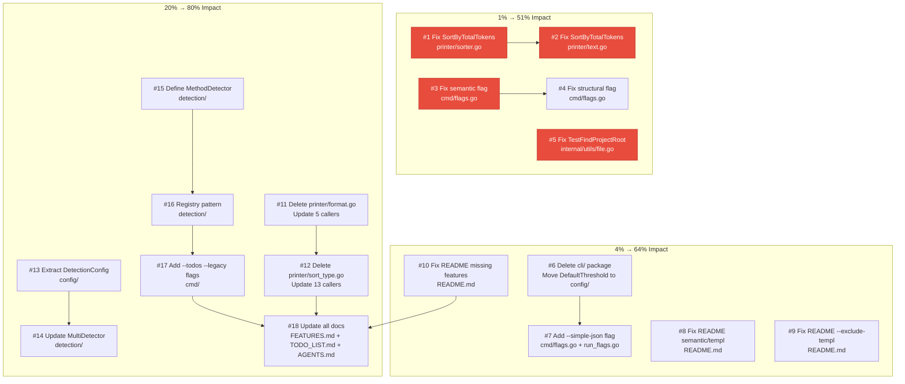

# Execution Plan — 2026-05-03

> **Goal:** Fix critical bugs, eliminate dead code, close feature gaps, update docs.
> **Pareto Principle Applied:**
>
> - **1% effort → 51% result:** Steps 1-4 (critical bugs + dead code)
> - **4% effort → 64% result:** Steps 1-8 (+ feature gaps + docs)
> - **20% effort → 80% result:** Steps 1-18 (+ architecture improvements)

---

## Pareto Breakdown

### 1% effort → 51% result (Critical Fixes)

| # | Task                                    | File(s)                                         | Work  | Impact                            |
| - | --------------------------------------- | ----------------------------------------------- | ----- | --------------------------------- |
| 1 | Fix SortByTotalTokens falls-through bug | `printer/sorter.go:39`, `printer/text.go:221`   | 10min | CRITICAL — sorting is wrong       |
| 2 | Fix semantic flag description           | `cmd/flags.go:47`                               | 5min  | HIGH — user-facing misinformation |
| 3 | Fix TestFindProjectRoot maxDepth        | `internal/utils/file.go:118`                    | 5min  | MEDIUM — pre-existing CI failure  |
| 4 | Delete dead cli/ package                | `cli/`, `cmd/flags.go`, `cmd/config_builder.go` | 15min | LOW — removes confusion           |

### 4% effort → 64% result (Feature Gaps + Docs)

| # | Task                                         | File(s)                            | Work  | Impact                        |
| - | -------------------------------------------- | ---------------------------------- | ----- | ----------------------------- |
| 5 | Add --simple-json CLI flag                   | `cmd/flags.go`, `cmd/run_flags.go` | 10min | MEDIUM — feature inaccessible |
| 6 | Fix README semantic/templ defaults           | `README.md`                        | 20min | HIGH — docs are wrong         |
| 7 | Add missing features to README               | `README.md`                        | 15min | HIGH — SARIF, --only, --diff  |
| 8 | Fix README --include-templ → --exclude-templ | `README.md`                        | 5min  | HIGH — wrong flag name        |

### 20% effort → 80% result (Architecture + Quality)

| #  | Task                                       | File(s)                 | Work  | Impact                             |
| -- | ------------------------------------------ | ----------------------- | ----- | ---------------------------------- |
| 9  | Delete printer/format.go                   | 5 files                 | 15min | MEDIUM — removes indirection       |
| 10 | Delete printer/sort_type.go                | 13 files                | 20min | MEDIUM — removes indirection       |
| 11 | Extract DetectionConfig from config.Config | `config/`, `detection/` | 25min | HIGH — decouples detection         |
| 12 | Define Detector interface in detection/    | `detection/`            | 20min | HIGH — enables pluggable detection |
| 13 | Wire TODO/Legacy detectors to CLI          | `cmd/`, `detection/`    | 15min | MEDIUM — dead code becomes live    |
| 14 | Add --todos and --legacy CLI flags         | `cmd/flags.go`          | 10min | MEDIUM — exposes hidden features   |

---

## Detailed Task Breakdown (15min each, 18 tasks)

| #  | Task                                                | Files Changed                      | Est.  | Status |
| -- | --------------------------------------------------- | ---------------------------------- | ----- | ------ |
| 1  | Fix SortByTotalTokens in sorter.go:39               | `printer/sorter.go`                | 10min | ⬜     |
| 2  | Fix SortByTotalTokens in text.go:221                | `printer/text.go`                  | 10min | ⬜     |
| 3  | Fix semantic flag description                       | `cmd/flags.go`                     | 5min  | ⬜     |
| 4  | Fix structural flag description                     | `cmd/flags.go`                     | 5min  | ⬜     |
| 5  | Fix TestFindProjectRoot maxDepth                    | `internal/utils/file.go`           | 5min  | ⬜     |
| 6  | Move DefaultThreshold to config/, delete cli/       | `config/`, `cmd/`, delete `cli/`   | 15min | ⬜     |
| 7  | Add --simple-json CLI flag                          | `cmd/flags.go`, `cmd/run_flags.go` | 10min | ⬜     |
| 8  | Fix README: semantic default + templ default        | `README.md`                        | 15min | ⬜     |
| 9  | Fix README: --include-templ → --exclude-templ       | `README.md`                        | 5min  | ⬜     |
| 10 | Fix README: add SARIF, --only, --diff, total-tokens | `README.md`                        | 15min | ⬜     |
| 11 | Delete printer/format.go, update callers            | `printer/`, `cmd/`                 | 15min | ⬜     |
| 12 | Delete printer/sort_type.go, update callers         | `printer/`, `cmd/`                 | 20min | ⬜     |
| 13 | Extract DetectionConfig struct                      | `config/`                          | 15min | ⬜     |
| 14 | Update MultiDetector to use DetectionConfig         | `detection/`                       | 10min | ⬜     |
| 15 | Define MethodDetector interface in detection/       | `detection/`                       | 15min | ⬜     |
| 16 | Refactor MultiDetector to use registry              | `detection/`                       | 20min | ⬜     |
| 17 | Add --todos and --legacy CLI flags                  | `cmd/`                             | 10min | ⬜     |
| 18 | Update FEATURES.md + TODO_LIST.md + AGENTS.md       | docs                               | 10min | ⬜     |

---

## Mermaid Execution Graph

