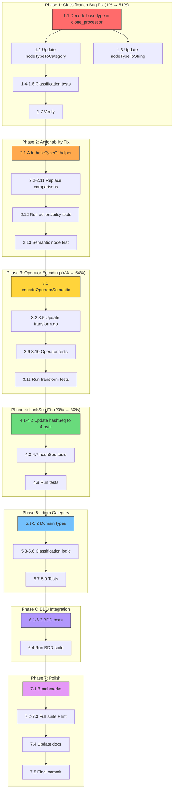

# Semantic Detection Hardening — Pareto Execution Plan

**Date:** 2026-06-09
**Scope:** Fix operator encoding, fix hashSeq truncation, fix classification bug, add idiom category
**Impact:** Directly addresses 88% false positive rate from 2026-06-08 feedback session

---

## Pareto Analysis

### 1% that delivers 51% of the result

**Fix the pre-existing classification bug** — `clone_processor.go:56` passes raw `nstart.Type` (semantic-encoded int32) to `nodeTypeToCategory()` which switches on raw `golang.FuncDecl` (value 25). In semantic mode, `FuncDecl` is `(hash << 8) | 25` which never equals 25. This means **all FuncDecl/Ident/SelectorExpr/TypeSpec clones are classified as `unknown` in semantic mode** — the default mode.

This is a correctness bug, not an improvement. It affects every single user running the default mode.

### 4% that delivers 64% of the result

1% + **Encode operators into semantic types** — BinaryExpr/UnaryExpr/IncDecStmt/AssignStmt all drop operator info. `a + b` and `a - b` are identical tokens. This is the root cause of inverse-condition false positives (Group #5 from feedback). Encoding `token.Token` operators via the same `encodeSemanticType` machinery makes `>=` vs `<` distinct tokens.

### 20% that delivers 80% of the result

4% + **Fix hashSeq truncation** + **Add idiom category** + **Fix actionability comparisons**

- `hashSeq` uses `byte(node.Type)` which truncates the semantic hash to lower 8 bits. Groups semantically different clones together.
- Add `CategoryIdiom` for <5 token clones — direct triage improvement.
- `actionability.go` compares `root.Type == golang.FuncDecl` — will break once operator encoding lands. Route through `DecodeBaseType()` preemptively.

### Remaining 20%

- Test-table pattern detection (CompositeLit multi-clone in same file)
- Semantic mode granularity levels (`--semantic=strict`)
- Cross-reference with existing helpers
- BDD tests for new patterns

---

## Critical Pre-existing Bug Analysis

### Bug: Category classification broken in semantic mode

**Location:** `printer/clone_processor.go:56` → `printer/clone_classify.go:96-117`

**Root cause:** `nstart.Type` is semantic-encoded `(hash << 8) | baseType`. The switch in `nodeTypeToCategory()` compares against raw constants like `golang.FuncDecl = 25`. In semantic mode, no encoded type ever equals the raw constant.

**Affected nodes:** `FuncDecl`, `Ident`, `SelectorExpr`, `TypeSpec`, `Field`, `FuncType` (6 of the most important node types).

**Impact:** Every FuncDecl clone → `unknown` category. Every function/method clone → wrong priority/suggestion. This is the default mode.

**Fix:** Decode before classification: `golang.DecodeBaseType(nstart.Type)`

### Bug: actionability.go will break with operator encoding

**Location:** `printer/actionability.go:59,78,98,113,115,144,170,178,185-186,200,215,222`

**Root cause:** Same pattern — direct `Type == golang.Const` comparisons.

**Fix:** Route all comparisons through `DecodeBaseType()` helper. Create `baseTypeOf(n *syntax.Node) int32` in actionability.go.

### Bug: hashSeq loses semantic info

**Location:** `syntax/hash_simd.go:61` — `buf[i] = byte(node.Type)` truncates to 8 bits.

**Impact:** Hash collisions for grouping — semantically distinct clone groups with same base-type sequence get merged.

**Fix:** Use 4 bytes per node: `binary.LittleEndian.PutUint32(buf[i*4:], uint32(node.Type))`.

---

## Comprehensive Plan — Medium Granularity (30min-100min tasks)

| # | Task | Impact | Effort | Files |
|---|------|--------|--------|-------|
| 1 | **Fix classification: decode base type before category switch** | CRITICAL | 30min | `printer/clone_processor.go`, `printer/clone_classify.go` |
| 2 | **Add baseTypeOf helper to actionability.go** | HIGH | 30min | `printer/actionability.go` |
| 3 | **Add unit tests for classification in semantic mode** | HIGH | 45min | `printer/clone_classify_test.go` |
| 4 | **Encode BinaryExpr operator into Type** | HIGH | 45min | `syntax/golang/transform.go`, `syntax/golang/identifier_hash.go` |
| 5 | **Encode UnaryExpr/IncDecStmt/AssignStmt operators** | HIGH | 45min | `syntax/golang/transform.go` |
| 6 | **Add operator encoding unit tests** | HIGH | 60min | `syntax/golang/identifier_hash_test.go`, `syntax/golang/transform_test.go` |
| 7 | **Fix hashSeq: use 4 bytes per node** | HIGH | 30min | `syntax/hash_simd.go` |
| 8 | **Add hashSeq unit tests (currently zero)** | MEDIUM | 45min | `syntax/hash_test.go` (new) |
| 9 | **Add CategoryIdiom to domain types** | MEDIUM | 15min | `domain/processed_clone.go` |
| 10 | **Add idiom detection to clone_classify.go** | MEDIUM | 30min | `printer/clone_classify.go` |
| 11 | **Wire idiom into HTML display + orderedCategories** | MEDIUM | 15min | `printer/html_summary.go`, `domain/processed_clone.go` |
| 12 | **Update nodeTypeToCategory to use decoded type** | CRITICAL | 15min | `printer/clone_classify.go` |
| 13 | **Add idiom suggestion constant** | LOW | 10min | `printer/clone_classify.go` |
| 14 | **BDD: semantic operator detection test** | MEDIUM | 45min | `bdd/semantic_detection_test.go` |
| 15 | **BDD: idiom classification test** | MEDIUM | 30min | `bdd/` (new or existing) |
| 16 | **Update hashSeq benchmarks for 4-byte encoding** | LOW | 15min | `syntax/hash_bench_test.go` |
| 17 | **Verify all tests pass, fix nix vendorHash** | HIGH | 30min | `flake.nix`, all test files |
| 18 | **Commit with detailed messages + push** | — | 15min | git |
| 19 | **Update AGENTS.md with new patterns** | LOW | 10min | `AGENTS.md` |

---

## Detailed Breakdown — Fine Granularity (max 15min each)

### Phase 1: Fix Classification Bug (1%)

| # | Task | Est | File |
|---|------|-----|------|
| 1.1 | Add `DecodeBaseType` call in `clone_processor.go` before passing to ClassifyClone | 5min | `printer/clone_processor.go` |
| 1.2 | Update `nodeTypeToCategory` to decode input | 5min | `printer/clone_classify.go` |
| 1.3 | Update `nodeTypeToString` to decode input | 5min | `printer/clone_classify.go` |
| 1.4 | Write test: FuncDecl in semantic mode classified as `function` | 10min | `printer/clone_classify_test.go` |
| 1.5 | Write test: SelectorExpr in semantic mode gets correct display name | 10min | `printer/clone_classify_test.go` |
| 1.6 | Write test: Ident in semantic mode classified correctly | 10min | `printer/clone_classify_test.go` |
| 1.7 | Run tests, verify fix | 5min | — |

### Phase 2: Fix Actionability Comparisons

| # | Task | Est | File |
|---|------|-----|------|
| 2.1 | Add `baseTypeOf(n *syntax.Node) int32` helper | 5min | `printer/actionability.go` |
| 2.2 | Replace `root.Type == golang.FuncDecl` with `baseTypeOf(root) == golang.FuncDecl` | 5min | `printer/actionability.go` |
| 2.3 | Replace `child.Type == golang.BlockStmt` with `baseTypeOf(child)` | 5min | `printer/actionability.go` |
| 2.4 | Replace `seq[0].Type != golang.DeferStmt` with `baseTypeOf` | 5min | `printer/actionability.go` |
| 2.5 | Replace all remaining `.Type == golang.*` in actionability.go | 10min | `printer/actionability.go` |
| 2.6 | Replace `child.Type == golang.BinaryExpr` in isErrorOnlyIf | 5min | `printer/actionability.go` |
| 2.7 | Replace `child.Type == golang.Ident` in containsNilIdentifier | 5min | `printer/actionability.go` |
| 2.8 | Replace `child.Type == golang.IfStmt` in isErrorOnlyIf | 5min | `printer/actionability.go` |
| 2.9 | Replace `child.Type == golang.AssignStmt/DeclStmt` | 5min | `printer/actionability.go` |
| 2.10 | Replace `node.Children[0].Type == golang.ReturnStmt` | 5min | `printer/actionability.go` |
| 2.11 | Replace `child.Type == golang.ReturnStmt \|\| golang.CallExpr` | 5min | `printer/actionability.go` |
| 2.12 | Run existing actionability tests, verify no regression | 5min | — |
| 2.13 | Add test: actionability works with semantic-encoded nodes | 10min | `printer/actionability_test.go` |

### Phase 3: Encode Operators (4%)

| # | Task | Est | File |
|---|------|-----|------|
| 3.1 | Add `encodeOperatorSemantic` function to identifier_hash.go | 10min | `syntax/golang/identifier_hash.go` |
| 3.2 | Update `BinaryExpr` case: encode `n.Op.String()` | 5min | `syntax/golang/transform.go` |
| 3.3 | Update `UnaryExpr` case: encode `n.Op.String()` | 5min | `syntax/golang/transform.go` |
| 3.4 | Update `IncDecStmt` case: encode `n.Tok.String()` | 5min | `syntax/golang/transform.go` |
| 3.5 | Update `AssignStmt` case: encode `n.Tok.String()` | 5min | `syntax/golang/transform.go` |
| 3.6 | Write test: `a + b` and `a - b` produce different types in semantic mode | 10min | `syntax/golang/transform_test.go` |
| 3.7 | Write test: `a >= b` and `a < b` produce different types | 10min | `syntax/golang/transform_test.go` |
| 3.8 | Write test: `x++` and `x--` produce different types | 10min | `syntax/golang/transform_test.go` |
| 3.9 | Write test: `x = 1` and `x := 1` produce different types | 10min | `syntax/golang/transform_test.go` |
| 3.10 | Write test: operators are identical in structural mode | 10min | `syntax/golang/transform_test.go` |
| 3.11 | Run all transform tests | 5min | — |

### Phase 4: Fix hashSeq (20%)

| # | Task | Est | File |
|---|------|-----|------|
| 4.1 | Update hashSeq to use 4 bytes per node | 10min | `syntax/hash_simd.go` |
| 4.2 | Update pool allocation to 4x node count | 5min | `syntax/hash_simd.go` |
| 4.3 | Write test: hashSeq produces different hashes for semantically different sequences | 10min | `syntax/hash_test.go` (new) |
| 4.4 | Write test: hashSeq produces same hash for same sequence | 5min | `syntax/hash_test.go` |
| 4.5 | Write test: hashSeq handles empty input | 5min | `syntax/hash_test.go` |
| 4.6 | Write test: hashSeq handles single node | 5min | `syntax/hash_test.go` |
| 4.7 | Write test: hashSeq handles large sequences | 5min | `syntax/hash_test.go` |
| 4.8 | Run all tests | 5min | — |

### Phase 5: Add Idiom Category

| # | Task | Est | File |
|---|------|-----|------|
| 5.1 | Add `CategoryIdiom` constant to domain | 5min | `domain/processed_clone.go` |
| 5.2 | Add idiom emoji to `GetCategoryEmoji()` | 5min | `domain/processed_clone.go` |
| 5.3 | Add idiom detection logic: tokens < 5 → idiom | 10min | `printer/clone_classify.go` |
| 5.4 | Add `suggestIdiom` constant | 5min | `printer/clone_classify.go` |
| 5.5 | Add idiom to `orderedCategories()` | 5min | `printer/html_summary.go` |
| 5.6 | Add idiom to `getSuggestion()` switch | 5min | `printer/clone_classify.go` |
| 5.7 | Write test: tokens=4 classified as idiom | 5min | `printer/clone_classify_test.go` |
| 5.8 | Write test: tokens=5 NOT classified as idiom | 5min | `printer/clone_classify_test.go` |
| 5.9 | Run all tests | 5min | — |

### Phase 6: BDD Integration Tests

| # | Task | Est | File |
|---|------|-----|------|
| 6.1 | BDD: operators produce different clones in semantic mode | 15min | `bdd/semantic_detection_test.go` |
| 6.2 | BDD: inverse conditions NOT reported as clones | 15min | `bdd/semantic_detection_test.go` |
| 6.3 | BDD: idiom category appears in output for <5 tokens | 15min | `bdd/classification_test.go` |
| 6.4 | Run full BDD suite | 5min | — |

### Phase 7: Polish & Verify

| # | Task | Est | File |
|---|------|-----|------|
| 7.1 | Update hashSeq benchmarks for 4-byte encoding | 10min | `syntax/hash_bench_test.go` |
| 7.2 | Run full test suite | 5min | — |
| 7.3 | Run lint check | 5min | — |
| 7.4 | Update AGENTS.md with semantic encoding docs | 10min | `AGENTS.md` |
| 7.5 | Final commit + push | 10min | git |

---

## Execution Graph

---

## Risk Assessment

| Risk | Mitigation |
|------|-----------|
| Operator encoding changes clone detection results | Operators encoded ONLY in semantic mode. Structural mode unchanged. |
| hashSeq 4-byte change affects grouping | Hash is only for grouping, not detection. Detection uses full int32. |
| Actionability breaks | Phase 2 runs BEFORE Phase 3 (operator encoding). baseTypeOf fixes both current + future. |
| Performance regression from 4-byte hashSeq | XXH3 is SIMD-optimized. 4x data is still negligible vs AST parsing. Benchmark to confirm. |
| Test flakiness | All changes are deterministic. No time/network dependencies. |

---

## Files Changed Summary

| File | Change Type |
|------|-------------|
| `syntax/golang/transform.go` | Encode operators for BinaryExpr, UnaryExpr, IncDecStmt, AssignStmt |
| `syntax/golang/identifier_hash.go` | Add operator encoding helper |
| `syntax/hash_simd.go` | 4-byte per node in hashSeq |
| `domain/processed_clone.go` | Add CategoryIdiom + emoji |
| `printer/clone_processor.go` | Decode base type before classification |
| `printer/clone_classify.go` | Use decoded type, add idiom detection |
| `printer/actionability.go` | Route Type comparisons through baseTypeOf |
| `printer/html_summary.go` | Add idiom to orderedCategories |
| New: `syntax/hash_test.go` | hashSeq unit tests |
| `bdd/semantic_detection_test.go` | Operator detection BDD |
