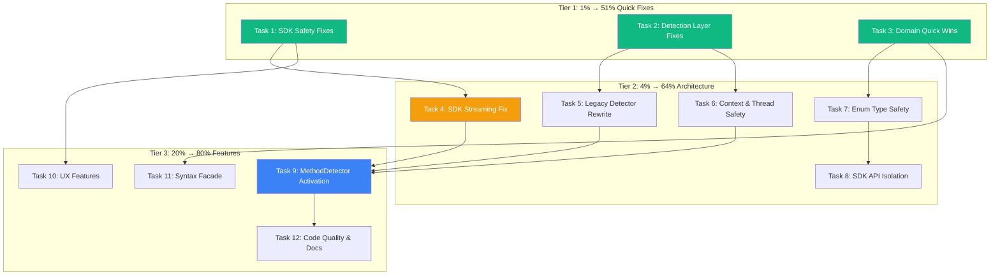

# Comprehensive Execution Plan — art-dupl Full TODO Sprint

**Date:** 2026-06-15
**Status:** Planning → Execution
**Total Open TODOs:** 37 items across HIGH/MEDIUM/LOW

---

## Pareto Breakdown

### The 1% that delivers 51% of the result

These are critical bug fixes and quick wins — each is isolated, safe, and high-impact:

| #  | Task                                                       | Impact                           | Effort |
| -- | ---------------------------------------------------------- | -------------------------------- | ------ |
| 1  | Fix `Clone.IsValid()` StartPos==0 bypass                   | Correctness — validation gap     | 5min   |
| 2  | Wire `ErrNoDuplicatesFound` sentinel in `FindClones`       | API honesty — dead sentinel      | 10min  |
| 3  | Deep-copy `Options` in `NewDetector`                       | Safety — prevents panic          | 15min  |
| 4  | Remove dead `Patterns`/`Imports` fields in `LegacyPattern` | Dead code cleanup                | 5min   |
| 5  | Fix `issue_helpers.go` Frags filter                        | Correctness — broken guard       | 10min  |
| 6  | Fix `.go-arch-lint.yml` sdk/pkg-utils glob overlap         | Config accuracy                  | 5min   |
| 7  | Fix `todo_detector.go:43` silent parse error               | Logging gap                      | 5min   |
| 8  | Document detection method help text                        | UX — missing `todos`/`legacy`    | 5min   |
| 9  | Add `ClonePriority.Rank()` to domain                       | DRY — deduplicates ordinal logic | 10min  |
| 10 | Wire `Actionability` field in `CloneClassification`        | Correctness — always invalid     | 10min  |
| 11 | Move test constants out of `actionability.go`              | Clean code                       | 10min  |

### The 4% that delivers 64% of the result

Architecture and safety improvements that compound:

| #  | Task                                              | Impact                        | Effort |
| -- | ------------------------------------------------- | ----------------------------- | ------ |
| 12 | Fix SDK `FindClonesStream` error handling         | Correctness — silent failure  | 30min  |
| 13 | Fix `legacy_detector.go` string matching          | Correctness — false positives | 30min  |
| 14 | Add `context.Context` to MultiDetector goroutines | Safety — goroutine leak       | 30min  |
| 15 | Document detector thread-safety contract          | Safety docs                   | 10min  |
| 16 | Add JSON validation to 3 domain enums             | Type safety                   | 30min  |
| 17 | Collapse `CloneSeverity` into `ClonePriority`     | Type safety — split-brain     | 45min  |
| 18 | Break SDK type aliases                            | API isolation                 | 30min  |
| 19 | Fix HealthScore legend vs formula                 | UX correctness                | 15min  |
| 20 | Extract `everySequenceMatch` helper               | Code quality — DRY            | 15min  |
| 21 | Extract `validateLocation` helper                 | Code quality — DRY            | 15min  |
| 22 | Create ADR for actionability system               | Documentation                 | 15min  |

### The 20% that delivers 80% of the result

Major architectural improvements:

| #  | Task                                | Impact                               | Effort |
| -- | ----------------------------------- | ------------------------------------ | ------ |
| 23 | Activate `MethodDetector` interface | Composability — polymorphic dispatch | 90min  |
| 24 | Add `--suppress-test-low` flag      | UX feature                           | 30min  |
| 25 | Separate test/production threshold  | UX feature                           | 30min  |
| 26 | Hide `syntax/golang` behind facade  | Modularity — stop leakage            | 60min  |
| 27 | Unify enum patterns                 | Code quality                         | 30min  |

### Deferred (High risk, multi-session)

These require careful planning and would risk destabilizing the system if rushed:

| #   | Task                                     | Why deferred                              |
| --- | ---------------------------------------- | ----------------------------------------- |
| D1  | Introduce ProcessedClone DTO             | 111+ test call sites, deeply coupled      |
| D2  | Consolidate four Clone types             | Depends on D1, massive surface area       |
| D3  | Split `printer/` into sub-packages       | 50 files, import path changes everywhere  |
| D4  | Implement string interning               | Performance optimization, not correctness |
| D5  | Implement hybrid slice/map transitions   | Performance optimization, not correctness |
| D6  | Refactor `transform.go` (369L switch)    | Risk of breaking AST matching             |
| D7  | Add fuzz tests for templ parser          | Testing, not production code              |
| D8  | Add property-based tests for suffix tree | Testing, not production code              |
| D9  | Add `DescribeTable` detection pattern    | Feature enhancement                       |
| D10 | Add builder/callback detection pattern   | Feature enhancement                       |
| D11 | Fix remaining LSP hints                  | Minor, non-blocking                       |

---

## Mermaid Execution Graph

---

## Medium Tasks (30-100min each)

| #   | Task                           | Tier | Items      | Est   | Risk   |
| --- | ------------------------------ | ---- | ---------- | ----- | ------ |
| M1  | SDK Safety & Correctness       | 1    | #1,2,3     | 30min | Low    |
| M2  | Detection Layer Fixes          | 1    | #4,5,6,7,8 | 30min | Low    |
| M3  | Domain Quick Wins              | 1    | #9,10,11   | 30min | Low    |
| M4  | SDK Streaming Error Handling   | 2    | #12,15     | 40min | Medium |
| M5  | Legacy Detector Rewrite        | 2    | #13        | 30min | Medium |
| M6  | MultiDetector Context & Safety | 2    | #14        | 30min | Medium |
| M7  | Domain Enum Type Safety        | 2    | #16,17,19  | 90min | Medium |
| M8  | SDK API Isolation              | 2    | #18        | 30min | Medium |
| M9  | Printer Code Quality           | 2    | #20,21,22  | 45min | Low    |
| M10 | Activate MethodDetector        | 3    | #23        | 90min | High   |
| M11 | UX Features                    | 3    | #24,25     | 60min | Medium |
| M12 | Syntax Facade                  | 3    | #26        | 60min | High   |
| M13 | Enum Unification & Docs        | 3    | #27        | 30min | Low    |

---

## Micro Tasks (max 15min each)

### M1: SDK Safety & Correctness (5 micro tasks)

| #   | Micro Task                                        | File                               | Est   |
| --- | ------------------------------------------------- | ---------------------------------- | ----- |
| 1.1 | Fix `Clone.IsValid()` — remove StartPos==0 bypass | pkg/artdupl/types.go               | 5min  |
| 1.2 | Wire `ErrNoDuplicatesFound` in `FindClones`       | pkg/artdupl/detector_conversion.go | 10min |
| 1.3 | Deep-copy Options slices in `NewDetector`         | pkg/artdupl/detector.go            | 10min |
| 1.4 | Add thread-safety doc comment to Detector         | pkg/artdupl/detector.go            | 5min  |
| 1.5 | Test: verify Clone.IsValid catches StartPos==0    | pkg/artdupl/types_test.go          | 5min  |

### M2: Detection Layer Fixes (7 micro tasks)

| #   | Micro Task                                                                | File                         | Est   |
| --- | ------------------------------------------------------------------------- | ---------------------------- | ----- |
| 2.1 | Remove dead `Patterns` field from `LegacyPattern`                         | detection/legacy_detector.go | 5min  |
| 2.2 | Remove dead `Imports` field from `LegacyPattern`                          | detection/legacy_detector.go | 5min  |
| 2.3 | Fix `createIssueMatch` Frags to use nil instead of empty                  | detection/issue_helpers.go   | 5min  |
| 2.4 | Fix multidetector.go guard to check `len(frags) > 0 && len(frags[0]) > 0` | detection/multidetector.go   | 10min |
| 2.5 | Fix todo_detector.go silent parse error → log Warn                        | detection/todo_detector.go   | 5min  |
| 2.6 | Fix `.go-arch-lint.yml` sdk/pkg-utils glob overlap                        | .go-arch-lint.yml            | 5min  |
| 2.7 | Update CLI `-m` help text to include todos/legacy                         | cmd/flags.go                 | 5min  |

### M3: Domain Quick Wins (5 micro tasks)

| #   | Micro Task                                                          | File                                 | Est   |
| --- | ------------------------------------------------------------------- | ------------------------------------ | ----- |
| 3.1 | Add `ClonePriority.Rank() int` method                               | domain/processed_clone.go            | 10min |
| 3.2 | Replace `priorityScore()` in printer/stats.go with `Rank()`         | printer/stats.go                     | 5min  |
| 3.3 | Replace `priorityHigher()` in printer/html.go with `Rank()`         | printer/html.go                      | 5min  |
| 3.4 | Wire `Actionability` in `ClassifyClone` via `EvaluateActionability` | printer/clone_classify.go            | 10min |
| 3.5 | Move `processOrderMethodName` to test file                          | printer/actionability.go → \_test.go | 5min  |

### M4: SDK Streaming Error Handling (4 micro tasks)

| #   | Micro Task                                               | File                             | Est   |
| --- | -------------------------------------------------------- | -------------------------------- | ----- |
| 4.1 | Add `StreamEvent` type with `CloneGroup` + `Err` fields  | pkg/artdupl/types.go             | 10min |
| 4.2 | Change `FindClonesStream` return to `<-chan StreamEvent` | pkg/artdupl/detector.go          | 10min |
| 4.3 | Emit `StreamEvent{Err: err}` before close in goroutine   | pkg/artdupl/detector_pipeline.go | 10min |
| 4.4 | Update SDK consumers and tests for new signature         | pkg/artdupl/\*\_test.go          | 15min |

### M5: Legacy Detector Rewrite (4 micro tasks)

| #   | Micro Task                                                           | File                         | Est   |
| --- | -------------------------------------------------------------------- | ---------------------------- | ----- |
| 5.1 | Replace `fmt.Sprintf("%v", node)` with AST-aware function name check | detection/legacy_detector.go | 15min |
| 5.2 | Update `findLegacyInFile` to check CallExpr.Fun.Name                 | detection/legacy_detector.go | 10min |
| 5.3 | Fix false positive: `os/exec.CommandContext` not deprecated          | detection/legacy_detector.go | 5min  |
| 5.4 | Test: verify legacy detector doesn't match string literals           | detection/detection_test.go  | 10min |

### M6: MultiDetector Context & Safety (4 micro tasks)

| #   | Micro Task                                                           | File                              | Est   |
| --- | -------------------------------------------------------------------- | --------------------------------- | ----- |
| 6.1 | Add `ctx context.Context` param to `FindDuplOver`                    | detection/multidetector.go        | 10min |
| 6.2 | Add `select { case ch <- match: case <-ctx.Done(): return }` pattern | detection/multidetector.go        | 10min |
| 6.3 | Add ctx to `findIssuesInFile` goroutine                              | detection/issue_helpers.go        | 10min |
| 6.4 | Update all callers of `FindDuplOver` to pass context                 | cmd/run_analysis.go, pkg/artdupl/ | 15min |

### M7: Domain Enum Type Safety (10 micro tasks)

| #    | Micro Task                                                          | File                                           | Est   |
| ---- | ------------------------------------------------------------------- | ---------------------------------------------- | ----- |
| 7.1  | Add `MarshalJSON`/`UnmarshalJSON` to `ClonePriority`                | domain/processed_clone.go                      | 10min |
| 7.2  | Add `MarshalJSON`/`UnmarshalJSON` to `CloneCategory`                | domain/processed_clone.go                      | 10min |
| 7.3  | Add `MarshalJSON`/`UnmarshalJSON` to `CloneActionability`           | domain/processed_clone.go                      | 10min |
| 7.4  | Add `ParseClonePriority(s string) (ClonePriority, error)`           | domain/processed_clone.go                      | 5min  |
| 7.5  | Add `ParseCloneCategory(s string) (CloneCategory, error)`           | domain/processed_clone.go                      | 5min  |
| 7.6  | Add `ParseCloneActionability(s string) (CloneActionability, error)` | domain/processed_clone.go                      | 5min  |
| 7.7  | Replace `CloneSeverity` usages with `ClonePriority`                 | detection/issue_helpers.go, legacy_detector.go | 10min |
| 7.8  | Add `CloneSeverity = ClonePriority` deprecated alias                | domain/types_severity.go                       | 5min  |
| 7.9  | Fix HealthScore legend to match formula                             | printer/stats_formatter.go                     | 10min |
| 7.10 | Test: verify JSON round-trip of all enum types                      | domain/domain_test.go                          | 10min |

### M8: SDK API Isolation (4 micro tasks)

| #   | Micro Task                                              | File                    | Est   |
| --- | ------------------------------------------------------- | ----------------------- | ----- |
| 8.1 | Define `type DetectionMethod string` in SDK (not alias) | pkg/artdupl/types.go    | 10min |
| 8.2 | Define `type Logger interface` in SDK (not alias)       | pkg/artdupl/types.go    | 10min |
| 8.3 | Add conversion functions at SDK boundary                | pkg/artdupl/detector.go | 10min |
| 8.4 | Update SDK error sentinels to be independent            | pkg/artdupl/errors.go   | 10min |

### M9: Printer Code Quality (5 micro tasks)

| #   | Micro Task                                               | File                                            | Est   |
| --- | -------------------------------------------------------- | ----------------------------------------------- | ----- |
| 9.1 | Extract `everySequenceMatch` helper function             | printer/actionability.go                        | 10min |
| 9.2 | Refactor 4 `is*` functions to use `everySequenceMatch`   | printer/actionability.go                        | 10min |
| 9.3 | Refactor `*map[string]bool` output param to return value | printer/actionability.go                        | 15min |
| 9.4 | Extract `validateLocation` helper                        | detection/todo_detector.go + legacy_detector.go | 10min |
| 9.5 | Create ADR for actionability pattern system              | docs/adr/0004-actionability-patterns.md         | 10min |

### M10: Activate MethodDetector (8 micro tasks)

| #    | Micro Task                                                          | File                         | Est   |
| ---- | ------------------------------------------------------------------- | ---------------------------- | ----- |
| 10.1 | Redesign `MethodDetector` interface with `Detect(ctx) <-chan Match` | detection/detector.go        | 10min |
| 10.2 | Create `SuffixTreeDetector` adapter                                 | detection/multidetector.go   | 15min |
| 10.3 | Create `HashDetector` adapter wrapping `hash.NewFileDetector`       | detection/multidetector.go   | 10min |
| 10.4 | Create `TodoDetectorAdapter` satisfying interface                   | detection/todo_detector.go   | 10min |
| 10.5 | Create `LegacyDetectorAdapter` satisfying interface                 | detection/legacy_detector.go | 10min |
| 10.6 | Refactor `MultiDetector` to hold `[]MethodDetector`                 | detection/multidetector.go   | 15min |
| 10.7 | Replace if-chain with loop dispatch                                 | detection/multidetector.go   | 10min |
| 10.8 | Test: verify all 4 methods still work through interface             | detection/detection_test.go  | 15min |

### M11: UX Features (5 micro tasks)

| #    | Micro Task                                                    | File              | Est   |
| ---- | ------------------------------------------------------------- | ----------------- | ----- |
| 11.1 | Add `SuppressTestLow bool` to `config.Config`                 | config/config.go  | 5min  |
| 11.2 | Add `--suppress-test-low` CLI flag                            | cmd/flags.go      | 5min  |
| 11.3 | Implement suppression logic in clone filtering                | cmd/run_output.go | 10min |
| 11.4 | Add `TestThreshold int` to config for test-specific threshold | config/config.go  | 5min  |
| 11.5 | Add `--test-threshold` CLI flag                               | cmd/flags.go      | 5min  |

### M12: Syntax Facade (6 micro tasks)

| #    | Micro Task                                                           | File                                         | Est   |
| ---- | -------------------------------------------------------------------- | -------------------------------------------- | ----- |
| 12.1 | Export `DecodeBaseType(nodeType int32) int32` through syntax package | syntax/syntax.go                             | 10min |
| 12.2 | Export node-type query functions through syntax facade               | syntax/syntax.go                             | 10min |
| 12.3 | Update printer/ imports from syntax/golang → syntax                  | printer/clone_processor.go, actionability.go | 10min |
| 12.4 | Update job/ imports from syntax/golang → syntax                      | job/file_parser.go                           | 5min  |
| 12.5 | Update detection/ imports from syntax/golang → syntax                | detection/multidetector.go                   | 5min  |
| 12.6 | Update pkg/artdupl/ imports from syntax/golang → syntax              | pkg/artdupl/detector_conversion.go           | 5min  |

### M13: Enum Unification & Docs (3 micro tasks)

| #    | Micro Task                                                   | File                      | Est   |
| ---- | ------------------------------------------------------------ | ------------------------- | ----- |
| 13.1 | Move domain enum IsValid/Parse to use config generic helpers | domain/processed_clone.go | 10min |
| 13.2 | Update TODO_LIST.md with completion status                   | TODO_LIST.md              | 5min  |
| 13.3 | Update FEATURES.md with new features                         | FEATURES.md               | 5min  |

---

## Total Micro Task Count: 70

| Tier                        | Tasks                           | Est Time      |
| --------------------------- | ------------------------------- | ------------- |
| Tier 1 (Quick fixes)        | 17                              | ~100min       |
| Tier 2 (Architecture)       | 22                              | ~200min       |
| Tier 3 (Features/Refactors) | 27                              | ~180min       |
| Deferred                    | 11                              | Multi-session |
| **TOTAL**                   | **70 actionable + 11 deferred** | **~8h**       |
