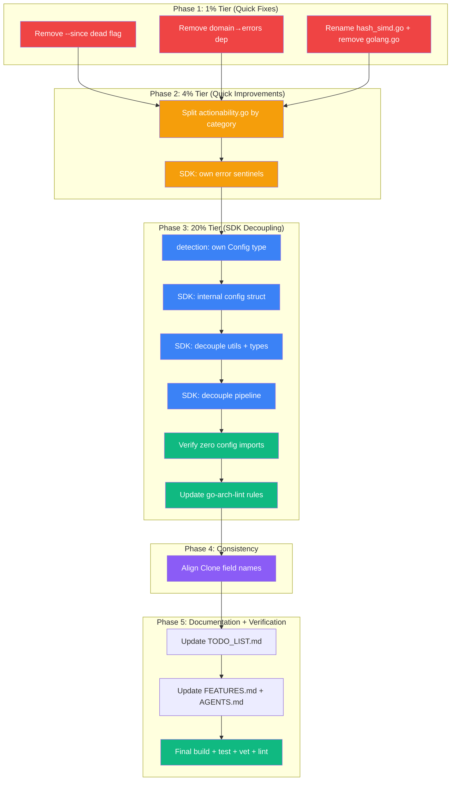

# Superb TODO Execution Plan — Architecture Hardening Sprint

**Date:** 2026-06-20
**Branch:** `fork`
**Source:** TODO_LIST.md + 2026-06-20 review session findings (8 skills)
**Status:** ACTIVE — executing now

---

## Context

The 2026-06-20 review session (features-audit, todo-list-builder, full-code-review,
naming-review, data-model-review, architecture-review, architecture-visualization,
go-modularize) produced **11 open TODOs** across 3 priority tiers. This plan breaks
them into actionable, verifiable tasks and executes them.

### Current State (verified before planning)

- **Build:** `go build ./...` clean
- **Tests:** 22 packages pass
- **Vet:** `go vet ./...` clean
- **Lint:** 0 golangci-lint issues
- **Architecture:** acyclic import graph, 12 packages
- **Pre-existing fixes:** 4 bugs already fixed and committed (JSON injection, slice
  panic, misleading CLI errors)

### What's NOT in Scope (blocked or deferred with rationale)

| Item                                  | Status       | Reason                                                                                                                                     |
| ------------------------------------- | ------------ | ------------------------------------------------------------------------------------------------------------------------------------------ |
| Hide `syntax/golang` behind facade    | **BLOCKED**  | Import cycle: `syntax/golang` imports `syntax` for `Node` type. Requires moving `Node` to a shared package first — multi-session refactor. |
| Consolidate five Clone types into one | **DEFERRED** | 5 types across 3 packages with divergent field names/types. Risk of breaking JSON/SARIF output. Needs design session first.                |
| Split `printer/` into sub-packages    | **DEFERRED** | 29 files / ~5400 lines. Import path changes affect all consumers. High risk of circular deps. Needs dedicated session.                     |
| Branded types (Filepath, LineNumber)  | **DEFERRED** | ~80 consumer sites across 8 packages. Mechanical but error-prone. Better as follow-up after Clone consolidation.                           |
| Hybrid slice/map transition storage   | **DEFERRED** | Map is already O(1). Diminishing returns.                                                                                                  |
| `internal/engine` facade              | **DEFERRED** | Valuable (reduces SDK from 7 deps to 1) but large (2-4h). Better as standalone follow-up after SDK decoupling stabilizes.                  |

---

## Pareto Breakdown

### 1% effort → 51% result (Micro-fixes: honesty + correctness)

These 4 changes take ~25 minutes total and eliminate a dead user-facing flag, an
architecture violation, a lying filename, and dead code:

| #   | Task                                                            | Time  | Impact                  |
| --- | --------------------------------------------------------------- | ----- | ----------------------- |
| 1   | Remove `--since` dead flag (flag never read by any code)        | 15min | User-facing correctness |
| 2   | Remove `domain/` → `errors/` dependency (6 call sites → stdlib) | 5min  | Architecture purity     |
| 3   | Rename `syntax/hash_simd.go` → `hash_seq.go` (no SIMD inside)   | 2min  | Naming honesty          |
| 4   | Remove empty `syntax/golang/golang.go` anchor file              | 3min  | Dead code removal       |

### 4% effort → 64% result (Quick improvements)

| #   | Task                                                          | Time  | Impact           |
| --- | ------------------------------------------------------------- | ----- | ---------------- |
| 5   | Split `printer/actionability.go` by category (624L → 4 files) | 30min | Maintainability  |
| 6   | SDK: define own error sentinels (decouple from `config.Err*`) | 15min | SDK independence |

### 20% effort → 80% result (Architecture refactors)

| #   | Task                                                                    | Time  | Impact           |
| --- | ----------------------------------------------------------------------- | ----- | ---------------- |
| 7   | `detection`: own `Config` type (decouple from `config.DetectionConfig`) | 45min | Clean boundaries |
| 8   | SDK: own internal config struct (decouple `detector.go`)                | 45min | SDK independence |
| 9   | SDK: decouple `detector_utils.go` + `types.go` from `config`            | 30min | SDK independence |
| 10  | SDK: decouple `detector_pipeline.go` (last config import)               | 30min | SDK independence |
| 11  | Align Clone field names: `StartLine`→`LineStart` (canonical)            | 30min | Consistency      |
| 12  | Update `go-arch-lint`: remove `sdk→config` dependency rule              | 10min | Enforcement      |

### Remaining 80% effort → 20% result (Deferred — see table above)

---

## Medium-Granularity Plan (15 tasks, 30-100 min each)

Sorted by impact/effort ratio (highest first).

| ID  | Task                                                             | Tier | Est   | Impact   | Effort | Status |
| --- | ---------------------------------------------------------------- | ---- | ----- | -------- | ------ | ------ |
| M01 | Remove `--since` dead flag + update all docs (5 files)           | 1%   | 20min | Critical | Low    | ⏳     |
| M02 | Remove `domain/` → `errors/` leaf violation                      | 1%   | 10min | High     | Low    | ⏳     |
| M03 | Rename `hash_simd.go` + remove `golang.go` anchor                | 1%   | 10min | Medium   | Low    | ⏳     |
| M04 | Split `actionability.go` into 4 category files                   | 4%   | 30min | Medium   | Medium | ⏳     |
| M05 | SDK: define own error sentinels in `errors.go`                   | 4%   | 15min | High     | Low    | ⏳     |
| M06 | `detection`: define own `Config` type, accept `[]string` methods | 20%  | 45min | High     | Medium | ⏳     |
| M07 | SDK: internal config struct replacing `*config.Config`           | 20%  | 45min | High     | Medium | ⏳     |
| M08 | SDK: decouple `detector_utils.go` + `types.go`                   | 20%  | 30min | High     | Medium | ⏳     |
| M09 | SDK: decouple `detector_pipeline.go` (final config removal)      | 20%  | 30min | High     | Medium | ⏳     |
| M10 | Verify SDK has zero `config` imports + go-arch-lint green        | 20%  | 10min | Critical | Low    | ⏳     |
| M11 | Update `.go-arch-lint.yml`: remove `config` from sdk deps        | 20%  | 10min | Medium   | Low    | ⏳     |
| M12 | Align Clone field names (`StartLine`→`LineStart` canonical)      | 20%  | 30min | Medium   | Medium | ⏳     |
| M13 | Update `TODO_LIST.md` with completed/blocked status              | 4%   | 15min | Low      | Low    | ⏳     |
| M14 | Update `FEATURES.md` + `AGENTS.md`                               | 4%   | 15min | Low      | Low    | ⏳     |
| M15 | Full verification: build + test + vet + arch-lint                | 1%   | 15min | Critical | Low    | ⏳     |

---

## Fine-Granularity Plan (76 tasks, max 15 min each)

### M01: Remove `--since` dead flag (10 tasks)

| Sub-ID | Task                                                           | Est  |
| ------ | -------------------------------------------------------------- | ---- |
| M01.1  | Remove `Since` field + comment from `config/config.go:113-116` | 2min |
| M01.2  | Remove `Since: ""` default from `config/config.go:190`         | 1min |
| M01.3  | Remove flag registration from `cmd/flags.go:85-86`             | 2min |
| M01.4  | Remove flag-read block from `cmd/config_builder.go:147-150`    | 2min |
| M01.5  | Remove `"since"` from `cmd/cmd_test.go:280` expected flags     | 1min |
| M01.6  | Remove `--since` row from `README.md:164`                      | 2min |
| M01.7  | Update `FEATURES.md`: Git-Aware Incremental → removed          | 2min |
| M01.8  | Update `AGENTS.md`: remove `--since` dead flag entry           | 1min |
| M01.9  | Build + test + verify                                          | 2min |

### M02: Remove `domain/` → `errors/` dependency (7 tasks)

| Sub-ID | Task                                                                                                  | Est  |
| ------ | ----------------------------------------------------------------------------------------------------- | ---- |
| M02.1  | Replace `errors.NewValidationError(msg, nil)` → `errors.New(msg)` in `domain/types_file.go` (4 sites) | 3min |
| M02.2  | Replace `errors.NewValidationError(msg, nil)` → `errors.New(msg)` in `domain/helpers.go` (2 sites)    | 3min |
| M02.3  | Update imports in both files: `duplerrors` → stdlib `errors`                                          | 2min |
| M02.4  | Build + test + verify                                                                                 | 2min |

### M03: Rename + remove dead files (5 tasks)

| Sub-ID | Task                                              | Est  |
| ------ | ------------------------------------------------- | ---- |
| M03.1  | `git mv syntax/hash_simd.go syntax/hash_seq.go`   | 1min |
| M03.2  | Read `syntax/golang/golang.go` + `doc.go`         | 2min |
| M03.3  | Merge `golang.go` comment into `doc.go` if needed | 2min |
| M03.4  | `git rm syntax/golang/golang.go`                  | 1min |
| M03.5  | Build + test + verify                             | 2min |

### M04: Split `actionability.go` by category (8 tasks)

| Sub-ID | Task                                                                       | Est  |
| ------ | -------------------------------------------------------------------------- | ---- |
| M04.1  | Create `printer/actionability_test_patterns.go` (test-related patterns)    | 5min |
| M04.2  | Move patterns 5-7,9 (test data, table-driven, scaffolding, describe-table) | 5min |
| M04.3  | Create `printer/actionability_control_flow.go` (defer + error patterns)    | 5min |
| M04.4  | Move patterns 3-4 (RAII defer, error propagation)                          | 5min |
| M04.5  | Create `printer/actionability_data.go` (data + builder patterns)           | 5min |
| M04.6  | Move patterns 8,10-11 (data dominated, builder callback, shared helper)    | 5min |
| M04.7  | Trim `actionability.go` to public API + dispatcher + base helpers          | 5min |
| M04.8  | Build + test + verify                                                      | 5min |

### M05: SDK own error sentinels (5 tasks)

| Sub-ID | Task                                                                                        | Est  |
| ------ | ------------------------------------------------------------------------------------------- | ---- |
| M05.1  | Read `pkg/artdupl/errors.go` + `detector_utils.go` ValidateOptions                          | 3min |
| M05.2  | Define `ErrInvalidThreshold` + `ErrThresholdTooLarge` as SDK-owned `errors.New()` sentinels | 3min |
| M05.3  | Update `ValidateOptions` to use SDK errors instead of config re-exports                     | 3min |
| M05.4  | Remove `config` import from `errors.go`                                                     | 2min |
| M05.5  | Build + test + verify                                                                       | 4min |

### M06: `detection` own Config type (7 tasks)

| Sub-ID | Task                                                                 | Est  |
| ------ | -------------------------------------------------------------------- | ---- |
| M06.1  | Define `detection.Config { Methods []string; Verbose bool }`         | 3min |
| M06.2  | Change `NewMultiDetector` to accept `detection.Config`               | 5min |
| M06.3  | Update `adapters.go`: use `slices.Contains(cfg.Methods, "art-dupl")` | 5min |
| M06.4  | Update `multidetector.go`: `detCfg` → `cfg` field rename             | 5min |
| M06.5  | Remove `config` import from detection package                        | 2min |
| M06.6  | Update `cmd/` callers to pass `detection.Config`                     | 5min |
| M06.7  | Build + test + verify                                                | 5min |

### M07: SDK internal config struct (6 tasks)

| Sub-ID | Task                                                                                                               | Est   |
| ------ | ------------------------------------------------------------------------------------------------------------------ | ----- |
| M07.1  | Define `pkg/artdupl` unexported `detectorConfig` struct (Semantic, Threshold, Methods, IncludeVendor, IgnoreFiles) | 5min  |
| M07.2  | Replace `config *config.Config` field with `cfg *detectorConfig` in `detector.go`                                  | 5min  |
| M07.3  | Update `NewDetector` to build `detectorConfig` from `Options`                                                      | 10min |
| M07.4  | Update all `d.config.*` → `d.cfg.*` accesses in `detector.go`                                                      | 5min  |
| M07.5  | Remove `config` import from `detector.go`                                                                          | 2min  |
| M07.6  | Build + fix compilation errors iteratively                                                                         | 10min |

### M08: SDK decouple `detector_utils.go` + `types.go` (6 tasks)

| Sub-ID | Task                                                                                 | Est   |
| ------ | ------------------------------------------------------------------------------------ | ----- |
| M08.1  | Update `convertOptionsToConfig` to build `detectorConfig` instead of `config.Config` | 10min |
| M08.2  | Remove `config.DefaultConfig()` usage from `detector_utils.go`                       | 5min  |
| M08.3  | Remove `config` import from `detector_utils.go`                                      | 2min  |
| M08.4  | Update `types.go`: remove `toConfigDetectionMethod` conversion funcs                 | 5min  |
| M08.5  | Remove `config` import from `types.go`                                               | 2min  |
| M08.6  | Build + fix compilation errors iteratively                                           | 10min |

### M09: SDK decouple `detector_pipeline.go` (5 tasks)

| Sub-ID | Task                                                          | Est   |
| ------ | ------------------------------------------------------------- | ----- |
| M09.1  | Update `detector_pipeline.go` to construct `detection.Config` | 5min  |
| M09.2  | Remove `config.DetectionConfig` construction                  | 3min  |
| M09.3  | Remove `config` import from `detector_pipeline.go`            | 2min  |
| M09.4  | Build + fix compilation errors iteratively                    | 10min |
| M09.5  | Verify: `grep -r 'config' pkg/artdupl/*.go` returns zero hits | 2min  |

### M10: Verify SDK zero config imports (3 tasks)

| Sub-ID | Task                                                                    | Est  |
| ------ | ----------------------------------------------------------------------- | ---- |
| M10.1  | `go list -f '{{join .Imports "\n"}}' ./pkg/artdupl/` — verify no config | 3min |
| M10.2  | Fix any remaining config references                                     | 5min |
| M10.3  | `go-arch-lint` — verify architecture rules pass                         | 5min |

### M11: Update go-arch-lint config (3 tasks)

| Sub-ID | Task                                                                        | Est  |
| ------ | --------------------------------------------------------------------------- | ---- |
| M11.1  | Remove `config` from `sdk` component's `mayDependOn` in `.go-arch-lint.yml` | 3min |
| M11.2  | Verify `detection` no longer lists `config` in deps (if decoupled)          | 3min |
| M11.3  | Run `go-arch-lint` to verify                                                | 5min |

### M12: Align Clone field names (5 tasks)

| Sub-ID | Task                                                                                    | Est   |
| ------ | --------------------------------------------------------------------------------------- | ----- |
| M12.1  | Rename `StartLine`→`LineStart`, `EndLine`→`LineEnd` in `pkg/artdupl.Clone` (`types.go`) | 5min  |
| M12.2  | Update SDK consumers (detector_pipeline.go, tests)                                      | 10min |
| M12.3  | Document canonical naming convention in AGENTS.md                                       | 5min  |
| M12.4  | Build + test + verify                                                                   | 5min  |

### M13: Update TODO_LIST.md (3 tasks)

| Sub-ID | Task                                | Est  |
| ------ | ----------------------------------- | ---- |
| M13.1  | Mark completed items with `[x]`     | 5min |
| M13.2  | Update blocked items with rationale | 5min |
| M13.3  | Update remaining items (deferred)   | 5min |

### M14: Update FEATURES.md + AGENTS.md (3 tasks)

| Sub-ID | Task                                                | Est  |
| ------ | --------------------------------------------------- | ---- |
| M14.1  | Update `FEATURES.md` with new status                | 5min |
| M14.2  | Update `AGENTS.md` with new limitations/conventions | 5min |
| M14.3  | Update `README.md` if needed                        | 5min |

### M15: Final verification (4 tasks)

| Sub-ID | Task                    | Est  |
| ------ | ----------------------- | ---- |
| M15.1  | `go build ./...`        | 2min |
| M15.2  | `go test ./...`         | 5min |
| M15.3  | `go vet ./...`          | 2min |
| M15.4  | `go-arch-lint` full run | 5min |

---

## Execution Graph

**Legend:** Red = 1% tier (critical quick fixes), Orange = 4% tier (quick improvements), Blue = 20% tier (SDK decoupling), Green = verification, Purple = consistency.

---

## Technical Approach Notes

### SDK Decoupling Strategy (M06-M11)

The SDK (`pkg/artdupl`) currently imports `config` in 5 production files. The
decoupling moves ownership of detection configuration to where it's used:

1. **`detection` package owns its Config** — `detection.Config { Methods []string; Verbose bool }`.
   No more `config.DetectionConfig`. The detection package validates method strings
   internally via `slices.Contains`.

2. **SDK owns its internal config** — Unexported `detectorConfig` struct with
   `Semantic`, `Threshold`, `Methods`, `IncludeVendor`, `IgnoreFiles`. Built from
   `Options` in `NewDetector`.

3. **Boundary conversion** — SDK converts its `DetectionMethod` (string type) to
   `[]string` when constructing `detection.Config`. No `config` types involved.

### Why `[]string` for detection methods (not a new enum)

Creating a `detection.Method` enum would either:

- Duplicate `config.DetectionMethod` (split-brain), or
- Require `config` to import `detection` (architectural inversion — config is
  Layer 0, detection is higher)

Using `[]string` avoids both problems. The strings are validated at the detection
boundary. Type safety is preserved in `config.DetectionMethod` and
`pkg/artdupl.DetectionMethod` (both string-based enums with `IsValid()`).

### actionability.go Split Strategy (M04)

Split within the same `printer` package — no import path changes, zero risk.
Files organized by pattern category:

| New File                         | Contents                                             | ~Lines |
| -------------------------------- | ---------------------------------------------------- | ------ |
| `actionability.go`               | Public API + dispatcher + base helpers               | ~130   |
| `actionability_test_patterns.go` | Test data, table-driven, scaffolding, describe-table | ~190   |
| `actionability_control_flow.go`  | RAII defer, error propagation                        | ~125   |
| `actionability_data.go`          | Data dominated, builder callback, shared helpers     | ~120   |

### Clone Field Name Alignment (M12)

Canonical names (majority usage wins):

- `LineStart` / `LineEnd` (used by `domain.ProcessedClone`, `printer.JSONClone`)
- NOT `StartLine` / `EndLine` (only in `pkg/artdupl.Clone`)

Rename in SDK only. Domain and printer already use the canonical names.
