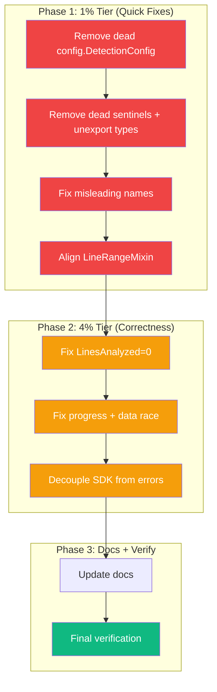

# Superb Correctness & Cleanup Sprint

**Date:** 2026-06-20
**Branch:** `fork`
**Source:** Brutal self-review + deep investigation findings
**Status:** ACTIVE

---

## Context

After the architecture hardening sprint, a brutal self-review surfaced **10 new issues** — 3 critical correctness bugs, 7 quality problems. These were either introduced during refactoring or pre-existing and hidden. This sprint fixes all of them.

### Current State (verified before planning)

- **Build:** `go build ./...` clean
- **Tests:** 22 packages pass
- **Vet:** clean
- **go-arch-lint:** 0 violations (exit 0)

---

## Pareto Breakdown

### 1% effort → 51% result (Dead code removal + naming honesty)

| #   | Task                                                                 | Est   | Impact         |
| --- | -------------------------------------------------------------------- | ----- | -------------- |
| 1   | Remove dead `config.DetectionConfig` (zero consumers)                | 3min  | Dead code      |
| 2   | Remove 6 dead SDK sentinel errors (never returned by code)           | 5min  | API honesty    |
| 3   | Unexport `SimpleJSONClone`/`SimpleCloneGroup`/`SimpleJSONOutput`     | 5min  | API surface    |
| 4   | Rename `validateInputsOrError` → `validateInputsWithContext`         | 3min  | Naming clarity |
| 5   | Fix `hashConfig` → rename to `configDebugString` (it's not a hash)   | 5min  | Naming honesty |
| 6   | Align `LineRangeMixin`: `StartLine`→`LineStart`, `EndLine`→`LineEnd` | 10min | Consistency    |

### 4% effort → 64% result (Correctness fixes)

| #   | Task                                                             | Est   | Impact             |
| --- | ---------------------------------------------------------------- | ----- | ------------------ |
| 7   | Fix `Summary.LinesAnalyzed = 0` — wire real data from ParseStats | 15min | Correctness        |
| 8   | Fix sync `FindClones` missing 100% progress report               | 5min  | UX consistency     |
| 9   | Fix `started time.Time` data race — pass as local variable       | 15min | Concurrency safety |
| 10  | Decouple SDK `detector.go` from internal `errors` package        | 20min | SDK independence   |

### 20% effort → 80% result (Deferred — requires design decisions)

These remain in TODO_LIST.md for future sessions:

- Printer→syntax.Node coupling reduction (needs interface design)
- Clone type consolidation (needs DTO architecture design)
- printer/ split into sub-packages (needs core package extraction)

---

## Medium-Granularity Plan (10 tasks, 30-100 min each)

| ID  | Task                                                 | Tier | Est   | Impact   | Effort | Status |
| --- | ---------------------------------------------------- | ---- | ----- | -------- | ------ | ------ |
| M01 | Remove `config.DetectionConfig` dead code            | 1%   | 5min  | High     | Low    | ⏳     |
| M02 | Remove 6 dead SDK sentinels + unexport Simple types  | 1%   | 10min | Medium   | Low    | ⏳     |
| M03 | Fix naming: `validateInputsOrError` + `hashConfig`   | 1%   | 10min | Low      | Low    | ⏳     |
| M04 | Align `LineRangeMixin` field names                   | 1%   | 15min | Medium   | Low    | ⏳     |
| M05 | Fix `LinesAnalyzed = 0` — wire ParseStats data       | 4%   | 20min | Critical | Medium | ⏳     |
| M06 | Fix sync `FindClones` 100% progress + `started` race | 4%   | 20min | High     | Medium | ⏳     |
| M07 | Decouple SDK from internal `errors` package          | 4%   | 25min | Critical | Medium | ⏳     |
| M08 | Update `TODO_LIST.md` + `FEATURES.md` + `AGENTS.md`  | 4%   | 15min | Low      | Low    | ⏳     |
| M09 | Final verification: build + test + vet + arch-lint   | 1%   | 5min  | Critical | Low    | ⏳     |
| M10 | Commit + push                                        | 1%   | 5min  | —        | —      | ⏳     |

---

## Fine-Granularity Plan (47 tasks, max 15 min each)

### M01: Remove dead config.DetectionConfig (3 tasks)

| Sub-ID | Task                                                                  | Est  |
| ------ | --------------------------------------------------------------------- | ---- |
| M01.1  | Delete `config/detection.go` (entire file — 12 lines, zero consumers) | 2min |
| M01.2  | Build + verify no import breaks                                       | 2min |

### M02: Remove dead sentinels + unexport Simple types (6 tasks)

| Sub-ID | Task                                                                   | Est  |
| ------ | ---------------------------------------------------------------------- | ---- |
| M02.1  | Read `pkg/artdupl/errors.go` + identify 6 dead sentinels               | 2min |
| M02.2  | Remove `ErrParsingFailed`, `ErrContextCanceled`, `ErrResultProcessing` | 5min |
| M02.3  | Remove `ErrCloneInvalidPosition`, `ErrMemoryLimit`, `ErrInternal`      | 5min |
| M02.4  | Unexport `SimpleJSONClone` → `simpleJSONClone` etc. in json.go         | 5min |
| M02.5  | Build + fix test references                                            | 5min |

### M03: Fix misleading names (5 tasks)

| Sub-ID | Task                                                            | Est  |
| ------ | --------------------------------------------------------------- | ---- |
| M03.1  | Rename `validateInputsOrError` → `validateInputsWithContext`    | 3min |
| M03.2  | Rename `hashConfig` → `configDebugString` + update comment      | 5min |
| M03.3  | Update Metadata.ConfigHash doc to say "debug string" not "hash" | 3min |
| M03.4  | Build + test                                                    | 2min |

### M04: Align LineRangeMixin (5 tasks)

| Sub-ID | Task                                                             | Est  |
| ------ | ---------------------------------------------------------------- | ---- |
| M04.1  | Rename `LineRangeMixin.StartLine` → `.LineStart`                 | 3min |
| M04.2  | Rename `LineRangeMixin.EndLine` → `.LineEnd`                     | 3min |
| M04.3  | Update JSON tags: `startLine`→`line_start`, `endLine`→`line_end` | 3min |
| M04.4  | Update construction sites (json.go:197, sarif.go:203)            | 3min |
| M04.5  | Build + test + verify JSON output format                         | 3min |

### M05: Fix LinesAnalyzed=0 (7 tasks)

| Sub-ID | Task                                                    | Est  |
| ------ | ------------------------------------------------------- | ---- |
| M05.1  | Read detector_pipeline.go to trace how ParseStats flows | 3min |
| M05.2  | Read detector_conversion.go to see buildResult          | 3min |
| M05.3  | Add `linesAnalyzed int` param to buildResult            | 5min |
| M05.4  | Wire `fileCount.LinesCount` through FindClones path     | 5min |
| M05.5  | Wire through FindClonesStreamResult path                | 5min |
| M05.6  | Build + test                                            | 2min |

### M06: Fix progress 100% + data race (6 tasks)

| Sub-ID | Task                                                      | Est  |
| ------ | --------------------------------------------------------- | ---- |
| M06.1  | Add `reportProgress(100, ...)` to end of `FindClones`     | 3min |
| M06.2  | Remove `started time.Time` field from detector struct     | 3min |
| M06.3  | Pass `startTime time.Time` as local through FindClones    | 5min |
| M06.4  | Pass `startTime time.Time` through FindClonesStreamResult | 5min |
| M06.5  | Build + test                                              | 2min |

### M07: Decouple SDK from internal errors (8 tasks)

| Sub-ID | Task                                                                     | Est  |
| ------ | ------------------------------------------------------------------------ | ---- |
| M07.1  | Read detector.go error wrapping sites (4 sites)                          | 3min |
| M07.2  | Replace `errors.WrapConfig(err, msg)` → `fmt.Errorf("%s: %w", msg, err)` | 5min |
| M07.3  | Replace `errors.Wrap(err, errors.AnalysisError, msg)` → `fmt.Errorf`     | 5min |
| M07.4  | Replace `errors.Wrap(err, errors.DetectionError, msg)` → `fmt.Errorf`    | 5min |
| M07.5  | Replace `errors.WrapValidation(err, msg)` → `fmt.Errorf`                 | 5min |
| M07.6  | Remove `"github.com/LarsArtmann/art-dupl/errors"` import                 | 2min |
| M07.7  | Build + fix any test references                                          | 5min |

---

## Execution Graph

**Legend:** Red = 1% quick fixes, Orange = 4% correctness, Green = verification.
