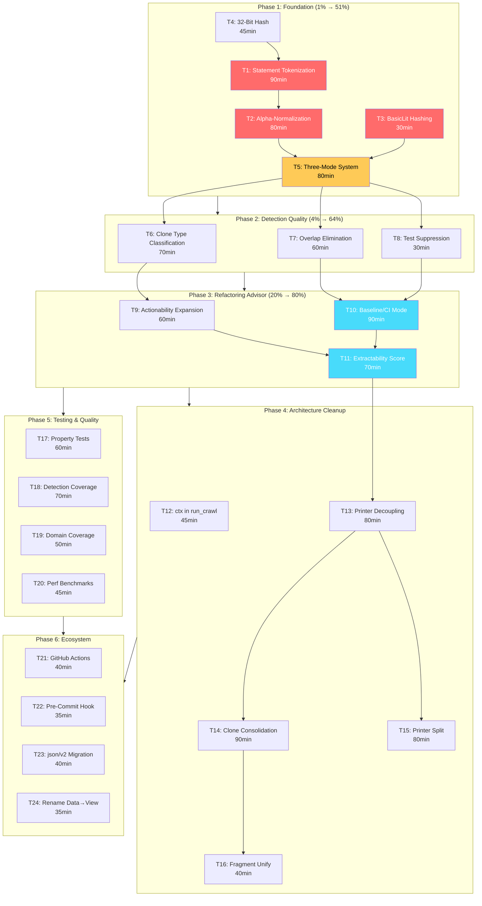

# Superb Clone Detection Engine — Comprehensive Execution Plan

**Date:** 2026-06-20 16:05
**Status:** PLANNING — Awaiting execution
**Vision:** Transform art-dupl from "AST shape matcher" into "semantic refactoring advisor"

---

## The Problem

Dogfooding art-dupl on itself revealed a fundamental flaw: **the tool counts the wrong things.**

`serial()` (`syntax/syntax.go:116-133`) flattens the entire AST via pre-order DFS. Every node — structural wrappers (`BlockStmt`, `ExprStmt`, `CallExpr`) AND semantic atoms (`Ident`, `BasicLit`) — becomes one token. One Go statement like `Expect(x).To(Equal(y))` generates ~13 tokens. The threshold of 15 is barely 2 statements of dense code.

Worse, `--semantic` mode is **backwards**: it bakes exact identifier names into the token hash (`identifier_hash.go:52`), making matches _stricter_ than structural mode. `processUser` and `processOrder` with identical logic are _rejected_ because the names differ. That's exact-text matching, not semantic matching.

And `BasicLit` values are erased entirely (`transform.go:42`) — `return 42` matches `return 999` in every mode.

Result: 81 clone groups at `-t 15`, of which ~60 are test-file noise, ~15 are single-line framework API coincidences, and maybe 5 are real duplicates.

---

## Pareto Breakdown

### The 1% that delivers 51%

Three foundational changes to what the suffix tree operates on:

| Change                           | Why                                                                                                                             | Impact                                                                              |
| -------------------------------- | ------------------------------------------------------------------------------------------------------------------------------- | ----------------------------------------------------------------------------------- |
| **Statement-level tokenization** | One Go statement = one token (hash of semantic content). Threshold 5 = "5 duplicated statements," not "15 arbitrary AST nodes." | Eliminates ~60% of false positives from structural wrapper inflation                |
| **Alpha-normalization**          | Canonicalize variable names (v0, v1, ...), parameters (p0, p1, ...), receivers (r) before hashing.                              | Enables Type 2 clone detection — the clone type that matters most in real codebases |
| **BasicLit value hashing**       | Hash literal VALUES into the token type (same as identifiers currently work).                                                   | Eliminates `return 42` matching `return 999` — an entire false-positive class       |

### The 4% that delivers 64%

| Change                        | Why                                                                                                      | Impact                                                       |
| ----------------------------- | -------------------------------------------------------------------------------------------------------- | ------------------------------------------------------------ |
| **Three-mode system**         | `--exact` (current semantic), `--semantic` (alpha-normalized, new default), `--structural` (pure shape). | Makes detection quality accessible via clear user-facing API |
| **Clone type classification** | Label every clone Type 1/2/3.                                                                            | Gives users the refactoring strategy                         |
| **Overlap elimination**       | Suppress clones whose token range is contained in a larger clone.                                        | Removes redundant reports from suffix-tree nested matches    |
| **Default test suppression**  | `--test-threshold` defaults to `max(30, t)`. Add `--ignore-tests`.                                       | Test noise drops from 60/81 to ~5 groups                     |

### The 20% that delivers 80%

| Change                              | Why                                                                | Impact                                                |
| ----------------------------------- | ------------------------------------------------------------------ | ----------------------------------------------------- |
| **Actionability pattern expansion** | Add Cobra boilerplate, assertion chains, error-wrapping detectors. | Suppress known noise patterns automatically           |
| **Baseline/CI mode**                | `art-dupl baseline` + `art-dupl check` (reports only new clones).  | Makes tool usable in CI/pre-commit                    |
| **Extractability score**            | Compute: can this be cleanly extracted? Lines saved?               | Transforms from "clone dump" to "refactoring advisor" |
| **Hash collision fix**              | 32-bit non-commutative hash replaces 24-bit FNV+XOR.               | Eliminates FuncDecl false matches                     |
| **Architecture cleanup**            | Printer decoupling, Clone consolidation, package split.            | Reduces maintenance burden, enables future work       |

---

## Execution Dependency Graph

---

## Comprehensive Plan — Medium Granularity

**24 tasks, 30-100min each. Total estimated: ~24.75 hours**

Sorted by impact/effort/customer-value within each phase.

### Phase 1: Foundation (1% → 51% of result)

| ID     | Task                                                                                                                                                                                                                                    | Impact                                                                          | Effort | Dependencies | Customer Value                                                  |
| ------ | --------------------------------------------------------------------------------------------------------------------------------------------------------------------------------------------------------------------------------------- | ------------------------------------------------------------------------------- | ------ | ------------ | --------------------------------------------------------------- |
| **T1** | Statement-Level Tokenization Engine — Replace `serial()` pre-order DFS with statement-level fingerprinting. Each Go statement becomes ONE token (FNV hash of its semantic content). Threshold = "N duplicated statements."              | **Critical** — fixes the core measurement problem                               | 90min  | T4           | Thresholds finally mean what developers expect                  |
| **T2** | Alpha-Normalization Pass — Walk each function body with a symbol table. First local = `v0`, second = `v1`, params = `p0, p1, ...`, receiver = `r`. After normalization, identical logic with different names produces identical tokens. | **Critical** — enables Type 2 detection (the most common real-world clone type) | 80min  | T1           | Finds renamed-variable clones for the first time                |
| **T3** | BasicLit Value Hashing — In exact mode, hash literal values into the token type (same mechanism as identifiers). `return 42` ≠ `return 999`. Keep structural mode value-agnostic.                                                       | **High** — eliminates entire false-positive class                               | 30min  | None         | No more "same logic different constants" false positives        |
| **T4** | 32-Bit Non-Commutative Hash — Expand `hashIdentifierFast` to full 32 bits. Move base type to separate `Node.BaseType` field. Replace `combineIdentifierHashes` XOR with FNV multiply-pair combiner.                                     | **Medium** — fixes collision risk for large codebases                           | 45min  | None         | Eliminates FuncDecl false matches from XOR commutativity        |
| **T5** | Three-Mode Detection System — Define `DetectionMode` enum: `Exact` (current semantic), `Semantic` (alpha-normalized, NEW default), `Structural` (pure shape). Rename flags accordingly.                                                 | **Critical** — user-facing API for the new capabilities                         | 80min  | T1, T2, T3   | Clear modes: "exact copy-paste" vs "same logic" vs "same shape" |

### Phase 2: Detection Quality (4% → 64% of result)

| ID     | Task                                                                                                                                                                                                                                                | Impact                                          | Effort | Dependencies | Customer Value                                                 |
| ------ | --------------------------------------------------------------------------------------------------------------------------------------------------------------------------------------------------------------------------------------------------- | ----------------------------------------------- | ------ | ------------ | -------------------------------------------------------------- |
| **T6** | Clone Type Classification — Define `CloneType` (Type1/Type2/Type3) in domain. Implement detection: Type 1 = token-identical, Type 2 = structurally identical with different names, Type 3 = near-miss (future). Add to JSON/SARIF/HTML/text output. | **High** — tells users the refactoring strategy | 70min  | T5           | "Type 1 → mechanical extract, Type 2 → extract + parameterize" |
| **T7** | Overlap & Nested Clone Elimination — Suffix tree emits at every internal node. Implement interval tree, suppress clones whose token range is fully contained in a larger clone.                                                                     | **High** — removes redundant reports            | 60min  | T5           | Cleaner output, no nested duplicates                           |
| **T8** | Default Test-File Noise Suppression — Change `--test-threshold` default to `max(30, threshold)`. Add `--ignore-tests` flag and `--include-tests` override.                                                                                          | **High** — massive noise reduction              | 30min  | None         | Output goes from 81→~20 groups by default                      |

### Phase 3: Refactoring Advisor (20% → 80% of result)

| ID      | Task                                                                                                                                                                                                                                           | Impact                                                           | Effort | Dependencies | Customer Value                                  |
| ------- | ---------------------------------------------------------------------------------------------------------------------------------------------------------------------------------------------------------------------------------------------- | ---------------------------------------------------------------- | ------ | ------------ | ----------------------------------------------- |
| **T9**  | Actionability Pattern Expansion — Add detectors: Cobra/Fang command boilerplate, assertion chains (≥3 Expect/Assert/Require calls), error-wrapping returns. Expand RAII cleanup list. Lower interface impl threshold 3→2.                      | **Medium** — auto-suppresses known noise patterns                | 60min  | T6           | Fewer manual false-positive suppressions needed |
| **T10** | Baseline Recording & CI Check Mode — `art-dupl baseline` records accepted clones to `.art-dupl-baseline.json`. `art-dupl check` (CI mode) reports only NEW clones. Exit 1 if new clones found. `--baseline` flag for inline diff.              | **Critical** — makes tool usable in CI                           | 90min  | T7, T8       | Pre-commit hooks and CI gates become possible   |
| **T11** | Extractability Score & Refactoring Hints — For each clone group: single-entry-point check, no-shared-mutable-state check, consistent-return-paths check. Compute lines-saved. Output: "Extract to func X(e Entity) — 4 sites, 84 lines saved." | **High** — transforms from "clone dump" to "refactoring advisor" | 70min  | T6, T10      | Actionable suggestions, not just reports        |

### Phase 4: Architecture Cleanup

| ID      | Task                                                                                                                                                                                                  | Impact                              | Effort | Dependencies | Customer Value                            |
| ------- | ----------------------------------------------------------------------------------------------------------------------------------------------------------------------------------------------------- | ----------------------------------- | ------ | ------------ | ----------------------------------------- |
| **T12** | Thread context.Context through cmd/run_crawl.go — Last goroutine leak. `filesFeedWithOptions` → stdin scanner → `filepath.Walk` all need ctx propagation.                                             | **Medium** — eliminates last leak   | 45min  | None         | No goroutine leaks remain                 |
| **T13** | Decouple Printer from syntax.Node — Design `ReadOnlyNode` interface. Update actionability matchers. Remove 34 direct `syntax.Node` imports from printer/.                                             | **Medium** — reduces coupling       | 80min  | None         | Printer testable in isolation             |
| **T14** | Consolidate Parallel Clone/Group Types — Extract `CloneLocation` (Filename + LineStart + LineEnd) shared core. Embed in `ProcessedClone`, `CloneGroup`, `pkg/artdupl.Clone`. Remove duplicate fields. | **Medium** — reduces type confusion | 90min  | T13          | One canonical clone type, not 5           |
| **T15** | Split printer/ into Sub-Packages — `printer/stats/`, `printer/html/`, `printer/analyze/`. ~29 files / ~3500 lines is too many for one package.                                                        | **Low-Medium** — maintainability    | 80min  | T13          | Navigable package structure               |
| **T16** | Unify Fragment Type — Decide canonical type ([]byte or string). Update domain + SDK. Remove boundary conversion code.                                                                                 | **Low** — reduces friction          | 40min  | T14          | No more type conversion at every boundary |

### Phase 5: Testing & Quality

| ID      | Task                                                                                                                                                                                                                      | Impact                                         | Effort | Dependencies | Customer Value                      |
| ------- | ------------------------------------------------------------------------------------------------------------------------------------------------------------------------------------------------------------------------- | ---------------------------------------------- | ------ | ------------ | ----------------------------------- |
| **T17** | Property-Based Tests for Clone Finding — Suffix tree `dupl_test.go` has 4 trivial cases. Add: every match is a real repeat, maximal matches are maximal, threshold filtering correct, no false positives on random input. | **High** — algorithm correctness is unverified | 60min  | T1           | Confidence in detection correctness |
| **T18** | Detection Package Coverage Tests — Add MultiDetector dispatch, adapter integration, cross-method combination, context cancellation tests. Target: 61.8% → 80%.                                                            | **Medium** — coverage gap                      | 70min  | T5           | Detection logic well-tested         |
| **T19** | Domain Package Coverage Tests — Add ProcessedClone, CloneClassification, ClonePriority tests. Target: 66.2% → 80%.                                                                                                        | **Low-Medium** — coverage gap                  | 50min  | None         | Domain logic well-tested            |
| **T20** | Performance Baseline Benchmarks — Create benchmark corpus, add suffix-tree and end-to-end benchmarks, record baseline numbers.                                                                                            | **Low** — no current regression risk           | 45min  | T1           | Catch performance regressions       |

### Phase 6: Ecosystem

| ID      | Task                                                                                                                               | Impact                          | Effort | Dependencies | Customer Value             |
| ------- | ---------------------------------------------------------------------------------------------------------------------------------- | ------------------------------- | ------ | ------------ | -------------------------- |
| **T21** | GitHub Actions Workflow Template — `.github/workflows/art-dupl-check.yml`. Baseline check step. HTML report artifact upload.       | **Medium** — CI adoption        | 40min  | T10          | One-click CI integration   |
| **T22** | Pre-Commit Hook Integration — `.pre-commit-hooks.yaml`. Installation docs. Test on staged files.                                   | **Medium** — developer workflow | 35min  | T10          | Git pre-commit integration |
| **T23** | encoding/json/v2 Migration — Audit 6 production files on v1. Migrate MarshalJSON/UnmarshalJSON to v2 API. Verify output unchanged. | **Low** — future-proofing       | 40min  | None         | Modern JSON handling       |
| **T24** | Rename …Data View Models to …View — Audit all `*Data` types in printer/. Rename to `*View`. Update templ-generated references.     | **Low** — naming clarity        | 35min  | T15          | Honest naming in printer   |

---

## Fine-Grained Breakdown — 123 tasks, max 15min each

### Phase 1: Foundation (33 tasks)

#### T1: Statement-Level Tokenization Engine

| Sub-ID | Task                                                                                                                                                                                    | Time  | Deps |
| ------ | --------------------------------------------------------------------------------------------------------------------------------------------------------------------------------------- | ----- | ---- |
| T1.1   | Design `StatementFingerprint` type: a single `int32` token representing one complete statement, hashed from its semantic content (identifiers, operators, literals, control-flow shape) | 12min | —    |
| T1.2   | Implement statement boundary detection: walk AST `BlockStmt.List` entries, identify top-level statements vs sub-expressions                                                             | 12min | T1.1 |
| T1.3   | Replace `serial()` node-stream with statement-level serialization: each statement subtree → one composite token via FNV hash of its serialized children                                 | 12min | T1.2 |
| T1.4   | Update `FindSyntaxUnits` for statement-level tokens: `Owns=0` for statement atoms, no multi-unit splitting needed                                                                       | 12min | T1.3 |
| T1.5   | Update threshold semantics: document that `-t 5` means "5 duplicated statements" and adjust defaults                                                                                    | 10min | T1.4 |
| T1.6   | Update existing unit tests: all token-count assertions need rescaling (old 15 nodes ≈ new 2-3 statements)                                                                               | 12min | T1.5 |
| T1.7   | Dogfood: run on art-dupl itself, verify single-line clones and framework API chains no longer appear at reasonable thresholds                                                           | 10min | T1.6 |

#### T2: Alpha-Normalization Pass

| Sub-ID | Task                                                                                                                               | Time  | Deps       |
| ------ | ---------------------------------------------------------------------------------------------------------------------------------- | ----- | ---------- |
| T2.1   | Design `SymbolTable` walker: tracks scope entry/exit, assigns canonical names in declaration order per function                    | 12min | T1.1       |
| T2.2   | Implement variable/parameter/receiver canonical renaming: first local=`v0`, second=`v1`, params=`p0,p1,...`, receiver=`r`          | 12min | T2.1       |
| T2.3   | Integrate normalization into transform pipeline: AST → alpha-normalize → encode → statement-fingerprint                            | 12min | T1.3, T2.2 |
| T2.4   | Handle edge cases: blank identifiers (`_`), re-declarations, type aliases, embedded struct fields, closure variable capture        | 12min | T2.3       |
| T2.5   | Add unit tests: verify `processUser(u *User)` and `processOrder(o *Order)` with identical bodies produce identical token sequences | 12min | T2.4       |
| T2.6   | Add BDD test: "renamed function body detected as clone in semantic mode" — the test that proves Type 2 detection works             | 12min | T2.5       |

#### T3: BasicLit Value Hashing

| Sub-ID | Task                                                                                                                    | Time  | Deps |
| ------ | ----------------------------------------------------------------------------------------------------------------------- | ----- | ---- |
| T3.1   | Hash BasicLit values into token type in exact mode: use same `hashIdentifierFast` mechanism on the literal value string | 10min | —    |
| T3.2   | Verify structural mode remains value-agnostic: all BasicLits get same type (Type 1/2 detection only)                    | 10min | T3.1 |
| T3.3   | Add tests: `return 42` ≠ `return 999` in exact mode; `return 42` == `return 42` in exact mode                           | 10min | T3.2 |

#### T4: 32-Bit Non-Commutative Hash

| Sub-ID | Task                                                                                                             | Time  | Deps |
| ------ | ---------------------------------------------------------------------------------------------------------------- | ----- | ---- |
| T4.1   | Expand `hashIdentifierFast` to return full 32-bit FNV-1a (remove `& 0x00FFFFFF` truncation)                      | 10min | —    |
| T4.2   | Add `Node.BaseType` field (int32): stores the raw AST type separately from the semantic hash                     | 12min | T4.1 |
| T4.3   | Replace `combineIdentifierHashes` XOR with FNV multiply-pair: `hash(left)*prime ^ hash(right)` — non-commutative | 10min | T4.1 |
| T4.4   | Update all `DecodeBaseType` callers to use `Node.BaseType` field instead of `t & 0xFF` bit extraction            | 12min | T4.2 |
| T4.5   | Add hash collision test: generate 10,000 synthetic identifiers, verify zero collisions at 32 bits                | 10min | T4.3 |

#### T5: Three-Mode Detection System

| Sub-ID | Task                                                                                                                 | Time  | Deps       |
| ------ | -------------------------------------------------------------------------------------------------------------------- | ----- | ---------- |
| T5.1   | Define `DetectionMode` enum in config: `ModeExact`, `ModeSemantic`, `ModeStructural` with `IsValid()` and `String()` | 10min | —          |
| T5.2   | Rename current `--semantic` flag to `--exact`: this is exact name matching (current behavior)                        | 10min | T5.1       |
| T5.3   | Wire new `--semantic` flag to alpha-normalization pipeline (T2 output)                                               | 12min | T2.3, T5.2 |
| T5.4   | Keep `--structural` as pure AST shape matching (all names erased, all literals erased)                               | 10min | T5.3       |
| T5.5   | Set `--semantic` (alpha-normalized) as the DEFAULT mode — it's what developers actually want                         | 10min | T5.4       |
| T5.6   | Update config defaults, help text, HOW_TO_USE.md, FEATURES.md for three-mode system                                  | 12min | T5.5       |
| T5.7   | Update BDD tests: add scenarios for exact ≠ semantic ≠ structural behavior                                           | 12min | T5.6       |

### Phase 2: Detection Quality (19 tasks)

#### T6: Clone Type Classification

| Sub-ID | Task                                                                                                                                                    | Time  | Deps |
| ------ | ------------------------------------------------------------------------------------------------------------------------------------------------------- | ----- | ---- |
| T6.1   | Define `CloneType` enum in domain: `Type1` (exact), `Type2` (renamed), `Type3` (near-miss). Add `IsValid()`, `String()`, JSON marshaling via `pkg/enum` | 10min | —    |
| T6.2   | Implement Type 1 detection: all fragments are token-identical (same semantic hashes, same literal hashes)                                               | 12min | T6.1 |
| T6.3   | Implement Type 2 detection: fragments are structurally identical but identifier names differ (detected via alpha-normalization match in semantic mode)  | 12min | T6.2 |
| T6.4   | Add `clone_type` field to JSON output schema                                                                                                            | 10min | T6.3 |
| T6.5   | Add `clone_type` to SARIF output (as a property on each result)                                                                                         | 10min | T6.4 |
| T6.6   | Add clone type badge to HTML output and `--rich-text` terminal output                                                                                   | 10min | T6.5 |

#### T7: Overlap & Nested Clone Elimination

| Sub-ID | Task                                                                                                        | Time  | Deps |
| ------ | ----------------------------------------------------------------------------------------------------------- | ----- | ---- |
| T7.1   | Implement interval tree for clone token ranges: store `(start, end)` per clone, support containment queries | 12min | —    |
| T7.2   | Add containment check: if clone A's range ⊂ clone B's range (and they share ≥1 position), suppress A        | 12min | T7.1 |
| T7.3   | Integrate suppression into `BuildCloneGroups` pipeline: filter after grouping, before classification        | 12min | T7.2 |
| T7.4   | Add tests: nested clones (50-token containing 15-token sub-match) produce only the 50-token report          | 12min | T7.3 |
| T7.5   | Dogfood: verify no real clones suppressed (compare group count before/after, manual review)                 | 10min | T7.4 |

#### T8: Default Test-File Noise Suppression

| Sub-ID | Task                                                                                             | Time  | Deps |
| ------ | ------------------------------------------------------------------------------------------------ | ----- | ---- |
| T8.1   | Change `--test-threshold` default to `max(30, threshold)` so only substantial test clones appear | 10min | —    |
| T8.2   | Add `--ignore-tests` flag (excludes `*_test.go` entirely) and `--include-tests` override         | 10min | T8.1 |
| T8.3   | Update HOW_TO_USE.md, help text, and FEATURES.md with new test filtering behavior                | 10min | T8.2 |

### Phase 3: Refactoring Advisor (19 tasks)

#### T9: Actionability Pattern Expansion

| Sub-ID | Task                                                                                                                    | Time  | Deps |
| ------ | ----------------------------------------------------------------------------------------------------------------------- | ----- | ---- |
| T9.1   | Add Cobra/Fang command boilerplate detector: `cobra.Command{...}` or `fang.Command{...}` literals with Run/RunE fields  | 12min | —    |
| T9.2   | Add assertion chain detector: ≥3 CallExpr nodes targeting `Expect`/`Assert`/`Require`/`Should`/`Must` methods           | 12min | T9.1 |
| T9.3   | Add error-wrapping return detector: `IfStmt` with `!= nil` check, body is only `return fmt.Errorf/werrors.Wrap`         | 12min | T9.2 |
| T9.4   | Expand RAII cleanup method list: add `Stop`, `Shutdown`, `Cleanup`, `Reset`, `Put`, `Drop`, `Abort`, `Teardown`         | 10min | T9.3 |
| T9.5   | Lower `isInterfaceImplementation` threshold from 3 to 2 fragments (two files implementing same method = non-actionable) | 10min | T9.4 |

#### T10: Baseline Recording & CI Check Mode

| Sub-ID | Task                                                                                                                           | Time  | Deps  |
| ------ | ------------------------------------------------------------------------------------------------------------------------------ | ----- | ----- |
| T10.1  | Design baseline file format `.art-dupl-baseline.json`: array of clone hashes with metadata (file, lines, threshold, timestamp) | 12min | —     |
| T10.2  | Implement `art-dupl baseline` subcommand: run detection, write accepted clones to baseline file                                | 12min | T10.1 |
| T10.3  | Implement `art-dupl check` subcommand: run detection, compare against baseline, report only NEW clones                         | 12min | T10.2 |
| T10.4  | Implement clone diff logic: match by hash, report additions (new clones) and removals (fixed clones)                           | 12min | T10.3 |
| T10.5  | Add `--baseline <path>` flag to main command for inline diff mode (non-subcommand usage)                                       | 10min | T10.4 |
| T10.6  | Set exit code 1 if new clones found in `check` mode (for CI integration); exit 0 if clean                                      | 10min | T10.5 |
| T10.7  | Add tests for full baseline workflow: record → modify code → check → verify only new clones reported                           | 12min | T10.6 |
| T10.8  | Document CI integration in HOW_TO_USE.md: GitHub Actions example, pre-commit example, baseline workflow                        | 10min | T10.7 |

#### T11: Extractability Score & Refactoring Hints

| Sub-ID | Task                                                                                                                    | Time  | Deps  |
| ------ | ----------------------------------------------------------------------------------------------------------------------- | ----- | ----- |
| T11.1  | Design `ExtractabilityScore` type: `Score` (0-100), `CanExtract` (bool), `Reason` (string), `EstimatedLinesSaved` (int) | 12min | —     |
| T11.2  | Implement single-entry-point check: all fragments must start at a function/block boundary (not mid-expression)          | 12min | T11.1 |
| T11.3  | Implement no-shared-mutable-state check: fragments must not reference outer-scope variables that are mutated            | 12min | T11.2 |
| T11.4  | Implement consistent-return-paths check: all fragments must have same return type and similar exit paths                | 12min | T11.3 |
| T11.5  | Compute lines-saved metric: `(clone_lines × fragment_count) - estimated_extracted_function_lines`                       | 10min | T11.4 |
| T11.6  | Add extractability score and refactoring hint to JSON, HTML, and `--rich-text` output formats                           | 12min | T11.5 |

### Phase 4: Architecture Cleanup (26 tasks)

#### T12: Thread context.Context through cmd/run_crawl.go

| Sub-ID | Task                                                                                        | Time  | Deps         |
| ------ | ------------------------------------------------------------------------------------------- | ----- | ------------ |
| T12.1  | Add `ctx context.Context` parameter to `filesFeedWithOptions` signature                     | 12min | —            |
| T12.2  | Wrap stdin scanner loop with `select { case <-ctx.Done(): return }` between scan iterations | 12min | T12.1        |
| T12.3  | Replace `filepath.Walk` with `filepath.WalkDir` + ctx cancellation check at directory entry | 12min | T12.1        |
| T12.4  | Update all callers of `filesFeedWithOptions` to pass ctx through                            | 9min  | T12.2, T12.3 |

#### T13: Decouple Printer from syntax.Node

| Sub-ID | Task                                                                                                                            | Time  | Deps  |
| ------ | ------------------------------------------------------------------------------------------------------------------------------- | ----- | ----- |
| T13.1  | Design `ReadOnlyNode` interface: `Type() int32`, `Pos() int32`, `End() int32`, `Filename() string`, `Children() []ReadOnlyNode` | 12min | —     |
| T13.2  | Update all actionability pattern matchers (`actionability*.go`) to accept `ReadOnlyNode` instead of `*syntax.Node`              | 12min | T13.1 |
| T13.3  | Update `clone_processor.go` bridge: convert `*syntax.Node` → `ReadOnlyNode` at the boundary                                     | 12min | T13.2 |
| T13.4  | Remove direct `syntax.Node` imports from all `printer/actionability*.go` files                                                  | 12min | T13.3 |
| T13.5  | Update `go-arch-lint` rules to enforce: `printer/` may not depend on `syntax/`                                                  | 10min | T13.4 |
| T13.6  | Verify all printer tests pass with the interface abstraction                                                                    | 10min | T13.5 |
| T13.7  | Grep for remaining `syntax.Node` references in printer/ (target: 0)                                                             | 10min | T13.6 |

#### T14: Consolidate Parallel Clone/Group Types

| Sub-ID | Task                                                                                                                   | Time  | Deps                |
| ------ | ---------------------------------------------------------------------------------------------------------------------- | ----- | ------------------- |
| T14.1  | Design `CloneLocation` value type: `Filename string`, `LineStart int`, `LineEnd int`, `StartPos int32`, `EndPos int32` | 12min | —                   |
| T14.2  | Embed `CloneLocation` in `domain.ProcessedClone` (replace individual fields)                                           | 12min | T14.1               |
| T14.3  | Embed `CloneLocation` in `printer.CloneGroup` (replace individual fields)                                              | 12min | T14.1               |
| T14.4  | Embed `CloneLocation` in `pkg/artdupl.Clone` (replace individual fields)                                               | 12min | T14.1               |
| T14.5  | Update all JSON serialization paths to use embedded `CloneLocation` fields                                             | 12min | T14.2, T14.3, T14.4 |
| T14.6  | Remove duplicate field definitions from each type (Filename, LineStart, LineEnd, etc.)                                 | 10min | T14.5               |
| T14.7  | Verify SDK independence: `pkg/artdupl` still has ZERO config/internal imports                                          | 10min | T14.6               |

#### T15: Split printer/ into Sub-Packages

| Sub-ID | Task                                                                                      | Time  | Deps                |
| ------ | ----------------------------------------------------------------------------------------- | ----- | ------------------- |
| T15.1  | Create `printer/stats/` sub-package with `package stats` declaration                      | 10min | T13                 |
| T15.2  | Move `stats*.go`, `stats_formatter.go`, `stats_styles.go` to `printer/stats/`             | 12min | T15.1               |
| T15.3  | Create `printer/html/` sub-package with `package html` declaration                        | 10min | T13                 |
| T15.4  | Move `html*.go`, `diff*.go` to `printer/html/`                                            | 12min | T15.3               |
| T15.5  | Create `printer/analyze/` sub-package with `package analyze` declaration                  | 10min | T13                 |
| T15.6  | Move `actionability*.go`, `clone_classify.go`, `clone_processor.go` to `printer/analyze/` | 12min | T15.5               |
| T15.7  | Update all imports across codebase to use new sub-package paths                           | 12min | T15.2, T15.4, T15.6 |
| T15.8  | Update `go-arch-lint` rules for new package structure                                     | 10min | T15.7               |

#### T16: Unify Fragment Type

| Sub-ID | Task                                                                                                                | Time  | Deps         |
| ------ | ------------------------------------------------------------------------------------------------------------------- | ----- | ------------ |
| T16.1  | Decide canonical type: `[]byte` (domain, matches file reading) vs `string` (SDK, matches JSON). Document rationale. | 10min | T14          |
| T16.2  | Update domain `Fragment` to canonical type                                                                          | 10min | T16.1        |
| T16.3  | Update SDK `Fragment` to canonical type                                                                             | 10min | T16.1        |
| T16.4  | Remove boundary conversion code (the `[]byte`↔`string` conversions at domain/SDK boundary)                          | 10min | T16.2, T16.3 |

### Phase 5: Testing & Quality (19 tasks)

#### T17: Property-Based Tests for Clone Finding

| Sub-ID | Task                                                                                                               | Time  | Deps  |
| ------ | ------------------------------------------------------------------------------------------------------------------ | ----- | ----- |
| T17.1  | Property: every reported match position pair, when extracted from data, contains identical token subsequences      | 12min | T1    |
| T17.2  | Property: maximal matches cannot be extended by one token in either direction without breaking the match           | 12min | T17.1 |
| T17.3  | Property: no matches reported below threshold (set threshold=N, verify all matches have Len≥N)                     | 12min | T17.2 |
| T17.4  | Property: random token sequences with no intentional duplicates produce zero matches                               | 12min | T17.3 |
| T17.5  | Property: multi-file token sequences (with file-boundary markers) handle correctly — no cross-file partial matches | 12min | T17.4 |

#### T18: Detection Package Coverage Tests

| Sub-ID | Task                                                                                             | Time  | Deps         |
| ------ | ------------------------------------------------------------------------------------------------ | ----- | ------------ |
| T18.1  | Add `MultiDetector.FindDuplOver` dispatch tests: verify correct detector selection per method    | 12min | T5           |
| T18.2  | Add `suffixTreeAdapter` integration tests with real Go source containing known clones            | 12min | T18.1        |
| T18.3  | Add `hashAdapter` integration tests with byte-identical files                                    | 12min | T18.1        |
| T18.4  | Add cross-method combination tests: both art-dupl + hash enabled, verify no duplicate reports    | 12min | T18.2, T18.3 |
| T18.5  | Add context cancellation propagation tests: cancel mid-detection, verify goroutines exit cleanly | 12min | T18.4        |
| T18.6  | Verify detection coverage ≥80% via `go test -cover`                                              | 10min | T18.5        |

#### T19: Domain Package Coverage Tests

| Sub-ID | Task                                                                                                     | Time  | Deps  |
| ------ | -------------------------------------------------------------------------------------------------------- | ----- | ----- |
| T19.1  | Add `ProcessedClone` / `ProcessedCloneGroup` method tests (validation, serialization)                    | 12min | —     |
| T19.2  | Add `CloneClassification` tests: verify category mapping, priority calculation, actionability assignment | 12min | T19.1 |
| T19.3  | Add `ClonePriority` tests: `Rank()` ordering, comparison operators, all enum values                      | 12min | T19.2 |
| T19.4  | Verify domain coverage ≥80% via `go test -cover`                                                         | 10min | T19.3 |

#### T20: Performance Baseline Benchmarks

| Sub-ID | Task                                                                                                                | Time  | Deps  |
| ------ | ------------------------------------------------------------------------------------------------------------------- | ----- | ----- |
| T20.1  | Create benchmark corpus: 10/50/100/500 Go files of varying sizes (use art-dupl's own codebase + generate synthetic) | 12min | T1    |
| T20.2  | Add suffix tree build benchmarks: `BenchmarkSTreeUpdate`, `BenchmarkFindDuplOver` at various thresholds             | 12min | T20.1 |
| T20.3  | Add end-to-end detection benchmarks: `BenchmarkParseToReport` covering full pipeline                                | 12min | T20.2 |
| T20.4  | Record baseline numbers in `docs/performance-baseline-2026-06-20.md`                                                | 9min  | T20.3 |

### Phase 6: Ecosystem (14 tasks)

#### T21: GitHub Actions Workflow Template

| Sub-ID | Task                                                                                                           | Time  | Deps  |
| ------ | -------------------------------------------------------------------------------------------------------------- | ----- | ----- |
| T21.1  | Create `.github/workflows/art-dupl-check.yml` template: checkout, install art-dupl, run check against baseline | 12min | T10   |
| T21.2  | Add baseline update step: comment-based trigger to regenerate baseline on `art-dupl-baseline` label            | 12min | T21.1 |
| T21.3  | Add HTML report artifact upload on failure (so devs can review new clones visually)                            | 10min | T21.2 |
| T21.4  | Document CI setup in README.md and HOW_TO_USE.md                                                               | 6min  | T21.3 |

#### T22: Pre-Commit Hook Integration

| Sub-ID | Task                                                                                           | Time  | Deps  |
| ------ | ---------------------------------------------------------------------------------------------- | ----- | ----- |
| T22.1  | Create `.pre-commit-hooks.yaml`: hook ID `art-dupl`, entry `art-dupl check`, language `golang` | 12min | T10   |
| T22.2  | Add installation instructions to README.md (pre-commit framework setup)                        | 10min | T22.1 |
| T22.3  | Test hook works: stage a file with a clone, verify pre-commit blocks it                        | 13min | T22.2 |

#### T23: encoding/json/v2 Migration

| Sub-ID | Task                                                                                                   | Time  | Deps  |
| ------ | ------------------------------------------------------------------------------------------------------ | ----- | ----- |
| T23.1  | Audit 6 production files using `encoding/json/v1`: list all `json.Marshal`/`json.Unmarshal` call sites | 10min | —     |
| T23.2  | Migrate MarshalJSON/UnmarshalJSON methods to `encoding/json/v2` API (if stable in Go 1.26)             | 12min | T23.1 |
| T23.3  | Test JSON output byte-for-byte unchanged before/after migration                                        | 10min | T23.2 |

#### T24: Rename …Data View Models to …View

| Sub-ID | Task                                                                       | Time  | Deps  |
| ------ | -------------------------------------------------------------------------- | ----- | ----- |
| T24.1  | Audit all `*Data` types in `printer/`: list each with its purpose          | 10min | T15   |
| T24.2  | Rename `*Data` → `*View` across all printer files (gofmt -r)               | 12min | T24.1 |
| T24.3  | Update templ-generated code references and regenerate via `templ generate` | 10min | T24.2 |

---

## Summary Statistics

| Metric                   | Value                                                                     |
| ------------------------ | ------------------------------------------------------------------------- |
| **Medium tasks**         | 24 (30-100min each)                                                       |
| **Fine-grained tasks**   | 123 (max 15min each)                                                      |
| **Total estimated time** | ~24.75 hours                                                              |
| **Phases**               | 6 (Foundation → Detection → Advisor → Architecture → Testing → Ecosystem) |
| **Critical path**        | T4 → T1 → T2 → T5 → T6 → T10 → T11 → T13 → T15                            |
| **Quick wins (< 40min)** | T3, T8, T12, T16, T19, T20, T22, T23, T24                                 |
| **Blocking items**       | T1 blocks T2, T5, T7, T17; T5 blocks T6, T9; T10 blocks T11, T21, T22     |

---

## Pareto Tier Summary

### Tier 1: Do First (1% effort → 51% result)

**T1 + T2 + T3 + T4 + T5** — Foundation changes that transform what the tool detects.

- Estimated: 325min (~5.4 hours)
- Outcome: Thresholds mean something. Type 2 clones detected. BasicLits differentiated. Three clear modes.

### Tier 2: Do Second (4% effort → 64% result)

**T6 + T7 + T8** — Detection quality improvements.

- Estimated: 160min (~2.7 hours)
- Outcome: Clone types labeled. No redundant reports. Test noise eliminated by default.

### Tier 3: Do Third (20% effort → 80% result)

**T9 + T10 + T11** — Refactoring advisor capabilities.

- Estimated: 220min (~3.7 hours)
- Outcome: CI-ready. Baseline/check workflow. Extractability suggestions.

### Tier 4-6: Do When Time Permits

**T12-T24** — Architecture, testing, ecosystem.

- Estimated: 780min (~13 hours)
- Outcome: Clean architecture, verified correctness, ecosystem integration.
