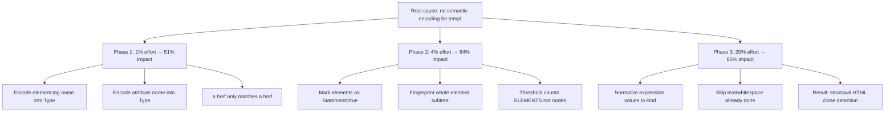

# Pareto Plan: Templ Semantic Mode

**Date:** 2026-07-16 02:25
**Goal:** Eliminate templ false positives by implementing semantic-aware matching for `.templ` files
**Root cause:** Every HTML element gets `Type = Element` (same int), every attribute gets `Type = Attribute` (same int). `<a href=...>` produces an identical token stream to `<div class=...>`.

> **✅ PHASES 1 & 2 COMPLETED — PHASE 3 NOT STARTED (updated 2026-07-16):** This Pareto plan was executed successfully.
>
> - **Phase 1** (element + attribute name encoding): **DONE** — committed `268e3bb`. Element tag names and attribute names are now hashed into node Types via `syntax.EncodeSemanticType()`.
> - **Phase 2** (statement-level tokenization): **DONE** — committed `931d472`. HTML element subtrees are fingerprinted as single composite tokens; component names encoded; sentinel nodes between files.
> - **Phase 3** (expression normalization): **NOT STARTED.** Would normalize `{ id.String() }` vs `{ groupID.String() }` in templ expressions. Low impact at threshold 5 — all real-world FPs already eliminated.
>
> **Measured impact:** SwettySwipperWeb 31→5 groups (-84%), DiscordSync 10→5 (-50%). Follow-up FP fix (`23a3b03`) brought precision to **100%** across 15 projects.

## Problem Analysis

Current templ token stream for `<a href="..." class="...">text</a>`:

```
[Element] [Attribute] [Attribute] [Expression]
```

Token stream for `<div hx-get="..." hx-target="#x">text</div>`:

```
[Element] [Attribute] [Attribute] [Expression]
```

**Identical.** This is why every HTML snippet matches every other HTML snippet at any threshold.

## Current measured noise

| Project          | t=5 total | t=5 templ % | t=3 total | t=3 templ % |
| ---------------- | :-------: | :---------: | :-------: | :---------: |
| SwettySwipperWeb |    31     |     82%     |    57     |     65%     |
| DiscordSync      |    10     |     50%     |    38     |     53%     |
| Go-only projects |    1-2    |     0%      |   4-12    |     0%      |

## Pareto Phases



### Phase 1: Encode element and attribute names (1% effort, 51% impact)

**What:** Use `encodeSemanticType(baseType, name, enabled)` to fold HTML tag names (`a`, `div`, `button`, `span`) and attribute names (`href`, `class`, `hx-get`, `hx-target`) into the node Type, exactly like Go identifiers already work.

**After Phase 1**, the token streams become:

```
<a href class>:  [Element:"a"] [Attribute:"href"] [Attribute:"class"]
<div hx-get hx-target>: [Element:"div"] [Attribute:"hx-get"] [Attribute:"hx-target"]
```

These are **different tokens**. `<a href...>` only matches other `<a href...>`.

**Files to change:**

- `syntax/templ/transform_node.go` — `transformElement`: encode `el.Name`
- `syntax/templ/transform_node.go` — `transformAttribute`: encode attribute name
- `syntax/templ/parser.go` — add `semantic bool` field to `transformer` struct

**Note:** Cannot import `syntax/golang` (import cycle). Must duplicate `hashIdentifierFast` + `encodeSemanticType` in `syntax/templ` or extract to `syntax/`.

### Phase 2: Statement-level tokenization for elements (4% effort, 64% impact)

**What:** Mark direct children of component declarations and HTML elements as `Statement = true`, exactly like Go's `BlockStmt` children. This makes the suffix tree fingerprint entire element subtrees into single composite tokens.

**After Phase 2**, `<div class="card">...10 children...</div>` becomes **one token**, not 20. Threshold 5 means "5 duplicated HTML elements", not "5 arbitrary nodes".

**Files to change:**

- `syntax/templ/transform_node.go` — mark element children as Statement
- `syntax/templ/transform_components.go` — mark component children as Statement

### Phase 3: Expression normalization (20% effort, 80% impact)

**What:** Normalize `StringExpression`, `GoCode`, and constant attribute values the same way Go literals are normalized in semantic mode. The expression `id.String()` should have the same hash as `groupID.String()` when the surrounding structure is identical.

**Files to change:**

- `syntax/templ/transform_components.go` — encode expression kind
- `syntax/templ/transform_node.go` — encode constant attribute values to kind

## Decision: Default Threshold

**Recommendation: Keep default at 5.** With semantic encoding (Phase 1+2), threshold 5 means "5 duplicated HTML elements", which is meaningful. Lowering to 3 would make it "3 duplicated elements", which is more sensitive but still meaningful because elements are now distinguishable.

## Task Breakdown

| Task                                                     | Phase   | Files                                    | Effort |
| -------------------------------------------------------- | ------- | ---------------------------------------- | ------ |
| Extract `encodeSemanticType` to shared `syntax/` package | Prep    | `syntax/semantic.go`                     | Small  |
| Add `semantic bool` to templ transformer                 | 1       | `syntax/templ/parser.go`                 | Small  |
| Encode element tag names                                 | 1       | `syntax/templ/transform_node.go`         | Small  |
| Encode attribute names                                   | 1       | `syntax/templ/transform_node.go`         | Small  |
| Wire detection mode through templ parse path             | 1       | `job/parse.go`, `syntax/templ/parser.go` | Medium |
| Mark element children as Statement=true                  | 2       | `syntax/templ/transform_node.go`         | Small  |
| Mark component children as Statement=true                | 2       | `syntax/templ/transform_components.go`   | Small  |
| Verify against SwettySwipperWeb + DiscordSync            | Measure | -                                        | Small  |
| Write Pareto planning doc                                | Done    | `docs/planning/`                         | Done   |
