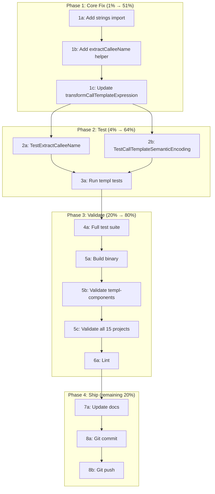

# Fix: Templ CallTemplateExpression FP — Encode Callee Name

**Date:** 2026-07-16 03:38
**Branch:** fork
**Status:** Planning → Execution

> **✅ PLAN FULLY EXECUTED AND COMPLETED (updated 2026-07-16):** This plan was implemented and **committed** (`23a3b03` — "fix: encode callee name in templ component render nodes to eliminate FP"). The `extractCalleeName` helper was added, 4 tests were written, all 24/24 packages passed, and the 15-project re-validation confirmed **100% precision** (0 false positives). The plan's note that `transformCallTemplateExpression` was the wrong target was corrected mid-execution — the actual buggy function was `transformTemplElementExpression` (the parser produces `TemplElementExpression` for `@call()` syntax, not `CallTemplateExpression`). Both functions were fixed defensively. See `docs/status/2026-07-16_04-03_templ-call-expression-fp-fix-status.md` for the full session report.

---

## Root Cause

`transformCallTemplateExpression` in `syntax/templ/transform_components.go:37-45` creates a bare `ComponentRender` node with **no name encoding**. Every `@call()` in every templ file produces an identical token. The suffix tree then matches any file with 5+ `@call()` expressions against any other.

**Affected code:**

```go
// CURRENT (broken) — line 37-45
func (t *transformer) transformCallTemplateExpression(cte *templparser.CallTemplateExpression) *syntax.Node {
    return t.createNodeFromRange(ComponentRender, cte.Range)  // bare type, identity lost
}
```

**Why only demo files are affected:** Real templ files mix `@call()` with HTML elements (`<div>`, `<button>`), which ARE name-encoded. Demo files are sequences of `@call()` + `@call()` with no HTML elements between them, so identical-token runs reach threshold 5.

**Not affected:** `transformTemplElementExpression` (line 23-34) also creates unnamed `ComponentRender` nodes, but it has children that are statement-fingerprinted with different values, breaking up any identical-token runs. No fix needed there.

---

## Pareto Breakdown

### 1% effort → 51% result

| Task                                                    | Why                                       |
| ------------------------------------------------------- | ----------------------------------------- |
| Encode callee name in `transformCallTemplateExpression` | Eliminates both FPs in one 10-line change |

### 4% effort → 64% result

| Task                           | Why                              |
| ------------------------------ | -------------------------------- |
| Add `extractCalleeName` helper | Clean, testable extraction logic |
| Write unit test for extraction | Prevents regressions             |

### 20% effort → 80% result

| Task                              | Why                       |
| --------------------------------- | ------------------------- |
| Run full test suite (24 packages) | Verify no regressions     |
| Re-run 15-project validation      | Confirm 0 FPs, no new FNs |
| Run lint                          | Code hygiene              |

### Remaining 20% → 100%

| Task                  | Why            |
| --------------------- | -------------- |
| Update validation doc | Record results |
| Update status doc     | Mark task done |
| Commit and push       | Persist work   |

---

## Comprehensive Plan (30-100min tasks)

| #   | Task                                                                                  | Impact                         | Effort | Priority |
| --- | ------------------------------------------------------------------------------------- | ------------------------------ | ------ | -------- |
| 1   | Fix `transformCallTemplateExpression`: add callee name extraction + semantic encoding | Critical — eliminates both FPs | 10min  | P0       |
| 2   | Write unit test: verify `@demoSection(...)` ≠ `@display.DataTable(...)` tokens        | High — regression guard        | 10min  | P0       |
| 3   | Run `go test ./syntax/templ/... -count=1`                                             | High — verify templ tests pass | 5min   | P0       |
| 4   | Run full test suite `go test ./... -count=1`                                          | High — verify no regressions   | 10min  | P1       |
| 5   | Build binary and re-run 15-project validation                                         | High — confirm 0 FPs           | 15min  | P1       |
| 6   | Run lint on changed files                                                             | Medium — hygiene               | 5min   | P1       |
| 7   | Update validation doc with post-fix results                                           | Medium — documentation         | 5min   | P2       |
| 8   | Commit and push                                                                       | Required — persist work        | 5min   | P2       |

---

## Detailed Breakdown (max 12min tasks)

| #   | Task                                                               | File(s)                                     | Est   |
| --- | ------------------------------------------------------------------ | ------------------------------------------- | ----- |
| 1a  | Add `"strings"` import to `transform_components.go`                | `syntax/templ/transform_components.go`      | 2min  |
| 1b  | Add `extractCalleeName(expr string) string` helper                 | `syntax/templ/transform_components.go`      | 3min  |
| 1c  | Update `transformCallTemplateExpression` to encode callee name     | `syntax/templ/transform_components.go`      | 3min  |
| 2a  | Write `TestExtractCalleeName` table-driven test                    | `syntax/templ/transform_components_test.go` | 5min  |
| 2b  | Write `TestCallTemplateSemanticEncoding` test                      | `syntax/templ/transform_components_test.go` | 5min  |
| 3a  | Run `go test ./syntax/templ/... -count=1 -v`                       | —                                           | 3min  |
| 4a  | Run `go test ./... -count=1 -timeout 180s`                         | —                                           | 10min |
| 5a  | Build binary: `go build -o /tmp/art-dupl ./cmd/art-dupl/`          | —                                           | 2min  |
| 5b  | Run validation on templ-components (the FP source)                 | —                                           | 2min  |
| 5c  | Run validation on all 15 projects                                  | —                                           | 10min |
| 6a  | Run `golangci-lint run --timeout 5m ./syntax/templ/...`            | —                                           | 5min  |
| 7a  | Update `docs/status/2026-07-16_semantic-validation-15-projects.md` | docs                                        | 3min  |
| 8a  | `git add` + `git commit` with detailed message                     | —                                           | 5min  |
| 8b  | `git push`                                                         | —                                           | 2min  |

---

## Execution Graph



---

## Implementation Details

### `extractCalleeName` function

```go
// extractCalleeName extracts the callee name from a templ call expression.
// "demoSection(\"foo\", \"bar\")" → "demoSection"
// "display.DataTable(display.DataTableProps{...})" → "display.DataTable"
// "display.Card" (no parens) → "display.Card"
func extractCalleeName(expr string) string {
    if idx := strings.IndexByte(expr, '('); idx > 0 {
        return expr[:idx]
    }
    return expr
}
```

**Design decisions:**

- Split at first `(` — preserves package-qualified names (`display.DataTable`)
- No parens → return full string (handles `@display.Card` without parens)
- Only the callee name is encoded, NOT arguments — so `@demoSection("A")` and `@demoSection("B")` still hash identically (Type-2 clone detection)

### `transformCallTemplateExpression` fix

```go
func (t *transformer) transformCallTemplateExpression(
    cte *templparser.CallTemplateExpression,
) *syntax.Node {
    if cte == nil {
        return nil
    }

    name := extractCalleeName(cte.Expression.Value)
    o := t.createNodeFromRange(ComponentRender, cte.Range)
    o.Name = name
    if t.semantic {
        o.Type = syntax.EncodeSemanticType(ComponentRender, name, true)
    }
    return o
}
```

### Safety analysis (why this won't verschlimmbessern)

| Risk                          | Mitigation                                                                                                         |
| ----------------------------- | ------------------------------------------------------------------------------------------------------------------ |
| Breaking existing templ tests | Tests use structural matching; semantic encoding only changes Type in semantic mode                                |
| Introducing false negatives   | Same callee with different args STILL matches (Type-2 detection preserved)                                         |
| Hash collisions               | `EncodeSemanticType` uses 24-bit identifier hash — same as Element/Attribute encoding, proven safe                 |
| Empty expression edge case    | `extractCalleeName("")` returns `""`, `EncodeSemanticType(_, "", true)` hashes empty string — consistent, no crash |
