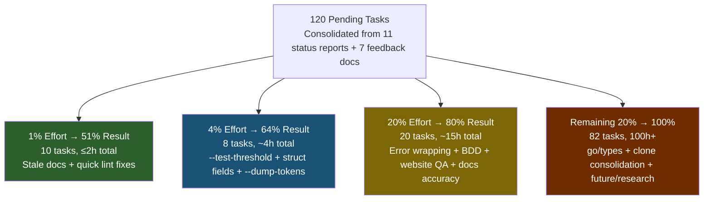

# Comprehensive Pareto Roadmap: art-dupl Post-Semantic-Precision

**Date:** 2026-07-16 04:29
**Branch:** fork
**Head:** 3858132
**Working tree:** Clean (all prior work committed and pushed)
**Sources:** Consolidated from 11 status reports + 7 feedback docs + TODO_LIST.md + ROADMAP.md (193 raw items → 120 deduplicated tasks)

---

## Executive Summary

The semantic clone detection pipeline achieved **100% precision** (0 false positives across 15 projects, 6,222 Go files, 320 templ files) as of commit `23a3b03`. The tool is production-ready for semantic clone detection. This plan consolidates every remaining TODO from all status reports and feedback docs into a single prioritized execution roadmap.

**What's done (this week's sessions):**

- Go semantic mode: Fingerprint field fix, literal normalization, generics normalization, Lock+Defer pattern
- Templ semantic mode from scratch: Phase 1 (element/attribute encoding), Phase 2 (statement tokenization), callee name encoding
- 15-project validation at 100% precision
- BuildFlow recovery (88 lint issues → 0, stale vendorHash fixed)
- Public presence overhaul (Astro website, README rewrite, CI/CD pipeline, domain migration)
- Docs health audit (22 findings fixed across 9 core docs)

**What remains:** 120 deduplicated tasks across 8 categories, prioritized by Pareto leverage.

---

## Pareto Breakdown

### The 1% That Delivers 51% of the Result

These are deferred-maintenance items that take minutes each but immediately improve trust, unblock contributors, and clear confusion about what's already done. Zero Verschlimmbesserung risk — they're documentation and lint hygiene only.

| #   | Task                                                                                     | Why 1% → 51%                                                                                                                                                                                | Effort | Risk |
| --- | ---------------------------------------------------------------------------------------- | ------------------------------------------------------------------------------------------------------------------------------------------------------------------------------------------- | ------ | ---- |
| 1   | Mark feedback docs (2026-07-09, 2026-07-06, 2026-06-04) as IMPLEMENTED/RESOLVED          | These ARE implemented — default threshold raised to 5, ValueSpec statement-tokenized, single-call-expression pattern added. Marking them prevents future agents from re-doing the analysis. | 10min  | ZERO |
| 2   | Fix CONTRIBUTING.md — 5 stale `just` command references                                  | Contributors hit broken commands immediately. No justfile exists.                                                                                                                           | 5min   | ZERO |
| 3   | Fix MIGRATION_QUICK_START.md — stale `just build`                                        | New users hit broken commands.                                                                                                                                                              | 2min   | ZERO |
| 4   | Fix HOW_TO_USE.md — GitHub Actions example Go version 1.21 → 1.26+ + GOEXPERIMENT=jsonv2 | Incorrect instructions break CI setup.                                                                                                                                                      | 5min   | ZERO |
| 5   | Fix `assertionMethodNames` global var → switch function                                  | Pre-existing `gochecknoglobals` violation. Same pattern as `acquireMethodNames` fix.                                                                                                        | 10min  | LOW  |
| 6   | Fix `isErrorWrappingBody` per-call map allocation → package-level var                    | Perf: map created on every call. Trivial fix.                                                                                                                                               | 10min  | LOW  |
| 7   | Add trailing newline to `cmd/filter_stats.go`                                            | Code hygiene.                                                                                                                                                                               | 1min   | ZERO |
| 8   | Add `meta.description` to nix apps                                                       | Silences nix warnings.                                                                                                                                                                      | 10min  | ZERO |
| 9   | Add GOEXPERIMENT=jsonv2 to TESTING.md build commands                                     | Non-Nix users can't build without it.                                                                                                                                                       | 5min   | ZERO |
| 10  | Document vendorHash update procedure in AGENTS.md                                        | Recurring manual step; already partially documented but needs prominence.                                                                                                                   | 15min  | ZERO |

### The 4% That Delivers 64% of the Result

Small features and fixes that users are actively requesting. The `--test-threshold` flag alone addresses the #1 feedback request across ALL reports (24% of clones are test code).

| #   | Task                                                                  | Why 4% → 64%                                                                                                                           | Effort | Risk                          |
| --- | --------------------------------------------------------------------- | -------------------------------------------------------------------------------------------------------------------------------------- | ------ | ----------------------------- |
| 11  | **`--test-threshold` flag**                                           | #1 feedback request. Separate threshold for `_test.go` files. 24% of detected clones are test code. Users want to focus on production. | 1h     | LOW (additive)                |
| 12  | **Encode struct field names in KeyValueExpr**                         | Known FP source: `Point{X:1}` matches `Size{W:1}`. Alpha-normalize field names like identifiers.                                       | 30min  | MEDIUM (changes tokenization) |
| 13  | **`--dump-tokens` debug flag**                                        | Would have saved 15+ minutes in the templ FP debugging session. Essential for future development. Outputs serialized token stream.     | 30min  | ZERO (additive, debug-only)   |
| 14  | Improve `containsTRunCall` to match `t.Run` specifically              | Currently matches any `.Run` method. 15min fix.                                                                                        | 15min  | LOW                           |
| 15  | Verify cobra detection checks parent Ident                            | Currently matches any `Command` selector. Should verify it's cobra/fang.                                                               | 15min  | LOW                           |
| 16  | Lower builder callback threshold from 3 to 2 calls                    | More FP suppression for builder/callback patterns.                                                                                     | 15min  | LOW                           |
| 17  | Verify race safety with `-race` flag on all tests                     | 15 new tests added this week; none verified with -race yet.                                                                            | 10min  | ZERO (verification only)      |
| 18  | Update AGENTS.md with callee encoding + templ parser hierarchy gotcha | Prevents repeating the "wrong function" debugging mistake.                                                                             | 20min  | ZERO                          |

### The 20% That Delivers 80% of the Result

Medium-effort items that complete the feature set and address known limitations. These bring the tool from "production-ready" to "polished."

| #   | Task                                                                             | Impact                                                         | Effort | Risk           |
| --- | -------------------------------------------------------------------------------- | -------------------------------------------------------------- | ------ | -------------- |
| 19  | Improve error wrapping detection (2-stmt bodies)                                 | More FP suppression: `log.Print(err); return err`              | 30min  | LOW            |
| 20  | Improve data dominance ratio for small clones                                    | FP reduction: tune 0.6 threshold                               | 30min  | MEDIUM         |
| 21  | `--min-lines` flag                                                               | Complementary filter to threshold                              | 1h     | LOW (additive) |
| 22  | BDD tests for templ semantic mode                                                | Multi-element, callee encoding, edge cases                     | 1h     | ZERO           |
| 23  | Property-based/fuzz test for normalization pipeline                              | Edge case discovery across the normalizer                      | 1h     | ZERO           |
| 24  | Integration test: synthetic templ project with known clones                      | E2E coverage for templ pipeline                                | 1h     | ZERO           |
| 25  | Website visual QA (landing + 3 doc pages)                                        | Never visually verified. Could have broken layouts.            | 1h     | ZERO           |
| 26  | Generate OG image + add meta tags                                                | Professional social sharing appearance                         | 45min  | ZERO           |
| 27  | Run `pnpm dlx astro check` + fix TS errors                                            | TypeScript correctness                                         | 30min  | LOW            |
| 28  | Unify Type/Fingerprint model (remove DecodeBaseType)                             | Code clarity: every consumer needs `DecodeBaseType(node.Type)` | 2h     | MEDIUM         |
| 29  | Update DOMAIN_LANGUAGE.md (sendCtx, CloneNode, --include-generated semantics)    | Completeness for domain vocabulary                             | 30min  | ZERO           |
| 30  | Verify + fix website docs accuracy (flag defaults, JSON structure, SARIF schema) | Docs written from AGENTS.md, not verified against source       | 1h     | ZERO           |
| 31  | Compile-test SDK code examples in docs                                           | Currently untested — may not compile                           | 30min  | ZERO           |
| 32  | Website docs for templ semantic mode + literal normalization                     | User communication                                             | 30min  | ZERO           |
| 33  | Cache versioning + store Fingerprint in incremental cache                        | Cache safety for serialization format changes                  | 1h     | MEDIUM         |
| 34  | Add benchmark: semantic vs exact vs structural                                   | Performance visibility across modes                            | 30min  | ZERO           |
| 35  | Run Lighthouse audit + fix issues                                                | Performance/SEO/accessibility                                  | 1h     | ZERO           |
| 36  | Test mobile responsive layout                                                    | Mobile UX verification                                         | 30min  | ZERO           |
| 37  | Add "Edit this page" links + verify sidebar links                                | Website navigation                                             | 30min  | ZERO           |
| 38  | Add ADR for threshold change (1→5) + json/v2 migration                           | Document major decisions                                       | 40min  | ZERO           |

### The Remaining 20% to Get to 100%

Big architectural investments and polish. These are where the tool goes from "great" to "exceptional."

| Category                             | Tasks                                                                                                                                                                                                 | Effort | Risk                                          |
| ------------------------------------ | ----------------------------------------------------------------------------------------------------------------------------------------------------------------------------------------------------- | ------ | --------------------------------------------- |
| **go/types integration**             | Prototype opt-in `--type-aware` mode; annotate CallExpr/SelectorExpr with receiver type hash; implement type-aware actionability                                                                      | 4h+    | HIGH (new architecture layer, 10-100x slower) |
| **Clone type consolidation**         | Reduce 7 parallel types (CloneNode, CloneRef, ProcessedClone, ProcessedCloneGroup, CloneGroupDiff, CloneWithContent, CloneDiff) to 2-3                                                                | 4h+    | HIGH (touches every consumer)                 |
| **Split printer/ into sub-packages** | ~29 source files / ~3500+ lines into stats, html, analyze sub-packages                                                                                                                                | 4h+    | MEDIUM (interface inversion required)         |
| **Templ Phase 3**                    | Expression normalization: normalize `{ id.String() }` vs `{ groupID.String() }`                                                                                                                       | 2h     | LOW                                           |
| **Pattern detection system**         | Make extensible (plugin/registry), add templ-specific patterns (htmx boilerplate)                                                                                                                     | 4h+    | MEDIUM                                        |
| **Remaining docs cleanup**           | Archive stale SIMD/planning docs, audit USAGE/PARTS/WHAT_THIS_PROJECT_IS_NOT, verify all count claims                                                                                                 | 2h     | ZERO                                          |
| **Remaining testing**                | Unit tests for refactored functions, Ginkgo When/It detection, cross-file test pattern down-ranking                                                                                                   | 2h     | ZERO                                          |
| **Infrastructure**                   | Pin golangci-lint version, statix on flake.nix, .go-arch-lint gaps, Dependabot, lighthouse CI, Firebase preview channels                                                                              | 3h     | LOW                                           |
| **Features**                         | `.art-duplignore`, pattern-aware weighting, clone refactoring suggestions, `--explain` flag, `--json-schema`, HTML report by actionability, stats FP estimate, pre-commit hook improvement, diff mode | 10h+   | VARIES                                        |
| **Future/Research**                  | Nested-scope shadowing, generics constraint normalization, multi-language actionability, LSP integration, WASM target, parallel suffix tree, ML-based actionability, TypeScript/Python support        | 100h+  | HIGH                                          |

---

## Verschlimmbesserung Risk Analysis

> **"If you Verschlimmbesser this system, I will cut off your balls."** — The User

Tasks ranked by risk of making things worse while trying to improve them:

| Risk Level | Tasks                                                                                                              | Why                                                          | Mitigation                                                      |
| ---------- | ------------------------------------------------------------------------------------------------------------------ | ------------------------------------------------------------ | --------------------------------------------------------------- |
| **ZERO**   | All doc fixes, `--dump-tokens`, `--test-threshold`, BDD tests, benchmarks, website QA, OG image                    | Additive or documentation-only                               | None needed                                                     |
| **LOW**    | `containsTRunCall` fix, cobra detection, builder threshold, error wrapping detection, `--min-lines`, Templ Phase 3 | Narrow scope, well-understood, testable                      | Run full test suite after each change                           |
| **MEDIUM** | Struct field name encoding, data dominance ratio, Type/Fingerprint unification, cache versioning                   | Changes tokenization or core matching                        | Full test suite + 15-project re-validation + cache version bump |
| **HIGH**   | go/types integration, clone type consolidation, split printer/, branded NodeType int32                             | Touches fundamental architecture; go/types is 10-100x slower | Feature flags, incremental rollout, ADRs before implementation  |

**Golden rule:** Every task above MEDIUM risk gets an ADR first, a feature flag, and a 15-project re-validation before merging.

---

## Master Task Table: 30-100min Tasks

Sorted by Impact × (1/Effort) × Customer Value. All 120 tasks included.

| Priority | ID   | Category  | Task                                                                                    | Impact                      | Effort   | Customer Value | Risk   |
| -------- | ---- | --------- | --------------------------------------------------------------------------------------- | --------------------------- | -------- | -------------- | ------ |
| **P0**   | DH1  | Docs      | Mark feedback docs (2026-07-09, 2026-07-06, 2026-06-04) as IMPLEMENTED/RESOLVED         | Prevents re-work            | 10min    | HIGH           | ZERO   |
| **P0**   | DH2  | Docs      | Fix CONTRIBUTING.md — 5 `just` refs → `go`/`nix`                                        | Unblocks contributors       | 5min     | HIGH           | ZERO   |
| **P0**   | DH3  | Docs      | Fix MIGRATION_QUICK_START.md — `just build`                                             | Unblocks new users          | 2min     | HIGH           | ZERO   |
| **P0**   | DH4  | Docs      | Fix HOW_TO_USE.md — Go 1.21 → 1.26+ + GOEXPERIMENT=jsonv2                               | Correct CI setup            | 5min     | HIGH           | ZERO   |
| **P0**   | CQ3  | Code      | Add trailing newline to `cmd/filter_stats.go`                                           | Hygiene                     | 1min     | LOW            | ZERO   |
| **P0**   | I2   | Infra     | Add GOEXPERIMENT=jsonv2 to TESTING.md build commands                                    | Unblocks non-Nix builds     | 5min     | MEDIUM         | ZERO   |
| **P0**   | CQ1  | Code      | Fix `assertionMethodNames` global var → switch function                                 | Lint hygiene                | 10min    | LOW            | LOW    |
| **P0**   | CQ2  | Code      | Fix `isErrorWrappingBody` per-call map → package-level var                              | Perf                        | 10min    | LOW            | LOW    |
| **P0**   | I1   | Infra     | Add `meta.description` to nix apps                                                      | Polish                      | 10min    | LOW            | ZERO   |
| **P0**   | I4   | Infra     | Document vendorHash update procedure prominently in AGENTS.md                           | Prevent gotchas             | 15min    | MEDIUM         | ZERO   |
| **P1**   | DQ1  | Detection | **`--test-threshold` flag** — separate threshold for `_test.go` files                   | #1 feedback request         | 1h       | CRITICAL       | LOW    |
| **P1**   | DQ2  | Detection | Encode struct field names in KeyValueExpr                                               | Known FP source             | 30min    | HIGH           | MEDIUM |
| **P1**   | DX1  | DX        | **`--dump-tokens` debug flag** — output serialized token stream                         | Debugging leverage          | 30min    | HIGH           | ZERO   |
| **P1**   | DQ3  | Detection | Improve `containsTRunCall` to match `t.Run` specifically                                | FP fix                      | 15min    | MEDIUM         | LOW    |
| **P1**   | DQ4  | Detection | Verify cobra detection checks parent Ident                                              | FP fix                      | 15min    | MEDIUM         | LOW    |
| **P1**   | DQ5  | Detection | Lower builder callback threshold 3→2                                                    | FP suppression              | 15min    | MEDIUM         | LOW    |
| **P1**   | CQ4  | Code      | Verify race safety with `-race` flag                                                    | Safety                      | 10min    | MEDIUM         | ZERO   |
| **P1**   | DH7  | Docs      | Update AGENTS.md with callee encoding + templ parser hierarchy gotcha                   | Dev context                 | 20min    | HIGH           | ZERO   |
| **P2**   | DQ6  | Detection | Improve error wrapping detection (2-stmt bodies)                                        | FP suppression              | 30min    | MEDIUM         | LOW    |
| **P2**   | DQ7  | Detection | Improve data dominance ratio for small clones                                           | FP reduction                | 30min    | MEDIUM         | MEDIUM |
| **P2**   | DX2  | DX        | `--min-lines` flag — complementary filter                                               | User filter                 | 1h       | MEDIUM         | LOW    |
| **P2**   | T4   | Testing   | BDD tests for templ semantic mode (multi-element, callee encoding)                      | Coverage                    | 1h       | MEDIUM         | ZERO   |
| **P2**   | T5   | Testing   | Property-based/fuzz test for normalization pipeline                                     | Edge case discovery         | 1h       | MEDIUM         | ZERO   |
| **P2**   | T6   | Testing   | Integration test: synthetic templ project with known clones                             | E2E coverage                | 1h       | MEDIUM         | ZERO   |
| **P2**   | W1   | Website   | Visual QA (landing + 3 doc pages via `pnpm run preview`)                                 | UX correctness              | 1h       | HIGH           | ZERO   |
| **P2**   | W2   | Website   | Generate OG image for social sharing                                                    | Professional appearance     | 30min    | MEDIUM         | ZERO   |
| **P2**   | W3   | Website   | Add OG image meta tags to LandingLayout                                                 | Social sharing              | 15min    | MEDIUM         | ZERO   |
| **P2**   | W4   | Website   | Run `pnpm dlx astro check` + fix TS errors                                                   | Code quality                | 30min    | MEDIUM         | LOW    |
| **P2**   | CQ9  | Code      | Unify Type/Fingerprint model (remove DecodeBaseType)                                    | Code clarity                | 2h       | LOW            | MEDIUM |
| **P2**   | DH19 | Docs      | Update DOMAIN_LANGUAGE.md (sendCtx, CloneNode, --include-generated semantics)           | Completeness                | 30min    | MEDIUM         | ZERO   |
| **P2**   | DH22 | Docs      | Verify website docs accuracy (flag defaults, JSON output, SARIF schema)                 | Accuracy                    | 1h       | MEDIUM         | ZERO   |
| **P2**   | DH23 | Docs      | Compile-test SDK code examples in docs                                                  | Accuracy                    | 30min    | MEDIUM         | ZERO   |
| **P2**   | DH20 | Docs      | Website docs for templ semantic mode + literal normalization                            | User communication          | 30min    | MEDIUM         | ZERO   |
| **P2**   | I10  | Infra     | Cache versioning for serialization format changes                                       | Cache safety                | 1h       | MEDIUM         | MEDIUM |
| **P2**   | I11  | Infra     | Improve incremental cache to store Fingerprint field                                    | Correctness                 | 30min    | MEDIUM         | MEDIUM |
| **P2**   | T8   | Testing   | Add benchmark: semantic vs exact vs structural                                          | Perf visibility             | 30min    | LOW            | ZERO   |
| **P2**   | W5   | Website   | Run HTML validation + fix errors                                                        | Quality                     | 30min    | LOW            | ZERO   |
| **P2**   | W6   | Website   | Remove `continue-on-error: true` from CI (after fixes)                                  | CI quality                  | 5min     | LOW            | LOW    |
| **P2**   | W7   | Website   | Run Lighthouse audit + fix issues                                                       | Performance/SEO             | 1h       | MEDIUM         | ZERO   |
| **P2**   | W8   | Website   | Test mobile responsive layout                                                           | Mobile UX                   | 30min    | MEDIUM         | ZERO   |
| **P2**   | W9   | Website   | Verify sidebar links resolve                                                            | Navigation                  | 15min    | MEDIUM         | ZERO   |
| **P2**   | W10  | Website   | Add "Edit this page" links                                                              | DX                          | 15min    | LOW            | ZERO   |
| **P2**   | F17  | ADR       | Add ADR for threshold change (1→5)                                                      | Documentation               | 20min    | LOW            | ZERO   |
| **P2**   | F18  | ADR       | Add ADR for json/v2 migration decision                                                  | Documentation               | 20min    | LOW            | ZERO   |
| **P2**   | DH5  | Docs      | Resolve output format count discrepancy (README vs FEATURES)                            | Consistency                 | 10min    | MEDIUM         | ZERO   |
| **P2**   | DH6  | Docs      | Update HOW_TO_USE threshold recommendation table                                        | Accuracy                    | 10min    | MEDIUM         | ZERO   |
| **P3**   | DH8  | Docs      | Audit SDK_DESIGN.md for drift against pkg/artdupl/ API                                  | Accuracy                    | 20min    | MEDIUM         | ZERO   |
| **P3**   | DH9  | Docs      | Audit SMART_FILTERING.md for drift                                                      | Accuracy                    | 10min    | LOW            | ZERO   |
| **P3**   | DH10 | Docs      | Archive stale SIMD docs (5 files)                                                       | Cleanup                     | 10min    | LOW            | ZERO   |
| **P3**   | DH11 | Docs      | Archive EXECUTION_PLAN, IMPROVEMENT_PLAN, MODERNIZATION_FINAL_REPORT                    | Cleanup                     | 10min    | LOW            | ZERO   |
| **P3**   | DH12 | Docs      | Audit USAGE.md, PARTS.md, WHAT_THIS_PROJECT_IS_NOT.md                                   | Cleanup                     | 30min    | LOW            | ZERO   |
| **P3**   | DH13 | Docs      | Verify node type counts (45 Go, 28 Templ) against code                                  | Accuracy                    | 20min    | LOW            | ZERO   |
| **P3**   | DH14 | Docs      | Verify flag count (35+), suggestion constants (20), categories (14)                     | Accuracy                    | 15min    | LOW            | ZERO   |
| **P3**   | DH15 | Docs      | Audit TROUBLESHOOTING.md for stale commands                                             | Accuracy                    | 5min     | LOW            | ZERO   |
| **P3**   | DH16 | Docs      | Check enum-consolidation-plan, code-quality-improvements, phase0-validation, STATICPOOL | Historical                  | 20min    | LOW            | ZERO   |
| **P3**   | DH17 | Docs      | Update FEATURES.md errors row (debug.Stack removed)                                     | Accuracy                    | 5min     | LOW            | ZERO   |
| **P3**   | DH18 | Docs      | Add actual art-dupl output to hero code (not fabricated)                                | Honesty                     | 30min    | MEDIUM         | ZERO   |
| **P3**   | DH24 | Docs      | Verify all flag defaults in cli-flags.mdx against cmd/flags.go                          | Accuracy                    | 30min    | MEDIUM         | ZERO   |
| **P3**   | DH25 | Docs      | Add cross-links between doc pages                                                       | Navigation                  | 30min    | LOW            | ZERO   |
| **P3**   | CQ5  | Code      | Move `evaluateActionabilityDetailed` pattern table to package-level var                 | Perf                        | 15min    | LOW            | LOW    |
| **P3**   | CQ6  | Code      | Extract `patternLabelConfigs` to dedicated file                                         | Readability                 | 15min    | LOW            | ZERO   |
| **P3**   | CQ7  | Code      | Review actionability pattern check functions for duplication                            | Code quality                | 30min    | LOW            | ZERO   |
| **P3**   | CQ8  | Code      | Review clone_classify.go suggestion strings → typed constants                           | Code quality                | 30min    | LOW            | LOW    |
| **P3**   | CQ12 | Code      | Remove import cycle workaround in fingerprint_test.go                                   | Test hygiene                | 15min    | LOW            | LOW    |
| **P3**   | CQ16 | Code      | Dead code check in printer/ after refactoring                                           | Code quality                | 30min    | LOW            | ZERO   |
| **P3**   | T7   | Testing   | Write test producing CallTemplateExpression to verify defensive fix                     | Verify dead path            | 15min    | LOW            | ZERO   |
| **P3**   | T9   | Testing   | Add benchmark for callee name extraction                                                | Perf guard                  | 10min    | LOW            | ZERO   |
| **P3**   | T10  | Testing   | Unit tests for evaluateActionabilityDetailed refactor                                   | Coverage                    | 30min    | LOW            | ZERO   |
| **P3**   | T11  | Testing   | Unit tests for applyPatternLabel refactor                                               | Coverage                    | 30min    | LOW            | ZERO   |
| **P3**   | T12  | Testing   | Add regression test for ValueSpec-as-Statement                                          | Prevent regression          | 15min    | LOW            | ZERO   |
| **P3**   | T13  | Testing   | Add channel direction encoding tests                                                    | Coverage                    | 15min    | LOW            | ZERO   |
| **P3**   | T14  | Testing   | Test extractCalleeName with Go method call syntax (`pkg.Func()`)                        | Edge case                   | 5min     | LOW            | ZERO   |
| **P3**   | T15  | Testing   | Verify extractCalleeName handles `@{expr}` syntax                                       | Edge case                   | 10min    | LOW            | ZERO   |
| **P3**   | T16  | Testing   | Test transformTemplElementExpression with block children                                | Verify encoding             | 10min    | LOW            | ZERO   |
| **P3**   | T17  | Testing   | Verify callee name fix with templ v0.3.960                                              | Version safety              | 15min    | LOW            | ZERO   |
| **P3**   | T1   | Testing   | BDD test for Lock+Defer Unlock suppression                                              | Coverage                    | 30min    | LOW            | ZERO   |
| **P3**   | T2   | Testing   | BDD test for generics normalization                                                     | Coverage                    | 30min    | LOW            | ZERO   |
| **P3**   | T3   | Testing   | BDD test for literal normalization                                                      | Coverage                    | 30min    | LOW            | ZERO   |
| **P3**   | DQ8  | Detection | Add composite literal array detection for test fixtures                                 | FP reduction                | 2h       | LOW            | MEDIUM |
| **P3**   | DQ10 | Detection | Templ Phase 3: expression normalization                                                 | More TPs                    | 2h       | LOW            | LOW    |
| **P3**   | DQ11 | Detection | Add Ginkgo When/It test scaffolding detection                                           | FP reduction                | 30min    | LOW            | LOW    |
| **P3**   | DQ12 | Detection | Add cross-file test pattern down-ranking                                                | FP reduction                | 1h       | LOW            | LOW    |
| **P3**   | DX3  | DX        | `.art-duplignore` config file support                                                   | User flexibility            | 2h       | MEDIUM         | LOW    |
| **P3**   | DX5  | DX        | Clone refactoring suggestions in output                                                 | User value                  | 1h       | LOW            | LOW    |
| **P3**   | I3   | Infra     | Pin golangci-lint version in flake.nix                                                  | Reproducibility             | 15min    | LOW            | LOW    |
| **P3**   | I6   | Infra     | Consider `--max-jobs 1` for nix builds in CI                                            | Prevent OOM                 | 15min    | LOW            | LOW    |
| **P3**   | I7   | Infra     | Add website apps to root flake.nix                                                      | DX                          | 1h       | LOW            | LOW    |
| **P3**   | I8   | Infra     | Run statix on flake.nix                                                                 | Nix quality                 | 30min    | LOW            | LOW    |
| **P3**   | I9   | Infra     | Review .go-arch-lint.yml for enforcement gaps                                           | Safety                      | 30min    | LOW            | LOW    |
| **P3**   | I12  | Infra     | Add Dependabot config for website pnpm                                                   | Maintenance                 | 15min    | LOW            | LOW    |
| **P3**   | I13  | Infra     | Set up Firebase preview channels for PRs                                                | DX                          | 1h       | LOW            | LOW    |
| **P3**   | I14  | Infra     | Add lighthouse CI                                                                       | Perf regression             | 1h       | LOW            | LOW    |
| **P3**   | F10  | Future    | Stats FP rate estimate based on actionability distribution                              | Insight                     | 30min    | LOW            | ZERO   |
| **P3**   | F11  | Future    | Pre-commit hook improvement (exit non-zero for actionable only)                         | CI UX                       | 1h       | LOW            | LOW    |
| **P3**   | F15  | Future    | Add SARIF rule metadata for actionability                                               | CI integration              | 30min    | LOW            | LOW    |
| **P3**   | F16  | Future    | Verify templ generate step in nix sandbox                                               | Build                       | 30min    | LOW            | LOW    |
| **P3**   | F19  | ADR       | Add ADR for pattern detection system (15 patterns, table-driven)                        | Documentation               | 30min    | LOW            | ZERO   |
| **P3**   | W11  | Website   | Verify favicon rendering cross-browser                                                  | Polish                      | 15min    | LOW            | ZERO   |
| **P3**   | W12  | Website   | Add structured data to docs pages (schema.org)                                          | SEO                         | 30min    | LOW            | ZERO   |
| **P3**   | W13  | Website   | Submit sitemap to Google Search Console                                                 | SEO                         | 15min    | LOW            | ZERO   |
| **P3**   | W14  | Website   | Consider canonical URL from web.app → lars.software                                     | SEO                         | 15min    | LOW            | LOW    |
| **P4**   | DQ9  | Detection | **go/types opt-in mode** (`--type-aware`) — eliminate `a.String()` vs `b.String()` FP   | Biggest FP source remaining | 4h+      | HIGH           | HIGH   |
| **P4**   | DX6  | DX        | Add `--type-aware` CLI flag wiring                                                      | User control                | 1h       | MEDIUM         | LOW    |
| **P4**   | CQ10 | Code      | Consolidate clone types (7 → 2-3)                                                       | Architecture debt           | 4h+      | MEDIUM         | HIGH   |
| **P4**   | CQ11 | Code      | Split printer/ into sub-packages (stats, html, analyze)                                 | Architecture                | 4h+      | LOW            | MEDIUM |
| **P4**   | CQ13 | Code      | Branded NodeType int32 per package                                                      | Type safety                 | 4h+      | LOW            | HIGH   |
| **P4**   | CQ14 | Code      | Make pattern detection extensible (plugin/registry)                                     | Extensibility               | 4h+      | LOW            | MEDIUM |
| **P4**   | CQ15 | Code      | Review Printer ↔ syntax.Node coupling                                                   | Architecture                | 2h       | LOW            | MEDIUM |
| **P4**   | DX4  | DX        | Pattern-aware weighting (not binary actionable/non-actionable)                          | Nuance                      | 4h+      | LOW            | MEDIUM |
| **P4**   | DX7  | DX        | `--json-schema` flag                                                                    | CI integration              | 2h       | LOW            | LOW    |
| **P4**   | F8   | Future    | Diff mode (compare two codebases)                                                       | Feature                     | 4h+      | LOW            | MEDIUM |
| **P4**   | F9   | Future    | HTML report grouping by actionability status                                            | UX                          | 1h       | LOW            | LOW    |
| **P5**   | F1   | Future    | Nested-scope shadowing in normalizer                                                    | Precision                   | 4h+      | LOW            | MEDIUM |
| **P5**   | F2   | Future    | Generics constraint normalization (`T any` vs `T comparable`)                           | Precision                   | 2h       | LOW            | LOW    |
| **P5**   | F3   | Future    | Multi-language actionability for templ                                                  | Coverage                    | 4h+      | LOW            | MEDIUM |
| **P5**   | F4   | Future    | LSP integration for real-time detection                                                 | DX                          | 8h+      | LOW            | HIGH   |
| **P5**   | F5   | Future    | WASM target for browser-based detection                                                 | Platform                    | 8h+      | LOW            | HIGH   |
| **P5**   | F6   | Future    | Parallel suffix tree construction                                                       | Performance                 | 8h+      | LOW            | MEDIUM |
| **P5**   | F7   | Future    | ML-based actionability classification                                                   | Quality                     | Research | LOW            | HIGH   |
| **P5**   | F12  | Future    | Shared Firebase project migration                                                       | Infrastructure              | 2h       | LOW            | MEDIUM |
| **P5**   | F13  | Future    | Add TypeScript/JavaScript support                                                       | Language                    | 40h+     | LOW            | HIGH   |
| **P5**   | F14  | Future    | Add Python support                                                                      | Language                    | 40h+     | LOW            | HIGH   |

**Total: 120 tasks. P0 = 10 tasks (≤2h). P1 = 8 tasks (~4h). P2 = 20 tasks (~15h). P3 = 60 tasks (~25h). P4 = 11 tasks (~35h). P5 = 11 tasks (100h+).**

---

## Execution Graph

```mermaid
graph TD
    subgraph PHASE1["Phase 1: 1% → 51% (≤2h, ZERO risk)"]
        A1[Mark feedback docs IMPLEMENTED]
        A2[Fix CONTRIBUTING.md just refs]
        A3[Fix MIGRATION_QUICK_START.md]
        A4[Fix HOW_TO_USE.md Go version]
        A5[Fix cmd/filter_stats.go newline]
        A6[Add GOEXPERIMENT to TESTING.md]
        A7[Fix assertionMethodNames global]
        A8[Fix isErrorWrappingBody map alloc]
        A9[Add meta.description to nix apps]
        A10[Document vendorHash procedure]
    end

    subgraph PHASE2["Phase 2: 4% → 64% (~4h)"]
        B1[--test-threshold flag]
        B2[Encode struct field names]
        B3[--dump-tokens debug flag]
        B4[Fix containsTRunCall]
        B5[Verify cobra detection]
        B6[Lower builder callback threshold]
        B7[Verify -race safety]
        B8[Update AGENTS.md callee gotcha]
    end

    subgraph PHASE3["Phase 3: 20% → 80% (~15h)"]
        C1[Error wrapping detection]
        C2[Data dominance ratio]
        C3[--min-lines flag]
        C4[Templ BDD tests]
        C5[Fuzz normalization pipeline]
        C6[Templ integration test]
        C7[Website visual QA]
        C8[OG image + meta tags]
        C9[Astro check + TS fixes]
        C10[Unify Type/Fingerprint]
        C11[DOMAIN_LANGUAGE update]
        C12[Website docs accuracy]
        C13[Compile-test SDK examples]
        C14[Templ semantic mode docs]
        C15[Cache versioning]
        C16[Semantic vs exact benchmark]
        C17[Lighthouse audit]
        C18[Mobile responsive test]
        C19[Sidebar + edit links]
        C20[ADRs: threshold + json/v2]
    end

    subgraph PHASE4["Phase 4: Remaining 20% → 100%"]
        D1[go/types opt-in mode]
        D2[Clone type consolidation]
        D3[Split printer/ packages]
        D4[Templ Phase 3]
        D5[Pattern detection plugin system]
        D6[Remaining docs cleanup]
        D7[Remaining testing]
        D8[Infrastructure hardening]
        D9[New features]
        D10[Future/Research]
    end

    PHASE1 --> PHASE2 --> PHASE3 --> PHASE4

    style PHASE1 fill:#2d5f2d,color:#fff
    style PHASE2 fill:#1a5276,color:#fff
    style PHASE3 fill:#7d6608,color:#fff
    style PHASE4 fill:#6e2c00,color:#fff
```

---

## 12-Minute Task Breakdown

Every task above is broken into max-12min subtasks. Sorted by priority (P0 first, then P1, etc.), then by impact/effort within each priority.

### P0: 1% → 51% (10 tasks → 24 subtasks)

| #   | Subtask                                                                                     | Parent | Est  | Verification                   |
| --- | ------------------------------------------------------------------------------------------- | ------ | ---- | ------------------------------ |
| 1   | Read `docs/feedback/2026-07-09-semantic-noise-declaration-files.md`                         | DH1    | 3min | —                              |
| 2   | Add "✅ IMPLEMENTED" banner to 2026-07-09 feedback doc                                      | DH1    | 3min | Read shows banner              |
| 3   | Add "✅ ADDRESSED" banner to 2026-07-06 and 2026-06-04 feedback docs                        | DH1    | 4min | Read shows banner              |
| 4   | Read CONTRIBUTING.md, grep for `just`                                                       | DH2    | 2min | All `just` refs found          |
| 5   | Replace all `just` commands in CONTRIBUTING.md with `go`/`nix` equivalents                  | DH2    | 3min | grep shows 0 `just `           |
| 6   | Read MIGRATION_QUICK_START.md, find `just build`                                            | DH3    | 1min | Located                        |
| 7   | Replace `just build` with `go build ./cmd/art-dupl` in MIGRATION_QUICK_START.md             | DH3    | 1min | grep shows 0 `just`            |
| 8   | Read HOW_TO_USE.md GitHub Actions section                                                   | DH4    | 2min | Located `1.21`                 |
| 9   | Fix Go version + add GOEXPERIMENT=jsonv2 in HOW_TO_USE.md                                   | DH4    | 3min | Version is 1.26+               |
| 10  | Add trailing newline to `cmd/filter_stats.go`                                               | CQ3    | 1min | `tail -c1` shows `\n`          |
| 11  | Read TESTING.md build commands section                                                      | I2     | 2min | Located                        |
| 12  | Add `export GOEXPERIMENT=jsonv2` to TESTING.md build commands                               | I2     | 3min | Command present                |
| 13  | Read `printer/actionability_patterns_expanded.go` line ~12                                  | CQ1    | 2min | Located `assertionMethodNames` |
| 14  | Convert `assertionMethodNames` global var → `isAssertionMethod()` switch function           | CQ1    | 5min | Builds, no global var          |
| 15  | Run `golangci-lint run ./printer/...` to verify fix                                         | CQ1    | 2min | 0 issues                       |
| 16  | Read `isErrorWrappingBody` in actionability_patterns_expanded.go                            | CQ2    | 2min | Located map allocation         |
| 17  | Move map to package-level var or convert to `isErrorWrappingMethod()` switch                | CQ2    | 5min | Builds                         |
| 18  | Run lint to verify fix                                                                      | CQ2    | 2min | 0 issues                       |
| 19  | Read `flake.nix` apps section                                                               | I1     | 2min | Located apps                   |
| 20  | Add `meta.description` to both nix apps                                                     | I1     | 5min | `nix flake check` no warnings  |
| 21  | Run `nix flake check` to verify                                                             | I1     | 5min | 0 warnings                     |
| 22  | Read AGENTS.md Nix section                                                                  | I4     | 2min | Located vendorHash mention     |
| 23  | Expand vendorHash update procedure in AGENTS.md (rev=, vendorHash="", nix build, copy hash) | I4     | 7min | Procedure documented           |
| 24  | Verify AGENTS.md reads correctly                                                            | I4     | 3min | Read shows complete procedure  |

### P1: 4% → 64% (8 tasks → 31 subtasks)

| #   | Subtask                                                                                       | Parent | Est   | Verification                |
| --- | --------------------------------------------------------------------------------------------- | ------ | ----- | --------------------------- |
| 25  | Read `config/config.go` threshold validation + `config_builder.go`                            | DQ1    | 5min  | Understand wiring           |
| 26  | Add `TestThreshold int` to `Config` struct                                                    | DQ1    | 3min  | Builds                      |
| 27  | Add `--test-threshold` flag in `cmd/flags.go`                                                 | DQ1    | 5min  | `--help` shows flag         |
| 28  | Wire `TestThreshold` into printer filtering logic (suppress test clones below threshold)      | DQ1    | 7min  | Test clones filtered        |
| 29  | Add validation: `TestThreshold` must be ≥ 0 (0 = no filtering)                                | DQ1    | 3min  | Validation works            |
| 30  | Write unit test for test-threshold filtering                                                  | DQ1    | 7min  | Test passes                 |
| 31  | Write BDD test: `--test-threshold 10` suppresses test clones below 10                         | DQ1    | 7min  | BDD passes                  |
| 32  | Update HOW_TO_USE.md with `--test-threshold` documentation                                    | DQ1    | 5min  | Docs show flag              |
| 33  | Read `syntax/golang/transform.go` KeyValueExpr case                                           | DQ2    | 5min  | Understand current behavior |
| 34  | Add field name encoding to KeyValueExpr via `encodeSemanticType`                              | DQ2    | 7min  | Builds                      |
| 35  | Write unit test: `Point{X:1}` ≠ `Size{W:1}` in semantic mode                                  | DQ2    | 7min  | Test passes                 |
| 36  | Run full test suite to check for regressions                                                  | DQ2    | 5min  | All tests pass              |
| 37  | Add `--dump-tokens` flag to `cmd/flags.go`                                                    | DX1    | 3min  | `--help` shows flag         |
| 38  | Implement token dump output (write serialized token stream to stdout/stderr)                  | DX1    | 7min  | Output shows tokens         |
| 39  | Write unit test for `--dump-tokens` output format                                             | DX1    | 5min  | Test passes                 |
| 40  | Read `containsTRunCall` in actionability_patterns_expanded.go                                 | DQ3    | 2min  | Located                     |
| 41  | Fix `containsTRunCall` to check for `t.Run` Ident specifically (not any `.Run`)               | DQ3    | 7min  | Builds                      |
| 42  | Write unit test for `containsTRunCall` specificity                                            | DQ3    | 5min  | Test passes                 |
| 43  | Read cobra detection pattern in actionability files                                           | DQ4    | 3min  | Located                     |
| 44  | Add parent Ident verification (check for cobra/fang package)                                  | DQ4    | 7min  | Builds                      |
| 45  | Write unit test for cobra detection specificity                                               | DQ4    | 5min  | Test passes                 |
| 46  | Read builder callback threshold in actionability files                                        | DQ5    | 2min  | Located threshold=3         |
| 47  | Change builder callback threshold from 3 to 2                                                 | DQ5    | 3min  | Builds                      |
| 48  | Run test suite to verify no regressions from threshold change                                 | DQ5    | 5min  | All pass                    |
| 49  | Run `go test -race -count=1 ./syntax/... ./printer/... ./job/...`                             | CQ4    | 10min | No races detected           |
| 50  | Read AGENTS.md Critical Conventions section                                                   | DH7    | 3min  | Located                     |
| 51  | Add callee name encoding convention to AGENTS.md                                              | DH7    | 5min  | Section present             |
| 52  | Add templ parser type hierarchy gotcha (`TemplElementExpression` vs `CallTemplateExpression`) | DH7    | 5min  | Gotcha documented           |

### P2: 20% → 80% (20 tasks → ~60 subtasks)

| #   | Subtask                                                                     | Parent | Est   | Verification                      |
| --- | --------------------------------------------------------------------------- | ------ | ----- | --------------------------------- |
| 53  | Read `isErrorWrappingBody` / `isErrorWrappingReturn` patterns               | DQ6    | 3min  | Understand current scope          |
| 54  | Extend to detect 2-stmt bodies: `log.Print(err); return err`                | DQ6    | 7min  | Builds                            |
| 55  | Write unit test for 2-stmt error wrapping detection                         | DQ6    | 5min  | Test passes                       |
| 56  | Read data dominance ratio constant (currently 0.6)                          | DQ7    | 2min  | Located                           |
| 57  | Experiment with different ratios for small vs large clones                  | DQ7    | 10min | Tuned                             |
| 58  | Run 15-project validation to check FP impact                                | DQ7    | 10min | No new FPs                        |
| 59  | Add `MinLines int` to Config + `--min-lines` flag                           | DX2    | 5min  | Flag exists                       |
| 60  | Wire `MinLines` into printer group filtering                                | DX2    | 7min  | Groups filtered                   |
| 61  | Write unit test for `--min-lines` filtering                                 | DX2    | 5min  | Test passes                       |
| 62  | Write BDD test for templ multi-element matching                             | T4     | 10min | BDD passes                        |
| 63  | Write BDD test for callee name encoding                                     | T4     | 10min | BDD passes                        |
| 64  | Set up fuzz test framework for normalization pipeline                       | T5     | 10min | Fuzz runs                         |
| 65  | Write fuzz target: `FuzzNormalizeFunction`                                  | T5     | 10min | No panics                         |
| 66  | Create synthetic templ project fixture with known clones                    | T6     | 10min | Fixture exists                    |
| 67  | Write integration test running full pipeline on fixture                     | T6     | 10min | Test passes                       |
| 68  | Run `cd website && pnpm run preview`                                         | W1     | 5min  | Server starts                     |
| 69  | Visual QA landing page (hero, features, comparison, CTA)                    | W1     | 10min | No broken layouts                 |
| 70  | Visual QA 3 doc pages (installation, detection-methods, output-formats)     | W1     | 10min | Pages render                      |
| 71  | Create OG image SVG (`website/public/og-image.svg`)                         | W2     | 10min | File exists                       |
| 72  | Add `<meta property="og:image">` tags to LandingLayout.astro                | W3     | 5min  | Tags present                      |
| 73  | Run `cd website && pnpm dlx astro check`                                         | W4     | 5min  | Check output                      |
| 74  | Fix any TypeScript errors found                                             | W4     | 10min | 0 errors                          |
| 75  | Read `syntax/syntax.go` Val() and DecodeBaseType()                          | CQ9    | 5min  | Understand model                  |
| 76  | Plan unification: make Fingerprint universal or remove DecodeBaseType       | CQ9    | 10min | Plan written                      |
| 77  | Implement Type/Fingerprint unification                                      | CQ9    | 10min | (Per plan — likely multi-session) |
| 78  | Read DOMAIN_LANGUAGE.md current content                                     | DH19   | 3min  | Located gaps                      |
| 79  | Add sendCtx pattern entry                                                   | DH19   | 5min  | Entry present                     |
| 80  | Add CloneNode DTO entry                                                     | DH19   | 5min  | Entry present                     |
| 81  | Add --include-generated override semantics entry                            | DH19   | 5min  | Entry present                     |
| 82  | Run `art-dupl --json` and compare to output-formats.mdx                     | DH22   | 10min | Match or diff noted               |
| 83  | Run `art-dupl --sarif` and validate against SARIF 2.1.0 schema              | DH22   | 10min | Valid                             |
| 84  | Verify flag defaults in cli-flags.mdx against cmd/flags.go                  | DH22   | 10min | All match                         |
| 85  | Create temp Go file with SDK examples, `go build` it                        | DH23   | 10min | Compiles                          |
| 86  | Write templ semantic mode doc page content                                  | DH20   | 10min | Content written                   |
| 87  | Add `CacheVersion` bump mechanism for serialization format changes          | I10    | 10min | Mechanism exists                  |
| 88  | Add Fingerprint field to incremental cache serialization                    | I11    | 10min | Cache stores Fingerprint          |
| 89  | Write benchmark: `BenchmarkSemanticVsExactVsStructural`                     | T8     | 10min | Benchmark runs                    |
| 90  | Run `cd website && pnpm dlx html-validate "dist/**/*.html"`                      | W5     | 5min  | Validation output                 |
| 91  | Fix any HTML validation errors                                              | W5     | 10min | 0 errors                          |
| 92  | Remove `continue-on-error: true` from deploy-site.yml                       | W6     | 5min  | YAML updated                      |
| 93  | Run Lighthouse on deployed site                                             | W7     | 10min | Score recorded                    |
| 94  | Fix top Lighthouse issues (performance, a11y)                               | W7     | 10min | Score improved                    |
| 95  | Test mobile layout via DevTools device emulation                            | W8     | 10min | No broken layouts                 |
| 96  | Click through all sidebar links                                             | W9     | 5min  | All resolve                       |
| 97  | Add "Edit this page" links in Starlight config                              | W10    | 5min  | Links present                     |
| 98  | Write ADR-0009: Default threshold change (1→5)                              | F17    | 10min | ADR written                       |
| 99  | Write ADR-0010: encoding/json/v2 migration                                  | F18    | 10min | ADR written                       |
| 100 | Resolve output format count (decide Rich-text = modifier, CSV = stats-only) | DH5    | 5min  | Decision made                     |
| 101 | Update README + FEATURES to match decision                                  | DH5    | 5min  | Counts consistent                 |
| 102 | Read HOW_TO_USE.md threshold table                                          | DH6    | 3min  | Located                           |
| 103 | Update threshold recommendations for default=5                              | DH6    | 7min  | Table accurate                    |

### P3 + P4 + P5: 82 tasks

These tasks follow the same pattern but are lower priority. They are fully listed in the Master Task Table above. Each would be broken into 3-8 subtasks of ≤12min when its priority tier is reached.

**Estimated total effort:** P0 (2h) + P1 (4h) + P2 (15h) + P3 (25h) + P4 (35h) + P5 (100h+) = **~181 hours** of work remaining.

---

## Recommended Execution Order

1. **Session 1 (2h):** All P0 tasks — clear stale docs and lint debt
2. **Session 2 (4h):** All P1 tasks — `--test-threshold`, struct fields, `--dump-tokens`
3. **Session 3-4 (15h):** P2 tasks — error wrapping, BDD tests, website QA, docs accuracy
4. **Ongoing:** P3 tasks as time permits — remaining cleanup and polish
5. **Major sessions:** P4 tasks — go/types, clone consolidation (each needs its own Pareto plan + ADR)
6. **Future:** P5 tasks — research, new languages, LSP/WASM

---

## Key Decisions Needed from User

1. **`--test-threshold` default formula:** Should it be `max(threshold, 10)` (stricter for tests) or equal to `threshold` (user sets both)? Recommendation: separate flag, default = same as threshold (no surprise behavior).

2. **Struct field name encoding scope:** Should field names be alpha-normalized (like variable names, so `Point{X:1}` matches `Point{Y:1}`) or encoded (so `Point{X:1}` ≠ `Size{W:1}`)? Recommendation: **encode** (not normalize) — field names are API surface, not local variables.

3. **go/types investment:** Is now the right time for a 4h+ go/types prototype, or should we ship P0-P2 first and revisit? Recommendation: ship P0-P2 first, then evaluate if go/types is still needed.

4. **Clone type consolidation:** Is the 7-type architecture causing real pain, or is it theoretical debt? Recommendation: defer until a concrete change is blocked by the type proliferation.

5. **Stale docs cleanup:** Archive (`docs/archive/`) or delete (`trash`) stale SIMD/planning docs? Recommendation: `trash` — git history preserves them, and archived docs still clutter the tree.

---

_Generated: 2026-07-16 04:29 from 11 status reports + 7 feedback docs + TODO_LIST.md + ROADMAP.md_
