# SUPERB Comprehensive Execution Plan

**Created:** 2026-07-24 22:31
**Scope:** All 29 TODO_LIST.md items + 3 DEFERRED + 5 actionable ROADMAP items = 37 total tasks
**Branch:** fork

> **Status (2026-07-25):** PARTIALLY EXECUTED. 21 of 30 medium-granularity tasks (M01-M25)
> shipped in the full-todo-execution-sprint (`2026-07-24_23-11`). The 5 stub-flag tasks
> (M26-M30: YAML config, `--diff-report`, `--explain`, HTML improvements,
> `--recommend-threshold`) were removed as non-functional stubs and re-added to TODO_LIST
> as genuine future work. See CHANGELOG `[Unreleased]` for what shipped. Remaining open
> items are tracked in the current TODO_LIST.md.

---

## 1. Pareto Breakdown

### The 1% That Delivers 51% of the Result (2 tasks)

| # | Task                                               | Why                                                                                                                                                   | Impact                                                    | Effort |
| - | -------------------------------------------------- | ----------------------------------------------------------------------------------------------------------------------------------------------------- | --------------------------------------------------------- | ------ |
| 1 | `//art-dupl:accept` inline directive               | Top feature request from 3 feedback sessions (httputil, cyberdom, go-auto-upgrade). Transforms CI from "manage JSON file" to "add a comment in code." | Transforms the core CI workflow. Every CI user benefits.  | 150min |
| 2 | `.gitignore` honoring + `_templ.go` auto-exclusion | 67% of DiscordSync's clone groups were in gitignored generated files. The #1 noise complaint.                                                         | Eliminates the most common reason users abandon the tool. | 90min  |

If you do NOTHING else from this plan, do these two.

### The 4% That Deliver 64% of the Result (4 additional tasks)

| # | Task                                                          | Why                                                                                                           | Impact                                                  | Effort |
| - | ------------------------------------------------------------- | ------------------------------------------------------------------------------------------------------------- | ------------------------------------------------------- | ------ |
| 3 | `--type-aware` validation warnings (structural + incremental) | Two silent failure modes for the v0.4.0 flagship feature. Users think it works when it silently does nothing. | Trust. Silent failures destroy credibility.             | 30min  |
| 4 | GitHub Release for v0.4.0                                     | Tag pushed and signed but invisible. Users cannot discover or install it.                                     | Visibility. Zero effort, instant payoff.                | 5min   |
| 5 | RELEASE.md checklist                                          | v0.4.0 postmortem showed quality gates were skipped. Permanent fix for all future releases.                   | Process quality. One-time investment, permanent payoff. | 30min  |
| 6 | CI guard against auto-committer re-adding disabled linters    | 5 regressions so far. Each breaks the build and wastes debugging time.                                        | Eliminates a recurring time sink permanently.           | 45min  |

### The 20% That Deliver 80% of the Result (10 additional tasks)

| #  | Task                                                    | Impact                                   | Effort |
| -- | ------------------------------------------------------- | ---------------------------------------- | ------ |
| 7  | Remove orphaned exhaustruct exclusion rules             | Dead config cleanup                      | 10min  |
| 8  | Clean em-dashes in AGENTS.md (24 instances)             | Style consistency in the most-read file  | 30min  |
| 9  | Clean em-dashes in ADR docs (0002-0008)                 | Style consistency in architecture docs   | 20min  |
| 10 | Verify HOW_TO_USE.md flag examples (21 broken commands) | Every broken command is a lost user      | 30min  |
| 11 | Verify TESTING.md mentions GOEXPERIMENT=jsonv2          | Required env var, may be undocumented    | 10min  |
| 12 | Check CONTRIBUTING.md for stale `just` references       | justfile removed, docs may lie           | 10min  |
| 13 | Run `go test -race ./...` on full suite                 | Verify core algorithm thread safety      | 15min  |
| 14 | BDD test for type-aware mode                            | E2E coverage for flagship feature        | 60min  |
| 15 | SDK_DESIGN.md disposition (rewrite or delete)           | Stale design doc misleads contributors   | 45min  |
| 16 | ADR-0015: Type-aware detection design                   | Flagship feature has no architecture doc | 45min  |

### The Remaining 80% of Tasks (21 tasks)

Everything below the 80% line: features, architecture, intelligence, performance. Important but not urgent.

---

## 2. Comprehensive Plan (Medium Granularity, 30-100min each)

Sorted by: Impact (descending) > Effort (ascending) > Customer Value (descending)

| #   | Task                                           | Category     | Impact   | Effort | Customer Value | Depends On |
| --- | ---------------------------------------------- | ------------ | -------- | ------ | -------------- | ---------- |
| M01 | `//art-dupl:accept` inline directive           | Feature      | Critical | 150min | Critical       | -          |
| M02 | `.gitignore` honoring during file enumeration  | Feature      | Critical | 60min  | Critical       | -          |
| M03 | Generated `_templ.go` auto-exclusion           | Feature      | Critical | 30min  | Critical       | M02        |
| M04 | `--type-aware` + `--structural` validation     | Feature      | High     | 15min  | High           | -          |
| M05 | `--type-aware` + `--incremental` warning       | Feature      | High     | 15min  | High           | -          |
| M06 | GitHub Release for v0.4.0                      | Release      | High     | 5min   | High           | -          |
| M07 | RELEASE.md checklist                           | Process      | High     | 30min  | Medium         | -          |
| M08 | CI guard: prevent re-adding disabled linters   | CI           | High     | 45min  | Medium         | -          |
| M09 | Remove orphaned exhaustruct exclusion rules    | Lint Config  | Medium   | 10min  | Low            | -          |
| M10 | Verify HOW_TO_USE.md flag examples (21 broken) | Docs         | High     | 30min  | High           | -          |
| M11 | Verify TESTING.md GOEXPERIMENT=jsonv2          | Docs         | Medium   | 10min  | Medium         | -          |
| M12 | Check CONTRIBUTING.md for stale `just` refs    | Docs         | Medium   | 10min  | Medium         | -          |
| M13 | Run `go test -race ./...` full suite           | Testing      | High     | 15min  | Medium         | -          |
| M14 | BDD test for type-aware mode                   | Testing      | High     | 60min  | Medium         | -          |
| M15 | Clean em-dashes in AGENTS.md                   | Style        | Medium   | 30min  | Low            | -          |
| M16 | Clean em-dashes in ADR docs (0002-0008)        | Style        | Low      | 20min  | Low            | -          |
| M17 | SDK_DESIGN.md disposition                      | Docs         | Medium   | 45min  | Low            | -          |
| M18 | ADR-0015: Type-aware detection design          | Docs         | Medium   | 45min  | Low            | -          |
| M19 | Annotate stale planning HTML files             | Docs         | Low      | 20min  | Low            | -          |
| M20 | Unit tests for `cmd/progress.go`               | Testing      | Medium   | 45min  | Low            | -          |
| M21 | Progress output in hash-only mode              | Feature      | Medium   | 30min  | Low            | M20        |
| M22 | JSON tag convention unification                | Code Quality | High     | 120min | Medium         | -          |
| M23 | Deprecation warning for `--semantic`           | UX           | Low      | 15min  | Low            | -          |
| M24 | SDK `Options.TypeAware` field                  | SDK          | Medium   | 60min  | Medium         | -          |
| M25 | "unknown" category to AST type fallback        | UX           | Medium   | 45min  | Medium         | -          |
| M26 | YAML config file support                       | Feature      | Medium   | 90min  | Medium         | -          |
| M27 | `--diff-report <baseline>` mode                | Feature      | Medium   | 90min  | Medium         | -          |
| M28 | `--explain` flag                               | Feature      | Medium   | 60min  | Medium         | -          |
| M29 | HTML report improvements                       | Feature      | Low      | 60min  | Low            | -          |
| M30 | `--recommend-threshold`                        | Feature      | Low      | 45min  | Low            | -          |

**Deferred / Architecturally Constrained (not scheduled):**

| #   | Task                                    | Blocker                                               |
| --- | --------------------------------------- | ----------------------------------------------------- |
| D01 | Split `printer/` into sub-packages      | Circular dep: core printer.go references StatsPrinter |
| D02 | Branded `NodeType int32`                | Touches gob cache format (ADR-0008)                   |
| D03 | Hide `syntax/golang` behind facade      | Import cycle                                          |
| D04 | Hybrid slice/map transition storage     | Map already O(1), low value                           |
| D05 | Templ Phase 3: expression normalization | Low impact at threshold 5                             |

---

## 3. Detailed Breakdown (Fine Granularity, max 12min each)

Each medium task broken into atomic steps. Sorted within each task by dependency order.

### M01: `//art-dupl:accept` inline directive (150min = 13 tasks)

| #    | Subtask                                                                         | Est   |
| ---- | ------------------------------------------------------------------------------- | ----- |
| F001 | Design directive syntax: `//art-dupl:accept` on line above clone group          | 5min  |
| F002 | Implement comment scanner in `cmd/run_output.go` to collect directives per file | 12min |
| F003 | Parse directive with optional hash: `//art-dupl:accept <hash>` for precision    | 10min |
| F004 | Build `AcceptedSet` type: map of accepted clone hashes per file                 | 10min |
| F005 | Wire `AcceptedSet` into `printCloneGroups` filter pipeline                      | 10min |
| F006 | Handle line-range matching: directive suppresses clones overlapping that line   | 12min |
| F007 | Add `--no-accept-directives` flag to disable the feature                        | 8min  |
| F008 | Add directive to `SuppressionConfig` struct                                     | 5min  |
| F009 | Unit test: directive suppresses a clone group                                   | 10min |
| F010 | Unit test: `--no-accept-directives` overrides                                   | 8min  |
| F011 | Unit test: directive with hash only suppresses matching hash                    | 10min |
| F012 | BDD test: CI workflow with accepted directives                                  | 12min |
| F013 | Document in HOW_TO_USE.md with example                                          | 10min |

### M02: `.gitignore` honoring (60min = 6 tasks)

| #    | Subtask                                                                        | Est   |
| ---- | ------------------------------------------------------------------------------ | ----- |
| F014 | Research: evaluate `go-gitignore` or manual parser libraries                   | 10min |
| F015 | Implement `.gitignore` loader: walk up directory tree to find .gitignore files | 12min |
| F016 | Integrate ignore matching into `crawlDirectoryWithOpts` file channel           | 10min |
| F017 | Add `--include-ignored` CLI flag to override                                   | 8min  |
| F018 | Unit test: gitignored files are excluded by default                            | 10min |
| F019 | Unit test: `--include-ignored` includes them                                   | 10min |

### M03: Generated `_templ.go` auto-exclusion (30min = 4 tasks)

| #    | Subtask                                                                    | Est   |
| ---- | -------------------------------------------------------------------------- | ----- |
| F020 | Add `// Code generated by templ - DO NOT EDIT.` to generated-code detector | 10min |
| F021 | Wire into `generatorIncludes` in `cmd/util.go`                             | 8min  |
| F022 | Unit test: `_templ.go` file with header is filtered                        | 8min  |
| F023 | Unit test: `_templ.go` without header is NOT filtered                      | 6min  |

### M04: `--type-aware` + `--structural` validation (15min = 2 tasks)

| #    | Subtask                                                       | Est  |
| ---- | ------------------------------------------------------------- | ---- |
| F024 | Add validation in `cmd/run_flags.go`: error if both flags set | 8min |
| F025 | Unit test: combination produces error message                 | 7min |

### M05: `--type-aware` + `--incremental` warning (15min = 2 tasks)

| #    | Subtask                                                       | Est  |
| ---- | ------------------------------------------------------------- | ---- |
| F026 | Add warning in `cmd/run_analysis.go` when both flags detected | 8min |
| F027 | Unit test: warning is printed to stderr                       | 7min |

### M06: GitHub Release for v0.4.0 (5min = 1 task)

| #    | Subtask                                     | Est  |
| ---- | ------------------------------------------- | ---- |
| F028 | `gh release create v0.4.0 --notes-from-tag` | 5min |

### M07: RELEASE.md checklist (30min = 4 tasks)

| #    | Subtask                                                                 | Est   |
| ---- | ----------------------------------------------------------------------- | ----- |
| F029 | Create `RELEASE.md` with pre-release checklist template                 | 12min |
| F030 | Document: build, test, race test, lint, nix flake check sequence        | 8min  |
| F031 | Document: CHANGELOG footer update, compare links, tag sign verification | 10min |

### M08: CI guard for disabled linters (45min = 5 tasks)

| #    | Subtask                                                          | Est   |
| ---- | ---------------------------------------------------------------- | ----- |
| F033 | Write script: extract `enable:` list from .golangci.yml          | 10min |
| F034 | Script: check for `exhaustruct` and `tagliatelle` in enable list | 8min  |
| F035 | Script: fail with clear error message if found                   | 5min  |
| F036 | Wire into `flake.nix` checks or pre-commit hook                  | 12min |
| F037 | Test: script catches the regression                              | 10min |

### M09: Remove orphaned exhaustruct exclusion rules (10min = 2 tasks)

| #    | Subtask                                                                    | Est  |
| ---- | -------------------------------------------------------------------------- | ---- |
| F038 | Remove `exhaustruct` from exclusion rules in `.golangci.yml` (2 locations) | 5min |
| F039 | Verify `golangci-lint run` still passes                                    | 5min |

### M10: Verify HOW_TO_USE.md flag examples (30min = 4 tasks)

| #    | Subtask                                              | Est   |
| ---- | ---------------------------------------------------- | ----- |
| F040 | Audit all command examples: check `--` vs `-` prefix | 10min |
| F041 | Test each command against actual CLI flags           | 10min |
| F042 | Fix broken examples found in audit                   | 8min  |

### M11: Verify TESTING.md GOEXPERIMENT=jsonv2 (10min = 2 tasks)

| #    | Subtask                                                | Est  |
| ---- | ------------------------------------------------------ | ---- |
| F043 | Read TESTING.md, check for GOEXPERIMENT=jsonv2 mention | 5min |
| F044 | Add section if missing                                 | 5min |

### M12: Check CONTRIBUTING.md for stale `just` refs (10min = 2 tasks)

| #    | Subtask                                          | Est  |
| ---- | ------------------------------------------------ | ---- |
| F045 | Read CONTRIBUTING.md, grep for `just` references | 5min |
| F046 | Replace with `nix` equivalents or remove         | 5min |

### M13: Run `go test -race ./...` (15min = 2 tasks)

| #    | Subtask                                              | Est   |
| ---- | ---------------------------------------------------- | ----- |
| F047 | Run `go test -race ./...` and capture output         | 10min |
| F048 | Fix any race conditions found (or document as known) | 5min  |

### M14: BDD test for type-aware mode (60min = 6 tasks)

| #    | Subtask                                                                 | Est   |
| ---- | ----------------------------------------------------------------------- | ----- |
| F049 | Create test fixtures: Go files with same-method-different-receiver-type | 12min |
| F050 | Write Ginkgo Describe block for type-aware detection                    | 12min |
| F051 | Test: type-aware mode distinguishes time.Time.String vs big.Int.String  | 10min |
| F052 | Test: type-aware mode falls back gracefully on missing deps             | 10min |
| F053 | Test: type-aware + structural produces validation error                 | 8min  |
| F054 | Run BDD suite, verify all pass                                          | 8min  |

### M15: Clean em-dashes in AGENTS.md (30min = 3 tasks)

| #    | Subtask                                                                   | Est   |
| ---- | ------------------------------------------------------------------------- | ----- |
| F055 | Read each em-dash line, choose replacement (comma/semicolon/paren/period) | 15min |
| F056 | Apply replacements via multiedit                                          | 10min |
| F057 | Verify zero em-dashes remain, read modified lines for correctness         | 5min  |

### M16: Clean em-dashes in ADR docs (20min = 3 tasks)

| #    | Subtask                                      | Est   |
| ---- | -------------------------------------------- | ----- |
| F058 | grep all em-dash lines in docs/adr/0002-0008 | 5min  |
| F059 | Apply replacements via multiedit per file    | 10min |
| F060 | Verify zero em-dashes remain                 | 5min  |

### M17: SDK_DESIGN.md disposition (45min = 4 tasks)

| #    | Subtask                                                    | Est   |
| ---- | ---------------------------------------------------------- | ----- |
| F061 | Read current pkg/artdupl/types.go to understand actual API | 10min |
| F062 | Compare SDK_DESIGN.md proposed types vs actual types       | 12min |
| F063 | Decision: rewrite to match actual types, or delete         | 5min  |
| F064 | Execute decision (rewrite sections or `trash` file)        | 18min |

### M18: ADR-0015: Type-aware detection design (45min = 5 tasks)

| #    | Subtask                                                                       | Est   |
| ---- | ----------------------------------------------------------------------------- | ----- |
| F065 | Create `docs/adr/0015-type-aware-detection.md`                                | 8min  |
| F066 | Document context: why go/types integration needed                             | 10min |
| F067 | Document decision: encoding approach (type string appended to canonical name) | 10min |
| F068 | Document tradeoffs: 10-100x slower, not compatible with incremental           | 8min  |
| F069 | Document fallback: graceful degradation to syntax-only                        | 9min  |

### M19: Annotate stale planning HTML files (20min = 3 tasks)

| #    | Subtask                                       | Est   |
| ---- | --------------------------------------------- | ----- |
| F070 | List all files in docs/planning/ with dates   | 5min  |
| F071 | Add resolution blockquote to superseded files | 10min |
| F072 | Verify annotations are non-destructive        | 5min  |

### M20: Unit tests for `cmd/progress.go` (45min = 5 tasks)

| #    | Subtask                                               | Est   |
| ---- | ----------------------------------------------------- | ----- |
| F073 | Test: file channel forwarding produces correct output | 10min |
| F074 | Test: `--quiet` suppresses progress output            | 8min  |
| F075 | Test: `ARTDUPL_NO_PROGRESS=1` suppresses output       | 8min  |
| F076 | Test: final count is reported correctly               | 10min |
| F077 | Test: periodic reporting interval (5s)                | 9min  |

### M21: Progress output in hash-only mode (30min = 3 tasks)

| #    | Subtask                                               | Est   |
| ---- | ----------------------------------------------------- | ----- |
| F078 | Wire `cmd/progress.go` into `executeHashOnlyAnalysis` | 12min |
| F079 | Unit test: hash mode shows progress                   | 10min |
| F080 | Unit test: hash mode respects `--quiet`               | 8min  |

### M22: JSON tag convention unification (120min = 10 tasks)

| #    | Subtask                                                                 | Est   |
| ---- | ----------------------------------------------------------------------- | ----- |
| F081 | Decision: snake_case or camelCase as canonical? Write ADR-0016          | 12min |
| F082 | Audit all JSON tags in `domain/`, `pkg/artdupl/` (snake_case)           | 10min |
| F083 | Audit all JSON tags in `baseline/`, `cache/`, `cmd/version` (camelCase) | 10min |
| F084 | Migrate `baseline/` JSON tags to canonical convention                   | 12min |
| F085 | Migrate `cache/` JSON tags to canonical convention                      | 12min |
| F086 | Migrate `cmd/version` JSON tags to canonical convention                 | 8min  |
| F087 | Update tests for changed JSON output                                    | 12min |
| F088 | Update HOW_TO_USE.md JSON examples                                      | 10min |
| F089 | Re-enable `tagliatelle` linter in .golangci.yml                         | 8min  |
| F090 | Verify `golangci-lint run` passes with tagliatelle enabled              | 8min  |

### M23: Deprecation warning for `--semantic` (15min = 2 tasks)

| #    | Subtask                                                         | Est  |
| ---- | --------------------------------------------------------------- | ---- |
| F091 | Add deprecation notice to stderr when `--semantic` flag is used | 8min |
| F092 | Unit test: warning is printed                                   | 7min |

### M24: SDK `Options.TypeAware` field (60min = 5 tasks)

| #    | Subtask                                                        | Est   |
| ---- | -------------------------------------------------------------- | ----- |
| F093 | Add `TypeAware bool` to `pkg/artdupl/Options`                  | 8min  |
| F094 | Wire type-aware flag into SDK detection pipeline               | 12min |
| F095 | Add `LoadTypeAwareData` call path when `TypeAware` is true     | 12min |
| F096 | Unit test: SDK with TypeAware=true produces type-aware results | 12min |
| F097 | Update SDK_DESIGN.md if it still exists                        | 8min  |

### M25: "unknown" category to AST type fallback (45min = 5 tasks)

| #    | Subtask                                                                     | Est   |
| ---- | --------------------------------------------------------------------------- | ----- |
| F098 | Map `unknown` to concrete types: `func-decl`, `block-stmt`, `composite-lit` | 12min |
| F099 | Update `domain.CloneCategory` with new values                               | 8min  |
| F100 | Update `printer/clone_classify.go` classification logic                     | 10min |
| F101 | Update tests for new categories                                             | 8min  |
| F102 | Verify JSON output uses new categories                                      | 7min  |

### M26: YAML config file support (90min = 8 tasks)

| #    | Subtask                                      | Est   |
| ---- | -------------------------------------------- | ----- |
| F103 | Evaluate YAML libraries (yaml.v3 vs others)  | 10min |
| F104 | Add `--config-format` flag (auto/json/yaml)  | 8min  |
| F105 | Implement YAML config file loader            | 12min |
| F106 | Wire into config merging pipeline            | 12min |
| F107 | Unit test: YAML config loads correctly       | 10min |
| F108 | Unit test: YAML config merges with CLI flags | 10min |
| F109 | Document `.artdupl.yml` in HOW_TO_USE.md     | 10min |
| F110 | Update FEATURES.md with YAML support         | 8min  |

### M27: `--diff-report <baseline>` mode (90min = 7 tasks)

| #    | Subtask                                                             | Est   |
| ---- | ------------------------------------------------------------------- | ----- |
| F111 | Design diff-report output format (new/suppressed/resolved sections) | 12min |
| F112 | Implement baseline comparison logic in `baseline/` package          | 12min |
| F113 | Add `--diff-report <path>` CLI flag                                 | 8min  |
| F114 | Wire diff-report output into printer pipeline                       | 12min |
| F115 | Unit test: new clones detected vs baseline                          | 10min |
| F116 | Unit test: resolved clones reported correctly                       | 10min |
| F117 | Document in HOW_TO_USE.md                                           | 8min  |

### M28: `--explain` flag (60min = 6 tasks)

| #    | Subtask                                                     | Est   |
| ---- | ----------------------------------------------------------- | ----- |
| F118 | Design explanation format (method, pattern, why actionable) | 10min |
| F119 | Implement `--explain` flag in CLI                           | 8min  |
| F120 | Add explanation generator in printer pipeline               | 12min |
| F121 | Unit test: explanation includes detection method            | 10min |
| F122 | Unit test: explanation includes actionability pattern       | 10min |
| F123 | Document in HOW_TO_USE.md                                   | 10min |

### M29: HTML report improvements (60min = 6 tasks)

| #    | Subtask                                                         | Est   |
| ---- | --------------------------------------------------------------- | ----- |
| F124 | Add `--out=<path>` flag for HTML file output                    | 10min |
| F125 | TTY auto-detection: suppress HTML to stdout if not redirectable | 10min |
| F126 | Add stable `id` attributes on clone group divs for deep-linking | 8min  |
| F127 | Unit test: `--out` writes file correctly                        | 8min  |
| F128 | Unit test: TTY detection logic                                  | 8min  |
| F129 | Document in HOW_TO_USE.md                                       | 8min  |

### M30: `--recommend-threshold` (45min = 5 tasks)

| #    | Subtask                                                    | Est   |
| ---- | ---------------------------------------------------------- | ----- |
| F130 | Design heuristic: codebase size, test-to-production ratio  | 10min |
| F131 | Implement recommendation algorithm                         | 12min |
| F132 | Add `--recommend-threshold` CLI flag                       | 8min  |
| F133 | Unit test: recommendation for small/medium/large codebases | 10min |
| F134 | Document in HOW_TO_USE.md                                  | 5min  |

---

## 4. Execution Graph

```mermaid
graph TD
    subgraph "Phase 1: Quick Wins (<30min each, no deps)"
        Q1[M04: type-aware+structural validation]
        Q2[M05: type-aware+incremental warning]
        Q3[M06: GitHub Release v0.4.0]
        Q4[M09: Remove orphaned exhaustruct rules]
        Q5[M11: Verify TESTING.md GOEXPERIMENT]
        Q6[M12: Check CONTRIBUTING.md just refs]
        Q7[M13: Run go test -race]
    end

    subgraph "Phase 2: Process & Prevention"
        P1[M07: RELEASE.md checklist]
        P2[M08: CI guard for disabled linters]
        P3[M10: Verify HOW_TO_USE.md flags]
    end

    subgraph "Phase 3: Core Features (the 1%)"
        C1[M01: art-dupl:accept directive]
        C2[M02: .gitignore honoring]
        C3[M03: _templ.go auto-exclusion]
    end

    subgraph "Phase 4: Quality Hardening"
        QH1[M14: BDD test type-aware]
        QH2[M15: Clean AGENTS.md em-dashes]
        QH3[M16: Clean ADR em-dashes]
        QH4[M17: SDK_DESIGN.md disposition]
        QH5[M18: ADR-0015 type-aware design]
        QH6[M19: Annotate stale planning]
    end

    subgraph "Phase 5: Medium-Impact Features"
        M20_25[M20-M25: Tests, progress, JSON tags, deprecation, SDK, categories]
    end

    subgraph "Phase 6: Feature Expansion"
        FE[M26-M30: YAML, diff-report, explain, HTML, recommend]
    end

    Q1 --> P1
    Q4 --> P2
    C2 --> C3
    P2 --> C1
    P1 --> C1
    QH1 --> M20_25
    M20_25 --> FE

    style Q1 fill:#4caf50,color:#fff
    style Q2 fill:#4caf50,color:#fff
    style Q3 fill:#4caf50,color:#fff
    style Q4 fill:#4caf50,color:#fff
    style Q5 fill:#4caf50,color:#fff
    style Q6 fill:#4caf50,color:#fff
    style Q7 fill:#4caf50,color:#fff
    style C1 fill:#ff9800,color:#fff
    style C2 fill:#ff9800,color:#fff
    style C3 fill:#ff9800,color:#fff
    style P1 fill:#2196f3,color:#fff
    style P2 fill:#2196f3,color:#fff
    style P3 fill:#2196f3,color:#fff
```

---

## 5. Summary Statistics

| Metric                                | Count            |
| ------------------------------------- | ---------------- |
| Total TODO items                      | 37               |
| Medium tasks (30-100min)              | 30               |
| Fine tasks (max 12min)                | 134              |
| Total estimated effort                | ~35 hours        |
| Phase 1 (Quick wins, <1 day)          | 7 tasks, ~100min |
| Phase 2 (Process, <1 day)             | 3 tasks, ~105min |
| Phase 3 (Core features, ~1 week)      | 3 tasks, ~240min |
| Phase 4 (Quality, ~3 days)            | 6 tasks, ~230min |
| Phase 5 (Medium features, ~1 week)    | 6 tasks, ~390min |
| Phase 6 (Feature expansion, ~2 weeks) | 5 tasks, ~300min |

---

## 6. Risk Assessment

| Risk                                     | Mitigation                                                   |
| ---------------------------------------- | ------------------------------------------------------------ |
| `//art-dupl:accept` directive is complex | Start with line-based matching, add hash precision later     |
| `.gitignore` parser adds dependency      | Use manual parser (gitignore syntax is simple enough)        |
| JSON tag migration breaks downstream     | Add `jsonv2` migration note in CHANGELOG, version the output |
| Auto-committer keeps re-adding linters   | Phase 2 CI guard must ship BEFORE any other work             |
| Em-dash cleanup introduces bugs          | Use multiedit (not sed), verify each replacement line        |

---

_Generated 2026-07-24 22:31. This is a point-in-time plan; defer to `update-old-docs` skill for annotations._
