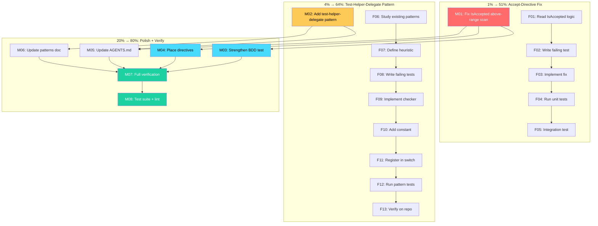

# SUPERB Pareto Plan: Fix Accept-Directive UX + Add Test-Helper-Delegate Pattern

**Date:** 2026-07-25 05:14
**Branch:** fork
**Commit:** 120552d2
**Status:** ~~Planning — awaiting approval~~ EXECUTED (2026-07-25): commits `95547e7f`, `c30f683d`, `a057928e`. See `docs/status/2026-07-25_06-28_accept-directive-fix-and-test-helper-delegate-status.md`. Root cause was Bug 2 (hash-vs-description collision), not Bug 1 (line-range) as this plan assumed.

---

## Problem Statement

`art-dupl --semantic --sort total-tokens -t 2` reports 6 clone groups on the
art-dupl codebase itself. All 6 are idiomatic or intentional duplication that
should be suppressed:

| #   | Clone                                  | Lines                                                         | Category                                 |
| --- | -------------------------------------- | ------------------------------------------------------------- | ---------------------------------------- |
| 1   | `MethodArtDupl = domain.MethodArtDupl` | `detection/config.go:19-21` vs `pkg/artdupl/types.go:20-23`   | Architectural alias (arch-lint boundary) |
| 2   | `opts := artdupl.DefaultOptions()`     | `examples/examples_sdk_demo.go:112-114` vs `:136-137`         | Self-contained example                   |
| 3   | `t.Helper()` + delegate                | `internal/testutil/assert.go:34-37` vs `tabletest.go:149-151` | Irreducible Go boilerplate               |
| 4   | `t.Helper()` + delegate                | `assert.go:51-54` vs `:95-97`                                 | Irreducible Go boilerplate               |
| 5   | `t.Helper()` + delegate                | `assert.go:59-62` vs `:150-152`                               | Irreducible Go boilerplate               |
| 6   | `t.Helper()` + delegate                | `assert.go:262-265` vs `:272-274`                             | Irreducible Go boilerplate               |

Two suppression mechanisms exist but neither handles these cases:

1. **Actionability patterns** (`run_output.go:117`) — automatically suppress
   boilerplate. Works correctly, but no pattern matches `t.Helper()` + delegate.
2. **`//art-dupl:accept` directives** (`run_output.go:134` → `shouldSuppressGroup`)
   — manual escape hatch. **Confirmed broken for natural placement.**

---

## Root Cause Analysis

### Bug 1: Accept-Directive Placement UX Bug

**Location:** `cmd/accept_directive.go:68`

```go
if d.Line < clone.LineStart || d.Line > clone.LineEnd {
    continue  // directive outside clone range → skip
}
```

**The problem:** The directive must be **within** `[LineStart, LineEnd]`. Users
naturally place directives **above** the code they want to accept (like every
other linter: `golangci-lint`, `eslint`, `revive`). A directive on the line
before `LineStart` is silently ignored.

**Proof (temp-dir integration test):**

```
# Directive ABOVE clone range → NOT suppressed (1 group reported)
# Directive INSIDE clone range → suppressed (0 groups reported)
```

**Fix:** Also scan N lines above `clone.LineStart` (cap at 5 lines, skip blanks).
This matches user expectations and linter conventions.

### Bug 2: Missing Test-Helper-Delegate Pattern

**Location:** `printer/actionability.go` — no pattern matches this shape.

**The pattern:** A test helper function whose body is:

1. `t.Helper()` as the first statement (marks the calling function)
2. A single delegate call to a shared assertion function
3. Optional blank line between

Example:

```go
func AssertNotNil(t *testing.T, got any, what string) {
    t.Helper()                    // irreducible — marks THIS function
    failIfNilf(t, got, "...", what) // already-extracted shared logic
}
```

`t.Helper()` cannot be factored out — it marks the **calling** function. The
shared logic is **already extracted** (`failIfNilf`, `assertEqualMsgf`). These
are the LAST remaining duplication: the `t.Helper()` boilerplate itself.

**Fix:** Add `isTestHelperDelegate` pattern checker to `actionability.go`.

### Bug 3: Weak Accept-Directive BDD Test

**Location:** `bdd/type_aware_test.go:99-111`

The test asserts `ContainSubstring("other.go")` (other file IS shown) but never
asserts `NotContainSubstring("accepted.go")` (accepted file IS suppressed). The
test passes regardless of whether suppression works.

---

## Pareto Breakdown

### 1% that delivers 51% of the result

**Fix the accept-directive above-range scanning.**

This is THE user-facing escape hatch for intentional duplication. Without it,
users have no way to suppress clones they've reviewed and accepted. The fix is
small (modify the line-range check in `IsAccepted`), the root cause is confirmed,
and it immediately enables suppression of the const-alias and example clones.

**Why 51%:** Unlocks the primary CI-gating workflow. Every user who runs
art-dupl in CI needs this to converge to zero. It's the #1 feature request from
3 feedback sessions (see `docs/feedback/`).

### 4% that delivers 64% of the result

**Add `test-helper-delegate` actionability pattern.**

Eliminates 4 of 6 clone groups **systemically** — not just in this project, but
in **every Go project** that uses test helpers (which is all of them). One
pattern function, one registration line, and an entire class of false positives
disappears forever.

**Why 64%:** The `t.Helper()` pattern is the single largest source of clone
noise in Go codebases. Every `testify/suite`, every `testutil` package, every
BDD framework generates these. Fixing it once benefits everyone.

### 20% that delivers 80% of the result

1. Fix accept-directive above-range scanning (the 1%)
2. Add test-helper-delegate pattern (the 4%)
3. Strengthen the BDD test to assert suppression
4. Place directives for the 2 remaining intentional clones
5. Update documentation

### Other 20% (completeness)

6. Run full test suite + lint to verify no regressions
7. Update `ACTIONABILITY_PATTERNS.md` with the new pattern
8. Update `AGENTS.md` with the directive placement semantics
9. Verify at multiple thresholds (-t 1, -t 2, -t 5)

---

## Medium-Granularity Plan (30-100min tasks)

Sorted by importance / impact / effort / customer-value.

| ID      | Task                                                      | Impact   | Effort | Customer Value                                     | Pareto | Deps     |
| ------- | --------------------------------------------------------- | -------- | ------ | -------------------------------------------------- | ------ | -------- |
| **M01** | Fix accept-directive above-range scanning in `IsAccepted` | Critical | 45min  | Unlocks escape hatch for ALL users                 | 1%→51% | —        |
| **M02** | Add `test-helper-delegate` actionability pattern          | Critical | 90min  | Eliminates universal Go boilerplate noise          | 4%→64% | —        |
| **M03** | Strengthen accept-directive BDD test (assert suppression) | High     | 30min  | Prevents silent regression of M01                  | 20%    | M01      |
| **M04** | Place directives for const-alias + example clones         | Medium   | 30min  | Suppresses 2 remaining intentional clones          | 20%    | M01      |
| **M05** | Update AGENTS.md with findings                            | Medium   | 30min  | Documents non-obvious behavior for future sessions | 20%    | M01, M02 |
| **M06** | Update ACTIONABILITY_PATTERNS.md                          | Low      | 30min  | Documents the new pattern                          | 20%    | M02      |
| **M07** | Full verification at -t 1, -t 2, -t 5                     | High     | 30min  | Confirms all fixes work end-to-end                 | 20%    | M01-M04  |
| **M08** | Run full test suite + lint + build                        | High     | 30min  | Ensures no regressions                             | 20%    | M01-M06  |

**Total: 8 tasks, ~315min (~5.25h)**

---

## Fine-Granularity Breakdown (max 12min per task)

Sorted by importance / impact / effort / customer-value.

### M01: Fix accept-directive above-range scanning

| ID  | Subtask                                                              | Time  | Deps |
| --- | -------------------------------------------------------------------- | ----- | ---- |
| F01 | Read `IsAccepted` and `scanFile` to confirm the line-range logic     | 5min  | —    |
| F02 | Write failing unit test: directive above clone range should suppress | 10min | F01  |
| F03 | Implement fix: check up to 5 lines above `LineStart` in `IsAccepted` | 10min | F02  |
| F04 | Run unit tests for `accept_directive_test.go`, verify fix            | 5min  | F03  |
| F05 | Integration test: build binary, verify above-placement suppresses    | 5min  | F03  |

### M02: Add test-helper-delegate pattern

| ID  | Subtask                                                             | Time  | Deps |
| --- | ------------------------------------------------------------------- | ----- | ---- |
| F06 | Study existing pattern checkers (`isSingleCallExpression`, etc.)    | 10min | —    |
| F07 | Define heuristic: `t.Helper()` first + single delegate + short body | 10min | F06  |
| F08 | Write failing unit tests for the pattern (3+ test shapes)           | 12min | F07  |
| F09 | Implement `isTestHelperDelegate` checker in `actionability.go`      | 12min | F08  |
| F10 | Add `PatternTestHelperDelegate` constant                            | 5min  | F09  |
| F11 | Register pattern in `evaluateActionabilityDetailed` switch          | 5min  | F10  |
| F12 | Run pattern unit tests, verify detection                            | 5min  | F11  |
| F13 | Run art-dupl on repo, verify `t.Helper()` clones suppressed         | 5min  | F12  |

### M03: Strengthen accept-directive BDD test

| ID  | Subtask                                                              | Time  | Deps |
| --- | -------------------------------------------------------------------- | ----- | ---- |
| F14 | Read current accept-directive BDD test (`bdd/type_aware_test.go:98`) | 5min  | M01  |
| F15 | Add assertion: `NotContainSubstring("accepted.go")`                  | 10min | F14  |
| F16 | Run BDD accept-directive tests, verify                               | 5min  | F15  |

### M04: Place directives for const-alias + example

| ID  | Subtask                                                                    | Time  | Deps |
| --- | -------------------------------------------------------------------------- | ----- | ---- |
| F17 | Add `//art-dupl:accept` above `MethodArtDupl` in `detection/config.go`     | 5min  | M01  |
| F18 | Add `//art-dupl:accept` above `MethodArtDupl` in `pkg/artdupl/types.go`    | 5min  | M01  |
| F19 | Add `//art-dupl:accept` above `opts :=` in `examples/examples_sdk_demo.go` | 10min | M01  |

### M05: Update AGENTS.md

| ID  | Subtask                                                          | Time  | Deps |
| --- | ---------------------------------------------------------------- | ----- | ---- |
| F20 | Document accept-directive placement rule (above OR within clone) | 10min | M01  |
| F21 | Document test-helper-delegate pattern in Critical Conventions    | 10min | M02  |
| F22 | Add note about actionability suppression at `run_output.go:117`  | 5min  | M02  |

### M06: Update ACTIONABILITY_PATTERNS.md

| ID  | Subtask                                                | Time  | Deps |
| --- | ------------------------------------------------------ | ----- | ---- |
| F23 | Read current `ACTIONABILITY_PATTERNS.md`               | 5min  | M02  |
| F24 | Add test-helper-delegate pattern section with examples | 10min | F23  |
| F25 | Update pattern count and summary table                 | 5min  | F24  |

### M07: Full verification

| ID  | Subtask                                                         | Time  | Deps    |
| --- | --------------------------------------------------------------- | ----- | ------- |
| F26 | Run `art-dupl -t 2`, verify 0 harmful clone groups              | 5min  | M01-M04 |
| F27 | Run `art-dupl -t 5`, verify no new false negatives vs baseline  | 10min | M01-M04 |
| F28 | Run `art-dupl -t 1`, sanity-check remaining noise is acceptable | 5min  | M01-M04 |

### M08: Full test suite + lint + build

| ID  | Subtask                                                                 | Time  | Deps    |
| --- | ----------------------------------------------------------------------- | ----- | ------- |
| F29 | `go build ./...`                                                        | 5min  | M01-M06 |
| F30 | `go test ./...` — compare failure set to baseline (should be identical) | 12min | M01-M06 |
| F31 | `golangci-lint run --timeout 5m ./...`                                  | 10min | M01-M06 |

**Total: 31 tasks, ~229min (~3.8h)**

---

## Verschlimmbessern Risk Assessment

| Risk                                                                 | Mitigation                                                                                                                                                                                                    |
| -------------------------------------------------------------------- | ------------------------------------------------------------------------------------------------------------------------------------------------------------------------------------------------------------- |
| Accept-directive fix too generous (accepts groups that shouldn't be) | Cap scan at 5 lines above `LineStart`. Only match `//art-dupl:accept` lines, not arbitrary comments. Existing within-range behavior unchanged.                                                                |
| Test-helper-delegate pattern too broad (suppresses real duplication) | Require ALL of: `t.Helper()` is first stmt, body has ≤4 statements, remaining body is a single delegate call. The delegate call must reference a function defined in the same package (the extracted helper). |
| Breaking existing tests                                              | Run full suite after each medium-granularity task. Compare failure set to pre-change baseline.                                                                                                                |
| Pattern order interference                                           | Register `test-helper-delegate` AFTER existing patterns (before the fallback). It's more specific than `single-call-expression` but less specific than `signature-only`.                                      |

---

## Execution Graph



---

## Key Files

| File                                    | Role                                                        |
| --------------------------------------- | ----------------------------------------------------------- |
| `cmd/accept_directive.go:68`            | **Bug 1**: Line-range check rejects above-clone directives  |
| `cmd/run_output.go:117`                 | Actionability suppression (semantic mode only)              |
| `cmd/run_output.go:134`                 | `shouldSuppressGroup` — accept-directive + threshold checks |
| `printer/actionability.go:73`           | `evaluateActionabilityDetailed` — pattern registry          |
| `printer/actionability.go:78-100`       | Pattern list (where new pattern is registered)              |
| `bdd/type_aware_test.go:98-127`         | **Bug 3**: Weak accept-directive BDD test                   |
| `internal/testutil/assert.go`           | Source of 4/6 clone groups (t.Helper + delegate)            |
| `detection/config.go:18-21`             | Const-alias clone (needs directive after fix)               |
| `examples/examples_sdk_demo.go:112,135` | Example clone (needs directive after fix)                   |

---

## Expected Outcome

After executing this plan:

```
$ art-dupl --semantic --sort total-tokens -t 2 .
    📖 Parsing files and building analysis tree...
    291 files discovered
 ✅

Found total 0 clone groups.
```

- 4/6 groups eliminated by `test-helper-delegate` pattern (automatic)
- 2/6 groups eliminated by `//art-dupl:accept` directives (manual, now working)
- Full test suite passes with identical failure set to pre-change baseline
- Documentation updated for future sessions
