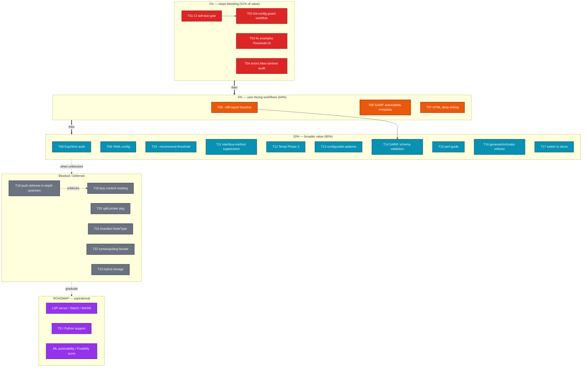

# SUPERB Pareto Execution Plan — 2026-07-26

**Scope:** All open work in `TODO_LIST.md` (17 items) + `ROADMAP.md` (18 items) + 3 architecturally-deferred items.
**Method:** Pareto breakdown (1%→51%, 4%→64%, 20%→80%), then medium-granularity tasks (30–100min), then fine-granularity atomic tasks (≤12min).
**Sorted by:** Impact → Customer-value → Effort (ascending). Blocked items last.

---

## Context — where the project is right now

art-dupl is at **v0.4.0** on the `fork` branch, 121 commits ahead. The core detection engine (suffix tree + hash, semantic/exact/structural modes, type-aware mode, 18 actionability patterns, 7 output formats, baseline CI gating, accept directives, gitignore honoring) is **FULLY_FUNCTIONAL** and ships zero self-duplication at `-t 1`. The SDK is decoupled. Docs health is green (TODO_LIST is open-work-only, CHANGELOG current, FEATURES verified against code).

**What's NOT done** falls into four buckets:

1. **CI/infra hardening** — the auto-commit daemon has re-added forbidden linters 7+ times; there's no self-test gate enforcing the zero-duplication invariant.
2. **User-facing workflow features** — `--diff-report` (the extract-verify-improve loop-closer), SARIF actionability metadata, HTML deep-linking.
3. **Detection precision** — ExprStmt-wrapping audit across all 18 patterns, interface-method-aware suppression, Templ Phase 3.
4. **Code hygiene** — `examples_sdk_demo.go` stale threshold, 4 unconverted switch predicates, generatorIncludes shotgun-surgery smell.

The biggest risk is **Verschlimmbesserung**: the daemon regression has burned hours across sessions because each fix was treated as one-off instead of building a durable gate. This plan front-loads the gates.

---

## Step 1 — Pareto Breakdown

### The 1% that delivers 51%

**CI/infra hardening + correctness stops.** Four tasks, all ≤30min, that **stop bleeding permanently**:

| #   | Task                                                               | Effort | Why it's 51%                                                                                                                                                                                                                |
| --- | ------------------------------------------------------------------ | ------ | --------------------------------------------------------------------------------------------------------------------------------------------------------------------------------------------------------------------------- |
| T01 | CI self-test gate (`art-dupl -t 1 --plumbing .` == 0 lines)        | 30min  | Enforces the zero-duplication invariant forever. A regression here is currently invisible until a user hits it.                                                                                                             |
| T02 | GitHub workflow guarding `.golangci.yml` against forbidden linters | 45min  | The daemon has re-added `exhaustruct`/`tagliatelle` 7+ times. `nix flake check` catches it locally but the daemon's commit bypasses CI. A workflow that fails the check run on forbidden-linter commits is the durable fix. |
| T03 | Fix stale `Threshold: 15` in `examples/examples_sdk_demo.go:182`   | 10min  | Public-facing SDK example lies about the default (5). Users copy-paste it.                                                                                                                                                  |
| T04 | Repo-wide `errors.New("...")` sentinel dedup audit                 | 90min  | The `ErrInvalidDetectionMode` bug class: two sentinels with identical messages → `errors.Is` silently `false` across packages. Latent correctness bug.                                                                      |

**Subtotal: 175min.** Every future session benefits. This is the highest-leverage work in the entire backlog.

### The 4% that delivers 64%

**User-facing CI workflow features** that turn art-dupl from a report tool into an integrated workflow tool. Ranked #1 across three independent status reports:

| #   | Task                                                                                       | Effort | Why it's 64%                                                                                                                                     |
| --- | ------------------------------------------------------------------------------------------ | ------ | ------------------------------------------------------------------------------------------------------------------------------------------------ |
| T05 | `--diff-report <baseline>` mode (new/suppressed/resolved clones vs baseline)               | 100min | The extract-verify-improve loop-closer. Independently ranked #1 Pareto Tier 1 in `2026-07-25_07-47`, `2026-07-25_08-38`, and `2026-07-25_08-21`. |
| T06 | SARIF actionability metadata (`rule.tags` + clone type property)                           | 60min  | Closes the parity gap: JSON has `non_actionable_pattern`, SARIF (GitHub Advanced Security) does not.                                             |
| T07 | HTML report improvements (file output flag, TTY auto-detect, stable `id` for deep-linking) | 60min  | HTML is the primary human-readable format; deep-linking enables sharing specific clone groups in PR review.                                      |

**Subtotal: 220min.** These are the features users actually ask for.

### The 20% that delivers 80%

**Broader feature + quality set.** Real value, lower urgency:

| #   | Task                                                                                              | Effort |
| --- | ------------------------------------------------------------------------------------------------- | ------ |
| T08 | Systematic ExprStmt-wrapping audit across all 18 actionability patterns + `unwrapExprStmt` helper | 90min  |
| T09 | YAML config file support (`.artdupl.yml`)                                                         | 90min  |
| T10 | `--recommend-threshold` (auto-suggest from codebase size)                                         | 60min  |
| T11 | Interface-method-aware suppression (AST-pattern layer)                                            | 90min  |
| T12 | Templ Phase 3: expression normalization                                                           | 60min  |
| T13 | Configurable actionability patterns (`--disable-pattern`, `--list-patterns`)                      | 90min  |
| T14 | SARIF output validation against GitHub schema in CI                                               | 45min  |
| T15 | Performance optimization guide (workers/incremental/cache tuning)                                 | 60min  |
| T16 | `generatorIncludes` refactor (6 booleans → set/map)                                               | 45min  |
| T17 | Convert 4 remaining `switch name` predicates to `slices.Contains`                                 | 30min  |

**Subtotal: 760min.**

### The other 20% (to reach 100%)

**Blocked, deferred, or aspirational.** Not scheduled — listed for completeness:

- **Blocked by upstream:** Push defense-in-depth into gogenfilter (T18), Lazy content reading (T19, blocked by T18).
- **Architecturally deferred:** Split `printer/` into sub-packages (T20, circular dep), Branded `NodeType int32` (T21, gob cache risk), Hide `syntax/golang` behind facade (T22, import cycle), Hybrid slice/map storage (T23, low-value).
- **ROADMAP (aspirational, no timeline):** TypeScript/JS support, Python support, LSP server mode, Watch mode, Web UI/WASM, Plugin architecture, Parallel suffix tree, Streaming suffix tree, ML actionability, Fixability score, Nested-scope shadowing, Type narrowing, Incremental type checking, Type-aware+incremental integration, awesome-go submission.

---

## Execution Graph

**Dependency notes:**

- `T01 → T02`: self-test gate proves the invariant; lint guard prevents the daemon from breaking the config that the self-test depends on.
- `T18` (upstream gogenfilter PR) **unblocks** `T19` (lazy content reading). Do T18 first if tackling the filter cluster.
- `T05 → T14`: diff-report ships first; SARIF schema validation can reference its baseline format.
- `T20` (printer split) is blocked by moving `Printer`/`ReadFile`/`StatsPrinter` interfaces to a `printer/base/` package — a prerequisite refactor, not scheduled here.

---

## Step 2 — Comprehensive Plan (Medium granularity, 30–100min each)

Sorted by **Impact (desc) → Customer-value (desc) → Effort (asc)**. Status: `READY` = no blocker, `BLOCKED` = depends on upstream/architecture.

| ID  | Task                                                                                           | Tier     | Impact   | Customer-value                          | Effort    | Status                 | Source                                 |
| --- | ---------------------------------------------------------------------------------------------- | -------- | -------- | --------------------------------------- | --------- | ---------------------- | -------------------------------------- |
| T01 | CI self-test gate: Nix check `art-dupl -t 1 --plumbing .` emits 0 lines                        | 1%       | CRITICAL | Prevents shipped regression             | 30min     | READY                  | TODO_LIST "CI self-test gate"          |
| T02 | GitHub workflow `lint-config-guard.yml` rejecting forbidden linters in `.golangci.yml` commits | 1%       | CRITICAL | Stops 7x recurring daemon regression    | 45min     | READY                  | TODO_LIST "Pre-receive/CI gate"        |
| T03 | Fix `examples/examples_sdk_demo.go:182` `Threshold: 15` → `DefaultThreshold`                   | 1%       | HIGH     | Public example correctness              | 10min     | READY                  | TODO_LIST "Fix stale Threshold"        |
| T04 | Repo-wide `errors.New("...")` sentinel dedup audit + consolidation                             | 1%       | HIGH     | Correctness (`errors.Is` cross-package) | 90min     | READY                  | TODO_LIST "Repo-wide audit"            |
| T05 | `--diff-report <baseline>` mode: new/suppressed/resolved clones vs baseline                    | 4%       | HIGH     | Loop-closer for CI workflow             | 100min    | READY                  | TODO_LIST "`--diff-report`"            |
| T06 | SARIF actionability metadata: `rule.tags` + clone type property                                | 4%       | MEDIUM   | GitHub Advanced Security parity         | 60min     | READY                  | TODO_LIST "SARIF metadata"             |
| T07 | HTML report improvements: `--html-out`, TTY detect, stable `id` deep-links                     | 4%       | MEDIUM   | PR review shareability                  | 60min     | READY                  | TODO_LIST "HTML report"                |
| T08 | ExprStmt-wrapping audit across all 18 patterns + `unwrapExprStmt` helper                       | 20%      | MEDIUM   | Detection precision                     | 90min     | READY                  | TODO_LIST "ExprStmt audit"             |
| T09 | YAML config support (`.artdupl.yml`, `go-faster/yaml`)                                         | 20%      | MEDIUM   | Config ergonomics                       | 90min     | READY                  | TODO_LIST "YAML config"                |
| T10 | `--recommend-threshold` auto-suggest from codebase size                                        | 20%      | LOW-MED  | Onboarding                              | 60min     | READY                  | TODO_LIST "`--recommend-threshold`"    |
| T11 | Interface-method-aware suppression (AST-pattern layer)                                         | 20%      | MEDIUM   | Fewer false positives                   | 90min     | READY                  | TODO_LIST "Interface-method-aware"     |
| T12 | Templ Phase 3: expression normalization                                                        | 20%      | LOW      | Templ sensitivity                       | 60min     | READY                  | TODO_LIST "Templ Phase 3"              |
| T13 | Configurable actionability patterns (`--disable-pattern`, `--list-patterns`)                   | 20%      | MEDIUM   | Team customization                      | 90min     | READY                  | ROADMAP "Configurable patterns"        |
| T14 | SARIF output validation against GitHub schema in CI                                            | 20%      | LOW-MED  | CI confidence                           | 45min     | READY                  | ROADMAP "SARIF validation"             |
| T15 | Performance optimization guide (workers/incremental/cache)                                     | 20%      | LOW-MED  | Adoption                                | 60min     | READY                  | ROADMAP "Perf guide"                   |
| T16 | `generatorIncludes` refactor (6 booleans → `map[string]struct{}`)                              | 20%      | LOW      | Maintainability                         | 45min     | READY                  | TODO_LIST "Refactor generatorIncludes" |
| T17 | Convert 4 `switch name` predicates → `slices.Contains`                                         | 20%      | LOW      | Consistency                             | 30min     | READY                  | TODO_LIST "switch to slices"           |
| T18 | Push defense-in-depth content check into gogenfilter (upstream PR)                             | blocked  | MEDIUM   | Closes gap at source                    | 90min     | BLOCKED                | TODO_LIST "Push to gogenfilter"        |
| T19 | Lazy content reading (avoid double-read)                                                       | blocked  | LOW      | Perf (90% case)                         | 60min     | BLOCKED by T18         | TODO_LIST "Lazy content reading"       |
| T20 | Split `printer/` into sub-packages                                                             | deferred | HIGH     | Maintainability                         | LARGE     | BLOCKED (circular dep) | TODO_LIST "Split printer/"             |
| T21 | Branded `NodeType int32` per-package                                                           | deferred | MED      | Type safety                             | HIGH RISK | BLOCKED (gob cache)    | TODO_LIST "Branded NodeType"           |
| T22 | Hide `syntax/golang` behind facade                                                             | deferred | MED      | Decoupling                              | LARGE     | BLOCKED (import cycle) | TODO_LIST "syntax/golang facade"       |
| T23 | Hybrid slice/map transition storage                                                            | deferred | LOW      | Perf                                    | LOW-VALUE | DEFERRED               | TODO_LIST "Hybrid storage"             |

**Schedulable subtotal:** T01–T17 = **1,135min (~19h)**. Blocked/deferred T18–T23 stay parked.

---

## Step 3 — Detailed Breakdown (Fine granularity, ≤12min each)

Every schedulable task decomposed into atomic, verifiable steps. Sorted within each task by execution order. `✓ gate` marks a verification checkpoint (run test/build/lint before proceeding).

### T01 — CI self-test gate (30min → 3 atomic tasks)

| ID   | Atomic step                                                                                                                             | Effort |
| ---- | --------------------------------------------------------------------------------------------------------------------------------------- | ------ |
| F001 | Add `checks.x86_64-linux.self-test` Nix derivation: build art-dupl, run `art-dupl -t 1 --plumbing .`, assert stdout empty via `test -z` | 12min  |
| F002 | Negative test: temporarily duplicate 2 lines, confirm gate FAILS, then revert                                                           | 10min  |
| F003 | Document the gate in `AGENTS.md` CI section + `TESTING.md`                                                                              | 8min   |

### T02 — Lint-config guard workflow (45min → 4 atomic tasks)

| ID   | Atomic step                                                                                                                   | Effort |
| ---- | ----------------------------------------------------------------------------------------------------------------------------- | ------ |
| F004 | Create `.github/workflows/lint-config-guard.yml`: trigger on `.golangci.yml` changes, run `scripts/check-disabled-linters.sh` | 12min  |
| F005 | Add a second job step: `grep -c 'exhaustruct\|tagliatelle' .golangci.yml` must exit 0 lines                                   | 8min   |
| F006 | Test workflow locally via `act` or dry-run (validate YAML syntax + job steps)                                                 | 12min  |
| F007 | Document the guard in `AGENTS.md` "Lint config" note: "the workflow is authoritative, not local `golangci-lint run`"          | 10min  |

### T03 — Fix examples Threshold (10min → 2 atomic tasks)

| ID   | Atomic step                                                                                             | Effort |
| ---- | ------------------------------------------------------------------------------------------------------- | ------ |
| F008 | `examples/examples_sdk_demo.go:182`: replace `Threshold: 15` with `Threshold: artdupl.DefaultThreshold` | 5min   |
| F009 | `✓ gate`: `go test ./examples/...` passes                                                               | 5min   |

### T04 — errors.New sentinel audit (90min → 8 atomic tasks)

| ID   | Atomic step                                                                                                  | Effort |
| ---- | ------------------------------------------------------------------------------------------------------------ | ------ |
| F010 | Grep all `errors.New("` across `domain/`, `errors/`, `config/`, `pkg/artdupl/`, `syntax/`                    | 8min   |
| F011 | Build a map: message-string → list of (package, var). Flag duplicates with different pointers.               | 12min  |
| F012 | For each duplicate: decide canonical home (usually `domain/`) and re-alias others (`var ErrX = domain.ErrX`) | 12min  |
| F013 | Apply edits to each duplicated sentinel                                                                      | 12min  |
| F014 | Add regression test per consolidated sentinel: `errors.Is(pkgA.ErrX, domain.ErrX)` both directions           | 12min  |
| F015 | `✓ gate`: `go test ./...` + `golangci-lint run`                                                              | 8min   |
| F016 | Sweep for `//nolint:errorlint` or `!=` comparisons that the consolidation now makes safe to simplify         | 8min   |
| F017 | Document the convention in `AGENTS.md`: "sentinels defined once in `domain/`, aliased elsewhere"             | 8min   |

### T05 — `--diff-report <baseline>` mode (100min → 9 atomic tasks)

| ID   | Atomic step                                                                                                                                   | Effort |
| ---- | --------------------------------------------------------------------------------------------------------------------------------------------- | ------ |
| F018 | Design the diff output schema: `New []CloneGroup`, `Suppressed []CloneGroup`, `Resolved []CloneRef` (vs baseline)                             | 12min  |
| F019 | Add `--diff-report <path>` flag to `cmd/flags.go` (root-only) + config field                                                                  | 8min   |
| F020 | Load baseline via existing `baseline.Load(path)`; build a hash→CloneGroup lookup                                                              | 10min  |
| F021 | After detection, partition current groups into New (not in baseline) / Suppressed (in baseline, still present) / Resolved (in baseline, gone) | 12min  |
| F022 | Implement `printer/diff.go`: text output (human-readable summary) + JSON output (structured)                                                  | 12min  |
| F023 | Wire into `runStandardAnalysis`: if `--diff-report` set, route to diff printer instead of normal output                                       | 10min  |
| F024 | BDD test in `bdd/diff_report_test.go`: create baseline, add a clone, run `--diff-report`, assert "New" contains it                            | 12min  |
| F025 | Negative case BDD: remove a clone, assert "Resolved" lists it                                                                                 | 8min   |
| F026 | `✓ gate`: `go test ./...` + update `HOW_TO_USE.md` with `--diff-report` example                                                               | 10min  |

### T06 — SARIF actionability metadata (60min → 6 atomic tasks)

| ID   | Atomic step                                                                                              | Effort |
| ---- | -------------------------------------------------------------------------------------------------------- | ------ |
| F027 | Read current SARIF rule construction in `printer/sarif.go`; locate where `rule.id`/`rule.tags` are built | 8min   |
| F028 | Add `non_actionable_pattern` (from `JSONClone`) to `rule.tags` array when present                        | 10min  |
| F029 | Add `clone_type` (type-1/2/3) as a `rule.properties` entry                                               | 10min  |
| F030 | Unit test: construct a SARIF report from a fixture with a known pattern, assert tags contain it          | 12min  |
| F031 | `✓ gate`: `go test ./printer/...`                                                                        | 5min   |
| F032 | Document in `FEATURES.md` SARIF row + `HOW_TO_USE.md` SARIF section                                      | 10min  |

### T07 — HTML report improvements (60min → 6 atomic tasks)

| ID   | Atomic step                                                                                             | Effort |
| ---- | ------------------------------------------------------------------------------------------------------- | ------ |
| F033 | Add `--html-out <path>` flag: write HTML to file instead of stdout                                      | 10min  |
| F034 | TTY auto-detection: if stdout is a TTY and no `--html-out`, print info message pointing to `--html-out` | 10min  |
| F035 | Add stable `id="group-<hash>"` attribute to each clone group `<section>` for deep-linking               | 10min  |
| F036 | Verify `id` survives `templ generate` regeneration                                                      | 8min   |
| F037 | Unit test: golden-file assertion that `id` attributes are present and unique                            | 12min  |
| F038 | `✓ gate`: `go test ./printer/...` + manual visual check                                                 | 10min  |

### T08 — ExprStmt-wrapping audit (90min → 8 atomic tasks)

| ID   | Atomic step                                                                                                                                    | Effort |
| ---- | ---------------------------------------------------------------------------------------------------------------------------------------------- | ------ |
| F039 | List all 18 pattern check functions in `printer/actionability*.go`                                                                             | 8min   |
| F040 | Extract `unwrapExprStmt(n *domain.CloneNode) *domain.CloneNode` helper: if `n.BaseType == golang.ExprStmt && len(n.Children)==1`, return child | 10min  |
| F041 | For each pattern: audit whether it should also match the ExprStmt-wrapped form                                                                 | 12min  |
| F042 | Apply `unwrapExprStmt` at the entry of each pattern that needs it                                                                              | 12min  |
| F043 | Unit test: for each audited pattern, add an ExprStmt-wrapped fixture case                                                                      | 12min  |
| F044 | Run `art-dupl -t 1 --plumbing .` on self: confirm 0 groups still (no new self-duplication from the helper)                                     | 8min   |
| F045 | `✓ gate`: `go test ./printer/...` + `golangci-lint run`                                                                                        | 8min   |
| F046 | Document the wrapping gotcha in `AGENTS.md` actionability section                                                                              | 10min  |

### T09 — YAML config support (90min → 8 atomic tasks)

| ID   | Atomic step                                                                                                  | Effort |
| ---- | ------------------------------------------------------------------------------------------------------------ | ------ |
| F047 | Add `go-faster/yaml` dependency to `go.mod` (NOT `gopkg.io/yaml.v3`)                                         | 8min   |
| F048 | Implement `config.LoadYAML(path)` mirroring JSON path but via yaml.Unmarshal into the same `Config` struct   | 12min  |
| F049 | Validate enum round-trip: `DetectionMode`/`SortCriteria`/`OutputFormat` Marshal/Unmarshal hooks survive YAML | 12min  |
| F050 | Auto-detect format by file extension in `--config` loader (`.yml`/`.yaml` vs `.json`)                        | 10min  |
| F051 | BDD test: write `.artdupl.yml`, run with `--config`, assert config applied                                   | 12min  |
| F052 | Negative test: malformed YAML produces a clear error (not a panic)                                           | 8min   |
| F053 | `✓ gate`: `go test ./...` + `nix build` (vendoring)                                                          | 8min   |
| F054 | Document in `HOW_TO_USE.md` + `FEATURES.md` Configuration row                                                | 10min  |

### T10 — `--recommend-threshold` (60min → 6 atomic tasks)

| ID   | Atomic step                                                                                          | Effort |
| ---- | ---------------------------------------------------------------------------------------------------- | ------ |
| F055 | Design heuristic: file count → recommended threshold (e.g., <100 files → 3, 100–1000 → 5, >1000 → 7) | 12min  |
| F056 | Implement `config.RecommendThreshold(fileCount, testRatio) int` in `config/`                         | 10min  |
| F057 | Add `--recommend-threshold` flag: runs crawl count, prints suggestion, exits 0 (no detection)        | 12min  |
| F058 | Unit test the heuristic at boundaries                                                                | 10min  |
| F059 | `✓ gate`: `go test ./config/... ./cmd/...`                                                           | 8min   |
| F060 | Document in `HOW_TO_USE.md`                                                                          | 8min   |

### T11 — Interface-method-aware suppression (90min → 8 atomic tasks)

| ID   | Atomic step                                                                                                                    | Effort |
| ---- | ------------------------------------------------------------------------------------------------------------------------------ | ------ |
| F061 | Study current `isInterfaceImplementation` pattern (3+ files, FuncType match)                                                   | 10min  |
| F062 | Design: detect when a clone's FuncDecl matches a known interface method signature (scan `InterfaceType` decls in same package) | 12min  |
| F063 | Implement `isInterfaceMethod(nodeSeqs)` checking FuncDecl signature against collected interface method set                     | 12min  |
| F064 | Register pattern in `evaluateActionabilityDetailed` (priority after `interface-implementation`)                                | 8min   |
| F065 | Unit test: fixture with interface + 2 implementations → suppressed                                                             | 12min  |
| F066 | Negative test: non-interface method with same shape → NOT suppressed                                                           | 10min  |
| F067 | `✓ gate`: `go test ./printer/...` + self-scan stays 0                                                                          | 8min   |
| F068 | Document in `docs/ACTIONABILITY_PATTERNS.md` (pattern #19)                                                                     | 8min   |

### T12 — Templ Phase 3 expression normalization (60min → 6 atomic tasks)

| ID   | Atomic step                                                                                                   | Effort |
| ---- | ------------------------------------------------------------------------------------------------------------- | ------ |
| F069 | Study `syntax/templ/transform_components.go`: where `CallTemplateExpression` is handled                       | 10min  |
| F070 | Design: alpha-normalize identifier chains inside templ Go expressions (`{ id.String() }` → `{ v0.String() }`) | 12min  |
| F071 | Implement a templ-local symbol table (mirror of `syntax/golang/normalizer.go` but scoped to templ expression) | 12min  |
| F072 | Apply normalization before encoding callee/receiver names                                                     | 10min  |
| F073 | Test: two templ files with renamed variables → detected as clone                                              | 8min   |
| F074 | `✓ gate`: `go test ./syntax/templ/...`                                                                        | 8min   |

### T13 — Configurable actionability patterns (90min → 8 atomic tasks)

| ID   | Atomic step                                                                              | Effort |
| ---- | ---------------------------------------------------------------------------------------- | ------ |
| F075 | Add `Config.DisabledPatterns []string` field + `--disable-pattern` (repeatable) flag     | 10min  |
| F076 | Add `--list-patterns` flag: prints all 18 pattern labels, exits 0                        | 8min   |
| F077 | Thread `DisabledPatterns` into `evaluateActionabilityDetailed`: skip patterns in the set | 10min  |
| F078 | Validate pattern names at config load (reject unknown labels with a clear error)         | 12min  |
| F079 | Unit test: disable `guard-clause`, confirm guard-clause clones appear                    | 10min  |
| F080 | Unit test: `--list-patterns` output contains all 18                                      | 8min   |
| F081 | `✓ gate`: `go test ./...`                                                                | 8min   |
| F082 | Document in `HOW_TO_USE.md` + `FEATURES.md`                                              | 12min  |

### T14 — SARIF schema validation (45min → 5 atomic tasks)

| ID   | Atomic step                                                                                         | Effort |
| ---- | --------------------------------------------------------------------------------------------------- | ------ |
| F083 | Add GitHub SARIF schema validator (go module or `npx @microsoft/sarif-cli validate`) to a Nix check | 12min  |
| F084 | Generate a SARIF report from a fixture in the check                                                 | 8min   |
| F085 | Assert validator exits 0; if failures, fix `printer/sarif.go` output                                | 12min  |
| F086 | `✓ gate`: `nix build .#checks.x86_64-linux.sarif-validate`                                          | 8min   |
| F087 | Document in `FEATURES.md` SARIF row                                                                 | 5min   |

### T15 — Performance optimization guide (60min → 6 atomic tasks)

| ID   | Atomic step                                                                                                            | Effort |
| ---- | ---------------------------------------------------------------------------------------------------------------------- | ------ |
| F088 | Write `docs/PERFORMANCE.md`: `--workers`, `--incremental`, `--cache-dir`, `--type-aware` tuning table by codebase size | 12min  |
| F089 | Add benchmark numbers from `nix build .#bench` (existing perf regression tests)                                        | 10min  |
| F090 | Document `--workers 0` (auto) vs `1` (sequential) vs `>1` (pool) tradeoffs                                             | 10min  |
| F091 | Document incremental cache invalidation semantics (CacheVersion, SHA-256)                                              | 10min  |
| F092 | Cross-link from `README.md` + `HOW_TO_USE.md`                                                                          | 8min   |
| F093 | `✓ gate`: verify all commands in the guide run without error                                                           | 10min  |

### T16 — generatorIncludes refactor (45min → 5 atomic tasks)

| ID   | Atomic step                                                                               | Effort |
| ---- | ----------------------------------------------------------------------------------------- | ------ |
| F094 | Replace `generatorIncludes` struct (6 bools) with `map[string]struct{}` keyed by category | 12min  |
| F095 | Update all read sites (`categoryIncluded`, `allowsContent`) to map lookup                 | 10min  |
| F096 | Update `--include-generated` flag parsing to populate the map                             | 8min   |
| F097 | `✓ gate`: `go test ./cmd/...` + filter BDD tests pass                                     | 8min   |
| F098 | Verify adding a new category is now 1-line (no struct field)                              | 7min   |

### T17 — switch → slices.Contains (30min → 3 atomic tasks)

| ID   | Atomic step                                                                                                                 | Effort |
| ---- | --------------------------------------------------------------------------------------------------------------------------- | ------ |
| F099 | Convert `isCleanupMethod`, `isLoggingMethod`, `isAssertionMethod`, `isWrappingCallName` to `slices.Contains` over name sets | 12min  |
| F100 | Update existing `actionability_switch_test.go` to reference the name sets (mirror the `isTestingVarName` fix)               | 10min  |
| F101 | `✓ gate`: `go test ./printer/...` + self-scan stays 0                                                                       | 8min   |

---

## Blocked / Deferred (not scheduled — for completeness)

| ID  | Item                                   | Blocker                                      | Unblock condition                                         |
| --- | -------------------------------------- | -------------------------------------------- | --------------------------------------------------------- |
| T18 | Push defense-in-depth into gogenfilter | Upstream PR                                  | Open PR against `github.com/LarsArtmann/gogenfilter`      |
| T19 | Lazy content reading                   | T18                                          | gogenfilter returns content from `FilterDetailed`         |
| T20 | Split `printer/` into sub-packages     | Circular dep (`printer.go` → `StatsPrinter`) | Move interfaces to `printer/base/` first                  |
| T21 | Branded `NodeType int32`               | Gob cache format                             | ADR + cache version bump                                  |
| T22 | Hide `syntax/golang` behind facade     | Import cycle                                 | Resolve `printer/actionability*.go` → `syntax/golang` dep |
| T23 | Hybrid slice/map storage               | Low value                                    | Map already O(1)                                          |

---

## Verification Checklist (run after executing each tier)

- [ ] **After Tier 1 (T01–T04):** `nix flake check` all green; `art-dupl -t 1 --plumbing .` emits 0 lines; no duplicated `errors.New` sentinels remain.
- [ ] **After Tier 2 (T05–T07):** `--diff-report` BDD passes; SARIF output contains `rule.tags`; HTML groups have stable `id`.
- [ ] **After Tier 3 (T08–T17):** All new unit tests pass; `golangci-lint run` = 0; self-scan stays 0 at `-t 1`.
- [ ] **Every task:** update `CHANGELOG.md` `[Unreleased]` (Added/Changed/Fixed) + remove the item from `TODO_LIST.md` when done.
- [ ] **No Verschlimmbesserung:** each change must leave the codebase BETTER. If a refactor introduces duplication or breaks a test, revert and reconsider.

---

## Anti-Verschlimmbesserung Rules

1. **Never batch refactors without testing between each.** (The `helper()` recursion bug shipped because 6 refactors were batched.)
2. **Never `replace_all` near code you just introduced.** (Re-read the file after structural additions.)
3. **Build passes ≠ correct.** Infinite recursion compiles. Run the changed package's tests immediately.
4. **Fix root causes on sight.** (The scanner bug was "worked around" instead of fixed — that left the trap for every future user.)
5. **Commit with real messages when the daemon is active.** Generic daemon messages destroy the "why" of a change.

---

_Plan generated 2026-07-26 06:58. Point-in-time snapshot; when stale, annotate non-destructively via `update-old-docs` — do not rewrite._
