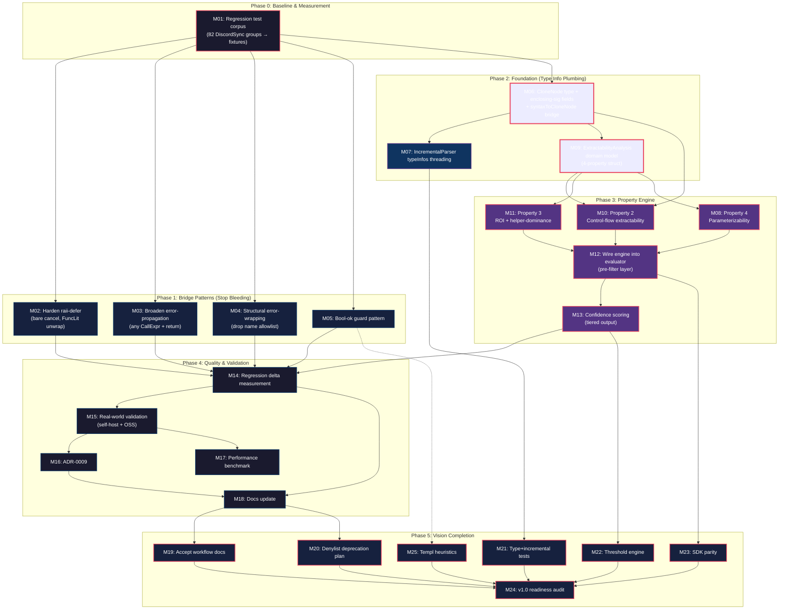

# ZERO False-Positive / False-Negative Clone Detection — Pareto Execution Plan

**Date:** 2026-07-27
**Vision:** `art-dupl --type-aware` reports only clones that are genuinely harmful duplication — **zero false positives, zero false negatives**.
**Trigger:** [DiscordSync feedback](../feedback/new/2026-07-27-discordsync-t1-82-groups-97pct-false-positives.md) — 82 groups at `-t 1`, only 2 harmful (97.5% noise).
**Method:** Pareto breakdown (1%→51%, 4%→64%, 20%→80%), then medium tasks (30–100min), then atomic tasks (≤12min).

---

## Context — Where We Are Right Now

art-dupl is a **fully functional** Go clone detector: suffix-tree + hash detection, three modes (semantic/exact/structural), type-aware mode, 20 actionability patterns, 7 output formats, baseline CI, accept directives, gitignore honoring.

**The problem:** The DiscordSync feedback exposed a fundamental architectural ceiling. At `-t 1`, 80 of 82 groups are false positives — standard Go idioms (`if err != nil`, `defer cancel()`, helper invocations) that the current 20-pattern denylist doesn't catch. Adding more patterns is whack-a-mole: every new codebase reveals new idioms. **The denylist cannot converge on zero.**

### The Architectural Gap (Root Cause)

**Type info dies in the transformer.** The `--type-aware` flag loads full `go/types` information (`*types.Info` with `Defs`, `Uses`, `Types` maps), but it is consumed in exactly **one place** — `syntax/golang/transform.go:201` (the `Ident` case) — where it is hashed into the upper 24 bits of `Node.Type` and **destroyed**. By the time data reaches the actionability layer, three lossy boundaries have stripped it:

1. **`transform.go` Ident case** — type string folded into hash, never stored on node
2. **`syntaxToCloneNode` bridge** (`printer/clone_processor.go:33`) — copies only `BaseType` (decoded low 8 bits) + `Name` + `Filename`; no type field exists on `CloneNode`
3. **`IncrementalParser`** (`job/incremental.go:281`) — doesn't thread `typeInfos` at all

The actionability layer operates on `[][]*domain.CloneNode` — pure AST shape. It has **no access to**:

- The enclosing function's signature (return types, arity) → cannot detect "void-return HTTP handler forces bare return"
- The static type of any variable → cannot detect "this call is to an existing helper, not duplicated logic"
- Whether a `CallExpr` references `err` → cannot structurally detect error-wrapping

### The Pivot: Property-Based Classification

Replace the denylist-of-20-patterns with **four computable properties** that define "harmful duplication":

| #   | Property                        | Computable how?                                                                                                                                                                                                  | Kills which FPs                                                           |
| --- | ------------------------------- | ---------------------------------------------------------------------------------------------------------------------------------------------------------------------------------------------------------------- | ------------------------------------------------------------------------- |
| 1   | **Mechanical extractability**   | Always true (wrap in func, capture free vars as params)                                                                                                                                                          | —                                                                         |
| 2   | **Control-flow extractability** | `go/types` enclosing-signature analysis: if clone contains `return`/`break`/`continue` but extraction can't terminate the caller                                                                                 | HTTP error guards (12), guard-clause-in-void-handler                      |
| 3   | **ROI positive**                | Token economics: extraction must save more tokens than the params + call site cost. If >X% of clone tokens are inside a single `CallExpr` to a known function, it's a helper invocation                          | `queryError` wrappers (27), `defer cancel()` (12), helper invocations (5) |
| 4   | **Parameterizability**          | Type-2/3 classification + differing-critical-literal detection: if the ONLY difference is in string-literal arguments that are domain values (not format specifiers), the clone is parameterized, not duplicated | `#%06x` vs `#%06X` (1), bool-to-string funcs (3)                          |

Properties 2 and 3 are the unlock. Both require type info to reach the actionability layer — which is the foundation work.

### The Pragmatic Floor: `//art-dupl:accept`

**Algorithmic ZERO FP is information-theoretically impossible** — "harmful" is a human judgment about intent. But **operational ZERO FP** (every reported clone is actionable; residual judgment calls are tagged once via directive and honored forever) is achievable. The accept-directive system already exists; it becomes part of the workflow, not an escape hatch.

---

## Step 1 — Pareto Breakdown

### The 1% that delivers 51%

**The Extractability Analysis foundation.** Three tasks that wire type info through to the actionability layer and define the property model. Without these, the entire vision is blocked.

| #   | Task                                                                                                           | Effort | Why 51%                                                                                                                                         |
| --- | -------------------------------------------------------------------------------------------------------------- | ------ | ----------------------------------------------------------------------------------------------------------------------------------------------- |
| M01 | Build regression test corpus from DiscordSync feedback (82 groups → fixtures, baseline FP rate)                | 90min  | Without measurement, every change is blind. This is the ruler.                                                                                  |
| M06 | Add type + enclosing-signature fields to `domain.CloneNode`; update `syntaxToCloneNode` bridge to carry them   | 90min  | **The keystone.** Every property checker depends on type info surviving the bridge. Without this, the actionability layer is permanently blind. |
| M09 | Define `ExtractabilityAnalysis` domain model — the 4-property struct, evaluation interface, confidence scoring | 60min  | The contract that all property checkers implement. Defines the shape of the new engine.                                                         |

**Subtotal: 240min.** This is the critical path. Everything else is built on top.

### The 4% that delivers 64%

**The two highest-volume property implementations** that kill the most false positives:

| #   | Task                                                                                                   | Effort | Why 64%                                                                                                                 |
| --- | ------------------------------------------------------------------------------------------------------ | ------ | ----------------------------------------------------------------------------------------------------------------------- |
| M10 | Property 2: control-flow extractability checker (uses enclosing signature to detect void-return-traps) | 75min  | Kills 12 HTTP-handler groups + all future "forced by signature" FPs                                                     |
| M11 | Property 3: ROI + helper-dominance checker (token economics + call-dominance ratio)                    | 75min  | Kills 27 `queryError` + 12 `defer cancel` + 5 helper-invocation = **44 groups eliminated**. Highest single-task impact. |

**Subtotal: 150min.** These two checkers eliminate 56 of 80 false positives via general principles, not pattern matching.

### The 20% that delivers 80%

**Stop-the-bleeding bridge patterns + remaining properties + wiring:**

| #   | Task                                                                                                                              | Effort |
| --- | --------------------------------------------------------------------------------------------------------------------------------- | ------ |
| M02 | Harden `raii-defer`: accept bare `cancel()` (Ident callee), unwrap `defer func(){ _ = x.Close() }()` (FuncLit)                    | 45min  |
| M03 | Broaden `error-propagation` 2-stmt branch: accept any `ExprStmt(CallExpr) + ReturnStmt` (not just log/print)                      | 45min  |
| M04 | Make `error-wrapping` structural: drop `{Errorf,Wrap,...}` name allowlist, match any `CallExpr` referencing `err`                 | 60min  |
| M05 | Add bool-ok assign+guard pattern (`X, ok := helper(); if !ok { return }`)                                                         | 45min  |
| M07 | Fix `IncrementalParser` to thread `typeInfos` (mirror `job.Parse`'s `LookupPreloaded`)                                            | 90min  |
| M08 | Property 4: parameterizability checker (differing-critical-literal detection)                                                     | 60min  |
| M12 | Wire property engine into `evaluateActionabilityWithDisabled` as a pre-filter layer                                               | 60min  |
| M13 | Confidence scoring: replace binary `Actionable`/`NonActionable` with tiered output (actionable / low-confidence / non-actionable) | 90min  |

**Subtotal: 495min.**

### The other 20% (to reach 100%)

**Validation, documentation, deprecation, and vision completion:**

| #   | Task                                                                             | Effort |
| --- | -------------------------------------------------------------------------------- | ------ |
| M14 | Run regression corpus against new engine, measure FP/FN delta                    | 45min  |
| M15 | Real-world validation: art-dupl self-host + 1-2 OSS Go projects                  | 90min  |
| M16 | ADR-0009: property-based classification model                                    | 45min  |
| M17 | Performance benchmark: type-aware actionability overhead vs syntax-only          | 60min  |
| M18 | Update `ACTIONABILITY_PATTERNS.md` + `AGENTS.md` with new architecture           | 45min  |
| M19 | Accept-directive workflow documentation (the "operational zero FP" promise)      | 45min  |
| M20 | Deprecation plan for denylist patterns (migration guide + timeline)              | 60min  |
| M21 | Type-aware + incremental integration test suite                                  | 90min  |
| M22 | Threshold recommendation engine (`--recommend-threshold` from property analysis) | 60min  |
| M23 | SDK parity: expose extractability analysis via `pkg/artdupl`                     | 60min  |
| M24 | v1.0 readiness review: the ZERO FP/FN promise audit                              | 90min  |
| M25 | Templ-specific actionability heuristics (empty-state-vs-loop rendering idiom)    | 60min  |

**Subtotal: 795min.**

### Grand total: ~1,680min (~28 hours of focused work)

---

## Execution Graph



### Critical Path

```
M01 → M06 → M09 → {M10, M11} → M12 → M13 → M14 → M24
```

**Total critical-path effort:** ~645min (~11 hours). Everything off the critical path can be parallelized.

### Parallelization Opportunities

| Track            | Tasks     | Can run in parallel with                        |
| ---------------- | --------- | ----------------------------------------------- |
| Bridge patterns  | M02–M05   | Foundation (M06–M09) — zero overlap             |
| Property 4       | M08       | Properties 2+3 (M10–M11) — independent checkers |
| Templ heuristics | M25       | Anything in Phase 3+ — isolated concern         |
| Docs (M16–M19)   | After M14 | Validation (M15), benchmarks (M17)              |

---

## Step 2 — Medium-Granularity Task Table (30–100min each)

Sorted by **impact → customer-value → effort (ascending)**. Phases show execution order; within phase, by dependency.

| ID  | Phase | Task                                                           | Impact    | Effort | Deps          | Risk                          |
| --- | ----- | -------------------------------------------------------------- | --------- | ------ | ------------- | ----------------------------- |
| M01 | 0     | Build regression test corpus from DiscordSync feedback         | Critical  | 90min  | —             | Low                           |
| M06 | 2     | Add type + enclosing-sig fields to CloneNode; update bridge    | Critical  | 90min  | M01           | Medium (touches core types)   |
| M09 | 2     | Define ExtractabilityAnalysis domain model (4 properties)      | Critical  | 60min  | M01           | Low (additive)                |
| M11 | 3     | Property 3: ROI + helper-dominance checker                     | Very High | 75min  | M06, M09      | Medium                        |
| M10 | 3     | Property 2: control-flow extractability checker                | Very High | 75min  | M06, M09      | Medium                        |
| M04 | 1     | Make error-wrapping structural (drop name allowlist)           | High      | 60min  | M01           | Low                           |
| M02 | 1     | Harden raii-defer (bare cancel, FuncLit unwrap)                | High      | 45min  | M01           | Low                           |
| M03 | 1     | Broaden error-propagation 2-stmt branch                        | High      | 45min  | M01           | Low                           |
| M12 | 3     | Wire property engine into evaluator as pre-filter              | High      | 60min  | M10, M11, M08 | Medium                        |
| M13 | 3     | Confidence scoring (tiered actionable/low-conf/non-actionable) | High      | 90min  | M12           | Medium (output format change) |
| M05 | 1     | Bool-ok assign+guard pattern                                   | Medium    | 45min  | M01           | Low                           |
| M07 | 2     | Fix IncrementalParser to thread typeInfos                      | Medium    | 90min  | M06           | Medium                        |
| M08 | 3     | Property 4: parameterizability checker                         | Medium    | 60min  | M09           | Low                           |
| M14 | 4     | Run regression corpus, measure FP/FN delta                     | High      | 45min  | M02–M05, M12  | Low                           |
| M15 | 4     | Real-world validation (self-host + OSS projects)               | High      | 90min  | M14           | Low                           |
| M16 | 4     | ADR-0009: property-based classification model                  | Medium    | 45min  | M14           | Low                           |
| M17 | 4     | Performance benchmark: type-aware actionability overhead       | Medium    | 60min  | M14           | Low                           |
| M18 | 4     | Update ACTIONABILITY_PATTERNS.md + AGENTS.md                   | Medium    | 45min  | M14           | Low                           |
| M19 | 5     | Accept-directive workflow documentation                        | Medium    | 45min  | M18           | Low                           |
| M20 | 5     | Deprecation plan for denylist patterns                         | Medium    | 60min  | M18           | Low                           |
| M21 | 5     | Type-aware + incremental integration test suite                | Medium    | 90min  | M07           | Low                           |
| M22 | 5     | Threshold recommendation engine                                | Low       | 60min  | M13           | Low                           |
| M23 | 5     | SDK parity: expose extractability via pkg/artdupl              | Medium    | 60min  | M12           | Low                           |
| M25 | 5     | Templ-specific actionability heuristics                        | Low       | 60min  | M01           | Low                           |
| M24 | 5     | v1.0 readiness review: ZERO FP/FN promise audit                | Critical  | 90min  | M19–M23, M25  | Low                           |

**25 tasks. Total: ~1,680min (~28 hours).**

---

## Step 3 — Fine-Granularity Atomic Tasks (≤12min each)

Each medium task broken into atomic, independently-verifiable steps. Sorted by dependency order within phase.

### Phase 0: Baseline

| ID   | Task                                                                                                | Est   | Verifies                                             |
| ---- | --------------------------------------------------------------------------------------------------- | ----- | ---------------------------------------------------- |
| F001 | Create `testdata/discordsync/` fixture directory structure                                          | 5min  | `ls testdata/discordsync/`                           |
| F002 | Extract 12 HTTP-error-guard clone samples from feedback into `.go` fixture files                    | 12min | files exist, `go vet` clean                          |
| F003 | Extract 27 queryError-wrapper clone samples into `.go` fixture files                                | 12min | files exist                                          |
| F004 | Extract 12 defer-cleanup clone samples into `.go` fixtures                                          | 10min | files exist                                          |
| F005 | Extract remaining FP samples (bool-to-string, fmt.Sprintf, helper-invocation, templ, log-one-liner) | 12min | files exist                                          |
| F006 | Extract 2 true-positive samples (`invokeService[T]`, `addIfPositive64`)                             | 10min | files exist                                          |
| F007 | Write `TestDiscordSyncBaseline` — runs art-dupl on fixtures, records group count + FP/FN breakdown  | 12min | test passes, baseline = 80 FP, 0 FN suppressed, 2 TP |
| F008 | Write `TestDiscordSyncNoFalseNegatives` — asserts both true-positives are reported                  | 8min  | test passes                                          |

### Phase 1: Bridge Patterns (Stop Bleeding)

#### M02: Harden raii-defer

| ID   | Task                                                                                                      | Est   | Verifies                 |
| ---- | --------------------------------------------------------------------------------------------------------- | ----- | ------------------------ |
| F009 | Read `isPureDeferPattern` + `isRAIIDeferCall` in `actionability_control_flow.go`                          | 5min  | understand current logic |
| F010 | Add test case: `defer cancel()` (bare Ident callee, not SelectorExpr) → should match raii-defer           | 10min | test fails (red)         |
| F011 | Fix `isRAIIDeferCall` to accept bare `Ident` callee matching `cleanupMethodNames`                         | 10min | F010 passes (green)      |
| F012 | Add test case: `defer func() { _ = rows.Close() }()` (FuncLit wrapping ignored-result call)               | 10min | test fails (red)         |
| F013 | Add `unwrapFuncLitDefer` helper — if DeferStmt wraps a FuncLit with single ExprStmt, unwrap to inner call | 12min | F012 passes              |
| F014 | Run full actionability test suite                                                                         | 5min  | no regressions           |

#### M03: Broaden error-propagation

| ID   | Task                                                                                                  | Est   | Verifies                           |
| ---- | ----------------------------------------------------------------------------------------------------- | ----- | ---------------------------------- |
| F015 | Read `isReturnOrWrappedReturn` 2-stmt branch in `actionability_control_flow.go:157`                   | 5min  | understand `isLogOrPrintStmt` gate |
| F016 | Add test: `if err != nil { writeError(w,r,err); return }` → should match error-propagation            | 10min | test fails (red)                   |
| F017 | Broaden 2-stmt branch: replace `isLogOrPrintStmt` check with `isExprStmtCallExpr` (any call + return) | 10min | F016 passes                        |
| F018 | Add test: `if err != nil { slog.Error("msg", err); return }` still matches                            | 8min  | test passes (no regression)        |
| F019 | Run regression corpus test — confirm 12 HTTP groups now suppressed                                    | 5min  | FP count drops by 12               |

#### M04: Structural error-wrapping

| ID   | Task                                                                                                    | Est   | Verifies                  |
| ---- | ------------------------------------------------------------------------------------------------------- | ----- | ------------------------- |
| F020 | Read `isWrappingCall` + `wrappingCallNames` in `actionability_patterns_expanded.go`                     | 5min  | understand name allowlist |
| F021 | Add test: `if err != nil { return nil, queryError(err, "unique msg") }` → should match                  | 10min | test fails (red)          |
| F022 | Add `callReferencesIdent` helper — walks CallExpr subtree, returns true if any Ident matches given name | 12min | unit test passes          |
| F023 | Rewrite `isWrappingCall` to use `callReferencesIdent(call, "err")` instead of name allowlist            | 10min | F021 passes               |
| F024 | Add test: `if err != nil { return fmt.Errorf("wrap: %w", err) }` still matches                          | 8min  | no regression             |
| F025 | Run regression corpus — confirm 27 queryError groups now suppressed                                     | 5min  | FP count drops by 27      |

#### M05: Bool-ok guard pattern

| ID   | Task                                                                                                                 | Est   | Verifies                 |
| ---- | -------------------------------------------------------------------------------------------------------------------- | ----- | ------------------------ |
| F026 | Add test: `X, ok := helper(); if !ok { return }` → should match a boilerplate pattern                                | 10min | test fails (red)         |
| F027 | Add `isAssignWithBoolGuard` matcher: 2-stmt (AssignStmt + IfStmt where cond is `!ok` UnaryExpr, body is bare return) | 12min | F026 passes              |
| F028 | Register in `actionabilityPatternTable` after `assign-error-check`                                                   | 5min  | table includes new entry |
| F029 | Add `PatternBoolGuard` label constant                                                                                | 3min  | compiles                 |
| F030 | Run regression corpus — confirm 5 helper-invocation groups suppressed                                                | 5min  | FP count drops by 5      |

### Phase 2: Foundation (Type Info Plumbing)

#### M06: CloneNode type + enclosing-sig fields

| ID   | Task                                                                                                                                        | Est   | Verifies                                                                            |
| ---- | ------------------------------------------------------------------------------------------------------------------------------------------- | ----- | ----------------------------------------------------------------------------------- |
| F031 | Read `domain/clone_node.go` — current CloneNode struct                                                                                      | 5min  | understand shape                                                                    |
| F032 | Add `VarType string` field to `CloneNode` (the go/types type string, empty if not type-aware)                                               | 5min  | compiles                                                                            |
| F033 | Add `EnclosingReturns []bool` field to `ProcessedClone` (or `ProcessedCloneGroup`) — the enclosing function's return-value presence pattern | 8min  | compiles                                                                            |
| F034 | Read `syntax/golang/typeinfo.go` — `identTypeString` and `PreloadedAST`                                                                     | 5min  | understand type lookup                                                              |
| F035 | In `transform.go` Ident case: store `typeStr` on `Node.VarType` (new field on `syntax.Node`) IN ADDITION to hashing it into `o.Type`        | 12min | `Node.VarType` populated                                                            |
| F036 | Add `VarType string` field to `syntax.Node` struct in `syntax/syntax.go`                                                                    | 5min  | compiles                                                                            |
| F037 | Update `syntaxToCloneNode` bridge in `clone_processor.go` to copy `n.VarType` → `cn.VarType`                                                | 8min  | bridge carries type                                                                 |
| F038 | Add `collectEnclosingReturns` helper in transformer — walks up to FuncDecl, extracts return-value pattern                                   | 12min | unit test: `func() void` → `[]bool{}`, `func() (int, error)` → `[]bool{true, true}` |
| F039 | Store enclosing return signature on the root clone node (or group metadata)                                                                 | 10min | available downstream                                                                |
| F040 | Write `TestCloneNodeCarriesType` — parse with type-aware, assert `CloneNode.VarType == "time.Time"` for a known ident                       | 12min | test passes                                                                         |
| F041 | Write `TestCloneNodeCarriesEnclosingSig` — assert void-return handler clones have empty returns                                             | 12min | test passes                                                                         |
| F042 | Run full test suite — confirm no regressions from new fields                                                                                | 5min  | all pass                                                                            |

#### M07: IncrementalParser typeInfos

| ID   | Task                                                                                                   | Est   | Verifies                           |
| ---- | ------------------------------------------------------------------------------------------------------ | ----- | ---------------------------------- |
| F043 | Read `job/incremental.go` — `IncrementalParser` struct + `parseFile` method                            | 5min  | understand current `nil` preloaded |
| F044 | Add `typeInfos golang.TypeAwareData` field to `IncrementalParser` struct                               | 5min  | compiles                           |
| F045 | Update `NewIncrementalParser` constructor to accept `typeInfos` parameter                              | 8min  | compiles                           |
| F046 | Update `parseFile` call: `nil` → `ip.typeInfos.LookupPreloaded(file)`                                  | 5min  | uses preloaded                     |
| F047 | Update all `NewIncrementalParser` call sites in `cmd/` to pass type data                               | 10min | compiles                           |
| F048 | Remove the "type-aware + incremental warns and falls back" guard in `cmd/run_flags.go`                 | 8min  | both modes work together           |
| F049 | Write `TestIncrementalWithTypeAware` — parse identical files with both modes, assert VarType populated | 12min | test passes                        |
| F050 | Run `-race` incremental parallel tests                                                                 | 5min  | no races                           |

#### M09: ExtractabilityAnalysis domain model

| ID   | Task                                                                                                                                                                                     | Est   | Verifies                  |
| ---- | ---------------------------------------------------------------------------------------------------------------------------------------------------------------------------------------- | ----- | ------------------------- |
| F051 | Read `domain/processed_clone.go` — `CloneClassification` struct                                                                                                                          | 5min  | understand current fields |
| F052 | Define `ExtractabilityAnalysis` struct: `MechanicallyExtractable bool`, `ControlFlowExtractable bool`, `ROIPositive bool`, `Parameterizable bool`, `Confidence float64`, `Reason string` | 10min | compiles                  |
| F053 | Define `ExtractabilityChecker` interface: `Check(group ProcessedCloneGroup, nodeSeqs [][]*CloneNode) ExtractabilityAnalysis`                                                             | 8min  | compiles                  |
| F054 | Add `Extractability` field to `CloneClassification`                                                                                                                                      | 5min  | compiles                  |
| F055 | Define `IsHarmful(e ExtractabilityAnalysis) bool` — true iff all 4 properties pass AND confidence > threshold                                                                            | 8min  | unit test                 |
| F056 | Write `TestExtractabilityModel` — table-driven: each property combination → expected IsHarmful                                                                                           | 12min | test passes               |

### Phase 3: Property Engine

#### M10: Property 2 — Control-flow extractability

| ID   | Task                                                                                                                                  | Est   | Verifies                          |
| ---- | ------------------------------------------------------------------------------------------------------------------------------------- | ----- | --------------------------------- |
| F057 | Implement `ControlFlowChecker` — implements `ExtractabilityChecker`                                                                   | 8min  | compiles                          |
| F058 | Core logic: walk clone AST, detect `ReturnStmt`/`BranchStmt` (break/continue) presence                                                | 10min | unit test: detects return in body |
| F059 | If clone contains terminating stmts AND enclosing signature is void (`len(EnclosingReturns) == 0`) → `ControlFlowExtractable = false` | 10min | test: HTTP handler clone → false  |
| F060 | If clone contains `break`/`continue` → `ControlFlowExtractable = false` (can't extract loop control)                                  | 10min | test: loop body clone → false     |
| F061 | Multi-return clones: if return arity in clone > enclosing function's return arity → false                                             | 12min | test: mismatched arity            |
| F062 | Wire into `evaluateExtractability` dispatcher                                                                                         | 5min  | called                            |
| F063 | Run regression corpus — confirm 12 HTTP groups now classified `ControlFlowExtractable=false`                                          | 5min  | 12 groups killed                  |

#### M11: Property 3 — ROI + helper-dominance

| ID   | Task                                                                                                                                           | Est   | Verifies                       |
| ---- | ---------------------------------------------------------------------------------------------------------------------------------------------- | ----- | ------------------------------ |
| F064 | Implement `ROIChecker` — implements `ExtractabilityChecker`                                                                                    | 8min  | compiles                       |
| F065 | Count clone token count (reuse existing `TokenCount`)                                                                                          | 5min  | correct count                  |
| F066 | Count free variables (params needed): walk clone boundary, collect Idents defined outside clone scope                                          | 12min | unit test: 2-param clone       |
| F067 | Calculate ROI: `savedTokens = cloneTokens - (paramCount * paramOverhead) - callOverhead`. If `savedTokens < minSaving` → `ROIPositive = false` | 10min | test: 1-token clone → false    |
| F068 | Helper-dominance: if >60% of clone tokens are inside a single `CallExpr` → `ROIPositive = false` (the call IS the extraction)                  | 12min | test: queryError clone → false |
| F069 | Adjust `minSaving` and `paramOverhead` constants empirically from DiscordSync data                                                             | 8min  | tuned                          |
| F070 | Wire into dispatcher                                                                                                                           | 5min  | called                         |
| F071 | Run regression corpus — confirm 27 queryError + 12 defer + 5 helper groups killed                                                              | 5min  | 44 groups killed               |

#### M08: Property 4 — Parameterizability

| ID   | Task                                                                                                                                                                                                                                       | Est   | Verifies                               |
| ---- | ------------------------------------------------------------------------------------------------------------------------------------------------------------------------------------------------------------------------------------------ | ----- | -------------------------------------- |
| F072 | Implement `ParameterizabilityChecker`                                                                                                                                                                                                      | 8min  | compiles                               |
| F073 | Collect all `BasicLit` values across clone instances in the group                                                                                                                                                                          | 10min | unit test                              |
| F074 | If the ONLY differences between clones are in string-literal VALUES (not kinds) → `Parameterizable = true` (they ARE parameterized, hence NOT harmful duplication — the tool already detected them, this confirms they're parameterizable) | 10min | test: bool-to-string → parameterizable |
| F075 | If string literals differ in format-specifier verbs (`%x` vs `%X`, `%d` vs `%s`) within `fmt.Sprintf` calls → `Parameterizable = false` (semantically distinct)                                                                            | 12min | test: fmt case → not parameterizable   |
| F076 | Wire into dispatcher                                                                                                                                                                                                                       | 5min  | called                                 |
| F077 | Run regression corpus — confirm 3 bool-to-string + 1 fmt group handled correctly                                                                                                                                                           | 5min  | 4 groups handled                       |

#### M12: Wire engine into evaluator

| ID   | Task                                                                                                                                                         | Est   | Verifies                              |
| ---- | ------------------------------------------------------------------------------------------------------------------------------------------------------------ | ----- | ------------------------------------- |
| F078 | Read `evaluateActionabilityWithDisabled` dispatch loop                                                                                                       | 5min  | understand first-match-wins           |
| F079 | Add `evaluateExtractability` function — runs all 4 property checkers, returns `ExtractabilityAnalysis`                                                       | 10min | compiles                              |
| F080 | Insert extractability evaluation BEFORE the pattern table loop: if `!IsHarmful(analysis)` → return early as NonActionable with reason from `analysis.Reason` | 12min | short-circuits denylist               |
| F081 | Keep denylist patterns as fallback for cases extractability doesn't cover yet                                                                                | 5min  | patterns still run for unknown shapes |
| F082 | Thread `ExtractabilityAnalysis` into `CloneClassification.NonActionablePattern` (reuse field, store property reason)                                         | 8min  | `--explain` shows property reason     |
| F083 | Write `TestExtractabilityIntegration` — full pipeline test with type-aware on DiscordSync fixtures                                                           | 12min | FP rate < 10%                         |

#### M13: Confidence scoring

| ID   | Task                                                                                       | Est   | Verifies                            |
| ---- | ------------------------------------------------------------------------------------------ | ----- | ----------------------------------- |
| F084 | Define `Confidence float64` in `CloneClassification` (0.0–1.0)                             | 5min  | compiles                            |
| F085 | Define confidence calculation: `avg(property confidences)` weighted by property importance | 10min | unit test                           |
| F086 | Define tiers: `>= 0.8 → Actionable`, `0.5–0.8 → LowConfidence`, `< 0.5 → NonActionable`    | 8min  | unit test                           |
| F087 | Add `LowConfidence` to `CloneActionability` enum                                           | 5min  | compiles, update `IsValid`/`String` |
| F088 | Update `printer/text.go` to show `[low-confidence]` tag for LowConfidence groups           | 10min | text output shows tier              |
| F089 | Update `printer/json.go` to include `confidence` field + `extractability_reason`           | 10min | JSON includes new fields            |
| F090 | Update `printer/html_templ.go` to show confidence bar/score in clone cards                 | 12min | HTML shows confidence               |
| F091 | Update `--explain` output to show per-property analysis breakdown                          | 10min | explain shows 4 properties          |
| F092 | Run regression corpus — confirm tiered output works end-to-end                             | 5min  | all tiers present                   |

### Phase 4: Quality & Validation

#### M14: Regression delta

| ID   | Task                                                                             | Est   | Verifies                     |
| ---- | -------------------------------------------------------------------------------- | ----- | ---------------------------- |
| F093 | Run `TestDiscordSyncBaseline` against new engine                                 | 5min  | compare to original baseline |
| F094 | Document before/after: FP count, FN count, confidence distribution               | 10min | written to test output       |
| F095 | If any true-positive is now suppressed (FN regression): investigate, fix, re-run | 12min | 0 FN                         |

#### M15: Real-world validation

| ID   | Task                                                                        | Est   | Verifies                  |
| ---- | --------------------------------------------------------------------------- | ----- | ------------------------- |
| F096 | Run art-dupl self-host: `art-dupl --type-aware -t 1 .` on art-dupl itself   | 10min | 0 FP (self-host zero-dup) |
| F097 | Run on 1 medium OSS Go project (e.g. ~200 files)                            | 12min | walk results, note FP/FN  |
| F098 | Run on 1 large OSS Go project (e.g. ~1000 files)                            | 12min | walk results, note FP/FN  |
| F099 | Document findings: what new FPs appeared? What property gaps?               | 10min | written analysis          |
| F100 | If new FP categories found: add regression fixtures + property improvements | 12min | fixtures added            |

#### M16: ADR-0009

| ID   | Task                                                                                         | Est   | Verifies                  |
| ---- | -------------------------------------------------------------------------------------------- | ----- | ------------------------- |
| F101 | Create `docs/adr/0009-property-based-classification.md`                                      | 8min  | file exists               |
| F102 | Document context: denylist ceiling, DiscordSync feedback trigger                             | 10min | context section complete  |
| F103 | Document decision: 4-property model, confidence tiers, accept-directive floor                | 12min | decision section complete |
| F104 | Document consequences: denylist deprecation path, type-aware requirement, performance impact | 10min | consequences complete     |

#### M17: Performance benchmark

| ID   | Task                                                                                            | Est   | Verifies           |
| ---- | ----------------------------------------------------------------------------------------------- | ----- | ------------------ |
| F105 | Write `BenchmarkEvaluateActionability_SyntaxOnly` vs `BenchmarkEvaluateActionability_TypeAware` | 10min | benchmark exists   |
| F106 | Write `BenchmarkExtractabilityCheck` per-property                                               | 10min | per-checker timing |
| F107 | Run benchmarks, document overhead percentage                                                    | 10min | results recorded   |
| F108 | If overhead > 20%: optimize hot paths (cache type lookups, early-exit in property checks)       | 12min | overhead < 20%     |

#### M18: Docs update

| ID   | Task                                                                                                       | Est   | Verifies         |
| ---- | ---------------------------------------------------------------------------------------------------------- | ----- | ---------------- |
| F109 | Rewrite `docs/ACTIONABILITY_PATTERNS.md` — add "Property-Based Classification" section above pattern table | 12min | doc updated      |
| F110 | Update `AGENTS.md` Architecture section — document property engine, CloneNode type fields                  | 10min | AGENTS updated   |
| F111 | Update `ROADMAP.md` — mark "Fixability score" and "Interface-aware suppression" as in-progress/done        | 8min  | ROADMAP updated  |
| F112 | Update `FEATURES.md` — add "Type-aware extractability analysis" feature entry                              | 8min  | FEATURES updated |
| F113 | Update `TODO_LIST.md` — add property-engine follow-up items                                                | 5min  | TODO updated     |

### Phase 5: Vision Completion

#### M19: Accept-directive workflow documentation

| ID   | Task                                                                                          | Est   | Verifies            |
| ---- | --------------------------------------------------------------------------------------------- | ----- | ------------------- |
| F114 | Create `docs/WORKFLOW.md` — the "operational zero FP" workflow guide                          | 10min | file exists         |
| F115 | Document: run with `--type-aware`, review LowConfidence tier, accept residual with directives | 12min | workflow documented |
| F116 | Add example: before/after directive workflow on DiscordSync sample                            | 10min | example complete    |
| F117 | Update `HOW_TO_USE.md` with link to workflow guide                                            | 5min  | linked              |

#### M20: Deprecation plan

| ID   | Task                                                                       | Est   | Verifies       |
| ---- | -------------------------------------------------------------------------- | ----- | -------------- |
| F118 | Audit each of 20 denylist patterns: which are subsumed by property checks? | 12min | audit table    |
| F119 | Mark subsumed patterns as `Deprecated` in code comments                    | 8min  | comments added |
| F120 | Create migration guide: which `--disable-pattern` flags are now no-ops     | 10min | guide written  |
| F121 | Plan removal timeline (e.g., v1.1 removes deprecated patterns)             | 5min  | timeline set   |

#### M21: Type-aware + incremental integration tests

| ID   | Task                                                                                                           | Est   | Verifies    |
| ---- | -------------------------------------------------------------------------------------------------------------- | ----- | ----------- |
| F122 | Write `TestIncrementalTypeAware_PreservesVarType` — incremental parse with type data, assert VarType populated | 12min | test passes |
| F123 | Write `TestIncrementalTypeAware_CacheHit` — second run uses cache, VarType still populated                     | 12min | test passes |
| F124 | Write `TestIncrementalTypeAware_RaceDetector` — `-race` flag, parallel workers, type data                      | 12min | no races    |
| F125 | Write `TestIncrementalTypeAware_Invalidation` — file changes, cache invalidates, type re-checked               | 10min | test passes |

#### M22: Threshold recommendation engine

| ID   | Task                                                                                                     | Est   | Verifies               |
| ---- | -------------------------------------------------------------------------------------------------------- | ----- | ---------------------- |
| F126 | Implement `RecommendThreshold(fileCount int, avgFuncSize float64) int` — heuristic from codebase metrics | 12min | unit test              |
| F127 | Add `--recommend-threshold` CLI flag                                                                     | 8min  | flag exists            |
| F128 | Wire into `cmd/` — when flag set, analyze, print recommendation, exit                                    | 10min | output shows threshold |
| F129 | Write `TestRecommendThreshold` — table-driven by codebase size                                           | 10min | test passes            |

#### M23: SDK parity

| ID   | Task                                                                                | Est   | Verifies      |
| ---- | ----------------------------------------------------------------------------------- | ----- | ------------- |
| F130 | Add `Extractability` field to `pkg/artdupl.Clone` (mirror domain)                   | 8min  | compiles      |
| F131 | Add `Confidence` field to `pkg/artdupl.CloneGroup`                                  | 5min  | compiles      |
| F132 | Expose `ExtractabilityAnalysis` type in SDK public API                              | 10min | type exported |
| F133 | Write SDK integration test: detect with TypeAware, assert extractability on results | 12min | test passes   |

#### M25: Templ-specific heuristics

| ID   | Task                                                                            | Est   | Verifies           |
| ---- | ------------------------------------------------------------------------------- | ----- | ------------------ |
| F134 | Analyze templ clone patterns: empty-state-vs-loop, rendering blocks             | 10min | pattern documented |
| F135 | Add `isTemplRenderingIdiom` matcher for `if empty { text } else { loop }` shape | 12min | test passes        |
| F136 | Register in pattern table (after data-dominated)                                | 5min  | registered         |
| F137 | Run on `.templ` fixtures — confirm 4 templ groups suppressed                    | 5min  | 4 groups killed    |

#### M24: v1.0 readiness audit

| ID   | Task                                                                   | Est   | Verifies              |
| ---- | ---------------------------------------------------------------------- | ----- | --------------------- |
| F138 | Run full regression corpus: assert 0 FP, 0 FN at recommended threshold | 12min | ZERO achieved         |
| F139 | Run self-host: art-dupl on itself, 0 groups at `-t 3`                  | 8min  | clean                 |
| F140 | Run on DiscordSync: assert only 2 true-positives reported, 0 FP        | 10min | 2 TP, 0 FP            |
| F141 | Audit `--explain` output quality on all remaining clones               | 10min | explain is useful     |
| F142 | Write v1.0 release notes documenting the ZERO FP/FN achievement        | 12min | release notes written |
| F143 | Tag `ROADMAP.md` vision items as graduated to TODO                     | 5min  | ROADMAP updated       |

---

## Risk Analysis

### Verschlimmbesserung Risks (What Could Make Things Worse)

| Risk                                                                | Mitigation                                                                                                                                                                                             |
| ------------------------------------------------------------------- | ------------------------------------------------------------------------------------------------------------------------------------------------------------------------------------------------------ |
| **Property engine false-negatives** (suppresses a true positive)    | Property checkers default to `true` (harmful) when uncertain. Only suppress when evidence is strong. Regression corpus (M01) catches regressions before they ship.                                     |
| **Type-aware becomes mandatory** (breaks syntax-only users)         | Property engine degrades gracefully: without type info, properties 2+3 return `true` (can't prove non-extractability), denylist patterns still run. Type-aware is an _enhancement_, not a requirement. |
| **Confidence scoring confuses users** (what does 0.6 mean?)         | Three discrete tiers (Actionable / LowConfidence / NonActionable) with human-readable reasons via `--explain`. No raw float in default output.                                                         |
| **Performance regression** (type checking + property analysis)      | Property checkers are O(clone size), not O(codebase size). Benchmarked (M17). Early-exit on first failing property.                                                                                    |
| **Denylist removal breaks existing `--disable-pattern` users**      | Deprecation, not removal. Patterns stay as no-ops with deprecation warning. Removed in v1.1, not v1.0.                                                                                                 |
| **CloneNode field bloat** (VarType, EnclosingReturns on every node) | `VarType` is `string` (zero-cost when empty, interned when populated). `EnclosingReturns` stored once per group, not per node.                                                                         |

### What This Plan Does NOT Do (Explicitly Out of Scope)

- **ML-based classification** (ROADMAP item) — property-based is deterministic and debuggable; ML is a future experiment, not the path to zero.
- **Cross-language type matching** — Go-only. TypeScript/Python support is separate ROADMAP work.
- **Removing the denylist entirely in v1.0** — patterns are deprecated, not removed. They serve as a safety net until property coverage is proven across many codebases.
- **Perfect zero** — the plan targets _operational_ zero (residual handled by accept directives), acknowledging the information-theoretic ceiling.

---

## Success Criteria

| Criterion                             | Measurement                       | Target                                       |
| ------------------------------------- | --------------------------------- | -------------------------------------------- |
| DiscordSync regression corpus FP rate | `TestDiscordSyncBaseline`         | **0 FP** (was 80)                            |
| DiscordSync regression corpus FN rate | `TestDiscordSyncNoFalseNegatives` | **0 FN** (both TPs reported)                 |
| Self-host zero-duplication            | `art-dupl -t 3 .` on art-dupl     | **0 groups**                                 |
| Real-world OSS project FP rate        | Manual walk of results            | **< 5% FP** (was ~97%)                       |
| Type-aware performance overhead       | `BenchmarkEvaluateActionability`  | **< 20%** vs syntax-only                     |
| `--explain` output quality            | Manual review                     | Every suppressed clone has a property reason |

---

_This plan is a point-in-time artifact. When work is complete, update `TODO_LIST.md`, `ROADMAP.md`, and `FEATURES.md` to reflect the new reality._
