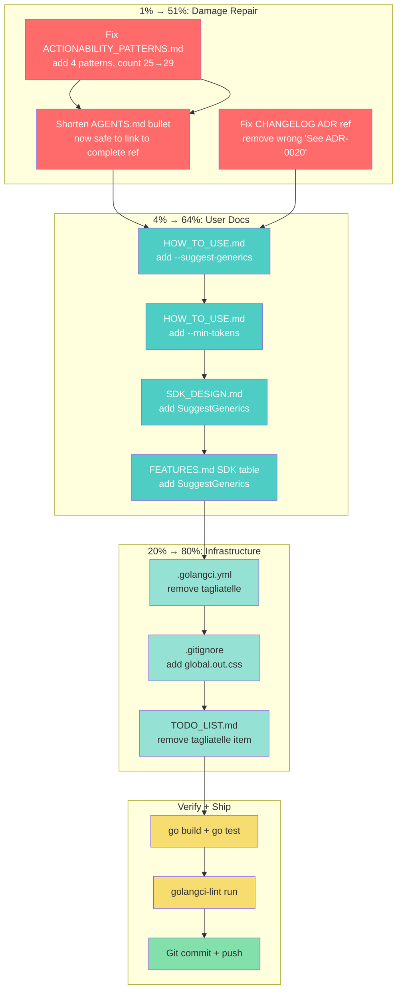

# Plan: Docs-Health Audit Gap Fix Sprint

**Date:** 2026-08-10 07:05
**Context:** Follow-up to `docs/status/2026-08-10_06-59_docs-health-audit-rebuild.md`. The prior session rebuilt living docs + archived 24 reports, but introduced 3 factual errors, missed 4 user-facing doc updates, and deferred trivial infrastructure fixes. This plan closes those gaps.

**Verschlimmbesserung guard:** No re-annotation of archived reports. No new ADRs. No cosmetic reorganization. Only surgical fixes to errors I introduced and documentation gaps for shipped features.

---

## Pareto Analysis

### 1% → 51%: Damage Repair (bugs I CREATED)

These are factual errors introduced in the prior session. Not fixing them leaves docs WORSE than before.

| Task | File | Fix |
|------|------|-----|
| Remove wrong ADR-0020 reference | CHANGELOG.md | Remove "See ADR-0020" from `--suggest-generics` entry |
| Shorten AGENTS.md pattern bullet | AGENTS.md | Replace 29-item inline list with concise summary + link |
| Update ACTIONABILITY_PATTERNS.md | docs/ACTIONABILITY_PATTERNS.md | Add 4 new patterns (defer-call, test-framework-call, state-flag-mutation, empty-default), count 25→29 |

### 4% → 64%: User-Facing Docs for Shipped Features

| Task | File | Add |
|------|------|-----|
| --suggest-generics section | HOW_TO_USE.md | Usage examples after type-aware section |
| --min-tokens section | HOW_TO_USE.md | Usage examples after suggest-generics |
| SuggestGenerics option | SDK_DESIGN.md | SDK option description after TypeAware |
| SuggestGenerics in SDK table | FEATURES.md | Row in SDK API section |

### 20% → 80%: Infrastructure

| Task | File | Fix |
|------|------|-----|
| Remove tagliatelle | .golangci.yml | Delete `- tagliatelle` line |
| Add global.out.css | .gitignore | One line |
| Remove tagliatelle TODO | TODO_LIST.md | Delete the fixed item |

### Final 20%: Verify + Ship

| Task | Command/Action |
|------|----------------|
| Build verification | `go build ./...` |
| Test verification | `go test ./...` |
| Lint verification | `golangci-lint run --timeout 5m ./...` |
| Git commit + push | Detailed message covering all changes |

---

## Execution Graph

---

## 12-Minute Task Breakdown

| # | Task | File | Est | Depends On |
|---|------|------|-----|------------|
| 1 | Read ACTIONABILITY_PATTERNS.md current state + identify insertion points | docs/ACTIONABILITY_PATTERNS.md | 5min | — |
| 2 | Add 4 new pattern rows + update count 25→29 | docs/ACTIONABILITY_PATTERNS.md | 8min | 1 |
| 3 | Replace AGENTS.md pattern bullet with concise version | AGENTS.md | 8min | 2 |
| 4 | Remove "See ADR-0020" from CHANGELOG --suggest-generics entry | CHANGELOG.md | 2min | — |
| 5 | Remove `- tagliatelle` from .golangci.yml | .golangci.yml | 2min | — |
| 6 | Add `global.out.css` to .gitignore | .gitignore | 2min | — |
| 7 | Add --suggest-generics section to HOW_TO_USE.md | HOW_TO_USE.md | 10min | — |
| 8 | Add --min-tokens section to HOW_TO_USE.md | HOW_TO_USE.md | 8min | 7 |
| 9 | Add SuggestGenerics to SDK_DESIGN.md | SDK_DESIGN.md | 5min | — |
| 10 | Add SuggestGenerics to FEATURES.md SDK table | FEATURES.md | 3min | — |
| 11 | Remove tagliatelle item from TODO_LIST.md | TODO_LIST.md | 3min | 5 |
| 12 | Run `go build ./...` + `go test ./...` | — | 5min | 1-11 |
| 13 | Run `golangci-lint run --timeout 5m ./...` | — | 5min | 5,12 |
| 14 | Git commit + push | — | 5min | 12,13 |

**Total estimated time:** ~71 minutes
