# Measure First, Then Trust and Signal — art-dupl Master Plan

**Date**: 2026-08-16 04:27
**Inputs**: `TODO_LIST.md` (2026-08-16), `docs/status/2026-08-16_04-23_suffixtree-followup-slice-transitions-race-fixes.md` §f, `ROADMAP.md`, `FEATURES.md`
**Preamble state**: build / `go test ./...` / `go test -race ./...` / lint all green. Three perf sessions (suffix tree) landed but **unvalidated end-to-end**. One real data race (cache) fixed; the class it came from is **unaudited**.

---

## 0. Guiding Thesis

Three sessions optimized the suffix tree on synthetic benchmarks. Nobody knows what share of a real run the suffix tree occupies. Meanwhile real-user feedback names the actual pains: false-positive noise (12 groups in discordsync from one missing pattern), invisible cache stats, exclude-pattern UX. And the race detector just proved the codebase hides correctness bugs in untested mixes of atomics and locks.

**Therefore: measure reality, then lock in trust (correctness gates), then cut noise (actionability), then polish (UX/perf follow-ups).**

---

## 1. Pareto Breakdown

### The 1% that delivers 51% — MEASURE REALITY

**T1: One real-world end-to-end benchmark with a stage-time split.**

Why this single ~90-minute task carries half the remaining value:

1. It **validates or indicts three sessions of perf work**. If the suffix tree is 5% of a real run's wall clock, `serial()` bulk allocation, `[]*Node` pooling, and any suffix-array migration (ADR-0020) are theater. If it is 40%, they are the roadmap.
2. Every remaining perf TODO (T13–T15, T23) is **gated on this number** — building them before knowing the split is how you verschlimmbessern a system.
3. It yields the **publishable numbers** (README/website: "N seconds on repo X") that adoption actually runs on.

### The 4% that delivers 64% — LOCK IN TRUST, CUT THE WORST NOISE

Four tasks, ~4 hours:

| Task | Why here |
|---|---|
| **T3 Atomic/mutex-mixing audit** | The cache race was real and shipped for weeks. Where there is one mixing bug there are usually siblings. Cheapest possible bug-kill per hour. |
| **T6 CI allocation-regression gate** | Turns "we cut allocations 67%" from a claim into an enforced invariant. Makes all past and future perf work permanent. |
| **T7 `defer-cleanup-of-arbitrary-resource` pattern** | 12 false-positive groups in one real user codebase (discordsync). Largest evidence-backed noise reducer available. |
| **T5 `nix flake check` + `-race` cadence decision** | The canonical gate was skipped for two sessions; `-race ./...` is green for the first time ever. Decide once, wire it, stop relying on luck. |

### The 20% that delivers 80% — COMPLETE THE TRUST/SIGNAL LAYER

T1–T15 plus cleanup: remaining feedback patterns (T8 `go:embed`, T9 `TestMain`), corpus validation (T10), cache-stats visibility (T11), exclude-pattern UX (T12), the two syntax-path allocation items **if T1 justifies them** (T13, T14), syntax budgets (T15), housekeeping trio (T19), docs sync (T25).

### The other 20% to reach 100% — POLISH, PROOF, AND PARKED WORK

Coverage baseline (T16), HTML output UX (T17, T18), hardening of the new slice code (T20–T22), `perf stat` evidence (T23), doc polish (T24), parked-tier entry criteria (T26). Below that: the DEFERRED/ROADMAP backlog stays parked with explicit revisit triggers (see §5) — it is documented, not forgotten.

---

## 2. Comprehensive Plan — 26 tasks, 30–100 min each

Sorted by importance → impact → customer value (effort shown for sequencing).

| # | Task | Track | Impact | Effort | Customer value |
|---|------|-------|--------|--------|----------------|
| T1 | Real-world end-to-end benchmark + stage-time split | Measure | 10 | 90m | Truth about where time goes; publishable perf claims |
| T2 | `taskset -c 1` benchmark protocol + one pinned timing re-run | Measure | 6 | 30m | Trustworthy timing columns in baselines |
| T3 | Atomic/mutex-mixing audit (whole repo) + fixes | Trust | 9 | 60m | No more latent races of the cache class |
| T4 | Cache `Clear()` concurrent-stats regression test | Trust | 5 | 30m | Locks in this session's race fix |
| T5 | `nix flake check` run + CI `-race` cadence wired | Trust | 8 | 45m | Permanent correctness gate |
| T6 | CI allocation-regression gate (benchstat allocs/op) | Trust | 8 | 90m | Perf wins become enforced invariants |
| T7 | `defer-cleanup-of-arbitrary-resource` pattern | Signal | 9 | 90m | −12 FP groups for a real user |
| T8 | `//go:embed` directive pattern | Signal | 6 | 60m | FP cut for go-sse-style codebases |
| T9 | `TestMain` boilerplate pattern | Signal | 5 | 45m | FP cut for all Go repos |
| T10 | Re-validate patterns on feedback corpora (diff FP/FN) | Signal | 7 | 60m | Evidence patterns don't over-suppress |
| T11 | Cache stats in `stats` subcommand | Signal | 6 | 45m | Users see cache effectiveness |
| T12 | `--exclude-pattern` zero-match warning + glob/regex docs | Signal | 5 | 30m | Removes silent-misconfig trap |
| T13 | `serial()` bulk Node allocation | Perf | gated | 90m | Cache-adjacent nodes IF T1 shows serialize matters |
| T14 | `sync.Pool` for `[]*Node` stream slices | Perf | gated | 45m | Fewer allocs IF T1 shows serialize matters |
| T15 | `AllocsPerRun` budgets for `syntax/` serialization | Perf | 5 | 45m | Regression guard for T13/T14 |
| T16 | Coverage baseline committed | Quality | 4 | 30m | Coverage trends become visible |
| T17 | TTY-aware HTML auto-write | UX | 6 | 60m | Zero-flag HTML reports |
| T18 | Stable display IDs (deep-link anchors) | UX | 6 | 60m | Shareable/reportable clone links |
| T19 | Cleanup trio: dead bench helper, `b.Loop()`, AGENTS bullet | Hygiene | 4 | 30m | No dead code, no lying docs |
| T20 | Slice-vs-reference-map property test | Hardening | 6 | 60m | Proves new transition layout == old semantics |
| T21 | Fuzz high-fanout seeds for `findTran`/`addTran` | Hardening | 5 | 30m | Stresses binary-search + insert-sort interleave |
| T22 | `linearScanMax` boundary micro-benchmark (8 vs 9) | Hardening | 3 | 30m | Crossover constant stays justified |
| T23 | `perf stat` cache-miss A/B vs `23fa1b4f` worktree | Evidence | 4 | 60m | Proves/refutes ADR-0022 locality claims |
| T24 | Suffixtree doc polish trio | Hygiene | 3 | 30m | Docs match the slice design |
| T25 | Docs sync: TODO_LIST checkboxes + CHANGELOG | Docs | 4 | 30m | Living docs stay true |
| T26 | Parked-tier review triggers written into TODO_LIST | Docs | 4 | 30m | Deferred work has entry criteria, not amnesia |

**Sequencing rule**: T1 before T13/T14/T23 (they are gated on its result). Trust track (T3–T6) runs any time. Signal track (T7–T12) independent.

---

## 3. Fine-Grained Breakdown — 105 tasks, ≤12 min each

**Tier A = 1%→51%, Tier B = 4%→64%, Tier C = 20%→80%, Tier D = other 20%→100%.**

| ID | Subtask | Min | Tier |
|----|---------|-----|------|
| 1.1 | Pick + pin external repo fixture (shallow clone, record commit SHA) | 10 | A |
| 1.2a | Write bench driver script (env, iterations, output dir) | 12 | A |
| 1.2b | Wire fixture through full pipeline (crawl→parse→print) | 12 | A |
| 1.3a | Add stage-timing collector struct + `--timing` flag skeleton | 12 | A |
| 1.3b | Wire parse + serialize stage timers | 12 | A |
| 1.3c | Wire build/search/print stage timers | 12 | A |
| 1.4a | Run on fixture, record stage split + total allocs (3 runs) | 12 | A |
| 1.4b | Write `docs/benchmarks/realworld-<repo>.md` results file | 8 | A |
| 1.5 | Verdict memo: suffix-tree share; go/no-go for T13/T14/T23 | 10 | A |
| 2.1 | Add taskset wrapper (script or nix attr) + usage note in benchmarks README | 12 | C |
| 2.2 | One pinned-core re-run of suffixtree timing benchmarks; annotate v3 notes | 12 | C |
| 3.1a | Grep all `atomic.` usages; list fields + access sites | 12 | B |
| 3.1b | Classify each: same-method lock coverage vs mixed access | 12 | B |
| 3.2a | Fix genuine mixes (atomic load/store/swap on shared words) | 12 | B |
| 3.2b | Fix remaining hits or document why safe (happens-before argument) | 12 | B |
| 3.3 | Document audit result in TESTING.md (pattern + how to avoid) | 10 | B |
| 3.4 | Full `go test -race ./...` re-run, green | 10 | B |
| 4.1a | Write concurrent Get-vs-Clear stats test | 12 | B |
| 4.1b | Verify under `-race` (passes now, would have caught old bug) | 6 | B |
| 5.1a | Run `nix flake check`, capture failures | 12 | B |
| 5.1b | Fix any fallout | 12 | B |
| 5.2a | Decide `-race` cadence (push vs nightly), record decision in AGENTS.md | 10 | B |
| 5.2b | Wire cadence into flake checks/CI | 10 | B |
| 6.1a | Script: run suffixtree benches count=1, emit benchstat input | 12 | B |
| 6.1b | Allocs/op column extraction + threshold comparison | 12 | B |
| 6.2a | Wire gate into flake check / CI job | 12 | B |
| 6.2b | Handle env variance (±1 alloc tolerance policy) | 12 | B |
| 6.3a | Inject intentional regression, verify gate fails | 6 | B |
| 6.3b | Revert injection, verify green | 6 | B |
| 7.1a | Extract discordsync corpus samples (defer rows.Close() etc.) | 12 | B |
| 7.1b | Write failing pattern tests from samples | 12 | B |
| 7.2a | Matcher: DeferStmt + CallExpr on arbitrary resource ident | 12 | B |
| 7.2b | Resource-var provenance (guard against suppressing real logic) | 12 | B |
| 7.2c | Register in pattern table with priority slot | 12 | B |
| 7.3 | Tune on corpus; assert zero over-suppression cases | 12 | B |
| 7.4 | Update `docs/ACTIONABILITY_PATTERNS.md` + count in AGENTS.md | 10 | B |
| 8.1a | Extract go-sse `//go:embed` corpus samples | 12 | C |
| 8.1b | Write failing tests | 12 | C |
| 8.2a | Matcher: embed directive comment + embed.FS decl shape | 12 | C |
| 8.2b | fs.Sub call-shape detection | 12 | C |
| 8.3 | Docs + pattern-count sync | 12 | C |
| 9.1a | TestMain corpus + failing tests | 12 | C |
| 9.1b | Matcher (func TestMain + os.Exit/m.Run shape) | 12 | C |
| 9.2 | Validate no over-suppression; docs | 12 | C |
| 10.1a | Fetch/refresh feedback fixture repos | 12 | C |
| 10.1b | Run art-dupl on each, capture group counts | 12 | C |
| 10.2a | Diff FP/FN before/after new patterns (T7–T9) | 12 | C |
| 10.2b | Tabulate precision delta per repo | 12 | C |
| 10.3 | Record numbers in patterns doc | 10 | C |
| 11.1a | Call `Stats()` from `stats` subcommand | 12 | C |
| 11.1b | Output formatting (hits/misses/mem-hits/size) | 12 | C |
| 11.2a | Tests for stats output | 12 | C |
| 11.2b | Help text + HOW_TO_USE note | 8 | C |
| 12.1 | Zero-match warning for `--exclude-pattern` | 12 | C |
| 12.2 | Glob-vs-regex documentation | 12 | C |
| 13.1 | Read `serial()`/`Clone()` interplay; design node-count pre-pass | 12 | C* |
| 13.2a | Implement count pre-pass | 12 | C* |
| 13.2b | Allocate `make([]Node, count)`; index non-statement path | 12 | C* |
| 13.2c | Statement (fingerprint) path conversion | 12 | C* |
| 13.2d | Remove per-node `&Node{}` allocations | 12 | C* |
| 13.3a | Bench before/after (`syntax` benches) | 12 | C* |
| 13.3b | Add/update AllocsPerRun budget | 8 | C* |
| 13.4 | `TestSerializePreservesAllFields` still green | 8 | C* |
| 14.1a | Pool type with reset semantics for `[]*Node` | 12 | C* |
| 14.1b | Wire acquire/release in `SerializeWithMaxChildren` | 12 | C* |
| 14.2 | Bench + `-race` test | 12 | C* |
| 15.1a | AllocsPerRun budget for `serial()` | 12 | C* |
| 15.1b | AllocsPerRun budget for `SerializeWithMaxChildren` | 12 | C* |
| 15.2 | Extend CI alloc gate (T6) to `syntax/` columns | 12 | C* |
| 16.1 | `go test -cover` snapshot script | 12 | D |
| 16.2 | Commit coverage baseline + README note | 12 | D |
| 17.1a | TTY detection (term.IsTerminal) | 12 | D |
| 17.1b | Default output path + console notice | 12 | D |
| 17.1c | Explicit-flag override semantics | 12 | D |
| 17.2a | Test via flag-override path | 12 | D |
| 17.2b | Assert file written + notice shown | 12 | D |
| 18.1a | Stable ID derivation from group content hash | 12 | D |
| 18.1b | HTML anchor emission | 12 | D |
| 18.1c | Plumb ID through group view model | 12 | D |
| 18.2a | Deep-link anchor tests | 12 | D |
| 18.2b | Stability test across reorders | 12 | D |
| 19.1 | Verify `benchmarkFindTranMethod` unused → delete | 10 | C |
| 19.2 | `b.N` → `b.Loop()` (3 sites, `parallel_bench_test.go`) | 10 | C |
| 19.3 | Verify + fix AGENTS.md "Workers routing" bullet | 10 | C |
| 20.1a | Reference map-based transition impl in test file | 12 | D |
| 20.1b | Parity helpers (transition-set normalization) | 12 | D |
| 20.2a | Property: same stream → identical findTran answers | 12 | D |
| 20.2b | Property: random streams (seeded), 1k cases | 12 | D |
| 21.1a | Add high-fanout fuzz seeds (many distinct tokens) | 12 | D |
| 21.1b | Run 100k execs, confirm no panic + channel closes | 12 | D |
| 22.1a | Bench generator: exact-8 transitions/state | 12 | D |
| 22.1b | Exact-9 variant + comparison assertion | 12 | D |
| 23.1a | Git worktree at `23fa1b4f`, build old binary | 12 | D |
| 23.1b | Build current binary (same flags) | 6 | D |
| 23.2 | `perf stat -e cache-misses,cache-references` on both (search bench) | 12 | D |
| 23.3 | Append counter evidence to ADR-0022 | 12 | D |
| 24.1 | Refresh suffixtree package doc (type list, no "Token (interface)" claim drift) | 10 | D |
| 24.2 | `maxStackKeys` getAll dedup evaluation (do or document why not) | 10 | D |
| 24.3 | Name `benchmarkMemoryUsage` magic numbers | 8 | D |
| 25.1 | Sync TODO_LIST checkboxes after execution wave | 12 | C |
| 25.2 | CHANGELOG entries for T7–T12, T17–T18 | 12 | C |
| 26.1 | Write revisit triggers for DEFERRED items into TODO_LIST | 12 | D |
| 26.2 | Write graduation criteria for top ROADMAP items (suffix-array A/B, threshold cliff, `.art-duplignore`) | 12 | D |

\* C-gated: only executed if T1's verdict says the syntax/serialize stage matters (≥15% of wall clock).

**Totals**: 105 subtasks, ~17.5 h. Tier A ≈ 1.5 h, Tier A+B ≈ 5.5 h, Tier A+B+C ≈ 13 h, +D ≈ 17.5 h.

---

## 4. Execution Graph

```mermaid
flowchart TD
    subgraph A["Tier A — 1% → 51%: MEASURE"]
        T1["T1 Real-world benchmark<br/>+ stage-time split"]
    end

    subgraph B["Tier B — 4% → 64%: TRUST + TOP NOISE"]
        T3["T3 Atomic-mixing audit"]
        T4["T4 Clear() race regression test"]
        T5["T5 flake check + -race CI"]
        T6["T6 CI allocation gate"]
        T7["T7 defer-cleanup pattern<br/>(−12 FP groups)"]
    end

    subgraph C["Tier C — 20% → 80%: COMPLETE THE LAYERS"]
        T2["T2 taskset protocol"]
        T8["T8 go:embed pattern"]
        T9["T9 TestMain pattern"]
        T10["T10 corpus validation"]
        T11["T11 cache stats cmd"]
        T12["T12 exclude-pattern UX"]
        T13["T13 serial() bulk alloc"]
        T14["T14 []*Node pool"]
        T15["T15 syntax budgets"]
        T19["T19 cleanup trio"]
        T25["T25 docs sync"]
    end

    subgraph D["Tier D — other 20% → 100%"]
        T16["T16 coverage baseline"]
        T17["T17 TTY-aware HTML"]
        T18["T18 stable IDs"]
        T20["T20 slice-vs-map property test"]
        T21["T21 fuzz high-fanout"]
        T22["T22 linearScanMax bench"]
        T23["T23 perf stat evidence"]
        T24["T24 doc polish"]
        T26["T26 parked-tier triggers"]
    end

    T1 -->|"go / no-go"| T13
    T1 -->|"go / no-go"| T14
    T1 -->|"justifies effort"| T23
    T2 -.->|"clean timing for"| T23
    T6 -->|"gate extended by"| T15
    T7 --> T8 --> T9 --> T10
    T13 --> T15
    T14 --> T15
    T25 --> T26
    T3 --> T4
    T3 --> T5
```

**Critical path**: T1 → (verdict) → T13/T14 → T15 → T6-extension. Everything else is parallelizable across sessions.

---

## 5. Parked Work (documented, with entry criteria — NOT forgotten)

| Item | Entry criterion |
|---|---|
| Suffix Array + LCP detector (ADR-0020) | T1 shows suffix tree ≥30% of wall clock on real repos |
| `serial()`-adjacent: per-file offset map (8N→2N) | T1 + memory profile on 100k-file corpus |
| Winnowing pre-filter | A user actually hits 100k-file scale |
| `int32` arena indices, `[]Pos` pool | Profile shows pointer-chasing / search allocs dominant again |
| Threshold cliff, `.art-duplignore`, `--ci-gate`, `--diff-baseline`, test-aware thresholds | Post-T10: corpus numbers define which UX lever pays first |
| TS/Python, LSP, watch mode, ML actionability | Explicit user pull; architecture docs exist |
| TypeAwareData restructure, branded NodeType, `syntax/golang` facade | Breaking-change windows only (major version) |

---

## 6. Anti-Verschlimmbesserung Rules

1. **T13/T14/T23 do not start before T1's verdict.** Optimizing unmeasured paths is how systems get worse.
2. **Every pattern (T7–T9) ships with over-suppression assertions** — a pattern that hides real duplication is worse than the noise it removes.
3. **T6's gate gets ±1-alloc tolerance** — a flaky CI gate that cries wolf gets disabled, and then nothing is protected.
4. **No reformatting/refactoring drives in this plan.** Every task is additive or fix-only.
5. **Race tests never get `t.Parallel()` with `AllocsPerRun`** (learned this session the hard way).
