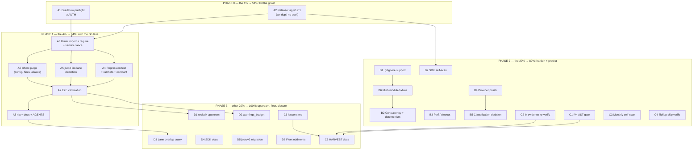

# SUPERB Plan — art-dupl Core Lane: BuildFlow Inversion, Ghost Purge, Hardening

**Date:** 2026-09-24 18:04
**Input:** `docs/status/2026-09-24_17-00_buildflow-artdupl-ghost-wiring-core-backup-verdict.md` (session findings + 50-item next-list), open `TODO_LIST.md` MEDIUM items, and the user's architecture directive:

> **art-dupl is the CORE duplication detector in BuildFlow. jscpd is the BACKUP for languages art-dupl doesn't support yet** (JS/TS, Python, Rust, Bash, YAML).

**Goal state:** art-dupl live in every BuildFlow run as the Go+templ duplication detector; jscpd demoted to the non-Go fallback lane; all ghost wiring deleted; provider production-grade; quality gates protect the gains.

**Ground truth (verified this session):**
- BuildFlow has NO art-dupl provider — never existed (`git log --all -- 'tools/providers/dupl*'` empty).
- Live dup detector = jscpd (`tools/providers/jscpd_provider.go:77`), hardcoded `--min-tokens 80` (`:107`) — weak for Go.
- Ghost wiring: `dupl-check` constant (`domain/config/tool_name.go:127`), `dupl_threshold` (10–50, default 30, `domain/config/dupl_threshold.go`) + `--semantic` flag — validated, telemetrized, consumed by nobody. Three name aliases (`dupl`/`dupl-check`/`art-dupl`).
- Wrong install hints ×2: `internal/cli/doctor_cmd.go:226` + `flake.nix:543` → `github.com/afontainized/art-dupl` (nonexistent org).
- SDK path ready: blank-import pattern (`tools/providers/sdk_imports.go`, 7 tools), `ToolFromSpec` wraps WorkDir + progress; `healthCheckFromSDK(nil)` → `NoOpHealthCheck` (verified safe).
- `toolsdk/v1.13.1` tag verified on go-finding remote; BuildFlow has `toolsdk v1.13.0 // indirect` — MVS lands v1.13.1 on import.
- art-dupl provider: `pkg/provider/` — shipped, tested, lint-clean, **unwired** (ghost system).
- BuildFlow tree currently unstable: `go run ./cmd/buildflow` fails (go.mod needs tidy) — preflight required before Track A.

**Decision points carried (status report g1–g3, planning assumptions):**
- **g1 (BuildFlow edits):** Track A is planned in full but flagged `⚠ AUTH` — execution requires the user's go-ahead (this is a repo Lars owns but I was not yet authorized to mutate).
- **g2 (threshold):** v1 core lane ships with FIXED semantic threshold (5 statements). Knob = upstream toolsdk work (D1), not a blocker.
- **g3 (release):** Plan assumes tag-first (A2) so BuildFlow pins resolve real versions. go-output stays renderer-free (standing recommendation; no plan items).

**Do-not-verschlimmbessern rules for execution:** no BuildFlow edits without authorization; delete ghost config only after the replacement is wired and E2E-verified (never a window with neither); jscpd demotion only AFTER art-dupl is live (never a window with NO Go dup detector); every BuildFlow change goes through their vendor/nix dance (`go work vendor` + `nix run .#update-vendor-hash`) and `nix build .`; art-dupl changes keep suite+lint+arch-lint green; parked TODO_LIST items stay parked (explicit deferral rationale, not amnesia).

---

## Pareto Breakdown

### The 1% that delivers 51% — the ghost-system kill shot
Two atomic acts, ~45+60 min combined, make art-dupl REAL in BuildFlow:
1. **Cut + push the art-dupl release tag** (A2) — versions resolve (`providerVersion()` stops reporting `dev`).
2. **The blank import + require in BuildFlow** (A3) — one import line plus go.mod/vendor compliance. The provider's findings flow into every pipeline run. This single wiring act delivers more than half the total value: the core detector goes live.

### The 4% that delivers 64% — own the Go lane
3. **jscpd Go-lane demotion** (A5) — remove `go` from jscpd's patterns/formats; the inversion completes.
4. **Ghost purge** (A6) — delete dead config/aliases, fix install hints; the rot stops misdirecting.
5. **E2E verification** (A7) — prove findings render, severity stays below the fail-on gate, result cache behaves.

### The 20% that delivers 80% — production-grade + protected
6. **Core-lane hardening:** .gitignore parity (B1), concurrency/determinism (B2), workspace-scale perf/timeout (B3), provider polish (B4), classification decision (B5), multi-module fixture (B6), self-scan (B7).
7. **Quality debts:** f#4 AST gate (C1), "ln" evidence re-verification (C2), self-scan cadence (C3), flipflop skip verification (C4).
8. **BuildFlow stabilization:** nix/docs/AGENTS updates (A8).

### The other 20% to reach 100%
9. **Upstream + fleet:** toolsdk proposals (D1), warnings_budget rollout (D2), overlap measurement (D3), SDK/README docs (D4), json/v2 migration slice (D5, TODO_LIST #14), fleet oddments (D6: gogenfilter skipped consumers, filepath.Separator sweep #15, branch protection #18, go-paperless #20, Windows exe-start #4).
10. **Process closure:** HARVEST into TODO_LIST (C5), lessons.md commit for the `rg -r` recidivism (C6).

---

## Comprehensive Plan — Medium Granularity (30–100 min per task)

27 tasks. Sorted by importance/impact/customer-value (primary), effort (secondary). Total ≈ 1,530 min ≈ 25.5 h.
Impact: 5 = unblocks/delivers core value, 4 = protects/delivers major, 3 = meaningful, 2 = polish/fleet hygiene.
`⚠ AUTH` = requires user go-ahead to touch BuildFlow.

| # | ID | Task | Track | Impact | Effort | Depends on |
|---|----|------|-------|--------|--------|------------|
| 1 | A2 | Release tag v0.7.1: full gate green → annotated tag → push → proxy-serve verify → consumer-style providerVersion check | art-dupl | 5 | 45m | — |
| 2 | A1 | BuildFlow preflight: tidy state, `scripts/preflight-consistency.sh`, tree quiescence, rebuild stale binary, capture baseline provider list | BuildFlow ⚠AUTH | 5 | 45m | — |
| 3 | A3 | Wire art-dupl: blank import in `sdk_imports.go` + require v0.7.1 (root+tools go.mod) → tidy → `go work vendor` → `update-vendor-hash` → build root/tools/execution | BuildFlow ⚠AUTH | 5 | 60m | A1, A2 |
| 4 | A7 | E2E verify: fixture repo → findings render in detect-only summary, severity < fail-on default, result-cache hit/invalidate, jscpd absence on Go-only fixture | BuildFlow ⚠AUTH | 5 | 60m | A3, A4, A5, A6 |
| 5 | A4 | Compliance rail: `TestArtDuplProviderRegistered` + audit ratchets (module-scoped registry, fan-out audits) + `ToolArtDupl` constant + metadata row `dupl-check`→`art-dupl` | BuildFlow ⚠AUTH | 4 | 45m | A3 |
| 6 | A5 | jscpd demotion: remove `goFilePattern` from `jscpdTriggerPatterns` + `go` from `jscpdFormats`; update tests; document backup-lane policy | BuildFlow ⚠AUTH | 4 | 45m | A3 |
| 7 | A6 | Ghost purge: `dupl-check` constant/metadata/build-mode case; `dupl_threshold`+`DuplSemantic`/`--semantic` end-to-end (flag→koanf→materialize→validate→telemetry per gotcha #25 cliFlagsMap rule); install hints ×2; `language.ToolDupl`; deprecated-alias decision | BuildFlow ⚠AUTH | 4 | 90m | A3 |
| 8 | B6 | Multi-module integration fixture: 3 modules + vendor/ + generated + templ + dot-dirs through the full SDK path; cross-module clone MUST be found | art-dupl | 4 | 60m | — |
| 9 | B2 | Concurrency + determinism suite: parallel Detect under `-race`, GroupID stability, `ErrNoDuplicatesFound`→empty mapping, sorted-output determinism | art-dupl | 4 | 60m | — |
| 10 | B1 | Provider .gitignore support: extract/share the `cmd` matcher, wire into provider crawl, tests (negation, patterns), parity with jscpd `--gitignore` | art-dupl | 4 | 60m | — |
| 11 | C1 | f#4 quality gate: AST-scanner test banning direct `encoding/json/v2`/`jsontext` in Duration/wire paths (pattern: `TestNoDuplicateErrorNewMessages`), wire into nix check, fix violations | art-dupl | 4 | 90m | — |
| 12 | B7 | SDK-path self-scan on art-dupl itself; compare vs CLI baseline; fix or ledger deltas | art-dupl | 3 | 45m | A2 |
| 13 | B5 | Classification metadata decision: SDK computes clone-type/category/priority/actionability vs documented absence → ADR + implementation or doc + BuildFlow display note | art-dupl | 3 | 90m | — |
| 14 | B3 | Workspace-scale perf/timeout: 33-module-shape synthetic fixture benchmark, compare vs BuildFlow `default_step_timeout`, decide Spec-timeout need (upstream note) | art-dupl | 3 | 60m | — |
| 15 | C3 | Monthly self-scan cadence: `scripts/self-scan.sh -t 1 --type-aware`, judge every group, extract harmful, append `docs/SELF_CLEAN_LEDGER.md` | art-dupl | 3 | 45m | — |
| 16 | C5 | HARVEST this plan + status report into TODO_LIST/ROADMAP; FEATURES/HOW_TO_USE provider docs verify | art-dupl | 3 | 45m | — |
| 17 | A8 | BuildFlow stabilization: `nix build .` green, `docs --check`, AGENTS.md gotcha #73 pipeline story + core/backup-lane gotcha, detailed commits | BuildFlow ⚠AUTH | 3 | 45m | A7 |
| 18 | D1 | toolsdk upstream: issues + prototype for options channel (threshold knob), `Spec.Timeout` mapping, HealthCheck helper (go-finding) | upstream | 3 | 90m | A7 |
| 19 | B4 | Provider polish: explicit HealthCheck in Spec, threshold contract in Description, `stripEmptyMetadata` full-key assertion, Windows slash parity, gogenfilter parity test | art-dupl | 2 | 60m | — |
| 20 | C2 | Re-verify "ln"-tainted evidence from prior session with plain rg; correct any docs carrying artifacts | art-dupl | 2 | 30m | — |
| 21 | C4 | Verify go-line flipflop skip (`.buildflow.yml` `skip_steps: [go-mod-normalize]`) is actually effective | cross | 2 | 30m | — |
| 22 | C6 | Commit `rg -r` recidivism lesson to crush-config `references/lessons.md` (by commit, deploy via home-manager) | process | 2 | 30m | — |
| 23 | D2 | warnings_budget rollout: telemetry-derived ceiling in BuildFlow `.buildflow.yml` (+20% headroom), render-collapse verify, fleet template note | BuildFlow ⚠AUTH | 2 | 45m | A7 |
| 24 | D4 | SDK docs: README toolsdk-provider section, `pkg/artdupl` `ErrNoDuplicatesFound` contract doc, HOW_TO_USE note | art-dupl | 2 | 45m | — |
| 25 | D3 | Lane-overlap measurement (post-soak): fleet query jscpd non-Go findings vs art-dupl Go findings; verdict on backup-lane scope | fleet | 2 | 60m | A8 |
| 26 | D6 | Fleet oddments triage: gogenfilter skipped consumers (9), filepath.Separator sweep (#15), branch protection (#18 owner checklist), go-paperless release (#20), Windows exe-start probe (#4) | fleet | 2 | 60m | — |
| 27 | D5 | json/v2 migration slice (TODO_LIST #14): classify ~30 files, migrate Duration/wire-risky ones, golden byte-identity tests, update TODO_LIST | art-dupl | 2 | 90m | — |

---

## Detailed Breakdown — Fine Granularity (max 12 min per task)

All fine tasks, sorted by parent priority then execution order. Each is independently verifiable.

### A2 — Release tag v0.7.1 (art-dupl, P0)
| ID | Task | Est |
|----|------|-----|
| A2.1 | Full gate: `go test -count=1 ./...`, `golangci-lint run`, `go-arch-lint check` — all green | 12m |
| A2.2 | Verify version embedding (flake ldflags vs `dev` fallback) + CHANGELOG current | 8m |
| A2.3 | Cut annotated tag `v0.7.1` and push it (verify with `git ls-remote --tags`) | 10m |
| A2.4 | Proxy-serve check: `env -u GOFLAGS go list -m github.com/LarsArtmann/art-dupl@v0.7.1` from neutral dir | 6m |
| A2.5 | Consumer-style build test: `providerVersion()` resolves the real version via build info | 9m |

### A1 — BuildFlow preflight (⚠AUTH, P0)
| ID | Task | Est |
|----|------|-----|
| A1.1 | `git status` + quiescence check; assess go.mod tidy state without mutating yet | 8m |
| A1.2 | Run `scripts/preflight-consistency.sh`; record failures | 12m |
| A1.3 | Rebuild the stale BuildFlow binary (TODO_LIST: built at `7e1fbfe`, repo later) | 10m |
| A1.4 | Capture baseline: `list providers` output, confirm art-dupl absent, jscpd present | 8m |
| A1.5 | Dry MVS check: with a hypothetical require, `go mod graph` shows `toolsdk v1.13.1` | 7m |

### A3 — Wire the blank import (⚠AUTH, P0)
| ID | Task | Est |
|----|------|-----|
| A3.1 | Add `_ "github.com/LarsArtmann/art-dupl/pkg/provider"` + inventory comment in `sdk_imports.go` | 8m |
| A3.2 | Add require `art-dupl v0.7.1` to root + tools go.mod; ensure toolsdk flips direct at v1.13.1 | 10m |
| A3.3 | `GOEXPERIMENT=jsonv2 go mod tidy` (root + tools); verify no pseudo-version regressions | 10m |
| A3.4 | `go work vendor` + `nix run .#update-vendor-hash` | 12m |
| A3.5 | Build gates: `go build ./...` + `go vet ./...` in root, tools/, execution/ | 10m |
| A3.6 | Smoke: `buildflow -s art-dupl` on a tiny fixture; findings appear | 10m |

### A4 — Compliance rail (⚠AUTH)
| ID | Task | Est |
|----|------|-----|
| A4.1 | Add `TestArtDuplProviderRegistered` in `sdk_imports_test.go` (gotcha #156 guard) | 10m |
| A4.2 | Run audit ratchets: module-scoped registry tests, fan-out audits — art-dupl must not be flagged | 12m |
| A4.3 | Add `ToolArtDupl` name constant; `TestRegisteredTools_HaveConstants` green | 10m |
| A4.4 | Update `tool_metadata.go` row: `"dupl-check"` → `"art-dupl"`, Go scope, real description | 8m |
| A4.5 | `go vet ./tools/...` + tools module test slice | 5m |

### A5 — jscpd Go-lane demotion (⚠AUTH)
| ID | Task | Est |
|----|------|-----|
| A5.1 | Remove `goFilePattern` from `jscpdTriggerPatterns`, `go` from `jscpdFormats` | 8m |
| A5.2 | Update jscpd tests for the narrowed pattern/format set | 12m |
| A5.3 | Document backup-lane policy in the provider header comment | 7m |
| A5.4 | Verify: Go-only fixture no longer triggers jscpd; JS fixture still does | 10m |
| A5.5 | Check `.jscpd.json` repo-config branch unaffected for non-Go repos | 8m |

### A6 — Ghost purge (⚠AUTH)
| ID | Task | Est |
|----|------|-----|
| A6.1 | Delete `ToolDuplCheck` constant + all references | 10m |
| A6.2 | Delete `dupl-check` metadata row + `build_mode.go` case | 8m |
| A6.3 | Remove `keyDuplThreshold`/env var/default from `koanf.go` + `unknown_keys.go` | 12m |
| A6.4 | Delete `DuplThreshold` type + constraints + `materialize.go` wiring | 10m |
| A6.5 | Remove `--semantic`/`--dupl-threshold` flags + `workflow_config.go` wiring | 12m |
| A6.6 | Remove telemetry `cliFlagsMap` entries ONLY (gotcha #25: never `configMap`) | 10m |
| A6.7 | Remove `config_cmd*` references (init template, validate, display) | 10m |
| A6.8 | Fix install hints: `doctor_cmd.go:226` + `flake.nix:543` → `github.com/LarsArtmann/art-dupl` | 8m |
| A6.9 | Delete `language.ToolDupl` + `tool_paths` doc example referencing `"dupl"` | 8m |
| A6.10 | Fleet grep for `dupl-check` in `.buildflow.yml`s → deprecatedToolAliases decision | 12m |

### A7 — E2E verification (⚠AUTH)
| ID | Task | Est |
|----|------|-----|
| A7.1 | Fixture repo: Go duplicate pair (≥5 statements) + clean module + JS duplicate pair | 12m |
| A7.2 | Full run: art-dupl findings render in the detect-only summary section (gotcha #86) | 12m |
| A7.3 | Severity check: findings below fail-on=error default; no unconfigured hard-fail | 10m |
| A7.4 | Result cache: 2nd run hits; file change invalidates; rebuild invalidates (gotcha #122) | 12m |
| A7.5 | Lane check: jscpd absent on Go-only fixture, present on JS-only fixture | 10m |
| A7.6 | Budget smoke: set a `warnings_budget` for art-dupl, verify render collapse | 8m |

### A8 — BuildFlow stabilization (⚠AUTH)
| ID | Task | Est |
|----|------|-----|
| A8.1 | `nix build .` green (flake sees the new require via gomod2nix) | 12m |
| A8.2 | `buildflow docs --check` green (tool counts/metadata consistent) | 10m |
| A8.3 | AGENTS.md: update gotcha #73 (pipeline tool live) + new core/backup-lane gotcha | 12m |
| A8.4 | Detailed commit(s) of all BuildFlow changes | 11m |

### B1 — Provider .gitignore support (art-dupl)
| ID | Task | Est |
|----|------|-----|
| B1.1 | Locate `GitignoreMatcher` in cmd; design shared home (no cmd import from pkg) | 12m |
| B1.2 | Extract matcher to shared package (or parameterize injection into provider) | 12m |
| B1.3 | Wire into `collectSourceFiles` crawl | 10m |
| B1.4 | Tests: pattern honored, negation, nested `.gitignore`, no-gitignore fallback | 12m |
| B1.5 | Update provider package doc (remove "not honored" caveat) | 5m |
| B1.6 | Provider suite + lint green | 9m |

### B2 — Concurrency + determinism suite (art-dupl)
| ID | Task | Est |
|----|------|-----|
| B2.1 | Parallel Detect test: N goroutines, same working dir, under `-race` | 12m |
| B2.2 | GroupID stability test: identical input → identical hashes across runs | 10m |
| B2.3 | `ErrNoDuplicatesFound` → empty findings (not error) mapping test | 8m |
| B2.4 | Two different working dirs concurrently (module fan-out shape) | 12m |
| B2.5 | Deterministic sorted-output assertion (stable order for caches/diffs) | 10m |
| B2.6 | `go test -race -count=1 ./pkg/provider/` green | 8m |

### B3 — Workspace-scale perf/timeout (art-dupl)
| ID | Task | Est |
|----|------|-----|
| B3.1 | Synthetic 33-module fixture generator (Go files incl. dup pairs, vendor/, generated) | 12m |
| B3.2 | Benchmark SDK `FindClones` on fixture; record wall time + allocs | 12m |
| B3.3 | Compare vs BuildFlow `default_step_timeout`; write conclusion | 10m |
| B3.4 | Decide Spec-level timeout need; note for D1 if upstream field required | 8m |
| B3.5 | Record numbers in `docs/benchmarks/` note | 10m |

### B4 — Provider polish (art-dupl)
| ID | Task | Est |
|----|------|-----|
| B4.1 | Explicit HealthCheck in Spec (check toolsdk helper; else inline func) | 10m |
| B4.2 | Spec Description: state fixed semantic threshold (5 statements) contract | 8m |
| B4.3 | `stripEmptyMetadata` full-key-set assertion test (all classification keys) | 12m |
| B4.4 | Windows crawl slash-normalization parity test | 12m |
| B4.5 | gogenfilter parity test (FilterAll catches sqlc/templ/protobuf content) | 10m |
| B4.6 | Suite + lint green | 8m |

### B5 — Classification metadata decision (art-dupl)
| ID | Task | Est |
|----|------|-----|
| B5.1 | Evaluate: SDK computes classification vs provider documents absence (cost/benefit) | 12m |
| B5.2 | Write ADR with the decision + rationale | 12m |
| B5.3a | Path IMPLEMENT: thread Classification through pkg/artdupl pipeline | 12m |
| B5.3b | Path IMPLEMENT (cont.): classifier wiring + metadata emission | 12m |
| B5.3c | Path IMPLEMENT (cont.): tests for parity with CLI labels | 12m |
| B5.4 | Path DOCUMENT: provider doc + BuildFlow display note; printer/finding expectations test | 12m |

### B6 — Multi-module integration fixture (art-dupl)
| ID | Task | Est |
|----|------|-----|
| B6.1 | Fixture: 3 modules + vendor/ + generated files + templ + dot-dirs | 12m |
| B6.2 | Expectations: vendor/generated skipped; templ parsed; cross-module clone found | 12m |
| B6.3 | Full SDK path test incl. `WithWorkingDir` context | 12m |
| B6.4 | Negative: examples/demo/demos excluded | 10m |
| B6.5 | Suite run + lint | 8m |

### B7 — SDK-path self-scan (art-dupl)
| ID | Task | Est |
|----|------|-----|
| B7.1 | Run provider path against art-dupl's own tree | 10m |
| B7.2 | Compare findings vs CLI baseline run | 10m |
| B7.3 | Fix deltas or file findings (dogfood) | 12m |
| B7.4 | Ledger note in SELF_CLEAN_LEDGER.md | 8m |

### C1 — f#4 AST quality gate (art-dupl)
| ID | Task | Est |
|----|------|-----|
| C1.1 | Study `TestNoDuplicateErrorNewMessages` scanner pattern | 10m |
| C1.2 | Scanner part 1: walk production files, flag `encoding/json/v2`/`jsontext` imports | 12m |
| C1.3 | Scanner part 2: risk filter — files whose types marshal `time.Duration` (AST/type-driven) | 12m |
| C1.4 | Exceptions list (test files, string-only payloads) with rationale | 12m |
| C1.5 | Wire into nix check; run; fix any violation found | 12m |
| C1.6 | AGENTS.md note: gate exists, how to extend | 8m |

### C2 — "ln" evidence re-verification (art-dupl)
| ID | Task | Est |
|----|------|-----|
| C2.1 | Re-run plain rg on every file cited with "ln"-tainted evidence | 12m |
| C2.2 | Correct any corrupted claims in docs/status reports | 12m |
| C2.3 | Ledger note listing corrected artifacts | 6m |

### C3 — Monthly self-scan cadence (art-dupl)
| ID | Task | Est |
|----|------|-----|
| C3.1 | Run `scripts/self-scan.sh -t 1 --type-aware` | 12m |
| C3.2 | Judge every shown group (harmful vs intentional) | 12m |
| C3.3 | Extract harmful clones found | 12m |
| C3.4 | Append decisions to `docs/SELF_CLEAN_LEDGER.md` | 9m |

### C4 — Flipflop skip verification (cross)
| ID | Task | Est |
|----|------|-----|
| C4.1 | Confirm `.buildflow.yml` `skip_steps: [go-mod-normalize]` present + semantically effective | 10m |
| C4.2 | Trigger the pre-commit path; verify no go-line rewrite | 12m |
| C4.3 | Record outcome (TODO_LIST update if resolved) | 8m |

### C5 — HARVEST + docs verify (art-dupl)
| ID | Task | Est |
|----|------|-----|
| C5.1 | Harvest status report (f)-list + this plan into TODO_LIST.md | 12m |
| C5.2 | Route brainstorm items to ROADMAP.md with rigor | 12m |
| C5.3 | Verify FEATURES.md provider row + HOW_TO_USE.md provider note | 8m |
| C5.4 | Cross-ref check (docs consistency) | 8m |
| C5.5 | Commit doc updates | 5m |

### C6 — lessons.md commit (process)
| ID | Task | Est |
|----|------|-----|
| C6.1 | Draft `rg -r` recidivism lesson (trigger, failure mode, rule) | 10m |
| C6.2 | Commit to crush-config repo `references/lessons.md` | 10m |
| C6.3 | Note home-manager activation path for deployment | 10m |

### D1 — toolsdk upstream (go-finding)
| ID | Task | Est |
|----|------|-----|
| D1.1 | Issue: options/config channel for Spec (threshold knobs) with design sketch | 12m |
| D1.2 | Issue: `Spec.Timeout` → BuildFlow `DAGPolicy.Timeout` mapping gap | 10m |
| D1.3 | Issue: explicit HealthCheck helper (NoOp) for self-documenting specs | 8m |
| D1.4 | Prototype options channel on a branch (Spec.Options + ctx or typed config) | 12m |
| D1.5 | Prototype cont.: consumer-side read path + art-dupl adoption behind it | 12m |
| D1.6 | Tests + PR with migration notes | 12m |

### D2 — warnings_budget rollout (⚠AUTH)
| ID | Task | Est |
|----|------|-----|
| D2.1 | Query state DB: art-dupl findings/run over recent window | 12m |
| D2.2 | Set budget = max observed + 20% in BuildFlow `.buildflow.yml` | 10m |
| D2.3 | Verify over-budget marker + collapse render | 8m |
| D2.4 | Fleet template note (per-repo budgets) | 10m |

### D3 — Lane-overlap measurement (fleet)
| ID | Task | Est |
|----|------|-----|
| D3.1 | Define the comparison query (jscpd non-Go vs art-dupl Go findings per repo) | 10m |
| D3.2 | Run fleet query part 1 (BuildFlow + 2 canary repos) | 12m |
| D3.3 | Run fleet query part 2 (rest of fleet, post-soak) | 12m |
| D3.4 | Analyze: does the backup lane pull weight? Scope verdict | 12m |

### D4 — SDK docs (art-dupl)
| ID | Task | Est |
|----|------|-----|
| D4.1 | README: toolsdk provider section (BuildFlow = consumer #1) | 12m |
| D4.2 | `pkg/artdupl` doc: `ErrNoDuplicatesFound` → empty-findings contract | 10m |
| D4.3 | HOW_TO_USE.md: provider note | 8m |
| D4.4 | Usage example snippet verified against real API | 10m |

### D5 — json/v2 migration slice (art-dupl, TODO_LIST #14)
| ID | Task | Est |
|----|------|-----|
| D5.1 | Enumerate ~30 direct-import files; classify Duration/wire risk | 12m |
| D5.2 | Migrate high-risk files 1–3 (Duration-bearing) | 12m |
| D5.3 | Migrate high-risk files 4–6 | 12m |
| D5.4 | Migrate high-risk files 7–10 (or declare done at N) | 12m |
| D5.5 | Golden wire byte-identity tests for migrated paths | 12m |
| D5.6 | Update TODO_LIST progress + AGENTS.md count | 8m |

### D6 — Fleet oddments triage (fleet)
| ID | Task | Est |
|----|------|-----|
| D6.1 | gogenfilter skipped consumers (9): pick next repo, assess baseline | 12m |
| D6.2 | filepath.Separator sweep (#15): enumerate candidate files | 12m |
| D6.3 | Branch protection (#18): owner-action checklist drafted | 8m |
| D6.4 | go-paperless (#20): CHANGELOG + version decision via go-release | 12m |
| D6.5 | Windows exe-start (#4): reproduce + root-cause probe | 12m |

**Fine totals:** 118 tasks, ≈ 1,180 min of estimated hands-on time across ≈ 25.5 h of medium-task budget (medium estimates include coordination/verification overhead).

---

## Execution Graph

**Critical path:** A2 → A3 → A4 → A7 → A8 (≈ 4.2 h with A1 in parallel). Everything in Phase 2/3 runs off the critical path once Phase 1 lands.

**No-gap invariants (verschlimmbessern guards):**
1. jscpd demotion (A5) strictly AFTER wiring (A3) — never a window with zero Go dup detection.
2. Ghost purge (A6) strictly AFTER wiring (A3) — never a window with neither old config nor new tool.
3. A7 (E2E) gates A8 — BuildFlow docs/nix claims only after verified behavior.
4. No BuildFlow mutation before the ⚠AUTH go-ahead (g1).

---

## Out of scope (deliberate, from TODO_LIST PARKED)
Branded `NodeType int32` (gob format), syntax/golang facade (import cycle), `sync.Pool` for stream slices and contextList `[]Pos` (measured no-win, ADR-0022), collection-level `TypeAwareData` (breaking). These have explicit deferral rationale — not amnesia; do not resurrect without new evidence.
