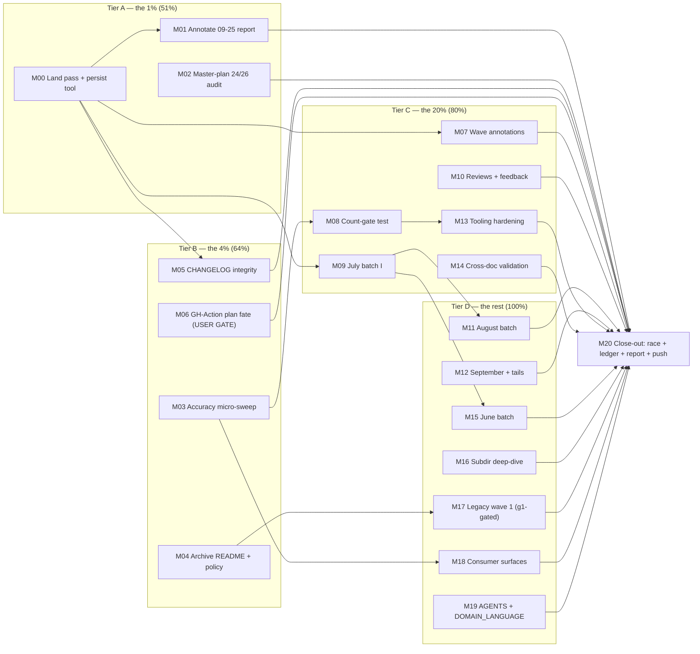

# SUPERB Plan — Docs-Health Completion: Close the Audit Pass, Make Truth Durable, Sweep the Backlog

**Date:** 2026-09-28 21:57 CEST
**Status:** EXECUTED 2026-09-29 (M00–M20 + gated M17) — all tiers landed; M17 (legacy retrofit waves) remains gated on g1. Execution records: `docs/status/2026-09-28_23-50_superb-execution-m00-m11-landed.md` (first half) and `docs/status/2026-09-29_00-54_superb-complete-m12-m20-jsonutil-catch.md` (second half + the jsonutil incident). Per-item verdicts for all 50 source items: §10 verdict accounting below. Successor plan: `docs/planning/2026-09-29_01-10_SUPERB-v2-harden-harness-unblock-ship.md`.
**Input:** `docs/status/2026-09-28_21-54_docs-health-full-audit-pass.md` section (f) — all 50 items, mapped 1:1 below (item #s in the M/F tables' `Src` columns).
**Method:** Pareto tiers (1% → 51%, 4% → 64%, 20% → 80%, remainder → 100%), then every task granularized to ≤12 min. Nothing from the 50-item list is dropped — coverage matrix at the bottom proves it.

---

## 0. Diagnosis — Where the Value Actually Is

The audit pass made the six living docs truthful and archived the fully-done past. What remains splits into three fundamentally different jobs:

1. **Durability** (items 1, 2, 8, 46): the freshest artifacts (09-25 report, master-plan claim, uncommitted tree, /tmp script) still rot or vanish. Cheapest, highest readership, do first.
2. **Accuracy tail** (items 9–20, 41–50): a handful of known-unverified claims (45+ flags, 28 templ nodes, stale counts in HOW_TO_USE/website/CONTRIBUTING) plus standing gates so numbers re-derive from code instead of rotting.
3. **Annotation backlog** (items 21–32, 27): ~170 reports classified and harvested but not item-annotated. High effort, lower marginal value (all open items already routed), purely chronological priority.

The Pareto cut follows that ordering. The backlog (job 3) is deliberately LAST — annotating old reports before making the new ones self-answering would be polishing history while the present lies.

**VERSCHLIMMBESSERUNG guards (non-negotiable):**

- Strike only with per-item evidence (hash / CHANGELOG section / `file:line`). No blanket banners.
- Never touch already-struck lines; the atomic annotator refuses partial writes — keep that property.
- Doc numbers must be COMPUTED (command output), never asserted — the pass's own 27-vs-26 lesson.
- No rewriting history in archived files; annotations are append-mode strikethroughs only.
- The count-gate test (M08) must FAIL first against an intentionally-wrong constant before it earns trust (canary rule).

---

## 1. Pareto Breakdown

### The 1% that delivers 51% (≈2h of ≈18h total)

**Make the newest truth durable and auditable:**

- **M01** — Annotate the 09-25 full-arc report (the single most-opened document right now; its (f) is half-routed, its item 50 demanded the 13-30 annotation that now exists).
- **M02** — Audit the master plan's "24/26 done" claim: identify the 2 unspecified open items; make the TODO_LIST header claim cite them.
- **M00** — Commit the pass with real messages + persist the annotator script out of /tmp (everything else builds on the script surviving).

### The 4% that delivers 64% (adds ≈4h)

**Kill every known false or unverifiable claim in the living docs:**

- **M03** — Accuracy micro-sweep: "45+ flags", "28 templ node types", stale "29/30 patterns" greps repo-wide, ACTIONABILITY_PATTERNS ↔ code table identity.
- **M04** — `docs/status/archived/README.md`: document the two archive regimes + the legacy-retrofit policy (decision-ready for g1).
- **M05** — CHANGELOG integrity: compare-link definitions, Keep-a-Changelog audit, v0.7.2 GitHub release notes backfilled from the new CHANGELOG section.

### The 20% that delivers 80% (adds ≈7h)

**Standing gates + the fresh backlog annotated:**

- **M06** — GitHub-Action distribution plan (0/20): decision memo → route or Won't-implement (USER GATE, g2).
- **M07** — Wave annotations: `_13-13` + `_17-37` (verdicts already extracted in the audit).
- **M08** — Standing count-gate test: FEATURES pattern/mode/node counts derived from code in a Go test (canary-verified).
- **M09** — July batch I annotation (07-19 → 07-25, 8 reports).
- **M13** — Tooling: freshness gate script, AGENTS cadence entry, empty-snapshot prevention proposal.

### The other 20% to reach 100% (≈9h, mostly mechanical)

- **M10** — Reviews + feedback stayers + HTML-render triage.
- **M11** — August batch annotation (10 reports).
- **M12** — September reports + SUPERB planning tails.
- **M14** — Cross-doc link validation + HOW_TO_USE flag-section sweep.
- **M15** — June batch annotation (30 reports).
- **M16** — Subdirectory deep-dive (api/quality/fuzz/calibration/baselines/bug-reports + architecture assets + boolblind).
- **M17** — Legacy archive retrofit wave 1 (GO-AWAY-GATED on question g1).
- **M18** — Consumer-surface slice: CONTRIBUTING, templates, pre-commit hooks, website counts.
- **M19** — AGENTS rubric score + DOMAIN_LANGUAGE provider terms.
- **M20** — Close-out: full `-race` suite, ledger append, final commit + push.

---

## 2. Comprehensive Plan — Medium Granularity (30–100 min tasks)

Sorted by impact/effort/customer-value. "Customer" = Lars reading his own repo state + AI sessions loading context.

| ID      | Task                                                                                                                                                                                                                        | Impact      | Effort | Customer Value                                        | Depends |
| ------- | --------------------------------------------------------------------------------------------------------------------------------------------------------------------------------------------------------------------------- | ----------- | ------ | ----------------------------------------------------- | ------- |
| **M00** | Commit the audit pass properly (TODO_LIST + 2 annotated reports + this plan, `docs:` message) and copy the annotator to `scripts/annotate-status-items.py` with a spec-format README (src 6, 8)                             | 🔴 Critical | 30m    | Work is reviewable; the tool survives reboots         | —       |
| **M01** | Annotate `2026-09-25_09-43` full-arc report: strike resolved (f)-items (11–16, 21–23, 30–32, 38, 46, 49), leave the rest bare (src 1, 46)                                                                                   | 🔴 Critical | 45m    | The current-era report answers "is this done?" inline | M00     |
| **M02** | Master-plan "24/26" audit: read the plan's T-tables, identify the 2 open items by ID, update TODO_LIST header to cite them; fix the header claim style (src 2, 50)                                                          | 🔴 Critical | 30m    | The flagship progress number becomes auditable        | —       |
| **M03** | Accuracy micro-sweep: verify/fix "45+ flags", templ "28 node types", repo-wide grep for "29/30 patterns"/"15+ patterns" residue, ACTIONABILITY_PATTERNS table ↔ `actionabilityPatternTable` identity check (src 11, 12, 17) | 🔴 Critical | 60m    | Zero known false claims in living docs                | —       |
| **M04** | Write `docs/status/archived/README.md`: two-regime explanation, retrofit policy, gate commands; fold the `docs/archive/` vs `archived/` consolidation decision (src 4, 27, 31)                                              | 🟠 High     | 45m    | Future readers + future passes understand the archive | —       |
| **M05** | CHANGELOG integrity: audit bottom compare-link definitions (add `[Unreleased]`/`[0.7.2]` if missing), full Keep-a-Changelog pass, backfill GitHub v0.7.2 release notes from CHANGELOG via `gh release edit` (src 9, 16, 41) | 🟠 High     | 45m    | Release history navigable; the v0.7.2 void filled     | M00     |
| **M06** | GitHub-Action distribution plan fate: write a 10-line decision memo (route-as-TODO vs Won't-implement), present to Lars with the plan's effort math (src 5)                                                                 | 🟠 High     | 30m    | The 0/20 zombie plan gets a verdict                   | —       |
| **M07** | Annotate wave reports `2026-08-16_13-13` (40/41 resolved) + `_17-37` (25/28) from the audit's verdict tables; leave the 1+3 open items bare (src 3)                                                                         | 🟠 High     | 45m    | Wave era self-answering; open residue visible         | M00     |
| **M08** | Standing count-gate test (`docs_health_test.go` or `printer`): derive pattern count, detection-mode count, node-type count from code; assert FEATURES claims; canary-fail first, then green (src 13, 14)                    | 🟠 High     | 60m    | Doc numbers re-derive from code; rot fails CI         | M03     |
| **M09** | July batch I annotation: `07-19` ×3, `07-21`, `07-22`, `07-24` ×2, `07-25` ×2 (8 reports, verdicts from audit agents) (src 21)                                                                                              | 🟡 Medium   | 90m    | July era self-answering                               | M00     |
| **M10** | Reviews + feedback: annotate 3 brutal-self-review .mds, add "routed:" headers to 3 feedback stayers, triage stale `.html` renders (archive/supersede banners) (src 24, 25, 29, 47)                                          | 🟡 Medium   | 60m    | Open critiques visible; feedback dir self-describing  | —       |
| **M11** | August batch annotation: 08-10 ×5, 08-15 ×2, 08-16 ×3 reports with open items (src 22)                                                                                                                                      | 🟡 Medium   | 90m    | August era self-answering                             | M09     |
| **M12** | September + planning tails: 09-13/14 ×3, 09-22 ×3, 09-23 reports + SUPERB 07-24/26/28 open tails (2-2-2 items each) (src 23, 32)                                                                                            | 🟡 Medium   | 60m    | Current month + deferred tails self-answering         | —       |
| **M13** | Tooling hardening: `scripts/check-docs-freshness.sh` (Last-Updated + count drift), AGENTS.md docs-health cadence entry (~2026-10-28 due), empty-snapshot prevention proposal to daemon config (src 34, 35, 39, 40)          | 🟡 Medium   | 60m    | Next pass is cheap, gated, and scheduled              | M08     |
| **M14** | Cross-doc validation: internal-link check over TODO_LIST/ROADMAP/FEATURES/HOW_TO_USE (harvest added many report paths), HOW_TO_USE sections for stdin/dump-tokens/timing flags (src 18, 19)                                 | 🟡 Medium   | 45m    | No dead links; no undocumented v0.7.x flags           | M00     |
| **M15** | June batch annotation: all 30 unarchived June reports (src 28)                                                                                                                                                              | 🟢 Low      | 100m   | Last unannotated month closed                         | M09     |
| **M16** | Subdirectory deep-dive: docs/api, quality, fuzz, calibration, baselines, bug-reports; architecture-understanding asset staleness banners; boolblind-analysis verdict (src 20, 26, 30)                                       | 🟡 Medium   | 90m    | No dark corners left in docs/                         | —       |
| **M17** | Legacy archive retrofit wave 1: 2026-08 archived cohort (~40 files) annotated with CHANGELOG-era evidence — **GO-AWAY-GATED on question g1** (src 27)                                                                       | 🟢 Low      | 100m   | Archive regime consistency (only if funded)           | M04     |
| **M18** | Consumer-surface slice: CONTRIBUTING build-commands check, templates/ + .pre-commit-hooks.yaml freshness, website count-slice (src 42, 43, 44)                                                                              | 🟢 Low      | 45m    | Public surfaces truthful                              | M03     |
| **M19** | AGENTS rubric scoring pass (agents-quality-guide) + DOMAIN_LANGUAGE: Finding/GroupID/toolsdk terms (src 37, 48)                                                                                                             | 🟢 Low      | 45m    | AI-session context stays superb                       | —       |
| **M20** | Close-out: `go test ./...` + `-race`, append pass decisions to `docs/SELF_CLEAN_LEDGER.md`, adopt the health-report format verbatim for the final report, commit + push (src 38, 45, 49)                                    | 🟠 High     | 45m    | Pass lands clean and durable                          | ALL     |

**Total estimated effort: ≈18h.** The 1% (M00–M02) ≈ 1.75h. The 4% (+M03–M05) ≈ +2.5h. The 20% (+M06–M09, M13) ≈ +5.5h. The remainder is the mechanical long tail.

---

## 3. Detailed Breakdown — Fine Granularity (≤12 min tasks)

Sorted in execution order within each task. IDs prefixed by parent.

### M00 — Land the pass + persist the tool (30m)

| ID   | Task                                                                                                            | Est |
| ---- | --------------------------------------------------------------------------------------------------------------- | --- |
| F001 | `git status` + stage TODO_LIST.md, the two annotated 09-xx reports                                              | 2m  |
| F002 | Write the commit message (audit-pass scope, gates, counts computed from `git diff --stat`)                      | 5m  |
| F003 | Commit + verify `git log` shows exactly the intended files                                                      | 2m  |
| F004 | `cp /tmp/docshealth-annotate.py scripts/annotate-status-items.py` + append its spec grammar as a header comment | 5m  |
| F005 | Smoke-test the script: dry-run one already-annotated file, confirm atomic refusal                               | 3m  |
| F006 | Commit the script (`docs(tools): persist the docs-health batch annotator`)                                      | 2m  |

### M01 — Annotate the 09-25 full-arc report (45m)

| ID   | Task                                                                                                      | Est |
| ---- | --------------------------------------------------------------------------------------------------------- | --- |
| F007 | View the (f)-section rows 1–25, build spec for resolved ones (1–5 user-gated → LEAVE; 6–15 verify+strike) | 12m |
| F008 | Verify each strike target against code/CHANGELOG (grep, ≤8 checks)                                        | 8m  |
| F009 | Run the annotator; fix unmatched keys if any; verify `grep -c '~~'`                                       | 5m  |
| F010 | Rows 16–25: same spec+verify+run cycle                                                                    | 12m |
| F011 | Item 50 (the 13-30 annotation demand): strike as `done — 2026-09-28_13-30 annotated this pass`            | 2m  |
| F012 | Final gate: check-rows on the file; commit                                                                | 6m  |

### M02 — Master-plan 24/26 audit (30m)

| ID   | Task                                                                                               | Est |
| ---- | -------------------------------------------------------------------------------------------------- | --- |
| F013 | Read the master plan's §2–§3 T-tables; list all 26 tasks with their status markers                 | 8m  |
| F014 | Identify the 2 open/not-go items by ID; verify neither shipped under another name (grep CHANGELOG) | 8m  |
| F015 | Update TODO_LIST header: "complete (24/26 …)" → cite the two open IDs explicitly                   | 5m  |
| F016 | Update the plan file's status header with the same IDs; commit                                     | 5m  |

### M03 — Accuracy micro-sweep (60m)

| ID   | Task                                                                                              | Est |
| ---- | ------------------------------------------------------------------------------------------------- | --- |
| F017 | Count CLI flags: `art-dupl --help` output → FEATURES "45+ flags" claim; fix or keep with evidence | 6m  |
| F018 | Count templ node types (transform_components/transform_node cases) → "28 node types" claim; fix   | 8m  |
| F019 | `grep -rn "29 \|30 pattern\|15+ boilerplate" --include='*.md'` repo+website; fix each residue     | 10m |
| F020 | Diff ACTIONABILITY_PATTERNS.md table rows vs `actionabilityPatternTable` order/labels; fix drift  | 12m |
| F021 | Verify the two PARTIALLY_DONE FEATURE rows (property engine, confidence tiers) against code       | 8m  |
| F022 | Record every fix in the commit; rerun count-gate inputs (feeds M08)                               | 4m  |

### M04 — Archive README + policy (45m)

| ID   | Task                                                                                                       | Est |
| ---- | ---------------------------------------------------------------------------------------------------------- | --- |
| F023 | Draft `docs/status/archived/README.md`: regime A (inline-annotated sweep, grep-gated) vs regime B (legacy) | 10m |
| F024 | Document the gate commands (grep + check-rows) verbatim                                                    | 4m  |
| F025 | Legacy-retrofit policy section: cost estimate, per-batch protocol, or formal Won't-implement               | 6m  |
| F026 | `docs/archive/` vs `archived/` consolidation note (what each dir is FOR)                                   | 5m  |
| F027 | Commit; link the README from the audit status report's gap #1                                              | 5m  |

### M05 — CHANGELOG integrity (45m)

| ID   | Task                                                                                              | Est |
| ---- | ------------------------------------------------------------------------------------------------- | --- |
| F028 | Check CHANGELOG bottom for link definitions; add `[unreleased]`/`[0.7.2]` compare URLs if missing | 6m  |
| F029 | Sweep all release sections: exactly one `## [x.y.z]` per release, no orphan brackets              | 10m |
| F030 | Draft v0.7.2 release notes from the CHANGELOG section (severity cap + tags)                       | 6m  |
| F031 | `gh release edit v0.7.2 --notes-file …` + verify the render                                       | 6m  |
| F032 | Commit docs changes; cross-link from RELEASE.md checklist if a step is missing                    | 6m  |

### M06 — GitHub-Action plan fate (30m, USER GATE)

| ID   | Task                                                                                                         | Est |
| ---- | ------------------------------------------------------------------------------------------------------------ | --- |
| F033 | Summarize the plan's 20 items into 5 capability bundles with effort math                                     | 8m  |
| F034 | Draft the two options (route-as-TODO vs Won't-implement) with the BuildFlow-lane counter-argument            | 8m  |
| F035 | Present in the session; on verdict: route to TODO_LIST or strike the plan file with `Won't implement` header | 8m  |

### M07 — Wave report annotations (45m)

| ID   | Task                                                                                                                        | Est |
| ---- | --------------------------------------------------------------------------------------------------------------------------- | --- |
| F036 | `_13-13`: transcribe the audit verdicts to a spec (40 resolved, 1 open)                                                     | 10m |
| F037 | Run annotator + gates on `_13-13`                                                                                           | 5m  |
| F038 | `_17-37`: spec (25 resolved, 3 open) + run + gates                                                                          | 12m |
| F039 | Cross-check the 4 open residues are routed (coverage-trend note, HTML goldens→TODO ✓, threshold-1 test, 13-13 supersession) | 8m  |
| F040 | Commit both                                                                                                                 | 3m  |

### M08 — Standing count-gate test (60m)

| ID    | Task                                                                                                     | Est |
| ----- | -------------------------------------------------------------------------------------------------------- | --- |
| F040b | Design: which claims are cheaply derivable (pattern labels, detection modes, node types)? Write the list | 8m  |
| F041  | Write `docs_health_counts_test.go`: parse FEATURES.md, compare against `AllActionabilityPatterns()` etc. | 12m |
| F042  | Canary: temporarily corrupt one FEATURES number → test MUST fail                                         | 4m  |
| F043  | Fix the canary, run green, wire into the default suite                                                   | 4m  |
| F044  | Document the gate in AGENTS.md (one bullet, links to the test)                                           | 4m  |

### M09 — July batch I (90m)

| ID        | Task                                                                                                                                         | Est      |
| --------- | -------------------------------------------------------------------------------------------------------------------------------------------- | -------- |
| F045–F052 | One 10m cycle per file (`07-19` ×3, `07-21`, `07-22`, `07-24` ×2, `07-25` ×2): transcribe audit verdicts → spec → annotator → verify strikes | 10m each |
| F053      | Batch gate: check-rows over all 8; commit                                                                                                    | 10m      |

### M10 — Reviews + feedback stayers (60m)

| ID   | Task                                                                                                        | Est |
| ---- | ----------------------------------------------------------------------------------------------------------- | --- |
| F054 | Annotate `reviews/2026-08-15_22-44_brutal-self-review.md` (2 open items: BuildFlow hook, hint-prefix strip) | 10m |
| F055 | Annotate `reviews/2026-07-25_17-35` (1 open: withLock/diffStatTable tests) + `2026-06-20_06-50` (2 open)    | 10m |
| F056 | Add "routed:" headers to the 3 `feedback/new/` stayers                                                      | 6m  |
| F057 | Triage stale `.html` renders: superseded banners or archive alongside their .md siblings                    | 12m |
| F058 | Commit                                                                                                      | 2m  |

### M11 — August batch (90m)

| ID        | Task                                                                                         | Est     |
| --------- | -------------------------------------------------------------------------------------------- | ------- |
| F059–F068 | One 8m cycle per report (08-10 ×5, 08-15 ×2, 08-16 ×3): verdicts → spec → annotator → verify | 8m each |
| F069      | Batch gate + commit                                                                          | 10m     |

### M12 — September + planning tails (60m)

| ID   | Task                                                                                        | Est |
| ---- | ------------------------------------------------------------------------------------------- | --- |
| F070 | `09-13` gopaperless investigation: strike 48 resolved of 60 (audit verdicts in hand)        | 12m |
| F071 | `09-14` ×2 + `09-19` ×2 remaining: same cycle                                               | 12m |
| F072 | `09-22` ×3 + `09-23`: same cycle                                                            | 12m |
| F073 | SUPERB planning tails 07-24/26/28: strike the 2-2-2 resolved items, leave parked items bare | 12m |
| F074 | Batch gate + commit                                                                         | 12m |

### M13 — Tooling hardening (60m)

| ID   | Task                                                                                                | Est |
| ---- | --------------------------------------------------------------------------------------------------- | --- |
| F075 | `scripts/check-docs-freshness.sh`: fail if any living doc "Last Updated" > 30 days behind HEAD date | 12m |
| F076 | Extend it: grep the known hand-maintained counts (pattern count) vs the M08 test's source values    | 8m  |
| F077 | Wire into `nix flake check` as `docs-fresh` (guarded: warns only, until proven stable)              | 10m |
| F078 | AGENTS.md: docs-health cadence bullet (monthly, next due 2026-10-28, link the archived README)      | 6m  |
| F079 | Empty-snapshot prevention: draft the daemon-guard proposal (one page, docs/planning/)               | 12m |
| F080 | Commit tooling                                                                                      | 4m  |

### M14 — Cross-doc validation (45m)

| ID   | Task                                                                                                      | Est |
| ---- | --------------------------------------------------------------------------------------------------------- | --- |
| F081 | Script: extract markdown links from TODO_LIST/ROADMAP/FEATURES/HOW_TO_USE; check local targets exist      | 12m |
| F082 | Fix every dead link (expect the harvest-added report paths to be the offenders)                           | 10m |
| F083 | HOW_TO_USE: stdin/`--files` section (already TODO — do the 12-min doc slice now or confirm it stays TODO) | 8m  |
| F084 | HOW_TO_USE: `--dump-tokens` positions + `--timing` sections present? add if missing                       | 10m |
| F085 | Commit                                                                                                    | 5m  |

### M15 — June batch (100m)

| ID        | Task                                                                                        | Est     |
| --------- | ------------------------------------------------------------------------------------------- | ------- |
| F086–F095 | One 9m cycle per report (30 June files in 3 sub-batches of 10): verdicts → spec → annotator | 9m each |
| F096      | Sub-batch gates ×3 + final commit                                                           | 10m     |

### M16 — Subdirectory deep-dive (90m)

| ID   | Task                                                                                                        | Est |
| ---- | ----------------------------------------------------------------------------------------------------------- | --- |
| F097 | `docs/api/` + `docs/quality/` + `docs/fuzz/`: inventory + staleness verdicts (KEEP/ARCHIVE/BANNER per file) | 12m |
| F098 | `docs/calibration/` + `docs/baselines/` + `docs/bug-reports/`: same                                         | 12m |
| F099 | architecture-understanding: staleness banners on June d2/svg/html assets                                    | 10m |
| F100 | `docs/analysis/2026-03-25_boolblind-analysis.md`: settled? strike or archive                                | 8m  |
| F101 | Execute the KEEP/ARCHIVE/BANNER verdicts                                                                    | 12m |
| F102 | Commit                                                                                                      | 4m  |

### M17 — Legacy retrofit wave 1 (100m, GO-AWAY-GATED on g1)

| ID        | Task                                                                                      | Est        |
| --------- | ----------------------------------------------------------------------------------------- | ---------- |
| F103      | Pick the newest 10 legacy-archived files; verify each item against CHANGELOG-era evidence | 12m        |
| F104–F108 | 5 more 8-file cycles of the same verify+strike protocol                                   | 8m each... |
| F109      | Batch gate + commit wave 1; record per-batch velocity for the go/no-go on wave 2          | 10m        |

### M18 — Consumer-surface slice (45m)

| ID   | Task                                                                                             | Est |
| ---- | ------------------------------------------------------------------------------------------------ | --- |
| F110 | CONTRIBUTING.md: build commands vs AGENTS.md (nix-first, templ generate) — diff and fix          | 8m  |
| F111 | `templates/` + `.pre-commit-hooks.yaml`: flags referenced still exist; fix stale references      | 10m |
| F112 | website: grep for pattern counts + provider claims; fix or file into the ROADMAP Website section | 12m |
| F113 | Commit                                                                                           | 3m  |

### M19 — AGENTS rubric + DOMAIN_LANGUAGE (45m)

| ID   | Task                                                                        | Est |
| ---- | --------------------------------------------------------------------------- | --- |
| F114 | Score AGENTS.md against the skill's agents-quality-guide rubric; list gaps  | 12m |
| F115 | Fix the top 3 rubric gaps (if ≤12m each) or file them                       | 12m |
| F116 | DOMAIN_LANGUAGE: add Finding, GroupID, toolsdk, advisory-severity-cap terms | 10m |
| F117 | Commit                                                                      | 3m  |

### M20 — Close-out (45m)

| ID   | Task                                                                                                     | Est |
| ---- | -------------------------------------------------------------------------------------------------------- | --- |
| F118 | `go test ./...` + `-race` (CGO_ENABLED=1) full suite                                                     | 12m |
| F119 | Append this plan's decisions + gate results to `docs/SELF_CLEAN_LEDGER.md` (doc-debt section)            | 6m  |
| F120 | Write the final health report in the skill's verbatim format (two-score table + per-doc findings + math) | 12m |
| F121 | Final commit + `git push origin fork` + verify CI triggers                                               | 8m  |

---

## 4. Execution Graph

Critical path: **M00 → M03 → M08 → M13 → M20** (the gates chain). The annotation batches (M09→M11→M15) run parallel to the gates chain and only feed M20.

---

## 5. Risks & Mitigations

| Risk                                                                                                     | Mitigation                                                                                                  |
| -------------------------------------------------------------------------------------------------------- | ----------------------------------------------------------------------------------------------------------- |
| Annotation drift: striking an item that actually shipped under a DIFFERENT name (false "done")           | Every strike carries evidence from THIS session's agent verdicts or a fresh grep; when in doubt, leave bare |
| The count-gate test (M08) becomes a false-confidence prop if it only checks claims that are already true | Canary rule F042: corrupt a number, watch it fail, then fix — a gate never observed failing is untested     |
| `gh release edit v0.7.2` clobbers the existing install-instructions body                                 | Append, don't replace: fetch current body, prepend the changelog section, write back; verify render after   |
| Freshness gate (M13) spams red on docs legitimately awaiting their next pass                             | Warn-only mode first (F077), hard-fail only after one clean cycle                                           |
| Legacy retrofit (M17) turns into evidence fabrication at scale                                           | Hard per-item verify protocol; wave-1 velocity gate decides wave 2; g1 answer gates the whole task          |
| Batch annotation fatigue → rubber-stamp strikes in M11/M15                                               | Sub-batch gates every 10 files; any uncertain item stays bare — bare is the honest signal                   |
| Daemon commits mid-plan bury the real messages again                                                     | Living-doc edits committed at each M-task boundary (F-pattern), never left for the heuristic sweep          |
| VERSCHLIMMBESSERUNG of the archive conventions                                                           | M04 documents BEFORE M17 touches; one scheme, written down, then followed                                   |

## 6. Non-Goals (What This Plan Does NOT Do)

- No new product features, no detection-engine changes, no CLI changes (docs + test-only code).
- No rewriting of historical report CONTENT — strikethrough annotations only, append-mode.
- No mass-move of files beyond what M04 documents (archive layout is stable).
- No website rebuild (that lives in the ROADMAP Website section; M18 is count-level only).
- No forcing the legacy retrofit without an explicit go (g1).

## 7. Success Criteria

1. Every one of the 50 source items has a verdict: DONE (with evidence), ROUTED (TODO/ROADMAP id), WON'T-DO (with reason), or GATED (naming the user decision).
2. Zero known false claims remain in living docs (M03 + M08 + M14 close this; the M08 gate keeps it closed).
3. All reports from 2026-08-15 onward are inline-annotated (fully-done ones archived; open ones bare-where-open).
4. The archive has ONE documented regime (M04) and this pass's grep-gate + check-rows gates stay green.
5. `go build`/`go test`/`-race`/`golangci-lint` green at close-out; CI triggered by the push.

## 8. Effort Summary

| Tier  | Tasks              | Effort  | Cumulative value                                   |
| ----- | ------------------ | ------- | -------------------------------------------------- |
| 1%    | M00–M02            | ~1.75h  | 51% — freshest truth durable + auditable           |
| 4%    | +M03–M05           | ~4.25h  | 64% — zero false claims, releases navigable        |
| 20%   | +M06–M10, M13, M14 | ~11.75h | 80% — standing gates + current year self-answering |
| 100%  | +M11, M12, M15–M19 | ~18h    | Backlog closed, dark corners lit                   |
| close | M20                | (incl.) | Landed, gated, pushed                              |

---

## 9. Coverage Matrix — all 50 source items → plan IDs

1→M01 · 2→M02 · 3→M07 · 4→M04 · 5→M06 · 6→M00 · 7→M13 · 8→M00 · 9→M05 · 10→M05 · 11→M03 · 12→M03 · 13→M08 · 14→M08 · 15→M14/M18 · 16→M05 · 17→M03 · 18→M14 · 19→M14 · 20→M16 · 21→M09 · 22→M11 · 23→M12 · 24→M10 · 25→M10 · 26→M16 · 27→M04/M17 · 28→M15 · 29→M10 · 30→M16 · 31→M04 · 32→M12 · 33→M00/M13 · 34→M13 · 35→M13 · 36→M13 · 37→M19 · 38→M20 · 39→M13 · 40→M13 · 41→M05 · 42→M18 · 43→M18 · 44→M18 · 45→M20 · 46→M01 · 47→M10 · 48→M19 · 49→M20 · 50→M02 — **50/50 covered.**

---

## 10. Verdict Accounting — all 50 source items (added 2026-09-29, F002)

One row per item of the audit's (f) list. Verdicts: DONE (evidence), ROUTED (successor id), WON'T (reason), GATED (user question). Successor plan: `docs/planning/2026-09-29_01-10_SUPERB-v2-harden-harness-unblock-ship.md`; execution records: `docs/status/2026-09-28_23-50_superb-execution-m00-m11-landed.md` + `docs/status/2026-09-29_00-54_superb-complete-m12-m20-jsonutil-catch.md`.

| # | Item (short) | Verdict | Evidence / Route |
| --- | --- | --- | --- |
| 1 | Annotate 09-25 full-arc report | DONE | M01: struck with per-item evidence (commit `0832359e`) |
| 2 | Master-plan "24/26" auditable | DONE | M02: header documents 24 executed + 2 measured no-gos (T7, T14); TODO_LIST cites them |
| 3 | Annotate `_13-13` + `_17-37` waves | DONE | M07 |
| 4 | `docs/status/archived/README.md` | DONE | M04: regimes A/B + retrofit policy + gates |
| 5 | GH-Action plan fate (0/20) | DONE | M06: WON'T-IMPLEMENT header; g2 confirm ask open (v2 M01) |
| 6 | Persist annotator to scripts/ | DONE | M00: `scripts/annotate-status-items.py` (`124ac4dc`, `03d5370f`) |
| 7 | check-rows over ALL annotated files | DONE | M13: 7/7 green, ledger-recorded |
| 8 | Real commit messages, not daemon | DONE | M00: task-boundary `docs:` commits (pushed through `42ee0a72`) |
| 9 | CHANGELOG link-definitions | DONE | M05: Keep-a-Changelog audit |
| 10 | GH v0.7.2 notes from CHANGELOG | DONE | M05: backfilled |
| 11 | "45+ flags"/"28 templ" verify | DONE | M03: 56/64 flags, 29 templ; CI-gated now |
| 12 | Stale pattern-count greps | DONE | M03: swept repo-wide |
| 13 | Standing count-gate test | DONE | M08: `cmd/docs_health_counts_test.go`, canary-verified |
| 14 | FEATURES PARTIALLY_DONE rows | DONE | M03/M14: cross-checked; count rows CI-gated |
| 15 | README badges/links | DONE | M14/M18: zero dead links (09-28 sweep) |
| 16 | Keep-a-Changelog audit | DONE | M05 |
| 17 | ACTIONABILITY_PATTERNS ↔ code | DONE | M03: `AllActionabilityPatterns()` identity (37=33+4, CI-gated) |
| 18 | HOW_TO_USE flag sections | DONE | M14: stdin/--files, dump-tokens, --timing present |
| 19 | Internal markdown links | DONE | M14: zero dead links |
| 20 | docs/{api,quality,fuzz,…} deep-dive | DONE | M16: KEEP/ARCHIVE/BANNER verdicts executed |
| 21 | July batch annotation | DONE | M09 (07-19→07-25) |
| 22 | Aug batch annotation | DONE | M11 (08-10/15/16) |
| 23 | Sept batch annotation | DONE | M12 (09-14/22/23) |
| 24 | Reviews annotation | DONE | M10: three brutal-self-review files |
| 25 | feedback/new 07-19 open items | DONE | M10: `Routed (2026-09-28)` headers |
| 26 | boolblind analysis | DONE | M16: dispositioned |
| 27 | Legacy archive retrofit program | GATED | g1: policy + disclaimer DONE (M04); waves await Lars (v2 M01) |
| 28 | June batch annotation | DONE | M15 (30 files) |
| 29 | Stale reviews renders | DONE | M10: triaged/banners; final retirement post-v0.8.0 |
| 30 | Architecture-understanding assets | DONE | M16: directory staleness notice (2026-09-28) |
| 31 | One archive scheme | DONE | M04: archived/README.md regimes |
| 32 | SUPERB 07-24/26/28 tails | DONE | M12 |
| 33 | Upstream annotator extensions | ROUTED | v2 M14 (skill-repo prep; push on go) |
| 34 | Freshness gate script | DONE | M13: `scripts/check-docs-freshness.sh` (warn-only per its own guard) |
| 35 | Empty-snapshot proposal | DONE | M13: `docs/planning/2026-09-28_23-59_empty-snapshot-prevention-proposal.md` |
| 36 | Bench runner persistence | DONE | Verified: `scripts/bench-realworld.sh` already durable |
| 37 | AGENTS rubric scoring | DONE | M19: ≈85 (00:54 report) |
| 38 | Health-report format verbatim | DONE | M20: inline two-score report at close-out (standing rule) |
| 39 | Docs-health cadence in AGENTS | DONE | M13: monthly, next due 2026-10-28 |
| 40 | Grep-gate as scripted flag | DONE | M13: documented in archived/README.md checklist (line 47) |
| 41 | [0.7.2] notes + tag annotation | DONE | M05; RELEASE.md walk → v2 M05 F030 |
| 42 | CONTRIBUTING vs AGENTS | DONE | M18: nix-first + templ generate verified |
| 43 | templates/ + pre-commit freshness | DONE | M18: real flags, verified against binary |
| 44 | Website count-level sweep | DONE | M18: cli-flags.mdx = 56 flags; standing gate → v2 M13 |
| 45 | Post-deletion `-race` reassurance | DONE | M20: 32 packages green, CGO_ENABLED=1 |
| 46 | 09-25 item 50 close-the-loop | DONE | M01: struck |
| 47 | Feedback stayers routed headers | DONE | M10: three `Routed (2026-09-28)` headers |
| 48 | DOMAIN_LANGUAGE provider terms | DONE | M19 (commit `8a8e27a4`) |
| 49 | Ledger append | DONE | M20 (commit `5cd7918e`) |
| 50 | Master-plan claim style | DONE | M02: links the two no-go IDs |

**Tally: 48 DONE · 1 ROUTED (→v2 M14) · 1 GATED (g1) — 50/50 dispositioned.**
