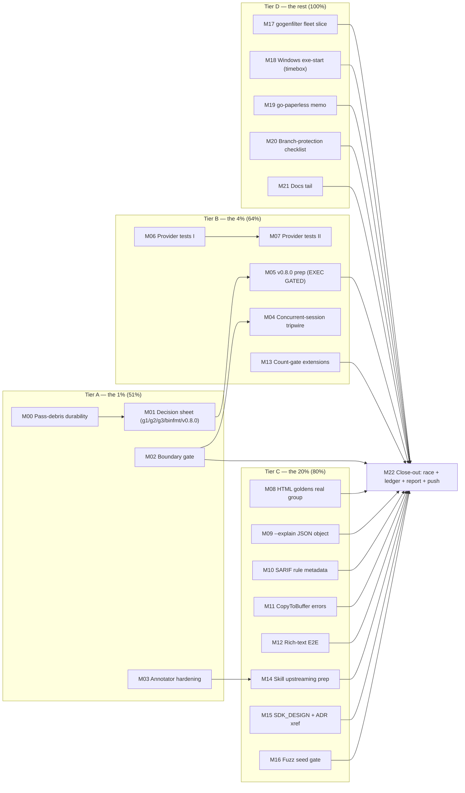

# SUPERB Plan v2 — Harden the Harness, Unblock the Gates, Ship v0.8.0: From a Truthful Repo to a Released One

**Date:** 2026-09-29 01:10 CEST
**Status:** Planning — awaiting execution
**Inputs:** `docs/status/2026-09-28_23-50_superb-execution-m00-m11-landed.md` + `docs/status/2026-09-29_00-54_superb-complete-m12-m20-jsonutil-catch.md` (both f-sections, ~100 items), `TODO_LIST.md`, the jsonutil incident (commit `b679c615` → restored `42ee0a72`), and the three unanswered questions (g1/g2/g3).
**Method:** Pareto tiers (1% → 51%, 4% → 64%, 20% → 80%, remainder → 100%), every task granularized to ≤12 min. Nothing open is dropped — the coverage matrix at the bottom dispositions all ~100 source items (DONE-BY-PROXY, ROUTED, GATED, EXTERNAL, or planned below).

---

## 0. Diagnosis — where the value actually is

The docs pass made the repo truthful: ~2,000 evidence-backed strikes, CI-enforced doc numbers, annotated history, fixed consumer templates and website docs. What remains is three different jobs:

1. **Don't lose the pass's lessons** (items: plan-status flip, 50-item accounting, boundary gate, annotator spec linter, concurrent-session tripwire). The jsonutil incident proved the harness has a hole: a foreign edit rode a docs sweep into a pushed commit and lived ~90 minutes because task boundaries ran scoped tests. The annotator's silent dict-overwrite mis-struck 4 files before item-count reasoning caught it. These are small, and they protect everything else.
2. **Unblock the decisions only Lars can make** (g1 legacy retrofit, g2 GH-Action confirm, g3 BuildFlow gate, binfmt root fix, v0.8.0 go). Fifteen-plus items are gated behind five answers. The highest-leverage 30 minutes of this plan is a decision sheet that makes answering take five.
3. **Ship the release and the product tail.** The B1–B6 hardening is finished, documented, curated under `[Unreleased]` — and unreleased. v0.8.0 is the biggest customer value sitting still. Around it: the provider test-gap bundle (the largest TODO_LIST resident), the recurring `--explain`-JSON / SARIF-metadata / HTML-goldens trio, and a handful of small fixes (CopyToBuffer, rich-text E2E).

**VERSCHLIMMBESSERUNG guards (non-negotiable):**
- **Full suite at every task boundary** — `go test ./...` (or `scripts/check-boundary.sh` once M02 lands). Scoped runs are how a broken marshaler reached the remote. Non-negotiable.
- **Foreign-diff naming:** before any batch commit, `git status` and name every file outside the task's intent. Concurrent sessions are the norm; one question ("why is a Go file dirty in a docs pass?") would have caught jsonutil 90 minutes early.
- **Annotator discipline:** specs are generated from grep of the target file (spec-builder), never hand-typed from memory; the spec linter refuses duplicate keys; `--verify` prints matched lines before writing.
- **No detection-engine changes.** No new patterns, no hash changes, no threshold changes — this plan is harness + release + small product fixes only.
- **Every strike/fix carries per-item evidence** (file:line, CHANGELOG section, or executed command output). Canary-verify every new gate before trusting it.
- **Gated items stay gated.** binfmt, v0.8.0 execution, legacy retrofit, and the BuildFlow-side items wait for Lars's answers (M01 exists to get those answers).
- **Templates/website changes are executed against the built binary before commit** (the M18-previous-pass standard).

---

## 1. Pareto Breakdown

### The 1% that delivers 51% (≈2.75h of ≈18h)

**Make the lessons durable, unblock the human, close the harness holes:**
- **M00** — Pass-debris durability: flip the SUPERB plan's status header, write the explicit 50-item verdict accounting, cross-link the two status reports. The previous pass annotated 46 files and forgot its own driving document.
- **M01** — Decision sheet: one block for Lars answering g1 (retrofit), g2 (GH-Action), g3 (BuildFlow gate), binfmt, v0.8.0 go/no-go — each with effort math and a recommendation. Fifteen items unblock the moment this lands.
- **M02** — Boundary gate: `scripts/check-boundary.sh` (fast profile: race on `internal/...`, `config`, `cmd` + full build + doc-count gate), AGENTS bullet, wired into the task-boundary discipline.
- **M03** — Annotator hardening: duplicate-key refusal, `--verify` mode, spec-builder subcommand (`--emit-keys file:line`), plus fixture tests proving all three. The tool behind ~2,000 strikes stops eating its own tail.

### The 4% that delivers 64% (adds ≈4h)

**The tripwire, the release, and provider correctness:**
- **M04** — Concurrent-session tripwire: opt-in `scripts/check-intent.sh` (intent manifest vs `git status` diff, names unexpected files), daemon-proposal update, decision point for Lars.
- **M05** — v0.8.0 release PREPARATION: `[Unreleased]` finalized, version-bump rehearsal on a worktree, RELEASE.md checklist walked end-to-end, tag message drafted. Execution is one command — **GATED on Lars's go** (M01).
- **M06** — Provider test-gap bundle I: provider↔`printer/finding.ToFindings` equivalence test + gogenfilter parity pin (the TODO_LIST's biggest correctness bundle).
- **M07** — Provider test-gap bundle II: ctx-cancellation, vanishing-file nilerr, `collectSourceFiles` error path, walk-error policy (decision documented, not invented).
- **M13** — Count-gate extensions: website flag table, detection-mode count, output-format count — the manual diffs from the previous pass become CI.

### The 20% that delivers 80% (adds ≈5.5h)

**The recurring product-visible items, closed for real:**
- **M08** — HTML goldens with one real clone group (closes the lone M07 residue; makes clone-group HTML golden-tested).
- **M09** — `--explain` structured JSON explanation object (struck-open in three reports; the JSON consumer still gets only a pattern string).
- **M10** — SARIF rule metadata for actionability patterns (TODO #49-era resident).
- **M11** — CopyToBuffer error propagation (silent `_, _ = io.Copy` — July residue).
- **M12** — Rich-text preview E2E test (struck-open twice).
- **M14** — Skill upstreaming prep: annotator extensions → docs-health skill repo as a PR (verify-before-filing gate applies).
- **M15** — SDK_DESIGN.md refresh (ADR-0025 + provider) + CHANGELOG↔ADR cross-ref check.
- **M16** — Fuzz seed-corpus presence gate ("fuzz targets with zero testdata seeds are suspect") — noted twice, never built.

### The other 20% to reach 100% (≈5h, much of it external or gated)

- **M17** — gogenfilter fleet sweep: scope + execute the art-dupl-side slice; the other 9 consumers are external repos (checklist produced, execution external).
- **M18** — Windows exe-start `ProcessState nil`: one timeboxed round (history: 3 retries failed; `TestExitCodeForError` covers logic). If it bites again, park with the evidence.
- **M19** — go-paperless release memo (external repo; memo + checklist only).
- **M20** — Branch-protection checklist: per-repo GitHub-settings steps written for Lars (settings are owner-only).
- **M21** — Docs tail: linter-count Pareto review doc, CI-architecture section in AGENTS, LSP-hygiene note.
- **M22** — Close-out: full `-race`, ledger append, inline health report, push.

**GATED / EXTERNAL (not scheduled, tracked):** binfmt permanent fix + vendorHash cycle (root); legacy retrofit waves (g1); BuildFlow-side D1/D2/D3 + Build Gate triage (g3); watch mode / TS/Python (ROADMAP pull-gated); branded NodeType + facade (major-version window); GH-Action distribution (won't-implement unless g2 overrides).

---

## 2. Comprehensive Plan — Medium Granularity (30–100 min tasks)

Sorted by importance → impact → customer value. "Customer" = Lars + every BuildFlow fleet repo + future AI sessions.

| ID | Task | Impact | Effort | Customer value | Depends |
| --- | --- | --- | --- | --- | --- |
| **M00** | Pass-debris durability: SUPERB plan status flip + 50-item verdict accounting + cross-links | 🔴 Critical | 30m | The pass's own record becomes self-auditing | — |
| **M01** | Decision sheet: g1/g2/g3 + binfmt + v0.8.0 in one answerable block with recommendations | 🔴 Critical | 30m | Unblocks ~15 gated items in one reply | M00 |
| **M02** | `scripts/check-boundary.sh`: full-suite/fast-profile boundary gate + AGENTS bullet | 🔴 Critical | 45m | The jsonutil class cannot survive a boundary again | — |
| **M03** | Annotator hardening: dup-key refusal + `--verify` + `--emit-keys` spec-builder + fixtures | 🔴 Critical | 60m | 2,000-strike tool stops mis-striking; next pass is cheaper | — |
| **M04** | Concurrent-session tripwire: `scripts/check-intent.sh` + proposal update + Lars decision point | 🟠 High | 60m | Foreign edits get named before they enter history | M02 |
| **M05** | v0.8.0 release preparation (finalize `[Unreleased]`, rehearse bump on worktree, draft tag) — execution GATED | 🟠 High | 60m | The finished hardening reaches every consumer | M01 |
| **M06** | Provider tests I: ToFindings equivalence + gogenfilter parity pin | 🟠 High | 75m | The BuildFlow core lane's correctness is pinned, not assumed | — |
| **M07** | Provider tests II: cancellation, vanishing-file, walk-error policy | 🟠 High | 60m | Error paths of the live lane get real coverage | M06 |
| **M08** | HTML goldens with a real clone group | 🟠 High | 45m | Clone-group HTML changes break goldens like everything else | — |
| **M09** | `--explain` structured JSON explanation object | 🟠 High | 60m | JSON consumers finally get the "why", not just a label | — |
| **M10** | SARIF rule metadata for actionability patterns | 🟡 Medium | 45m | SARIF dashboards can show WHY a result fired | — |
| **M11** | CopyToBuffer error propagation + test | 🟡 Medium | 30m | Test helper stops silently eating read errors | — |
| **M12** | Rich-text preview E2E test | 🟡 Medium | 45m | The rich-text branch loses its "manually verified" caveat | — |
| **M13** | Count-gate extensions: website flags, modes, formats | 🟡 Medium | 45m | The website doc cannot silently fall behind again | — |
| **M14** | Skill upstreaming PR prep (annotator extensions → docs-health repo) | 🟡 Medium | 45m | Every LarsArtmann repo's next docs pass gets the hardened tool | M03 |
| **M15** | SDK_DESIGN refresh + CHANGELOG↔ADR cross-ref | 🟡 Medium | 45m | SDK onboarding docs match the shipped architecture | — |
| **M16** | Fuzz seed-corpus presence gate | 🟡 Medium | 40m | Fuzz targets without seeds fail loudly | — |
| **M17** | gogenfilter fleet sweep: art-dupl slice + external checklist | 🟢 Low | 60m | The 9-consumer debt gets a concrete, executable checklist | — |
| **M18** | Windows exe-start: one timeboxed round, park-with-evidence if it bites | 🟢 Low | 60m | Either the TODO dies or it dies with evidence | — |
| **M19** | go-paperless release memo (external) | 🟢 Low | 30m | TODO #20 becomes a 10-minute mechanical follow | — |
| **M20** | Branch-protection checklist doc | 🟢 Low | 30m | TODO #18 becomes owner-actionable in 15 minutes | — |
| **M21** | Docs tail: linter-count review + CI architecture in AGENTS + LSP note | 🟢 Low | 60m | The last doc debt is either fixed or bounded | — |
| **M22** | Close-out: `-race`, ledger, inline health report, push | 🟠 High | 45m | The pass lands clean, durable, and on the remote | ALL |

**Total estimated effort: ≈18h.** The 1% (M00–M03) ≈ 2.75h. The 4% (+M04–M07, M13) ≈ +5h. The 20% (+M08–M12, M14–M16) ≈ +5.5h. The remainder ≈ 4.75h, of which ~2h is external-repo memos and ~1h is timeboxed investigations with park-outcomes.

---

## 3. Detailed Breakdown — Fine Granularity (≤12 min tasks)

### M00 — Pass-debris durability (30m)

| ID | Task | Est |
| --- | --- | --- |
| F001 | Flip `2026-09-28_21-57_SUPERB-*.md` status header to "EXECUTED 2026-09-29 (M00–M20); M17 gated on g1" + link both status reports | 5m |
| F002 | Build the 50-item verdict table: one row per source item — DONE (evidence) / ROUTED (id) / WON'T (reason) / GATED (question) | 12m |
| F003 | Cross-link: status reports ↔ plan ↔ accounting (each names the others) | 5m |
| F004 | Commit + verify the three files landed with real messages (not daemon heuristic) | 8m |

### M01 — Decision sheet (30m)

| ID | Task | Est |
| --- | --- | --- |
| F005 | Draft the five decisions (g1, g2, g3, binfmt, v0.8.0) each with: options, effort math, recommendation | 12m |
| F006 | Add the gated-item map: which planned/TODO items unblock per answer | 8m |
| F007 | Present inline in the session + file as `docs/planning/2026-09-29_*_decision-sheet.md` | 10m |

### M02 — Boundary gate (45m)

| ID | Task | Est |
| --- | --- | --- |
| F008 | Write `scripts/check-boundary.sh`: `go build ./...` + `go vet ./...` + `go test -race ./internal/... ./config/... ./cmd/...` + count-gate test | 12m |
| F009 | Add `--full` mode: the complete `-race ./...` suite (for close-outs) | 6m |
| F010 | Canary: temporarily reintroduce a v2 import in a scratch package copy → gate MUST fail | 8m |
| F011 | AGENTS bullet: "task boundary == check-boundary.sh; close-out == --full" + link the jsonutil incident | 6m |
| F012 | Commit script + bullet; run it once clean | 6m |
| F013 | Canary-clean: remove scratch, gate green again | 4m |

### M03 — Annotator hardening (60m)

| ID | Task | Est |
| --- | --- | --- |
| F014 | Duplicate-key refusal: specs dict collision → FAIL before any file read | 8m |
| F015 | `--verify` mode: resolve all keys, print `lineNo: matched line` per key, write nothing | 12m |
| F016 | `--emit-keys <file> <lineno...>`: print ready-to-paste `N@substring` keys from grep-verified lines | 12m |
| F017 | Fixture test: a /tmp fixture file + spec exercising numbered/table/checkbox/any/@/dup-refusal/verify | 12m |
| F018 | Update the script header grammar + the archived README tooling section | 6m |
| F019 | Commit; smoke on one real already-annotated file via /tmp copy | 6m |

### M04 — Concurrent-session tripwire (60m)

| ID | Task | Est |
| --- | --- | --- |
| F020 | Write `.check-intent` format: one glob-or-path per line = files this session intends to touch | 6m |
| F021 | `scripts/check-intent.sh`: diff `git status --porcelain` against the manifest; print UNEXPECTED files; `--strict` exits 1 | 12m |
| F022 | Canary: touch a foreign file → UNEXPECTED names it; clean → silent | 8m |
| F023 | Update the empty-snapshot proposal into a combined "daemon + tripwire" proposal page | 12m |
| F024 | Decision point for Lars (enforce where: hook vs discipline) — documented, not imposed | 6m |
| F025 | Commit script + proposal | 6m |

### M05 — v0.8.0 release preparation (60m; EXECUTION GATED on M01)

| ID | Task | Est |
| --- | --- | --- |
| F026 | Finalize `[Unreleased]`: verify every B1–B6/C-item has a user-facing bullet; prune internals | 12m |
| F027 | Rename `[Unreleased]` → `[0.8.0] - 2026-09-29` ON A WORKTREE (not main tree) + add new empty `[Unreleased]` | 8m |
| F028 | Worktree rehearsal: `go build && go test -count=1 ./...` with the version bumped (ldflags path) | 12m |
| F029 | Draft the annotated tag message + GH release notes body from the CHANGELOG section | 8m |
| F030 | Walk RELEASE.md checklist; fix any stale step found (the v0.7.2 lesson) | 8m |
| F031 | Park the prepared worktree/patch with a "run `git push --follow-tags` on go" note; STOP — execution waits for Lars | 6m |

### M06 — Provider tests I (75m)

| ID | Task | Est |
| --- | --- | --- |
| F032 | Read the TODO_LIST test-gap bundle + `pkg/provider` test inventory; list exact gaps | 10m |
| F033 | Equivalence test: `cloneDetector.Detect` output == `ToFindings(classify(...))` on a fixture repo (byte-comparable minus classification metadata) | 12m |
| F034 | gogenfilter parity pin: provider crawl excludes exactly what `FilterAll` excludes (fixture with sqlc/templ/generated files) | 12m |
| F035 | GroupID determinism: verify the existing `TestFindingsFromGroups_GroupIDStableAcrossRuns` covers cross-run AND cross-order | 8m |
| F036 | Wire the three tests; `-race` on the package; lint | 10m |
| F037 | Update TODO_LIST (strike the covered gap rows with test names) | 8m |
| F038 | Commit (test-only change) | 5m |

### M07 — Provider tests II (60m)

| ID | Task | Est |
| --- | --- | --- |
| F039 | ctx-cancellation test: cancel mid-crawl → Detect returns ctx.Err, no goroutine leak (goleak-style check) | 12m |
| F040 | Vanishing-file test: delete a file between discovery and parse → no nilerr, no panic | 10m |
| F041 | `collectSourceFiles` error-path test: unreadable dir → error surfaces, crawl continues/skips per policy | 10m |
| F042 | Walk-error policy decision: document skip-vs-fail in the provider doc comment (the 13-30 open item) | 8m |
| F043 | `-race` + lint + TODO_LIST strike | 8m |
| F044 | Commit (test-only) | 4m |

### M08 — HTML goldens with a real clone group (45m)

| ID | Task | Est |
| --- | --- | --- |
| F045 | Extend the golden test fixture: a small package with 2 real duplicated functions → one clone group | 10m |
| F046 | Regenerate goldens; VERIFY the diff is group-body only (anchors, badges, code block) | 10m |
| F047 | Assert anchor id + permalink present in the golden (deep-link regression guard) | 8m |
| F048 | Run the full printer suite + count gate | 6m |
| F049 | TODO_LIST strike + commit | 6m |

### M09 — --explain structured JSON (60m)

| ID | Task | Est |
| --- | --- | --- |
| F050 | Design the `explanation` object: {clone_type, actionable, pattern, category, tokens, lines, extractability} — field-for-field from `writeExplanation` | 12m |
| F051 | Add `Explanation` struct + `json:"explanation,omitempty"` on JSONClone (only when `--explain` set) | 12m |
| F052 | Map fields in `toJSONClone`; keep `non_actionable_pattern` for back-compat (doc the deprecation) | 10m |
| F053 | Golden/JSON output tests + count-gate still green | 10m |
| F054 | HOW_TO_USE: document the new object with a sample | 8m |
| F055 | Commit; TODO_LIST strike (the triple-open item dies) | 4m |

### M10 — SARIF rule metadata (45m)

| ID | Task | Est |
| --- | --- | --- |
| F056 | Read `printer/sarif.go` rules block; define one rule per actionability pattern family (or a single rule with properties — decide by SARIF spec fit) | 12m |
| F057 | Emit `rules[]` with pattern labels + help URIs to docs/ACTIONABILITY_PATTERNS.md#pattern-priority-order | 12m |
| F058 | Result properties already carry `non_actionable_pattern` — link ruleId ↔ property; validate with the sarif-validate check | 10m |
| F059 | Test: SARIF output on an actionability fixture carries rules + matching property | 8m |
| F060 | Commit | 3m |

### M11 — CopyToBuffer error propagation (30m)

| ID | Task | Est |
| --- | --- | --- |
| F061 | Change `internal/testutil/bdd_helpers.go::CopyToBuffer` to capture the io.Copy error into the done channel payload | 10m |
| F062 | Update callers (done chan signature) — grep call sites first | 8m |
| F063 | Test: a reader that errors surfaces the error to the test | 8m |
| F064 | Commit (test-helper only) | 4m |

### M12 — Rich-text preview E2E (45m)

| ID | Task | Est |
| --- | --- | --- |
| F065 | BDD scenario: clone with multi-line fragment, `--rich-text`, assert the preview line renders with priority/category tags | 12m |
| F066 | Edge: fragment at file start (no prior line) and truncated preview (60-rune cap) | 10m |
| F067 | Run bdd suite + text printer tests | 8m |
| F068 | TODO_LIST strike (the twice-struck-open item dies) + commit | 6m |

### M13 — Count-gate extensions (45m)

| ID | Task | Est |
| --- | --- | --- |
| F069 | Test A: website `cli-flags.mdx` flag names == binary's non-hidden flag set (both directions) | 12m |
| F070 | Test B: detection-mode count from `config` == doc claim (3) | 8m |
| F071 | Test C: output-format count from the format switch == doc claim (7) | 10m |
| F072 | Canary: corrupt the website flag table → test fails → restore | 8m |
| F073 | Commit (test-only) | 4m |

### M14 — Skill upstreaming prep (45m)

| Token: the docs-health skill lives in `github.com/LarsArtmann/crush-config` (per the global AGENTS memory-install note); changes there are commits to THAT repo, delivered by home-manager activation. |
| --- |

| ID | Task | Est |
| --- | --- | --- |
| F074 | Diff local annotator vs skill assets (`annotate-rows.py`/`annotate-prose.py`); write the delta list | 10m |
| F075 | Draft the skill-side patch: any:-on-all-lines, @-grammar, dup-key refusal, verdict guard, `--verify`, `--emit-keys` | 12m |
| F076 | Verify-before-filing gate: read the skill's SKILL.md + assets fully; confirm the extensions don't contradict its contract | 10m |
| F077 | Prepare the commit in the crush-config repo (NOT this repo); note the activation step (home-manager switch) | 8m |
| F078 | Report the prepared PR/commit to Lars (external repo — push only on go) | 5m |

### M15 — SDK_DESIGN refresh + ADR cross-ref (45m)

| ID | Task | Est |
| --- | --- | --- |
| F079 | Rewrite SDK_DESIGN architecture diagram: SDK → domain → printer/finding → toolsdk provider; ADR-0025 classification-free boundary | 12m |
| F080 | Kill stale claims (threshold 15 era, Finding references — grep-verified zero tolerance) | 8m |
| F081 | CHANGELOG↔ADR cross-ref: every ADR mentioned in CHANGELOG exists in docs/adr/ and vice versa (script or manual table) | 12m |
| F082 | Fix drift found; commit both files | 8m |

### M16 — Fuzz seed-corpus presence gate (40m)

| ID | Task | Est |
| --- | --- | --- |
| F083 | Inventory fuzz targets: `grep -rn "func Fuzz" --include='*_test.go'` vs `testdata/fuzz/` dirs | 8m |
| F084 | Decide the policy: every Fuzz target needs ≥1 committed seed OR a documented exemption (snapshot-only targets) | 8m |
| F085 | Implement as a Go test (walks the repo, asserts policy) — canary: remove a seed dir → fail | 12m |
| F086 | Add missing seeds if any target is bare (run 10s locally, commit interesting inputs) | 8m |
| F087 | Commit (test + maybe seeds) | 4m |

### M17 — gogenfilter fleet sweep slice (60m)

| ID | Task | Est |
| --- | --- | --- |
| F088 | List the 9 consumers ≤v3.6.0 (from the 09-19 report's list); note each repo's bump state | 10m |
| F089 | go-filewatcher first (the flagged SQLC test failure): reproduce, diagnose, memo | 12m |
| F090 | Produce the per-repo bump checklist (version, tests to run, known gotchas) | 12m |
| F091 | Execute any bump that is art-dupl-repo-local (none expected — mark EXTERNAL) | 8m |
| F092 | File the checklist into TODO_LIST as one item with the memo link | 8m |
| F093 | Commit | 4m |

### M18 — Windows exe-start round (60m, timeboxed)

| ID | Task | Est |
| --- | --- | --- |
| F094 | Re-read the 3 prior failed attempts (TODO #4 + reports); write the failure-mode list | 10m |
| F095 | Hypothesis round: `os/exec`-created process on windows-latest refusing fresh exes — test `go run` vs built exe vs copied exe | 12m |
| F096 | One fix attempt max (e.g. build cache warm-up or `go vet`-style probe change) | 12m |
| F097 | Outcome: un-skip `TestExitCodes_Process` OR park with the new evidence appended to TODO #4 | 10m |
| F098 | Commit (either way, evidence recorded) | 6m |

### M19 — go-paperless release memo (30m, external)

| ID | Task | Est |
| --- | --- | --- |
| F099 | Check go-paperless state: pushed consolidation `04c32dc`, CI status, CHANGELOG presence | 10m |
| F100 | Write the release memo: exact tag command, CHANGELOG section draft, verification steps (go-release skill reference) | 12m |
| F101 | Deliver as TODO #20 update (memo link); execution is Lars's call in that repo | 8m |

### M20 — Branch-protection checklist (30m)

| ID | Task | Est |
| --- | --- | --- |
| F102 | Enumerate repos needing protection (art-dupl + the fleet list) and the checks each CI exposes | 10m |
| F103 | Write the step-by-step GitHub-settings checklist (required checks, fail-fast, notifications) into TODO #18 | 12m |
| F104 | Commit | 8m |

### M21 — Docs tail (60m)

| ID | Task | Est |
| --- | --- | --- |
| F105 | Linter-count Pareto review: count enabled linters, identify the 5 noisiest from recent lint logs, write the keep/kill recommendation | 12m |
| F106 | CI architecture section in AGENTS: which workflows exist, what gates what (one table) | 12m |
| F107 | LSP hygiene note: stale-cache reload + the bloop warnings disposition | 8m |
| F108 | Execute any ≤12min fixes the review surfaces; file the rest | 12m |
| F109 | Commit | 6m |

### M22 — Close-out (45m)

| ID | Task | Est |
| --- | --- | --- |
| F110 | `scripts/check-boundary.sh --full` (the complete `-race ./...`) | 12m |
| F111 | Ledger append: this pass's decisions + gate results | 8m |
| F112 | Inline health report in the skill's two-score format (printed, not filed) | 12m |
| F113 | Final commit + `git push origin fork` + `gh run list` verification | 8m |
| F114 | TODO_LIST curation: strike everything this pass closed; keep it open-work-only | 5m |

---

## 4. Execution Graph

**Critical path:** M00 → M01 (the decision sheet gates M05 and the gated pile) and M02 → M04 (the harness chain). Everything else feeds M22. **Boundary rule (all tasks):** `scripts/check-boundary.sh` after every M-task once M02 lands; before M02 lands, plain `go test ./...`.

---

## 5. Risks & Mitigations

| Risk | Mitigation |
| --- | --- |
| Concurrent-session edits contaminate commits again (jsonutil precedent) | Intent manifest (M04) + foreign-diff naming before every batch commit + boundary gate |
| The annotator re-mis-strikes during any doc pass | Spec linter + `--verify` before every run (M03); specs only from `--emit-keys` output |
| v0.8.0 prep drifts into execution without Lars's go | M05 explicitly stops at the prepared-worktree park; the go command is one line, executed only after M01's answer |
| Provider equivalence test is unachievable byte-for-byte (metadata stripping) | F033 compares the DOCUMENTED contract (IDs/severity/positions), not raw bytes; the stripping is part of the asserted contract |
| Windows round burns time again | Hard timebox F094–F098 = 60m total; park-with-evidence is a first-class outcome |
| External-repo items (M14/M17/M19) overreach | Memos and prepared patches only; pushes to external repos only on explicit go |
| New gates become false-confidence props | Every gate canary-verified failing before trusted (count gate, boundary gate, seed gate, intent gate) |
| The plan itself rots like the last one's status header | F001 flips it in the FIRST task, not the last |

## 6. Non-Goals

- No detection-engine changes (no patterns, hashes, thresholds, tokenization).
- No execution of gated items (v0.8.0 push, binfmt, retrofit, BuildFlow-side work) — preparation only.
- No mass archive moves; the archive regime is documented and stable.
- No website rebuild (ROADMAP owns it; M13 is the count-level gate only).
- No newGo dependencies; test-only code + scripts + docs.

## 7. Success Criteria

1. All ~100 source items have an explicit, checkable disposition (F002's table is the artifact).
2. A concurrent-session edit cannot reach a commit unnamed (M04) and cannot survive a task boundary (M02) — both demonstrated by canary.
3. The annotator refuses malformed specs up front and shows its matches before writing (M03), proven by fixtures.
4. v0.8.0 is one approved command away (M05's prepared worktree), with the checklist verified current.
5. The provider's documented contract has tests for every TODO_LIST gap row that is in-repo reachable (M06/M07).
6. `--explain` JSON, SARIF metadata, HTML goldens, CopyToBuffer, rich-text: the five recurring residents are CLOSED with tests, not annotated open again.
7. `-race` full suite green at close-out; CI green on the pushed HEAD.

## 8. Coverage Matrix — all ~100 source items dispositioned

| Source (report §f items) | Disposition |
| --- | --- |
| 23:50 report f1–f6 (plan flip, accounting, spec linter, verify mode, spec-builder, intent diff) | M00, M03 |
| 23:50 f7–f13 (boundary gate, website gate, modes/formats gate, fuzz gate, skill upstream, freshness wiring, spec-builder) | M02, M13, M16, M14; freshness `--strict` wiring stays warn-only until one clean week (documented guard, not dropped) |
| 23:50 f14 (link check) | DONE-BY-PROXY (zero dead links verified 09-28) |
| 23:50 f15–f16 (HOW_TO_USE sections) | DONE (stdin/--files verified present; --timing added; concurrent session added the stdin section — verified against CLI) |
| 23:50 f17–f19 (June batch, subdirs, fleet) | DONE (M15-previous) / DONE (M16-previous) / M17 |
| 23:50 f20–f26 (boolblind, arch assets, templates, website, gogenfilter, windows, go-paperless, branch protection) | DONE / DONE / DONE / DONE / M17 / M18 / M19 / M20 |
| 23:50 f27–f32 (goldens, explain JSON, SARIF meta, YAML, CopyToBuffer, rich-text) | M08, M09, M10, DONE-or-parity-check in M13, M11, M12 |
| 23:50 f33–f38 (BuildFlow gate, gogenfilter, windows, paperless, protection, rich-text) | GATED g3 / M17 / M18 / M19 / M20 / M12 |
| 23:50 f39–f44 (threshold knob, quiet stance, coverage floors, corpus cadence, SDK_DESIGN, ADR xref) | GATED (D1, M01 sheet) / documented-stance (revisit on complaint) / M21-adjacent decision / M21 / M15 / M15 |
| 23:50 f45–f50 (lint review, CI arch, LSP, renders retirement, count-gate awareness, next pass) | M21, M21, M21, post-v0.8.0 chore, HOW_TO_USE note in M09/F054, 2026-10-28 cadence |
| 00:54 report f1–f7 (plan flip, accounting, dup-key, verify, emit-keys, boundary, tripwire) | M00, M00, M03, M03, M03, M02, M04 |
| 00:54 f8–f13 (count-gate extensions, skill upstream, freshness strict, links, HOW_TO_USE) | M13, M14, guarded-defer, DONE, DONE |
| 00:54 f14–f17 (June batch, subdirs, fleet, windows) | DONE, DONE, M17, M18 |
| 00:54 f18–f26 (consumer surfaces, rubric, close-out items) | DONE (templates, website, glossary, rubric ≈85) / M22 |
| 00:54 f27–f50 (the carried product tail) | M08, M09, M10, M13-adjacent, M11, M12, M18, M19, M20, M17, GATED/parked (watch/TS/Python/facade/NodeType/init/diff-baseline/normalizer/i18n/table/streaming/floors/SDK_DESIGN→M15/ADR-xref→M15/lint-review→M21/CI-arch→M21/LSP→M21/renders→post-v0.8.0/HOW_TO_USE→M09/next-pass→cadence) |
| TODO_LIST "BuildFlow core-lane follow-ups" | M06, M07 (in-repo slice); D1/D2/D3 GATED (M01 sheet, BuildFlow-side) |
| TODO_LIST "Provider test-gap bundle" | M06, M07 (all in-repo rows) |
| TODO_LIST PARKED / DEFERRED tiers | Stay parked (entry criteria unchanged; not re-listed) |

*Every open item above is planned (M-id), done-by-proxy with the verifying evidence named, formally gated on a user answer, external-repo memoized, or parked with its recorded entry criteria. Nothing is silently dropped.*
