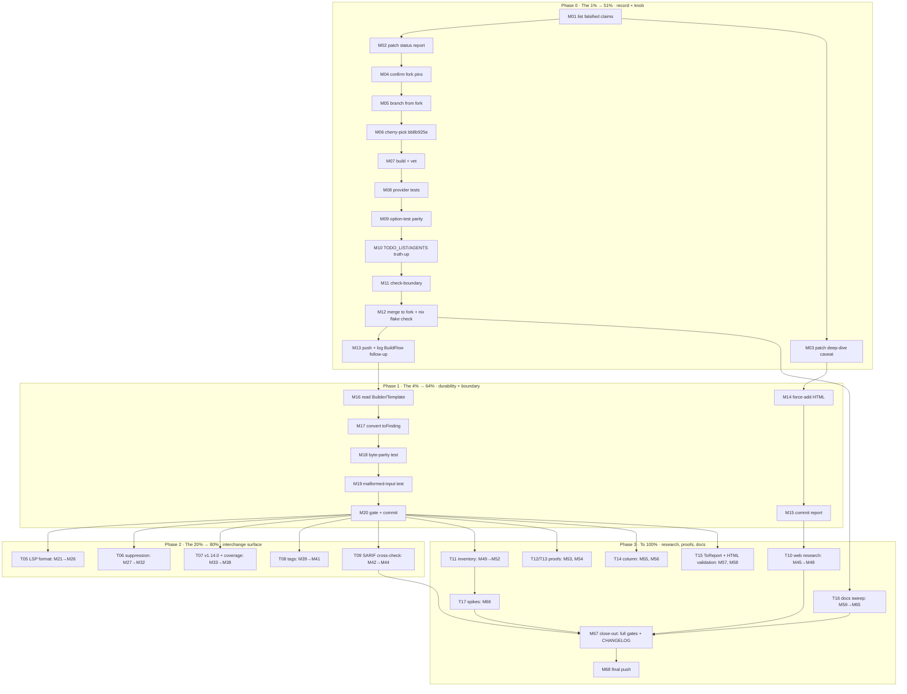

# SUPERB Plan: go-finding Remediation — From Audit to 100%

**Created:** 2026-10-05 15:45 CEST
**Source sessions:** go-finding deep-dive audit (`docs/research/2026-10-05_go-finding-deep-dive.html`)
and its self-review (`docs/status/2026-10-05_15-42_go-finding-deep-dive-self-review.md`).
**Scope:** turn the audit's 9 findings + process gaps into an executable, Pareto-ranked plan.

---

## 0. Groundwork Findings (verified this planning session, 15:45)

These facts were verified before planning — one of them **invalidates a claim in both prior
artifacts** and reshapes the top task.

| # | Finding | Evidence | Consequence |
| - | ------- | -------- | ----------- |
| G1 | The repo's default branch is **`fork`** (`origin/HEAD → fork`); `master` exists but is stale; **no `main` exists** | `git branch -a` | Explains the empty `main..feat/provider-threshold-knob` contradiction in the status report: the range was meaningless, not empty-by-identity |
| G2 | `feat/provider-threshold-knob` is exactly **1 commit** (`bb8b925e`) ahead of `fork`, touching only `pkg/provider/provider.go` (+44/−11) and `provider_test.go` (+63) | `git log fork..feat/provider-threshold-knob`, `git diff --stat fork...feat/...` | The "pop the branch" step is small and well-scoped |
| G3 | **The knob branch DOES NOT COMPILE on its own dependency pin.** It pins `toolsdk v1.13.1` (no options channel); the tests reference `Spec.ValidateOptions` and `OptionValues`, which only exist in toolsdk ≥ v1.14.0. Verified: `go test ./pkg/provider/` → build failed in a temp worktree | `grep go-finding go.mod` on branch = `toolsdk v1.13.1`; worktree test output | TODO_LIST D1's "validated end to end" was true only against a working copy that had the toolsdk source, not against the branch's own pins. **P0-1 must cherry-pick onto `fork` (which pins toolsdk v1.14.0) and re-gate**, not fast-forward |
| G4 | `fork`'s working tree already pins `go-finding v1.13.0` + `toolsdk v1.14.0` | `grep go-finding go.mod` | No dependency churn needed for the knob if cherry-picked; no vendorHash risk |
| G5 | The self-review status report was already auto-committed by the daemon; the HTML audit report is gitignored (`*.gitignore:22 *.html`) and untracked | `git status --short` (clean), `git check-ignore -v` | Durability task needed for the HTML deliverable |

---

## 1. Pareto Breakdown

### The 1% that delivers 51% — ONE item

**Land the threshold knob correctly.**
Cherry-pick `bb8b925e` onto `fork`, keep fork's toolsdk v1.14.0 pin, make the gates green,
update the docs that currently lie about the branch state.
*Why 51%:* it closes TODO_LIST D1 (the single open cross-repo contract), converts the
provider's self-imposed "not configurable" limit into a real knob for BuildFlow, repairs a
branch that is red today (G3), and unblocks the BuildFlow-side `WithOptions` mapping. Nothing
else on the list moves a cross-repo contract.

### The 4% that delivers 64% — the 1% plus three items

1. **Threshold knob** (above).
2. **Correct the record.** Both prior artifacts contain the now-falsified "wiring validated /
   branch ready" claim and the unresolved branch-evidence contradiction. Patch them with G1–G5.
   *Why:* the docs are the durable memory; leaving falsified claims in them re-creates the
   exact stale-skill / unverified-gate failure classes this repo has logged before.
3. **Make the audit report durable.** Force-add the gitignored HTML with precedent
   (8 tracked `.html` files already exist) and commit it. *Why:* an audit nobody can check out
   is an audit that didn't happen.
4. **Builder/validation at the finding boundary.** Convert `printer/finding` from unvalidated
   `NewFinding` to the validated `Builder`, byte-parity-pinned. *Why:* removes the one
   anti-pattern (silent malformed findings) at the exact boundary this library exists for.

### The 20% that delivers 80% — the 4% plus five items

5. **LSP output format** (`OutputFormatLSP` via `ToReport().ToLSP()`) — unlocks the editor
   surface go-finding already provides.
6. **Suppression surfacing** — emit `//art-dupl:accept` matches as `Finding.Suppression` /
   SARIF suppressions in the interchange path (default CLI behavior unchanged).
7. **Core bump to v1.14.0 + coverage evidence** — populate `Summary.FilesScanned` /
   `SkippedModules` so "scanned 0" is provable.
8. **Semantic tags** — `type-1/2/3`, `duplicate` on findings.
9. **SARIF cross-check test** — pin hand-rolled `printer/sarif.go` against `Report.ToSARIF()`
   on group identity + severity.

### The other 20% to reach 100%

- **Research debt:** re-run the deep dive's Phase 2 properly (Context7, `agentic_fetch`,
  published-version check via module proxy/pkg.go.dev).
- **Proof debt:** baseline-vs-`Diff` duplication verdict; SARIF divergence quantification.
- **Inventory debt:** mechanically complete the capability inventory (`analysis/`, `pipeline/`,
  `registry.go`, `interval_index.go`, `category_linter.go`) and re-score.
- **Column feasibility:** verify a start column exists in `domain.ProcessedClone` before
  recommending the fix; implement or mark N/A with evidence.
- **`ToReport` disposition:** public API or dead code — decide, document or delete.
- **Docs sweep:** TODO_LIST, FEATURES, SDK_DESIGN cross-link, AGENTS upgrade policy, dependabot
  entry, architecture-understanding edge.
- **Further integration spikes:** `Template` factory, `GroupFindings`/`Filter`, `ModuleFanOut`/
  `NotRequires`, go-finding CLI as consumer, `Edits` (future fixer).
- **Housekeeping:** HTML-report tracking policy, `docs/research` index, validation pass,
  cadence entry.

---

## 2. Guardrails (Verschlimmbesser-Prevention)

These are the ways this plan could make things WORSE. Each task below is bound by them.

1. **No wire-format changes.** Existing JSON/SARIF/text/HTML output bytes must stay identical.
   New capabilities are additive only (new `OutputFormat` member, new optional interchange
   fields). Parity/golden tests pin this.
2. **No behavioral change to `//art-dupl:accept`.** The CLI keeps suppressing accepted groups
   by default. Suppression surfacing happens ONLY in the go-finding interchange path, opt-in.
3. **Dependency discipline.** `fork`'s `go-finding v1.13.0 / toolsdk v1.14.0` pin stands. The
   cherry-pick takes fork's `go.mod` on conflict. Core bump to v1.14.0 is its own task with its
   own gate — never mixed into the knob commit.
4. **Do not touch:** `internal/jsonutil` (v1-only invariant), `.buildflow.yml` skips, the
   `go 1.27.1` line pin, banned-linter guard, `CacheVersion` (no serialization change is
   planned).
5. **Git safety:** no `rm` (use `trash`), no `git reset --hard`, no `git checkout` (use
   `git switch`/`git restore`), no force push. Branch operations via worktree or cherry-pick.
6. **Gate after EVERY task:** `scripts/check-boundary.sh` (fast: build + vet + `-count=1 -race`
   on `internal/`, `config/`, `cmd/`). Close-out: `--full` + `nix flake check`.
   No push on red (F11).
7. **Every new API surface** (output format, options) gets a docs-health count-gate review —
   if `cmd/docs_health_counts_test.go` fails with a derived number, update the DOC, not the test.
8. **Verify API signatures before writing them into code or docs** (the `.Int()` lapse rule).

---

## 3. Table 1 — Comprehensive Tasks (30–100 min each, ALL work items)

Sorted by impact, then effort-adjusted priority (P = impact × (6 − effort/20), higher first).

| # | Task (bundle) | Items covered | Impact (1-5) | Effort (min) | Priority | Phase |
| - | ------------- | ------------- | ------------ | ------------ | -------- | ----- |
| T01 | **Land the threshold knob** — cherry-pick `bb8b925e` onto fork, resolve `go.mod` in fork's favor, green gates, docs truth-up | G2, G3, G4 | 5 | 90 | 25 | P0 (1%) |
| T02 | **Correct the record** — patch status report + deep-dive finding #1 with G1–G5 (compile failure, branch topology, root cause) | self-review d1–d2 | 4 | 30 | 20 | P0 (4%) |
| T03 | **Make the audit durable** — force-add HTML (precedent: 8 tracked), commit with full findings summary | durability | 4 | 30 | 20 | P1 (4%) |
| T04 | **Builder conversion + validation boundary** — `toFinding` via `Builder`/`Template`, byte-parity pinned, malformed-input test | finding 2 | 4 | 60 | 16 | P1 (4%) |
| T05 | **LSP output format** — `OutputFormatLSP` enum + printer + flag plumbing + E2E GroupID round-trip | finding 3 | 4 | 90 | 14 | P2 (20%) |
| T06 | **Suppression surfacing** — `Options.EmitSuppressedAccepted`, adapter maps AcceptedSet → `Finding.Suppression`, SARIF round-trip, default-path guardrail | finding 4 | 3 | 90 | 12 | P2 (20%) |
| T07 | **Core v1.14.0 bump + coverage evidence** — `go get`, jsonv2gate + suite green, populate `FilesScanned`/`SkippedModules` on SDK path | finding 6 | 3 | 60 | 12 | P2 (20%) |
| T08 | **Semantic tags** — `type-1/2/3` + `duplicate` tags alongside metadata; validation + golden updates | finding 8 | 2 | 30 | 10 | P2 (20%) |
| T09 | **SARIF cross-check test** — same groups through `printer/sarif.go` and `Report.ToSARIF()`; compare groupId + severity; fix or document divergence | finding 7 | 3 | 60 | 12 | P2 (20%) |
| T10 | **Published-version + changelog research** — pkg.go.dev/proxy latest, changelog diff since installed, Context7 + community pass; update report currency section | research debt | 3 | 60 | 9 | P3 |
| T11 | **Complete the capability inventory** — read `analysis/`, `pipeline/` surface, `registry.go`, `interval_index.go`, `category_linter.go`; mechanically re-derive used/unused; re-score | inventory debt | 3 | 90 | 9 | P3 |
| T12 | **Baseline-vs-Diff proof** — read `baseline/baseline.go` comparison logic; write prove-or-retract verdict in report | proof debt | 2 | 45 | 6 | P3 |
| T13 | **SARIF divergence quantification** — property/rule/level shape diff between the two emitters; document intentional differences | proof debt | 2 | 45 | 6 | P3 |
| T14 | **Column feasibility + implement-or-N/A** — check `domain.ProcessedClone`/`CloneNode` for column data; implement `Position.Column` if it exists, else record evidence | finding 9 | 1 | 60 | 5 | P3 |
| T15 | **`ToReport` disposition + HTML validation** — grep consumers, decide document-vs-delete, execute; validate report HTML | G5, finding notes | 2 | 45 | 6 | P3 |
| T16 | **Docs sweep** — TODO_LIST items, FEATURES rows (post-landing), SDK_DESIGN cross-link, AGENTS upgrade policy, dependabot entry, arch-understanding edge, html-policy note, research index | docs debt | 3 | 90 | 9 | P3 |
| T17 | **Integration spikes bundle** — Template factory, `GroupFindings`/`Filter` vs bespoke grouping, `ModuleFanOut`/`NotRequires`, go-finding CLI consumer, `Edits` future — written verdicts only | integration backlog | 2 | 90 | 6 | P3 |

**Total: 17 bundles ≈ 15.5 h.** Close-out (inside T16/T17 overhead): `check-boundary.sh --full`
+ `nix flake check` + CHANGELOG entries before the final push.

---

## 4. Table 2 — Micro-Tasks (≤ 12 min each, ALL work items)

Dependency order = execution order. `T#` = parent bundle. Every task ends green or is rolled
back — no red states left parked.

| ID | T# | Micro-task | Min | Depends on | Gate/verification |
| -- | -- | ---------- | --- | ---------- | ----------------- |
| M01 | T02 | Re-read status report §2d1–d2 + deep-dive finding #1; list every falsified/unproven sentence | 5 | — | list in scratch |
| M02 | T02 | Patch status report: branch topology (G1), single-commit scope (G2), compile failure + root cause (G3), fork pin (G4) | 10 | M01 | markdown renders; claims cite commands |
| M03 | T02 | Patch deep-dive finding #1: add "branch red on own pin; cherry-pick required" caveat + fix the `.Int()` note already corrected | 8 | M01 | HTML snippet matches real API |
| M04 | T02 | Re-verify fork's `go.mod` pin (`toolsdk v1.14.0`) and record it as cherry-pick conflict policy | 3 | M02 | grep output in commit body |
| M05 | T01 | `git switch -c feat/provider-threshold-knob-v2 fork` | 2 | M04 | `git branch --show-current` |
| M06 | T01 | `git cherry-pick bb8b925e`; on conflict take fork's `go.mod`/`go.sum` | 12 | M05 | cherry-pick clean |
| M07 | T01 | `go build ./... && go vet ./pkg/provider/` | 8 | M06 | zero errors |
| M08 | T01 | `go test -count=1 ./pkg/provider/` | 10 | M07 | PASS incl. `TestDetect*Threshold*` |
| M09 | T01 | Read the option tests; confirm default-parity (no option → 5) and range-reject (0, 1001) cases exist; add if missing | 10 | M08 | test list reviewed |
| M10 | T01 | Truth-up docs: Spec description already updated by branch; update TODO_LIST D1 + AGENTS provider paragraph | 10 | M08 | no "not configurable" claim remains |
| M11 | T01 | `scripts/check-boundary.sh` (fast profile) | 10 | M10 | exit 0 |
| M12 | T01 | Commit; `git switch fork`; merge; `nix flake check` | 12 | M11 | checks green |
| M13 | T01 | Push fork; record BuildFlow-side `WithOptions` mapping as the follow-up (cross-repo) | 5 | M12 | pushed; follow-up logged |
| M14 | T03 | `git add -f docs/research/2026-10-05_go-finding-deep-dive.html`; confirm staged | 5 | M03 | `git status` shows it |
| M15 | T03 | Commit report (message: score, 9 findings, top-3) | 8 | M14 | commit exists |
| M16 | T04 | Read go-finding `finding_builder.go` + `Template` factory fully; note validation semantics | 10 | M13 | notes |
| M17 | T04 | Convert `toFinding` to `Builder` (+ `Template` for shared tool/category/fix-strategy) | 12 | M16 | compiles |
| M18 | T04 | Parity test: Builder output `MarshalJSON` bytes == legacy `NewFinding` bytes for fixture groups | 10 | M17 | PASS (wire unchanged) |
| M19 | T04 | Malformed-input test: empty rule / bad tag → `Build` error path exercised | 10 | M18 | PASS |
| M20 | T04 | Boundary gate + commit | 8 | M19 | exit 0 |
| M21 | T05 | Add `OutputFormatLSP` to `domain` enum: value, `String`, `Parse`, `All`, validation | 12 | M20 | `go test ./domain/` |
| M22 | T05 | LSP printer: `finding.ToReport(...).ToLSP()` emission through existing printer interfaces | 12 | M21 | compiles |
| M23 | T05 | Flag/config plumbing: `--format lsp`, config validate, `parseOutputFormat` | 10 | M22 | flag round-trip test |
| M24 | T05 | E2E: run CLI `--format lsp`, parse diagnostics, assert GroupID in `data` + positions | 10 | M23 | PASS |
| M25 | T05 | `HOW_TO_USE` section + docs-health count gate check (flags count!) | 10 | M24 | count test updated if derived number changed |
| M26 | T05 | Gate + commit | 6 | M25 | exit 0 |
| M27 | T06 | Add `Options.EmitSuppressedAccepted` (default false) to `printer/finding.Options` | 5 | M20 | compiles |
| M28 | T06 | Thread `AcceptedSet` hits to the adapter call site (cmd/SDK boundary, no printer←cmd import) | 12 | M27 | arch-lint green |
| M29 | T06 | Map accepted groups → `Finding.Suppression{Kind: InSource, Reason}` instead of dropping (opt-in path only) | 12 | M28 | unit test |
| M30 | T06 | SARIF suppressions round-trip test via `FindingsFromSARIF` | 10 | M29 | PASS |
| M31 | T06 | Guardrail test: default path (flag off) byte-identical to today | 8 | M29 | PASS |
| M32 | T06 | Docs + gate + commit | 10 | M30, M31 | exit 0 |
| M33 | T07 | `go get github.com/larsartmann/go-finding@v1.14.0 && go mod tidy` | 8 | M20 | go.mod/go.sum only |
| M34 | T07 | Full default suite + `jsonv2gate` + race on touched pkgs (wire-independence check) | 10 | M33 | PASS |
| M35 | T07 | Populate `Summary.FilesScanned` on the SDK/provider interchange path | 10 | M34 | provider test |
| M36 | T07 | Populate `SkippedModules` (reuse `isNestedGoModule` semantics) | 12 | M35 | provider test |
| M37 | T07 | Provider test: "scanned 0" and monorepo-skip cases asserted | 8 | M36 | PASS |
| M38 | T07 | Gate + commit | 8 | M37 | exit 0 |
| M39 | T08 | Add `type-1/2/3` + `duplicate` tags in the adapter (from `Classification.CloneType`) | 8 | M20 | compiles |
| M40 | T08 | Tag-validation test + provider golden/expected updates | 8 | M39 | PASS |
| M41 | T08 | Gate + commit | 6 | M40 | exit 0 |
| M42 | T09 | Cross-check test: same fixture groups → compare `printer/sarif.go` vs `Report.ToSARIF()` groupId + severity | 12 | M20 | test written |
| M43 | T09 | Run it: fix real divergences or document intentional ones (inline rationale) | 10 | M42 | verdict recorded |
| M44 | T09 | Gate + commit | 6 | M43 | exit 0 |
| M45 | T10 | `agentic_fetch` pkg.go.dev + proxy: confirm published latest (core, toolsdk) vs local tags | 12 | — | versions table |
| M46 | T10 | Context7: resolve go-finding, query API surface + best practices | 12 | M45 | notes |
| M47 | T10 | Community/anti-pattern search (issues tagged question/best-practice) | 10 | M46 | notes |
| M48 | T10 | Update report §currency + appendix with web-sourced data; correct any wrong claims | 10 | M47 | diffs committed |
| M49 | T11 | Read `analysis/` (adapter semantics) + `registry.go` | 12 | M20 | notes |
| M50 | T11 | Read `pipeline/` public surface (detect/triage/fix/verify stages) | 12 | M49 | notes |
| M51 | T11 | Read `interval_index.go` + `category_linter.go` | 10 | M50 | notes |
| M52 | T11 | Rebuild mechanical used/unused inventory; re-derive score; update report | 12 | M51 | updated appendix |
| M53 | T12 | Read `baseline/baseline.go` comparison logic; write prove-or-retract verdict | 12 | M20 | verdict in report |
| M54 | T13 | Quantify SARIF divergence (properties, rule ids, levels); document intentional deltas | 12 | M43 | table in report |
| M55 | T14 | Spike: does `domain.ProcessedClone`/`CloneNode` carry a start column? (grep + read) | 8 | M20 | yes/no + evidence |
| M56 | T14 | If yes: implement `Position.Column`; if no: mark finding N/A with evidence | 10 | M55 | either way, recorded |
| M57 | T15 | `ToReport` disposition: grep all consumers; decide document-vs-delete; execute | 10 | M20 | decision recorded |
| M58 | T15 | Validate report HTML (tidy/nu-validator or equivalent); fix findings | 10 | M03, M48 | zero errors |
| M59 | T16 | TODO_LIST: add Builder/LSP/suppression/coverage items with priorities | 8 | M20 | entries exist |
| M60 | T16 | FEATURES: update go-finding/provider rows only for what landed | 8 | M12–M44 | rows accurate |
| M61 | T16 | SDK_DESIGN cross-link + AGENTS: go-finding upgrade-policy paragraph | 10 | M59 | sections added |
| M62 | T16 | `.github/dependabot.yml`: confirm/add go-finding entry | 5 | M61 | entry present |
| M63 | T16 | Architecture-understanding d2: `printer → finding-output → go-finding` edge | 8 | M61 | diagram updated |
| M64 | T16 | HTML-report tracking policy note (force-add rule) in AGENTS or CONTRIBUTING | 8 | M15 | note committed |
| M65 | T16 | `docs/research/README.md` index of audits | 8 | M15 | index lists report |
| M66 | T17 | Spikes written verdicts: Template, GroupFindings/Filter, ModuleFanOut/NotRequires, CLI consumer, Edits | 12 | M49–M51 | verdict table |
| M67 | T17 | Close-out: `scripts/check-boundary.sh --full` + `nix flake check` + CHANGELOG entries | 12 | all code tasks | green |
| M68 | T17 | Final commit(s) + push fork | 8 | M67 | pushed; `git status` clean |

**Total: 68 micro-tasks ≈ 11.5 h of focused work** (excluding gate waits).

---

## 5. Execution Graph

Critical path: **M01 → M06 → M13 → M17 → M20 → M67** (the knob and the validation boundary
block everything else; everything in Phase 2/3 fans out from M20).

---

## 6. Definition of Done

- [ ] `feat/provider-threshold-knob` merged to `fork`, gates green, TODO_LIST D1 closed, no doc
      claims the branch is "ready" while it is red.
- [ ] Status report + deep-dive report contain zero falsified claims (G1–G5 reflected).
- [ ] HTML audit tracked in git; `docs/research` indexed.
- [ ] `printer/finding` constructs validated findings; wire bytes unchanged (parity test).
- [ ] Phase-2 surface landed behind additive flags/formats only; default outputs byte-identical.
- [ ] All 17 bundles closed with verdicts (including prove-or-retract items).
- [ ] `scripts/check-boundary.sh --full` + `nix flake check` green on final HEAD; pushed.

## 7. Risks

| Risk | Mitigation |
| ---- | ---------- |
| Cherry-pick conflicts in `provider.go` (branch predates daemon commits) | Conflict surface is one file + tests; take fork side for deps, branch side for code; M06 isolates it |
| Builder conversion changes wire bytes subtly | M18 byte-parity test blocks merge; revert = `git restore` the file (never reset --hard) |
| LSP/suppression leaks into default output | M31 guardrail test + guardrail rule 1/2; docs-health count gate for new flags |
| v1.14.0 core bump changes SARIF/JSON bytes | M34 wire-independence suite before any feature work rides on it |
| BuildFlow-side mapping (M13 follow-up) is out of this repo's control | Explicitly logged as cross-repo follow-up; art-dupl side is complete without it |
