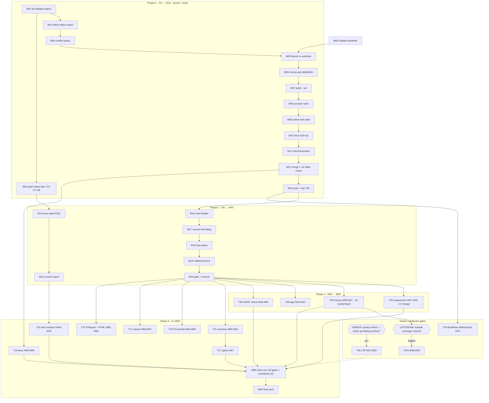

# SUPERB Plan: go-finding Remediation — From Audit to 100%

**Created:** 2026-10-05 15:45 CEST · **Revision 2:** 2026-10-05 15:58 CEST
**Source sessions:** go-finding deep-dive audit (`docs/research/2026-10-05_go-finding-deep-dive.html`)
and its self-review (`docs/status/2026-10-05_15-42_go-finding-deep-dive-self-review.md`).
**Scope:** turn the audit's 9 findings + process gaps into an executable, Pareto-ranked plan.

## Revision History

| Rev | Change |
| --- | ------ |
| 1 (15:45) | Initial plan; 17 bundles / 68 micro-tasks |
| 2 (15:58) | **Pressure-test pass falsified 3 assumptions and found 2 missing risk classes.** (F1) `ToLSP()` is a **Finding** method — v1's `ToReport().ToLSP()` composition was a fabricated API (same class as the `.Int()` lapse). (F2) SARIF export **drops suppressed findings by default**; suppression round-trips only via `ToSARIFWithOpts(WithIncludeSuppressed())` — T06's test design was wrong. (F3) The toolsdk **Detector contract returns `[]Finding` only** — art-dupl **cannot** set `Report.Summary.FilesScanned`; coverage evidence is an upstream gap, not an art-dupl task. (R1) v1 ignored the **auto-commit daemon interleaving** risk (the mechanism behind jsonv2 recurrences #3/#4) — all code tasks now run in an isolated worktree. (R2) v1's core-bump task omitted the **nix `vendorHash` refresh** (precedent: commit `7e761e99`). T05 (LSP) is now **owner-gated** on the product-intent question it presupposed; T07 split into feasible bump vs upstream-gated coverage; T18 (BuildFlow mapping) added as an explicit cross-repo bundle. |

---

## 0. Groundwork Findings (all verified, with commands)

| # | Finding | Evidence | Consequence |
| - | ------- | -------- | ----------- |
| G1 | Default branch is **`fork`**; `master` stale; **no `main`** | `git branch -a` | Resolves v1's empty `main..branch` contradiction — the range was meaningless |
| G2 | `feat/provider-threshold-knob` = **1 commit** (`bb8b925e`) ahead of `fork`, touching only `pkg/provider/provider.go` (+44/−11) and `provider_test.go` (+63); the fork↔branch delta in `provider.go` is exactly the options block | `git log fork..feat/...`, `git diff fork feat/... -- pkg/provider/provider.go` | Cherry-pick should be near-conflict-free (code-side) |
| G3 | **The knob branch DOES NOT COMPILE** on its own pin: `toolsdk v1.13.1` (no options channel) vs tests using `Spec.ValidateOptions`/`OptionValues` (≥ v1.14.0) | temp worktree: `go test ./pkg/provider/` → build failed | TODO_LIST D1's "validated end to end" was true only against the go-finding working copy. **Cherry-pick onto fork (v1.14.0) + re-gate, not fast-forward** |
| G4 | `fork` pins `go-finding v1.13.0` + `toolsdk v1.14.0` | `grep go-finding go.mod` | No dep churn for the knob |
| G5 | Status report was auto-committed; HTML audit is gitignored + untracked | `git status`, `git check-ignore -v` | Durability task required |
| G6 | `ToLSP()` is `func (f Finding) ToLSP() LSPDiagnostic` — per finding, no Report-level LSP export | `grep "func.*ToLSP" ~/projects/go-finding/lsp.go` | LSP printer iterates findings, not reports |
| G7 | SARIF export excludes suppressed findings unless `WithIncludeSuppressed()`; `IsSuppressed()` gates | `sarif_export.go:14-46` | Suppression task must test through the option |
| G8 | Detector contract is `Detect(ctx) ([]Finding, error)`; neither toolsdk nor Finding carries `FilesScanned` | grep over `toolsdk/*.go`, `finding.go` — zero hits | Coverage evidence **cannot** be emitted by art-dupl today → upstream-gated |

---

## 1. Pareto Breakdown

### The 1% that delivers 51% — ONE item

**Land the threshold knob correctly.** Cherry-pick `bb8b925e` into an isolated worktree branched
from `fork`, keep fork's toolsdk v1.14.0 pin, gates green, docs truth-up.
*Closes TODO_LIST D1, repairs a red branch (G3), converts a self-imposed fixed contract into a
real knob, unblocks BuildFlow's `WithOptions` mapping.*

### The 4% that delivers 64% — the 1% plus three items

1. Threshold knob.
2. **Correct the record** — both prior artifacts contain the falsified "wiring validated /
   branch ready" claim and unresolved branch-evidence contradiction.
3. **Make the audit durable** — force-add the HTML (precedent: 8 tracked `.html` files).
4. **Builder conversion + validation boundary** — validated construction, byte-parity pinned.

### The 20% that delivers 80% — the 4% plus four items

5. **Suppression surfacing** (opt-in, interchange path only) — design corrected per G7.
6. **Core bump to v1.14.0** with nix `vendorHash` refresh — feasibility proven.
7. **Semantic tags** (`type-1/2/3`, `duplicate` — pass tag validation).
8. **SARIF cross-check test** — hand-rolled emitter vs `Report.ToSARIF()`.

### The other 20% to 100%

- **Owner-gated:** LSP output format (blocked on the product-intent question my own status
  report filed: is a native go-finding surface wanted, or is "adapter + SARIF wire" final?).
- **Upstream-gated:** coverage evidence (`FilesScanned`/`SkippedModules` needs a toolsdk
  channel — G8; D1-style prototype→tag→consume recipe), BuildFlow-side `WithOptions` mapping.
- **Research debt:** Context7 + `agentic_fetch` re-run; published-version check.
- **Proof debt:** baseline-vs-`Diff` verdict; SARIF divergence quantification.
- **Inventory debt:** mechanical capability completion; re-score.
- **Column feasibility; `ToReport` disposition; docs sweep; integration spikes; housekeeping.**

---

## 2. Guardrails (Verschlimmbesser-Prevention)

1. **Worktree isolation for ALL code tasks.** The auto-commit daemon owns the main checkout;
   it has twice packaged in-flight foreign edits into pushed commits (jsonv2 recurrences #3/#4).
   Code work happens in `git worktree add /tmp/artdupl-<task> <branch>`; only finished, gated
   commits land on `fork`. Never leave red or half-applied state in the daemon's tree.
2. **No wire-format changes.** Existing JSON/SARIF/text/HTML bytes stay identical; new surface
   is additive. Parity/golden tests pin it.
3. **No behavioral change to `//art-dupl:accept`.** CLI suppresses accepted groups by default,
   unchanged. Suppression surfacing is interchange-only and opt-in.
4. **Dependency discipline.** Fork's pins stand; cherry-pick takes fork's `go.mod`/`go.sum` on
   conflict. Any dep bump is its own commit **plus nix `vendorHash` refresh + `nix build`**
   (precedent `7e761e99`). Never mix bumps into feature commits.
5. **Do not touch:** `internal/jsonutil` v1-only invariant, `.buildflow.yml` skips, `go 1.27.1`
   pin, banned-linter guard, `CacheVersion`.
6. **Git safety:** no `rm` (use `trash`), no `git reset --hard`, no `git checkout`, no force
   push.
7. **Gate after EVERY task:** `scripts/check-boundary.sh` (fast). Close-out: `--full` +
   `nix flake check`. No push on red (F11).
8. **Verify every external API signature before writing it into code, tests, or docs** —
   in the artifact AND in this plan (v1's `ToReport().ToLSP()` breach is the worked example).
9. **API-shape verification precedes scheduling:** a task that presupposes an upstream API it
   has not been verified against gets a spike micro-task first (G6–G8 pattern).
10. **Docs-health count gate:** if `cmd/docs_health_counts_test.go` fails with a derived
    number, the DOC moves, never the test.

---

## 3. Table 1 — Comprehensive Tasks (30–100 min each, ALL work items)

Sorted by impact, then effort-adjusted priority. **Gated** bundles are sequenced but wait on an
external event (owner decision / upstream tag); they carry no execution promise.

| # | Task (bundle) | Impact | Effort | Pri | Phase | Gate |
| - | ------------- | ------ | ------ | --- | ----- | ---- |
| T01 | **Land the threshold knob** — worktree, cherry-pick `bb8b925e` onto fork (fork's go.mod on conflict), option-test parity audit, gates, TODO_LIST/AGENTS truth-up | 5 | 90 | 25 | 1% | — |
| T02 | **Correct the record** — patch status + deep-dive reports with G1–G8 | 4 | 30 | 20 | 4% | — |
| T03 | **Make the audit durable** — force-add HTML, commit | 4 | 30 | 20 | 4% | — |
| T04 | **Builder conversion** — validated construction, byte-parity + malformed-input tests | 4 | 60 | 16 | 4% | — |
| T06 | **Suppression surfacing** — opt-in `EmitSuppressedAccepted`; map AcceptedSet → `Finding.Suppression`; round-trip via `ToSARIFWithOpts(WithIncludeSuppressed())` (G7); default-path guardrail | 3 | 90 | 12 | 20% | — |
| T07a | **Core v1.14.0 bump** — `go get`+tidy, jsonv2gate + full suite, **nix `vendorHash` refresh + `nix build`** | 3 | 60 | 12 | 20% | — |
| T09 | **SARIF cross-check test** — `printer/sarif.go` vs `Report.ToSARIF()` on groupId + severity; fix or document divergence | 3 | 60 | 12 | 20% | — |
| T08 | **Semantic tags** — `type-1/2/3` + `duplicate` (validated convention) | 2 | 30 | 10 | 20% | — |
| T05 | **LSP output format** — `OutputFormatLSP`, printer over per-finding `Finding.ToLSP()` (G6), E2E GroupID round-trip | 4 | 90 | 14 | rest | **OWNER: product intent** |
| T18 | **BuildFlow mapping** — consumer config → `toolsdk.WithOptions` for art-dupl spec; registration test (cross-repo) | 4 | 60 | 14 | rest | **needs T01 merged** |
| T07b | **Coverage evidence** — prototype a toolsdk coverage channel (`Spec` field or Detect-result extension), PR → tag → consume (G8) | 3 | 90 | 9 | rest | **UPSTREAM: go-finding tag** |
| T10 | **Published-version + web research** — pkg.go.dev/proxy latest, changelog diff, Context7, community pass; update report | 3 | 60 | 9 | rest | — |
| T11 | **Complete capability inventory** — `analysis/`, `pipeline/`, `registry.go`, `interval_index.go`, `category_linter.go`; mechanical used/unused; re-score | 3 | 90 | 9 | rest | — |
| T16 | **Docs sweep** — TODO_LIST, FEATURES (post-landing), SDK_DESIGN, AGENTS upgrade policy, dependabot, d2 edge, html-policy, research index | 3 | 90 | 9 | rest | — |
| T12 | **Baseline-vs-`Diff` proof** — read comparison logic; prove-or-retract | 2 | 45 | 6 | rest | — |
| T13 | **SARIF divergence quantification** | 2 | 45 | 6 | rest | — |
| T15 | **`ToReport` disposition + HTML validation** | 2 | 45 | 6 | rest | — |
| T17 | **Integration spikes** — Template, `GroupFindings`/`Filter`, `ModuleFanOut`/`NotRequires`, CLI consumer, `Edits`; verdicts only | 2 | 90 | 6 | rest | — |
| T14 | **Column feasibility** → implement or N/A-with-evidence | 1 | 60 | 5 | rest | — |

**Total: 19 bundles ≈ 16 h** (≈14 h un-gated). Close-out inside T16/T17: `--full` +
`nix flake check` + CHANGELOG before final push.

---

## 4. Table 2 — Micro-Tasks (≤ 12 min each, ALL work items)

`T#` = parent. Every task ends green or is rolled back (`git restore` / worktree discard —
never `reset --hard`). IDs M01–M69 are stable from rev 1 where possible; changes are marked ✏️,
new IDs M00/M70 added by rev 2.

| ID | T# | Micro-task | Min | Depends on | Gate/verification |
| -- | -- | ---------- | --- | ---------- | ----------------- |
| M00 | all code | ✏️ **Create isolated worktree** `/tmp/artdupl-work` branched from fork; daemon's tree untouched | 5 | — | `git worktree list` |
| M01 | T02 | Re-read both artifacts; list falsified/unproven sentences | 5 | — | list |
| M02 | T02 | ✏️ Patch status report: G1 (no main), G2 (1-commit scope), G3 (compile failure + root cause), G4 (fork pin) | 10 | M01 | claims cite commands |
| M03 | T02 | Patch deep-dive finding #1: branch-red caveat; ✏️ finding #4: `WithIncludeSuppressed()` requirement (G7); ✏️ finding #6: upstream-gated (G8) | 8 | M01 | snippets match real APIs |
| M04 | T02 | Record cherry-pick conflict policy (fork's go.mod/go.sum win) | 3 | M02 | in commit body |
| M05 | T01 | ✏️ Branch inside the worktree (`git switch -c feat/provider-threshold-knob-v2 fork`) | 2 | M00, M04 | branch shown |
| M06 | T01 | Cherry-pick `bb8b925e`; resolve deps toward fork | 12 | M05 | clean tree |
| M07 | T01 | `go build ./... && go vet ./pkg/provider/` | 8 | M06 | zero errors |
| M08 | T01 | `go test -count=1 ./pkg/provider/` | 10 | M07 | PASS incl. threshold tests |
| M09 | T01 | Audit option tests: default-parity (no option → 5) + range-reject (0, 1001) + typo-reject; add missing | 10 | M08 | reviewed |
| M10 | T01 | TODO_LIST D1 + AGENTS provider paragraph truth-up | 10 | M08 | no stale claims |
| M11 | T01 | `scripts/check-boundary.sh` (fast) | 10 | M10 | exit 0 |
| M12 | T01 | Commit in worktree; merge to fork; `nix flake check` | 12 | M11 | green |
| M13 | T01 | Push fork; log T18 as the consumer-side follow-up | 5 | M12 | pushed |
| M14 | T03 | `git add -f` the HTML audit; confirm staged | 5 | M03 | staged |
| M15 | T03 | Commit report (score, 9 findings, top-3) | 8 | M14 | committed |
| M16 | T04 | Read `finding_builder.go` + `Template` factory; note validation semantics | 10 | M13 | notes |
| M17 | T04 | Convert `toFinding` to `Builder` (+ `Template` for shared stamps) | 12 | M16 | compiles |
| M18 | T04 | Parity test: Builder vs legacy `NewFinding` JSON bytes on fixture groups | 10 | M17 | PASS (wire unchanged) |
| M19 | T04 | Malformed-input test: empty rule / bad tag → `Build` error path | 10 | M18 | PASS |
| M20 | T04 | Gate + commit (in worktree) | 8 | M19 | exit 0 |
| M21 | T05 | ✏️ Spike: read `lsp.go` fully — `LSPDiagnostic` shape, `Data.GroupID` (G6); print one diagnostic in a scratch test | 12 | owner OK | scratch test PASS |
| M22 | T05 | ✏️ LSP printer: iterate findings → `f.ToLSP()`; marshal via existing printer interfaces | 12 | M21 | compiles |
| M23 | T05 | `OutputFormatLSP` enum: value, `String`, `Parse`, `All`, validate + flag plumbing | 10 | M22 | round-trip test |
| M24 | T05 | E2E: CLI `--format lsp` → parse diagnostics → GroupID + positions asserted | 10 | M23 | PASS |
| M25 | T05 | `HOW_TO_USE` section + docs-health count gate (new flag + format counts!) | 10 | M24 | derived numbers honored |
| M26 | T05 | Gate + commit | 6 | M25 | exit 0 |
| M27 | T06 | Add `Options.EmitSuppressedAccepted` (default false) | 5 | M20 | compiles |
| M28 | T06 | Thread `AcceptedSet` hits to adapter call site (no printer←cmd import) | 12 | M27 | arch-lint green |
| M29 | T06 | Map accepted groups → `Finding.Suppression{Kind: InSource, Reason}` instead of dropping (opt-in only) | 12 | M28 | unit test |
| M30 | T06 | ✏️ Round-trip test via `ToSARIFWithOpts(WithIncludeSuppressed())` → `FindingsFromSARIF` (G7) | 10 | M29 | PASS |
| M31 | T06 | Guardrail test: flag off → output byte-identical to today | 8 | M29 | PASS |
| M32 | T06 | Docs + gate + commit | 10 | M30, M31 | exit 0 |
| M33 | T07a | `go get go-finding@v1.14.0 && go mod tidy` (worktree) | 8 | M20 | go.mod/go.sum only |
| M34 | T07a | ✏️ **Nix: set `vendorHash=""` → `nix build` → paste real hash** (precedent `7e761e99`) | 12 | M33 | build green |
| M35 | T07a | Full default suite + `jsonv2gate` + race (wire-independence check) | 10 | M34 | PASS |
| M36 | T07a | ✏️ Record verdict: coverage evidence is upstream-gated (G8) — write the T07b recipe into TODO_LIST | 8 | M35 | entry exists |
| M37 | T07a | Gate + commit | 8 | M36 | exit 0 |
| M38 | T07b | **(upstream)** Prototype coverage channel in go-finding toolsdk (Spec field or Detect-result extension) + tests + PR | 12* | M36 | PR open |
| M39 | T07b | **(upstream)** Land → tag → ✏️ art-dupl consumes: populate + provider tests | 12* | M38 | tag exists |
| M40 | T08 | Add `type-1/2/3` + `duplicate` tags from `Classification.CloneType` | 8 | M20 | compiles |
| M41 | T08 | Tag-validation + golden updates | 8 | M40 | PASS |
| M42 | T08 | Gate + commit | 6 | M41 | exit 0 |
| M43 | T09 | Cross-check test: fixture groups → `printer/sarif.go` vs `Report.ToSARIF()` on groupId + severity | 12 | M20 | written |
| M44 | T09 | Run: fix real divergences or document intentional ones inline | 10 | M43 | verdict |
| M45 | T09 | Gate + commit | 6 | M44 | exit 0 |
| M46 | T10 | `agentic_fetch` pkg.go.dev + proxy: published latest vs local tags | 12 | — | versions table |
| M47 | T10 | Context7: resolve go-finding; query API surface + practices | 12 | M46 | notes |
| M48 | T10 | Community/anti-pattern search | 10 | M47 | notes |
| M49 | T10 | Update report §currency + appendix; correct wrong claims | 10 | M48 | committed |
| M50 | T11 | Read `analysis/` + `registry.go` | 12 | M20 | notes |
| M51 | T11 | Read `pipeline/` public surface | 12 | M50 | notes |
| M52 | T11 | Read `interval_index.go` + `category_linter.go` | 10 | M51 | notes |
| M53 | T11 | Rebuild mechanical inventory; re-derive score; update report | 12 | M52 | appendix updated |
| M54 | T12 | Read `baseline/baseline.go` comparison logic; prove-or-retract verdict | 12 | M20 | verdict |
| M55 | T13 | Quantify SARIF divergence (properties, rule ids, levels); document deltas | 12 | M44 | table |
| M56 | T14 | Spike: start column in `domain.ProcessedClone`/`CloneNode`? | 8 | M20 | yes/no + evidence |
| M57 | T14 | Implement `Position.Column` or mark N/A with evidence | 10 | M56 | recorded |
| M58 | T15 | `ToReport` disposition: grep consumers; document-vs-delete; execute | 10 | M20 | decision |
| M59 | T15 | Validate report HTML; fix findings | 10 | M03, M49 | zero errors |
| M60 | T16 | TODO_LIST: add Builder/suppression/coverage-upstream entries | 8 | M20 | entries |
| M61 | T16 | FEATURES rows update (only what landed) | 8 | M12–M45 | accurate |
| M62 | T16 | SDK_DESIGN cross-link + AGENTS upgrade-policy paragraph | 10 | M60 | added |
| M63 | T16 | `.github/dependabot.yml` go-finding entry | 5 | M62 | present |
| M64 | T16 | Arch-understanding d2: `printer → finding-output → go-finding` edge | 8 | M62 | updated |
| M65 | T16 | HTML-report tracking policy note (AGENTS/CONTRIBUTING) | 8 | M15 | committed |
| M66 | T16 | `docs/research/README.md` audit index | 8 | M15 | index |
| M67 | T17 | Spikes verdicts: Template, `GroupFindings`/`Filter`, `ModuleFanOut`/`NotRequires`, CLI consumer, `Edits` | 12 | M50–M52 | table |
| M68 | all | Close-out: `check-boundary.sh --full` + `nix flake check` + CHANGELOG entries | 12 | code tasks | green |
| M69 | all | Final commit(s) + push fork | 8 | M68 | pushed, clean |
| M70 | T18 | **(BuildFlow repo)** Map consumer config `art-dupl.threshold` → `toolsdk.WithOptions` on the art-dupl spec; registration test; lane soak | 12* | M13 | BuildFlow lane green |

\* = per-session slice; T07b (M38–M39) and T18 (M70) live in other repos and iterate
PR→tag→consume (the D1 pattern). Art-dupl-side work never blocks on them.

**Total: 71 micro-tasks ≈ 12 h in-repo** + cross-repo slices.

---

## 5. Execution Graph

Critical path (un-gated): **M00 → M06 → M13 → M17 → M20 → M68 → M69** (~4.5 h to the 64%
milestone). Gated branches join when their gate opens; nothing in-repo blocks on them.

---

## 6. Definition of Done

- [ ] Knob merged to `fork` from an isolated worktree; gates green; TODO_LIST D1 closed; no
      doc claims the branch is "ready" while red.
- [ ] Both artifacts contain zero falsified claims; HTML audit tracked + indexed.
- [ ] `printer/finding` validated construction; wire bytes parity-pinned.
- [ ] Phase-2 surface additive-only; default outputs byte-identical (M31/M18 guards).
- [ ] Every un-gated bundle closed with a verdict; gated bundles carry their gate + recipe.
- [ ] `scripts/check-boundary.sh --full` + `nix flake check` green on final HEAD; pushed.

## 7. Risks

| Risk | Mitigation |
| ---- | ---------- |
| Daemon packages in-flight work (jsonv2 pattern, 2×) | Guardrail 1: worktree isolation; only gated commits touch fork |
| Cherry-pick conflicts (`provider.go` drifted on fork since branch) | G2 evidence: delta is the options block only; fork's deps win on conflict |
| Builder conversion changes wire bytes | M18 byte-parity blocks merge |
| Suppression/LSP leaks into default output | M31 guardrail + guardrails 2–3; docs-health count gate |
| v1.14.0 bump changes SARIF/JSON bytes or breaks nix build | M34 vendorHash refresh + M35 wire-independence suite before anything rides on it |
| Coverage evidence impossible from art-dupl (G8) | Reclassified upstream-gated (T07b) — no dead task on the critical path |
| LSP work unwanted (product intent) | T05 gated on the owner question; zero cost until answered |
| BuildFlow mapping stalls (other repo) | T18 is a slice-task after T01; art-dupl side complete without it |
