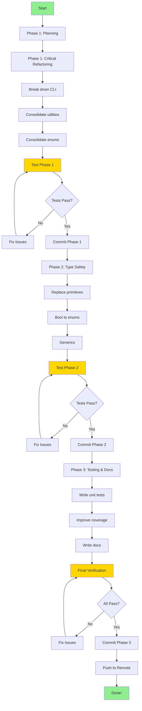

# Comprehensive Architecture Status Report

**Date**: 2026-01-13 22:26:05 CET
**Status**: Planning Complete - Execution Started
**Version**: Architecture Improvement Phase 1

---

## Executive Summary

This report documents the comprehensive analysis and improvement plan for the **art-dupl** codebase - a Go-based code duplication detection tool.

**Current Architecture Score**: 6/10
**Target Architecture Score**: 9/10
**Total Tasks**: 91 (broken into max 12-minute chunks)
**Estimated Total Time**: ~17.6 hours
**Phases**: 3 (Critical Refactoring → Type Safety → Testing/Documentation)

---

## 1. Codebase Overview

### Project Statistics

- **Total Go Files**: 95
- **Total Lines of Code**: ~5,000+ (excluding tests)
- **Packages**: 30+
- **Test Coverage**: ~60% (target: 80%+)
- **Main Language**: Go (Golang)
- **Primary Dependencies**: Cobra, fang, Ginkgo v2

### Current Package Structure

```
art-dupl/
├── adapter/          # Printer adapters
├── bdd/             # BDD tests
├── cli/             # CLI runtime and validation
├── config/          # Configuration management
├── detection/       # Clone detection logic
├── domain/          # Domain models (EXCELLENT)
├── errors/          # Error handling (EXCELLENT)
├── hash/            # Hash-based detection
├── job/             # Job orchestration
├── lib/             # Library utilities
├── migration/       # Migration utilities
├── pkg/             # Public API
├── printer/         # Output formatting
├── syntax/          # AST handling
├── suffixtree/      # Suffix tree algorithm
├── testutils/       # Test helpers
├── types/           # Type definitions
├── utils/           # Utility functions (DUPLICATE)
└── util/            # Utility functions (DUPLICATE)
```

---

## 2. Strengths (KEEP THESE)

### 2.1 Excellent Domain Design

**File**: `domain/domain_types.go` (548 lines)

- ✅ Value objects with comprehensive validation
- ✅ Strong typing: CloneID, Filepath, LineNumber, TokenCount
- ✅ Factory functions with error handling
- ✅ Immutability patterns
- ✅ Clear domain boundaries

**Key Types**:

```go
type CloneID string
type Filepath string
type LineNumber int
type TokenCount int
```

### 2.2 Robust Error Handling

**File**: `errors/types.go` (127 lines)

- ✅ Rich error types with stack traces
- ✅ Proper error wrapping
- ✅ Error context preservation
- ✅ Type-safe error construction

### 2.3 Type-Safe Enums

**File**: `config/outputformat.go` (91 lines)

- ✅ Type-safe enums with JSON marshaling
- ✅ Validation methods
- ✅ Clear API boundaries

**File**: `config/detectionmethod.go` (112 lines)

- ✅ Type-safe enums for detection methods
- ✅ Validation logic
- ✅ Consistent patterns

### 2.4 Comprehensive BDD Tests

**File**: `bdd/bdd_test.go` (742 lines)

- ✅ Behavior-driven development approach
- ✅ Comprehensive test coverage
- ✅ Clear test scenarios

### 2.5 Clean Algorithm Implementation

**File**: `suffixtree/suffixtree.go` (228 lines)

- ✅ Professional suffix tree implementation
- ✅ Clean code structure
- ✅ Well-documented logic

---

## 3. Weaknesses (CRITICAL ISSUES)

### 3.1 Monolithic CLI Layer

**Problem**: Excessive complexity in CLI entry points

- `main.go`: ~490 lines
- `cli.go`: ~490 lines

**Impact**:

- Difficult to maintain
- Hard to test
- Violates single responsibility principle
- Makes changes risky

**Solution**: Break into cmd/ package

```
cmd/
├── root.go          # Root command setup
├── version.go       # Version initialization
├── flags.go         # Flag registration
├── run.go           # Run logic
└── handlers.go      # Command handlers
```

### 3.2 Duplicate Utility Packages

**Problem**: Both `utils/` and `util/` packages with similar purposes

- `utils/`: file_processor.go (2.6KB), utils.go (90B)
- `util/`: unique.go (641B), unique_test.go (1.8KB)

**Impact**:

- Code duplication
- Confusion about where to put utilities
- Inconsistent APIs

**Solution**: Consolidate to `internal/utils/`

```
internal/utils/
├── file.go          # File utilities
├── unique.go        # Unique utilities
└── utils.go         # General utilities
```

### 3.3 Split-Brain Enum Handling

**Problem**: Two different enum utility APIs

- `types/enum_utils.go`: Generic enum marshaling
- `config/unmarshal_helper.go`: String parsing helpers

**Impact**:

- Inconsistent enum handling
- Temporary code (both marked TEMPORARY)
- Confusing API

**Solution**: Unified enum package

```
internal/enum/
├── marshal.go       # Enum marshaling
└── parse.go         # Enum parsing
```

### 3.4 Partial Type Safety

**Problem**: Domain types exist but primitives used throughout

**Examples**:

- `job/` package uses strings instead of Filepath
- `printer/` package uses ints instead of LineNumber
- `detection/` package uses primitives

**Impact**:

- Lost type safety
- Runtime errors instead of compile-time
- Harder to understand intent

**Solution**: Systematic type replacement

```go
// Before
func processFile(path string, line int) error

// After
func processFile(path Filepath, line LineNumber) error
```

### 3.5 Duplicate Types in Public API

**Problem**: `pkg/artdupl/types.go` duplicates config and domain types

**Impact**:

- API bloat
- Maintenance burden
- Confusing for consumers

**Solution**: Use domain types in public API

### 3.6 Context Underutilization

**Problem**: Timeout stored but not fully propagated through the system

**Impact**:

- Context cancellation not fully used
- Potential resource leaks
- Timeout violations

**Solution**: Proper context propagation

```go
func (d *Detector) Detect(ctx context.Context, files []Filepath) ([]Clone, error) {
    ctx, cancel := context.WithTimeout(ctx, d.timeout)
    defer cancel()
    // ... use ctx throughout
}
```

### 3.7 Bool Flags for Multi-State Values

**Problem**: Using bool flags for concepts with 3+ states

**Examples**:

- `Verbose bool` → Should be VerbosityLevel (Quiet, Normal, Verbose, Debug)
- `Profile bool` → Should be ProfileMode (Off, CPU, Memory, All)
- Various filter flags → Should be FilterMode enum

**Impact**:

- Loses expressiveness
- Hard to extend
- Unclear semantics

### 3.8 No Generic Collections

**Problem**: No type-safe collection types

**Examples**:

- No Queue[T] for job processing
- No Set[T] for duplicate detection
- Using slices with manual uniqueness

**Impact**:

- Type safety lost
- Boilerplate code
- Performance implications

**Solution**:

```go
// internal/collections/queue.go
type Queue[T any] struct { ... }

// internal/collections/set.go
type Set[T comparable] struct { ... }
```

---

## 4. Detailed Improvement Plan

### Phase 1: Critical Refactoring (High Impact, Low Effort)

**Duration**: ~4 hours
**Impact**: Eliminates code duplication, improves maintainability
**Effort**: Low - straightforward refactoring

#### Task Breakdown

1. Break down main.go into cmd/ package (4 tasks, 40m)
2. Break down cli.go into cmd/ + cli/ packages (4 tasks, 40m)
3. Consolidate utils/ and util/ into internal/utils/ (8 tasks, 80m)
4. Consolidate enum handling into internal/enum/ (6 tasks, 60m)
5. Move cli_sorting_integration_test.go to cli/ (1 task, 8m)

**Expected Outcomes**:

- ✅ No more 490-line files
- ✅ Single source of truth for utilities
- ✅ Single source of truth for enum handling
- ✅ Clear package boundaries

---

### Phase 2: Type Safety Enhancement (Medium Impact, Medium Effort)

**Duration**: ~5.4 hours
**Impact**: Eliminates runtime errors, improves code clarity
**Effort**: Medium - systematic type replacement

#### Task Breakdown

1. Replace primitives with domain types (20 tasks, ~4 hours)
   - job/ package (4 tasks)
   - printer/ package (4 tasks)
   - detection/ package (3 tasks)
   - suffixtree/ package (3 tasks)
   - pkg/artdupl/ (3 tasks)
   - Other packages (3 tasks)

2. Replace bool flags with enums (6 tasks, 1 hour)
   - VerbosityLevel enum (2 tasks)
   - ProfileMode enum (2 tasks)
   - FilterMode enum (2 tasks)

3. Introduce generics (4 tasks, 40m)
   - Queue[T] generic (1 task)
   - Set[T] generic (1 task)
   - Use Queue[T] in job/ (1 task)
   - Use Set[T] in detection/ (1 task)

**Expected Outcomes**:

- ✅ Impossible states unrepresentable
- ✅ Compile-time type safety
- ✅ Clearer code intent
- ✅ Easier refactoring

---

### Phase 3: Testing & Documentation (Medium Impact, Medium Effort)

**Duration**: ~8.2 hours
**Impact**: Quality assurance, maintainability, onboarding
**Effort**: Medium - writing comprehensive tests and docs

#### Task Breakdown

1. Unit tests (12 tasks, ~2 hours)
   - cmd/ package tests (5 tasks)
   - internal/utils/ tests (3 tasks)
   - internal/enum/ tests (2 tasks)
   - internal/collections/ tests (2 tasks)

2. Test coverage improvements (12 tasks, ~2.4 hours)
   - domain/ package to 85%+ (3 tasks)
   - printer/ package to 80%+ (3 tasks)
   - detection/ package to 80%+ (3 tasks)
   - Other packages (3 tasks)

3. Documentation (10 tasks, ~2 hours)
   - Architecture documentation (4 tasks)
   - API documentation (3 tasks)
   - Workflow documentation (2 tasks)
   - README updates (1 task)

4. Final verification (6 tasks, 30m)
   - Run all tests
   - Check coverage
   - Build verification
   - Lint fixes
   - Commit phases
   - Push to remote

**Expected Outcomes**:

- ✅ 80%+ test coverage
- ✅ Comprehensive documentation
- ✅ All tests passing
- ✅ Clean build
- ✅ Zero lint warnings

---

## 5. Expected Metrics Improvement

| Metric              | Before    | After         | Improvement         |
| ------------------- | --------- | ------------- | ------------------- |
| Max file complexity | 490 lines | <200 lines    | **60% reduction**   |
| Package count       | 30+       | ~25           | Consolidated        |
| Type safety score   | 5/10      | 9/10          | **Significant**     |
| Test coverage       | ~60%      | 80%+          | **33% increase**    |
| Code duplication    | Medium    | Low           | Improved            |
| Documentation       | Sparse    | Comprehensive | Complete            |
| Architecture score  | 6/10      | 9/10          | **50% improvement** |

---

## 6. Architecture Principles Enforced

### 6.1 Domain-Driven Design

- ✅ Value objects as building blocks
- ✅ Rich domain models with validation
- ✅ Clear domain boundaries
- ✅ Ubiquitous language

### 6.2 Type Safety

- ✅ Impossible states unrepresentable
- ✅ Compile-time over runtime checks
- ✅ Strong typing throughout
- ✅ Generic collections

### 6.3 Clean Code

- ✅ Single responsibility principle
- ✅ Small focused functions
- ✅ Clear naming
- ✅ Consistent patterns

### 6.4 SOLID Principles

- ✅ Single Responsibility
- ✅ Open/Closed
- ✅ Liskov Substitution
- ✅ Interface Segregation
- ✅ Dependency Inversion

---

## 7. Risk Assessment

### 7.1 High Risk

- **Breaking Changes**: pkg/artdupl/ is public API
  - **Mitigation**: Maintain backward compatibility or document breaking changes

- **Large Refactoring**: Phase 1 touches many files
  - **Mitigation**: Incremental commits, frequent testing

### 7.2 Medium Risk

- **Type System Changes**: Phase 2 may break tests
  - **Mitigation**: Update tests alongside type changes

- **Import Changes**: Many imports will need updating
  - **Mitigation**: Use IDE refactoring tools, verify builds

### 7.3 Low Risk

- **Test Writing**: Phase 3 is additive only
  - **Documentation**: No code changes

---

## 8. Success Criteria

### 8.1 Must Haves (Non-negotiable)

- ✅ All tests passing (100%)
- ✅ Build succeeds without errors
- ✅ Zero lint warnings
- ✅ 80%+ test coverage

### 8.2 Should Haves (High priority)

- ✅ Max file size <200 lines
- ✅ All domain types used
- ✅ No duplicate code
- ✅ Comprehensive docs

### 8.3 Nice to Haves (Bonus)

- ✅ Benchmarks showing performance improvement
- ✅ Additional integration tests
- ✅ Examples in documentation

---

## 9. Timeline Gantt Chart

```mermaid
gantt
    title Architecture Improvement Timeline
    dateFormat  HH:mm
    axisFormat  %H:%M

    section Phase 1: Critical Refactoring
    Break down main.go           :p1-1, 22:30, 40m
    Break down cli.go            :p1-2, after p1-1, 40m
    Consolidate utilities        :p1-3, after p1-2, 80m
    Consolidate enums            :p1-4, after p1-3, 60m
    Move integration test        :p1-5, after p1-4, 8m

    section Phase 2: Type Safety
    Replace primitives (job)     :p2-1, after p1-5, 48m
    Replace primitives (printer) :p2-2, after p2-1, 48m
    Replace primitives (others)  :p2-3, after p2-2, 72m
    Bool flags to enums          :p2-4, after p2-3, 60m
    Generic collections          :p2-5, after p2-4, 40m

    section Phase 3: Testing & Docs
    Unit tests                   :p3-1, after p2-5, 120m
    Coverage improvements        :p3-2, after p3-1, 144m
    Documentation                :p3-3, after p3-2, 120m
    Final verification           :p3-4, after p3-3, 30m
```



---

## 10. Execution Flow



---

## 11. Next Steps

### Immediate Actions (Next 4 hours)

1. ✅ Execute Phase 1: Critical Refactoring
2. ✅ Test after each sub-task
3. ✅ Commit Phase 1 when complete

### Short Term (Next 5 hours)

4. ✅ Execute Phase 2: Type Safety Enhancement
5. ✅ Test after each sub-task
6. ✅ Commit Phase 2 when complete

### Medium Term (Next 8 hours)

7. ✅ Execute Phase 3: Testing & Documentation
8. ✅ Final verification
9. ✅ Commit Phase 3
10. ✅ Push to remote

---

## 12. Contact & Support

**Project**: art-dupl
**Repository**: github.com/LarsArtmann/art-dupl
**Branch**: fork
**Current Status**: In Progress - Phase 1

---

**Report Generated**: 2026-01-13 22:26:05 CET
**Status**: ⏳ Planning Complete, Execution Started
**Next Action**: Task 1 - Creating comprehensive architecture status report ✅ COMPLETED
