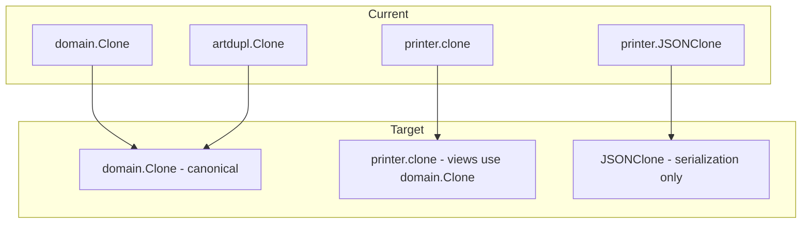
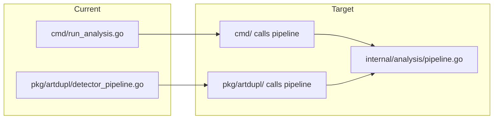

# Execution Plan: art-dupl Hardening & Architecture Improvement

**Generated**: 2026-04-15
**Sorted by**: Impact vs Work Required (highest ROI first)

---

## Phase 1: Quick Wins (Low Effort, High Impact)

### 1.1 Delete remaining dead packages
**Effort**: 30 min | **Impact**: Removes ~1070 lines of dead code, reduces maintenance burden

Delete `internal/enum/`, `git/`, `migration/`, `adapter/` — all verified zero production importers.


### 1.2 Replace `os.Exit(1)` in `cli.ExitIfBothSet` with error return
**Effort**: 15 min | **Impact**: Testable validation, idiomatic Go

Current code calls `os.Exit(1)` making the error path untestable. Return an error instead.

### 1.3 Remove dead fields from `cli.RuntimeConfig`
**Effort**: 10 min | **Impact**: Eliminates misleading dead code

`DiffMode` (typed `bool` but real config uses `string`), `All`, and `OutputDir` are set but never read by `ToConfig()`.

### 1.4 Unify error handling in `pkg/artdupl/` and `job/`
**Effort**: 45 min | **Impact**: Consistent error handling across codebase

Replace ~10 bare `fmt.Errorf` calls with `duplerrors.Wrap*` in `pkg/artdupl/` and `job/`.

---

## Phase 2: Type Consolidation (Medium Effort, Very High Impact)

### 2.1 Consolidate Clone types — Phase A: Canonical type
**Effort**: 2-3 hours | **Impact**: Single source of truth for clone data



Steps:
1. Add `Size() int` method to `domain.Clone`
2. Add `ToPrinterClone()` conversion on `domain.Clone`
3. Add `ToSDKClone()` conversion on `domain.Clone`
4. Migrate `printer/` to use conversions
5. Migrate `pkg/artdupl/` to use conversions
6. Remove `artdupl.Clone` (use `domain.Clone` directly in SDK)

### 2.2 Consolidate CloneGroup types
**Effort**: 1-2 hours | **Impact**: Consistent grouping across pipeline

Same pattern as 2.1 but for CloneGroup types.

### 2.3 Split `config/detectionmethod.go` into focused files
**Effort**: 30 min | **Impact**: Better file organization, easier navigation

Move each enum type to its own file:
- `config/detection_method.go` — DetectionMethod
- `config/output_format.go` — OutputFormat
- `config/sort_by.go` — SortBy
- `config/diff_mode.go` — DiffMode
- `config/file_type.go` — FileType (already separate)

---

## Phase 3: Test Coverage (Medium Effort, High Impact)

### 3.1 HTML diff view tests
**Effort**: 2 hours | **Impact**: Covers ~800 lines of untested code

11 functions at 0% in `printer/html.go` (diff view, severity distribution, etc.)

### 3.2 JSON printer tests
**Effort**: 1 hour | **Impact**: Covers `SetHash`, `PrintFooter`, `OutputSimpleJSON`

### 3.3 Plumbing printer tests
**Effort**: 30 min | **Impact**: Covers `PrintHeader`, `PrintFooter`, `OutputPlumbing`

### 3.4 Text printer tests
**Effort**: 1 hour | **Impact**: Covers `PrintHeader`, `PrintFooter`, `OutputText`, `PrintClonesSorted`

### 3.5 Hash package coverage (currently 70%)
**Effort**: 30 min | **Impact**: Better hash detection reliability

---

## Phase 4: Architecture Improvements (High Effort, Strategic Impact)

### 4.1 Unify analysis pipelines (SB-2)
**Effort**: 4-6 hours | **Impact**: Single source of truth for analysis logic



Extract shared pipeline into `internal/analysis/` package. Both `cmd/` and `pkg/artdupl/` call the same pipeline.

### 4.2 Split `printer/html.go` into focused files
**Effort**: 2 hours | **Impact**: Reduces ~1484 line file, easier maintenance

Split into:
- `printer/html_core.go` — Main HTML printer struct and output
- `printer/html_diff.go` — Diff view rendering
- `printer/html_styles.go` — CSS/style constants
- `printer/html_js.go` — JavaScript constants

### 4.3 Reduce nolint directives
**Effort**: 1-2 hours | **Impact**: ~80 nolint directives, many may be fixable

Audit each nolint: is the suppression still needed? Can the code be refactored to avoid it?

---

## Priority Matrix

```
Impact ↑
       │ 1.1 Delete dead pkgs    2.1 Consolidate Clone
       │ 1.2 Fix os.Exit         2.3 Split detectionmethod
       │ 1.3 Remove dead fields  3.1 HTML diff tests
       │ 1.4 Unify errors        4.1 Unify pipelines
       │───────────────────────────────────────────────→ Effort
       │ Low                     Medium                  High
```

---

## Execution Order

1. **Phase 1** (all 4 items) — ~1.5 hours total, can do in one session
2. **Phase 2.3** — Split detectionmethod.go (quick, enables Phase 2.1)
3. **Phase 2.1-2.2** — Clone type consolidation (most impactful architectural change)
4. **Phase 3** — Test coverage improvements
5. **Phase 4** — Architecture improvements (pipelines, HTML split, nolint audit)

---

## Libraries to Consider

| Need | Current | Suggestion | Why |
|------|---------|-----------|-----|
| Error wrapping | Custom `duplerrors` | `emperror` or stick with `fmt.Errorf("%w")` | Custom wrapping adds complexity; standard `%w` is idiomatic Go |
| CLI framework | Cobra + Fang | Keep | Already working, well-integrated |
| HTML templating | String concatenation | `html/template` | Safer HTML escaping, cleaner code |
| JSON output | Custom marshaling | Keep (JSONv2 experiment) | Already implemented |
| String interning | Custom `StringPool` | `go.stringinterner` or keep | Custom pool is fine for this use case |
